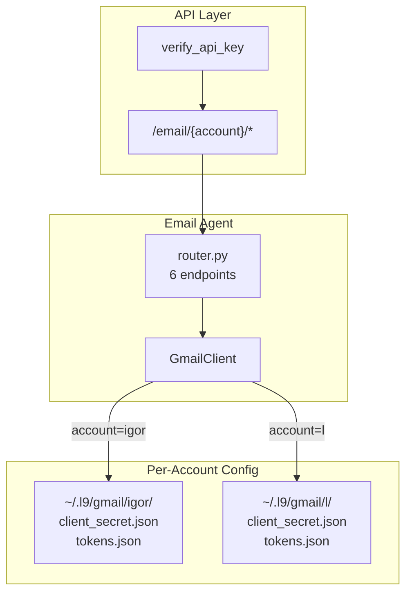

# Gmail Multi-Account Integration Plan (REVISED)

## Overview

Add API key authentication to all email endpoints and refactor to support both Igor and L Gmail accounts with separate endpoint prefixes (`/email/igor/*` and `/email/l/*`), while maintaining backward compatibility.

## Current State

- Single hardcoded account: `nc@scrapmanagement.com` in [email_agent/config.py](email_agent/config.py)
- Credentials expected at `~/.l9/gmail/client_secret.json` (single account)
- Router at `/email/*` with 6 endpoints - **NO AUTH**
- OAuth files exist in repo: `gmail/google_oauth_igor.json`, `gmail/google_oauth_L.json`
- `verify_api_key` in [api/auth.py](api/auth.py) expects `Authorization: Bearer {key}` header

## Target Architecture



## Implementation Phases

### Phase 1: Multi-Account Configuration

**File:** [email_agent/config.py](email_agent/config.py)

Add `AccountConfig` dataclass with validation, `ACCOUNTS` registry, and feature flag:

```python
from dataclasses import dataclass
from pathlib import Path
from typing import Dict, Optional
import os

# Feature flag for multi-account mode
L9_EMAIL_MULTI_ACCOUNT = os.getenv("L9_EMAIL_MULTI_ACCOUNT", "true").lower() == "true"

@dataclass
class AccountConfig:
    name: str
    email: str
    data_root: Path

    def __post_init__(self):
        if isinstance(self.data_root, str):
            self.data_root = Path(self.data_root).expanduser()
        if not self.name.isalnum():
            raise ValueError(f"Account name must be alphanumeric: {self.name}")

    @property
    def tokens_file(self) -> Path:
        return self.data_root / "tokens.json"

    @property
    def client_secret_file(self) -> Path:
        return self.data_root / "client_secret.json"

    @property
    def attachments_dir(self) -> Path:
        return self.data_root / "attachments"

ACCOUNTS: Dict[str, AccountConfig] = {
    "igor": AccountConfig(
        name="igor",
        email="igor@quantumaipartners.com",  # CONFIRM
        data_root=Path("~/.l9/gmail/igor"),
    ),
    "l": AccountConfig(
        name="l",
        email="l@quantumaipartners.com",  # CONFIRM
        data_root=Path("~/.l9/gmail/l"),
    ),
}

# Legacy paths (backward compat)
GMAIL_DATA_ROOT = Path(os.path.expanduser("~/.l9/gmail"))
TOKENS_FILE = GMAIL_DATA_ROOT / "tokens.json"
CLIENT_SECRET_FILE = GMAIL_DATA_ROOT / "client_secret.json"
ATTACHMENTS_DIR = GMAIL_DATA_ROOT / "attachments"
GMAIL_ACCOUNT = "nc@scrapmanagement.com"  # Legacy

def get_account_config(account: str) -> AccountConfig:
    if account not in ACCOUNTS:
        raise ValueError(f"Unknown account: {account}. Valid: {list(ACCOUNTS.keys())}")
    return ACCOUNTS[account]

def ensure_dirs(account: Optional[str] = None):
    """Ensure directories exist for account or legacy."""
    if account and account in ACCOUNTS:
        config = ACCOUNTS[account]
        config.data_root.mkdir(parents=True, exist_ok=True)
        config.attachments_dir.mkdir(parents=True, exist_ok=True)
    else:
        GMAIL_DATA_ROOT.mkdir(parents=True, exist_ok=True)
        ATTACHMENTS_DIR.mkdir(parents=True, exist_ok=True)
```

### Phase 2: Credentials Management (Backward Compatible)

**File:** [email_agent/credentials.py](email_agent/credentials.py)

Update all functions to accept optional `account` parameter. When `account=None`, use legacy paths:

```python
from email_agent.config import (
    get_account_config, TOKENS_FILE, CLIENT_SECRET_FILE,
    SCOPES, ensure_dirs, L9_EMAIL_MULTI_ACCOUNT
)

def load_client_secrets(account: str = None) -> Optional[Dict[str, Any]]:
    """Load OAuth client secrets. Uses account-specific path if provided."""
    if account:
        config = get_account_config(account)
        secret_file = config.client_secret_file
    else:
        secret_file = CLIENT_SECRET_FILE  # Legacy

    if not secret_file.exists():
        logger.error(f"Client secrets not found at {secret_file}")
        return None
    # ... rest unchanged

def load_tokens(account: str = None) -> Optional[Credentials]:
    """Load OAuth tokens. Uses account-specific path if provided."""
    if account:
        config = get_account_config(account)
        tokens_file = config.tokens_file
    else:
        tokens_file = TOKENS_FILE  # Legacy

    if not tokens_file.exists():
        return None
    # ... rest unchanged, but use tokens_file variable

def save_tokens(credentials: Credentials, account: str = None) -> bool:
    """Save OAuth tokens. Uses account-specific path if provided."""
    if account:
        config = get_account_config(account)
        tokens_file = config.tokens_file
        config.data_root.mkdir(parents=True, exist_ok=True)
    else:
        tokens_file = TOKENS_FILE  # Legacy
    # ... rest unchanged, but use tokens_file variable

def create_flow(redirect_uri: Optional[str] = None, account: str = None):
    """Create OAuth flow. Uses account-specific secrets if provided."""
    if account:
        config = get_account_config(account)
        secret_file = config.client_secret_file
    else:
        secret_file = CLIENT_SECRET_FILE
    # ... use secret_file in InstalledAppFlow.from_client_secrets_file()
```

### Phase 3: GmailClient Factory (Backward Compatible)

**File:** [email_agent/gmail_client.py](email_agent/gmail_client.py)

Update constructor to accept optional account with backward compat:

```python
class GmailClient:
    def __init__(self, account: str = None):
        """Initialize Gmail client.

        Args:
            account: Account name ("igor" or "l").
                    If None, uses legacy single-account mode.
        """
        self.account = account
        self.service = None

        if account:
            from email_agent.config import get_account_config
            config = get_account_config(account)
            self.email = config.email
            logger.info(f"GmailClient initialized for account: {account}")
        else:
            from email_agent.config import GMAIL_ACCOUNT
            self.email = GMAIL_ACCOUNT
            logger.warning("GmailClient in legacy mode (no account specified)")

        self._authenticate()

    def _authenticate(self):
        """Authenticate using credentials for self.account."""
        from email_agent.credentials import load_tokens

        credentials = load_tokens(self.account)  # None = legacy
        if not credentials:
            raise RuntimeError(
                f"No Gmail tokens found for account '{self.account or 'legacy'}'. "
                f"Run: python -m email_agent.oauth_server --account {self.account or 'legacy'}"
            )

        self.service = build("gmail", "v1", credentials=credentials)
```

### Phase 4: OAuth Server Multi-Account Support

**File:** [email_agent/oauth_server.py](email_agent/oauth_server.py)

Add `--account` CLI argument for per-account token generation:

```python
import argparse

# Module-level account (set by CLI)
CURRENT_ACCOUNT = None

class OAuthHandler(BaseHTTPRequestHandler):
    def handle_start(self):
        redirect_uri = f"http://localhost:{PORT}/oauth/callback"
        flow = create_flow(redirect_uri=redirect_uri, account=CURRENT_ACCOUNT)
        # ... rest unchanged

    def handle_callback(self, query_string):
        # ... parse code ...
        creds = exchange_code_for_tokens(code, redirect_uri, account=CURRENT_ACCOUNT)
        # ... rest unchanged

def main():
    global CURRENT_ACCOUNT

    parser = argparse.ArgumentParser(description="Gmail OAuth Server")
    parser.add_argument("--account", choices=["igor", "l"],
                       help="Account to authenticate (igor or l)")
    parser.add_argument("--port", type=int, default=8080)
    args = parser.parse_args()

    CURRENT_ACCOUNT = args.account

    if args.account:
        from email_agent.config import get_account_config
        config = get_account_config(args.account)
        print(f"Authenticating account: {args.account} ({config.email})")
        print(f"Tokens will be saved to: {config.tokens_file}")
    else:
        print("Legacy mode: using ~/.l9/gmail/tokens.json")

    print(f"Starting OAuth server on port {args.port}")
    print(f"Visit: http://localhost:{args.port}/oauth/start")

    server = HTTPServer(("localhost", args.port), OAuthHandler)
    server.serve_forever()

if __name__ == "__main__":
    main()
```

### Phase 5: Router Refactor with Auth

**File:** [email_agent/router.py](email_agent/router.py)

**Critical Fix:** Path params go in route decorators, NOT prefix.

```python
from fastapi import APIRouter, Depends, Path, HTTPException
from api.auth import verify_api_key

router = APIRouter(prefix="/email", tags=["email-agent"])

# Valid accounts for path validation
VALID_ACCOUNTS = ["igor", "l"]

@router.post("/{account}/query")
async def query_emails(
    request: QueryRequest,
    account: str = Path(..., pattern="^(igor|l)$"),
    _: None = Depends(verify_api_key),
):
    """Query emails for specific account. Requires API key."""
    if account not in VALID_ACCOUNTS:
        raise HTTPException(404, f"Unknown account: {account}")

    trace_id = generate_trace_id()
    action = f"email.{account}.query"  # Include account in action

    # Pre-action ingestion
    await ingest_email_event(
        trace_id=trace_id,
        action=action,
        phase="pre",
        payload={"query": request.query, "max_results": request.max_results, "account": account},
    )

    try:
        client = GmailClient(account=account)  # Account-specific client
        messages = client.list_messages(request.query, request.max_results)

        # Post-action ingestion (success)
        await ingest_email_event(
            trace_id=trace_id,
            action=action,
            phase="post",
            payload={"status": "success", "result_count": len(messages) if messages else 0, "account": account},
        )

        return {"messages": messages, "trace_id": trace_id, "account": account}

    except HTTPException:
        raise
    except Exception as e:
        await ingest_email_event(
            trace_id=trace_id, action=action, phase="post",
            payload={"status": "error", "account": account}, error=str(e),
        )
        raise HTTPException(500, f"{str(e)} (trace_id={trace_id})")
```

**Apply same pattern to all 6 endpoints:**

- `POST /{account}/query`
- `POST /{account}/get`
- `POST /{account}/draft`
- `POST /{account}/send`
- `POST /{account}/reply`
- `POST /{account}/forward`

### Phase 6: Setup Script

**New file:** `scripts/setup_gmail_accounts.py`

```python
#!/usr/bin/env python3
"""Setup Gmail Multi-Account Configuration."""

import shutil
from pathlib import Path

REPO_ROOT = Path(__file__).parent.parent
GMAIL_REPO_DIR = REPO_ROOT / "gmail"

def setup_account(account_name: str):
    from email_agent.config import get_account_config
    config = get_account_config(account_name)

    print(f"\n[{account_name}] Setting up at {config.data_root}")
    config.data_root.mkdir(parents=True, exist_ok=True)

    source_secret = GMAIL_REPO_DIR / f"google_oauth_{account_name}.json"
    dest_secret = config.client_secret_file

    if source_secret.exists():
        shutil.copy2(source_secret, dest_secret)
        print(f"  + Copied {source_secret.name} -> {dest_secret}")
    else:
        print(f"  ! Missing {source_secret}")

    if config.tokens_file.exists():
        print(f"  + Tokens exist: {config.tokens_file}")
    else:
        print(f"  - Tokens missing. Run: python -m email_agent.oauth_server --account {account_name}")

def main():
    from email_agent.config import ACCOUNTS
    print("Gmail Multi-Account Setup")
    print("=" * 50)
    for name in ACCOUNTS:
        setup_account(name)

    print("\n" + "=" * 50)
    print("Next steps:")
    print("1. Run OAuth for each account:")
    print("   python -m email_agent.oauth_server --account igor")
    print("   python -m email_agent.oauth_server --account l")
    print("2. Test endpoints:")
    print('   curl -X POST http://localhost:8000/email/igor/query \\')
    print('     -H "Authorization: Bearer $L9_EXECUTOR_API_KEY" \\')
    print('     -H "Content-Type: application/json" \\')
    print('     -d \'{"query": "is:unread", "max_results": 5}\'')

if __name__ == "__main__":
    main()
```

### Phase 7: Comprehensive Tests

**File:** [tests/email_agent/test_email_router.py](tests/email_agent/test_email_router.py)

```python
import pytest
from unittest.mock import patch, MagicMock
from fastapi import FastAPI
from fastapi.testclient import TestClient

@pytest.fixture
def app():
    from email_agent.router import router
    app = FastAPI()
    app.include_router(router)
    return app

@pytest.fixture
def client(app):
    return TestClient(app)

@pytest.fixture
def auth_headers():
    return {"Authorization": "Bearer test-api-key"}

class TestAuthEnforcement:
    """All endpoints require API key."""

    @pytest.mark.parametrize("endpoint", [
        "/email/igor/query",
        "/email/igor/get",
        "/email/igor/draft",
        "/email/igor/send",
        "/email/igor/reply",
        "/email/igor/forward",
    ])
    def test_no_auth_returns_401(self, client, endpoint):
        response = client.post(endpoint, json={})
        assert response.status_code == 401

class TestAccountRouting:
    """Account path parameter validation."""

    def test_valid_account_igor(self, client, auth_headers):
        with patch("email_agent.router.GmailClient") as mock:
            mock.return_value.list_messages.return_value = []
            with patch("email_agent.router.ingest_email_event"):
                response = client.post(
                    "/email/igor/query",
                    json={"query": "test"},
                    headers=auth_headers
                )
        # May fail on Gmail auth, but should not be 404
        assert response.status_code != 404

    def test_invalid_account_returns_422(self, client, auth_headers):
        response = client.post(
            "/email/unknown/query",
            json={"query": "test"},
            headers=auth_headers
        )
        assert response.status_code == 422  # Path validation fails

class TestMemoryIngestion:
    """Pre/post events ingested to memory."""

    def test_query_ingests_pre_post(self, client, auth_headers):
        with patch("email_agent.router.GmailClient") as mock_gmail:
            mock_gmail.return_value.list_messages.return_value = []
            with patch("email_agent.router.ingest_email_event") as mock_ingest:
                response = client.post(
                    "/email/igor/query",
                    json={"query": "test"},
                    headers=auth_headers
                )

        assert mock_ingest.call_count == 2
        calls = mock_ingest.call_args_list
        assert calls[0][1]["phase"] == "pre"
        assert calls[1][1]["phase"] == "post"

class TestBackwardCompat:
    """Legacy GmailClient() still works."""

    def test_gmail_client_no_account_uses_legacy(self):
        with patch("email_agent.gmail_client.load_tokens") as mock_load:
            mock_load.return_value = MagicMock()
            with patch("email_agent.gmail_client.build"):
                from email_agent.gmail_client import GmailClient
                client = GmailClient()  # No account param

        mock_load.assert_called_with(None)  # Legacy mode
```

## Files Modified Summary

| File | Changes |

|------|---------|

| `email_agent/config.py` | Add AccountConfig, ACCOUNTS, feature flag, get_account_config() |

| `email_agent/credentials.py` | Add account param to all 4 functions (backward compat) |

| `email_agent/gmail_client.py` | Add account param to constructor (backward compat) |

| `email_agent/oauth_server.py` | Add --account CLI arg, update flow/callback |

| `email_agent/router.py` | Add auth + /{account}/ path to all 6 endpoints |

| `scripts/setup_gmail_accounts.py` | New file - setup script |

| `tests/email_agent/test_email_router.py` | Comprehensive test coverage |

## Validation Steps

1. **Syntax check:** `python -m py_compile email_agent/*.py`
2. **Tests:** `pytest tests/email_agent/ -v`
3. **Setup:** `python scripts/setup_gmail_accounts.py`
4. **OAuth:** `python -m email_agent.oauth_server --account igor`
5. **Manual test:**
   ```bash
   curl -X POST http://localhost:8000/email/igor/query \
     -H "Authorization: Bearer $L9_EXECUTOR_API_KEY" \
     -H "Content-Type: application/json" \
     -d '{"query": "is:unread", "max_results": 5}'
   ```


## Rollback

If issues arise, the backward-compat design allows:

1. Set `L9_EMAIL_MULTI_ACCOUNT=false`
2. Legacy endpoints at `/email/*` continue working
3. `GmailClient()` with no args uses legacy paths
