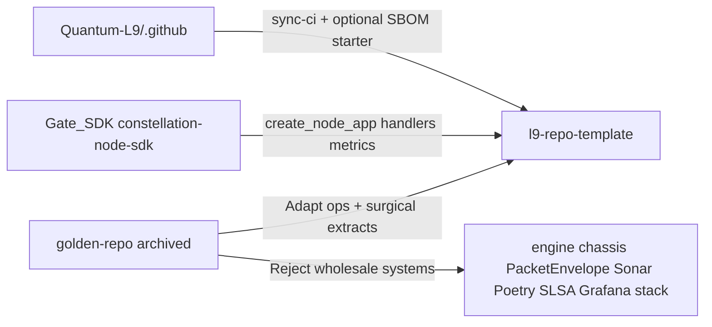

## PLAN: Harvest golden-repo head-start into museum worker shell

**PLAN_DOCUMENT:** validated PASS (`/tmp/l9-plan-golden-harvest.json`). Convergence: **partial** (U1 pin format, U2 orchestrator profile deferred). Surgical CI/obs extracts integrated as T10–T12 (plan iteration).

### Default locked

Destination stays [Quantum-L9/l9-repo-template](https://github.com/Quantum-L9/l9-repo-template). Head-start runtime is **Gate worker via `constellation-node-sdk`** ([Gate_SDK `examples/worker_node`](https://github.com/Quantum-L9/Gate_SDK/tree/main/examples/worker_node): `create_node_app` + `register_handler`), **not** golden `PacketEnvelope` / `engine/` / `chassis/`.

SDK dependency: git pin `constellation-node-sdk @ git+https://github.com/Quantum-L9/Gate_SDK.git@<full-sha>` (U1: SHA until a release tag exists).

### Skip (already ported — do not re-port)

`make verify` / `sync-ci` / `rename` / `render-rules` / `check-rules`, parametric Cursor rules, thin `.vscode` / `.devcontainer`, org pack workflows + dependabot + CODEOWNERS, LICENSE, AGENTS thin ladder, pre-commit ruff/mypy, inventory deny list.

### Candidate matrix (remaining golden)

| Candidate | Verdict | Head-start role |
|-----------|---------|-----------------|
| Runnable HTTP service shell | **Adapt via SDK** | `app.py` + `handlers.py` + `spec.yaml` domain drop-in |
| `Dockerfile` / `docker-compose.yml` | **Adapt** | uv + py3.12; api-only; no Poetry/redis |
| `scripts/wait_for_http.py` | **Adapt** | local readiness helper |
| Deploy `preflight_env_check.py` | **Adapt thinly** | `preflight_local_env.py` for `GATE_URL` / `L9_*` only — not DO terraform tokens |
| `.env.example` L9 runtime keys | **Adapt** | SDK worker env + optional OTEL comments — strip PacketEnvelope-only knobs as defaults |
| `docs/agent-tasks/add-action-handler.md` | **Rewrite** | TransportPacket `register_handler` playbook |
| `Makefile` `dev` / run UX | **Adapt** | `make run` / `make dev` on museum Makefile |
| `.semgrep/semgrep-rules.yaml` | **Adapt (T10)** | Wire into existing `l9-analysis` semgrep step |
| File-inv `observability/` compose pack | **Port (T13)** | Optional local Grafana/Prom/Tempo/OTelCol |
| Obs scrape/SLO alert extras | **Adapt as docs (T11)** | Only if not covered by T13 pack |
| CodeRabbit config + secret-rotation checklist | **Adapt as docs (T12)** | Opt-in examples; not required CI |
| `engine/` `chassis/` `domains/` `client/` `database/` | **Reject** | Wrong architecture; museum deny |
| PacketEnvelope contracts / AGENTS laws | **Reject** | Dual wire format forbidden |
| Poetry / Sonar / parallel CI / SLSA / golden SBOM / Grafana compose | **Reject wholesale** | See surgical table |
| `deploy/terraform` / `tools/audit*` | **Reject** | Out of museum bootstrap |
| Justfile as dual task-runner | **Reject** | Makefile covers targets |

### Surgical extract from CI / observability buckets

Do **not** copy golden workflows into museum (dual CI vs org pack). Extract only ideas/artifacts missing from museum+org+SDK and rewriteable to museum laws.

| Bucket | Surgical keep (adapt) | Leave behind |
|--------|----------------------|--------------|
| **Poetry** | Nothing as packaging; museum already has `uv.lock` | Poetry backend, poetry Docker stages, `cyclonedx-py poetry` SBOM |
| **Sonar** | Nothing; coverage via pytest-cov / org lint-test | `sonar-project.properties`, Sonar org keys, quality-gate-in-CI |
| **CodeRabbit** | Opt-in `docs/examples/coderabbit.yaml` (language, auto_review, no poem) — T12 | Assertive PR-blocking defaults as museum required surface |
| **Parallel CI** | Patterns only (already in org lint-test/analysis) | Entire golden workflow zoo; floating action pins; codecov as second SSOT |
| **SBOM** | Prefer org `workflow-templates/l9-sbom.yml` → Core Syft; document later — not golden copy | Golden `sbom.yml` using Poetry CycloneDX |
| **SLSA** | Org/Core ownership only | `slsa-build.yml` / P3 SLSA copies |
| **secret-rotation** | Checklist in docs/AGENTS (Gate signing keys / GitHub secrets) — T12; org `enable-secret-scanning.sh` | Cron workflows that open Neo4j/VPS issues |
| **dependency-review** | Skip this pass (Dependabot seeded); optional later SHA-pinned workflow | Golden duplicate dependency-review YAMLs |
| **release-drafter** | Prefer org `l9-release*` starters; out this pass | Golden release-drafter as parallel release SSOT |
| **`.semgrep/semgrep-rules.yaml`** | **Highest-value CI extract (T10)** — adapt paths to `src/`/`tests/`; feed via museum `l9-analysis` `--config` | `engine/security/*` prompt-injection rules; second Semgrep workflow |
| **observability/ Grafana stack** | **File-inv pack (T13)** as optional local compose; OTEL env comments (T5); SDK metrics for `/metrics`; golden SLO snippets as docs (T11) if needed | Golden numbered/Loki/Alloy stacks; file-inv Fix-B `src/.../observability` Python; obs as required CI gate |

### File-inv `observability/` harvest status

**Not harvested yet.** The [file-inv DX port](file-inv_dx_port_fa46bf57.plan.md) explicitly **Rejected** `observability/` as kitchen-sink; museum tree has **zero** observability paths today. T11 only planned golden scrape/SLO *docs examples*.

[constellation-file-inventory/observability](https://github.com/cryptoxdog/constellation-file-inventory/tree/main/observability) is a cleaner, transferable **local compose pack** than golden's numbered mess:

| Path | Role | Plan action |
|------|------|-------------|
| `docker-compose.observability.yml` | Grafana :3000, Prometheus :9090, Tempo :3200, OTelCol :4317/:4318 | **Port (T13)** — optional local stack |
| `otel-collector-config.yaml` | OTLP→Tempo traces + Prometheus remote-write | **Port (T13)** |
| `prometheus.yml` | scrape otel-collector + `host.docker.internal:8000/metrics` | **Port (T13)** — retarget SDK metrics path |
| `tempo-config.yaml` | local Tempo | **Port (T13)** |
| `grafana/provisioning/datasources/datasources.yaml` | Prometheus + Tempo datasources | **Port (T13)** |
| `grafana/provisioning/dashboards/dashboards.yaml` | dashboard provider stub | **Port (T13)** |
| Makefile `obs-up` / `obs-down` / `obs-ps` | stack lifecycle | **Port (T13)** onto museum Makefile |
| `src/l9_service/observability/*` (Fix-B OTel Python) | app instrumentation | **Reject** — use Gate_SDK `runtime/observability.py` + OTEL env; do not copy Fix-B |

**Inventory law change:** lift absolute deny of root `observability/` for this optional local pack; keep deny of golden `engine/`/`chassis/` and of shipping obs as required CI. Document as opt-in (`make obs-up`), not part of `make verify`.

T11 remains for any extra golden SLO alert *examples* under `docs/examples/observability/` that are not already covered by the file-inv pack; prefer file-inv compose as the runnable SSOT.

### Domain drop-in contract (what a new repo edits)

After `make rename PKG=foo_bar`:

1. Implement handlers in `src/foo_bar/handlers.py` (`@register_handler("your.action")`).
2. Adjust `spec.yaml` + `.env` (`L9_ALLOWED_ACTIONS`, `GATE_URL`, service name).
3. Keep `app.py` as `create_node_app(...)` wiring.
4. `make verify` → `make run` / `docker compose up`.

### Todos (critical path T1→T2→T6→T3→T4→T13→T10→T8→T9)

1. **T1** — Pin SDK + `uv.lock`
2. **T2** — Worker shell replaces hello package
3. **T6** — App/handler tests; keep rename/render green
4. **T3** — Dockerfile + compose + `.dockerignore`
5. **T4** — `wait_for_http` / `preflight_local_env` + Makefile `run`/`dev`
6. **T5** — `.env.example` Gate worker vars + OTEL comment block
7. **T7** — `docs/agent-tasks/add-domain-handler.md`
8. **T10** — Adapt Semgrep rules; wire into `l9-analysis` (do not add parallel Semgrep job)
9. **T13** — Port file-inv `observability/` compose pack + `make obs-up/down/ps` (not Fix-B Python; not in `make verify`)
10. **T11** — Extra golden SLO alert docs examples only if not covered by T13
11. **T12** — `docs/examples/coderabbit.yaml` + secret-rotation checklist (docs only)
12. **T8** — Docs/inventory/cartridge including surgical Reject/Skip + optional observability/
13. **T9** — Rename/inventory cover new paths (`.semgrep/`, `observability/`)

### Stress / leverage

- Disconfirm: copying `engine/` = golden redux; hello-world alone ≠ runnable head-start; floating SDK pin = CI churn; requiring obs stack in `make verify` = kitchen-sink return; copying Fix-B Python duplicates SDK metrics.
- Assume false: PacketEnvelope still valid; golden CI/SBOM/Sonar should be copied; museum must stay non-HTTP; Semgrep needs a second workflow.
- Leverage: **T1/T2** unlock runtime; **T10** is the only high-value CI extract from the Reject buckets; T11/T12 are docs-only.
- Rollback: revert worker/Docker/semgrep/docs commits; restore hello package; leave prior DX/CI ports.

### Final validation

`make verify` (must not require obs stack) · `docker compose -f observability/docker-compose.observability.yml config` · api `docker compose config` · no PacketEnvelope/poetry/sonar/Fix-B OTel Python · `make sync-ci` · semgrep loads `.semgrep/semgrep-rules.yaml` · Actions green.

### Handoff

Next: `l9-gmp-protocol`. May modify museum worker/ops/docs/semgrep/examples surfaces only. Must not modify Gate_SDK product code, org `.github` SSOT, or revive golden as bootstrap. Must not install Sonar, Poetry, SLSA, golden SBOM, golden Loki/Alloy stacks, or file-inv Fix-B OTel Python. File-inv local obs compose (T13) is allowed as opt-in DX.
