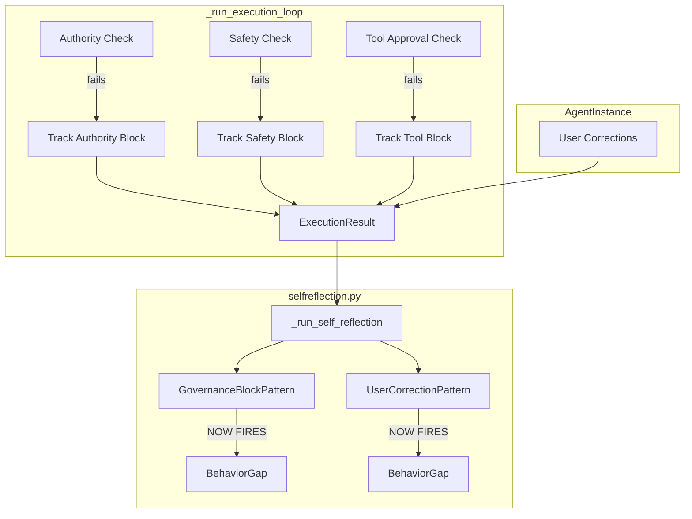

# Enterprise Frontier Grade: Governance Tracking GMP

## Variable Bindings

| Variable | Value ||----------|-------|| TASK_NAME | `governance_tracking_enterprise_frontier` || EXECUTION_SCOPE | Track governance blocks (authority/safety/tool approval) and user corrections during execution, wire into ExecutionResult schema, populate in _run_self_reflection() || RISK_LEVEL | Medium || IMPACT_METRICS | Self-reflection accuracy, governance visibility, behavioral gap detection |

## Current State

The self-reflection module has two pattern detectors that **never fire**:

```python
# selfreflection.py L175-176
if not context.governance_blocks:  # Always True - empty list
    return None

# selfreflection.py L212-213
if not context.user_corrections:  # Always True - empty list
    return None
```

The executor passes empty lists at [executor.py L1641-1642](core/agents/executor.py):

```python
governance_blocks=[],  # TODO: Track governance blocks in result
user_corrections=[],  # TODO: Track user corrections
```


## Files to Modify

| File | Purpose ||------|---------|| [core/agents/schemas.py](core/agents/schemas.py) | Add fields to ExecutionResult || [core/agents/agent_instance.py](core/agents/agent_instance.py) | Add user correction tracking || [core/agents/executor.py](core/agents/executor.py) | Track blocks, wire to result, populate reflection |

## TODO Plan (Locked)

### Phase 1: Schema Updates

- **[T1]** File: `core/agents/schemas.py` Lines: 345-348
- Action: Insert after `tokens_used` field
- Target: `ExecutionResult` class
- Change: Add `governance_blocks: Optional[List[Dict[str, Any]]]` field with description
- Gate: py_compile
- Imports: NONE (Dict, Any, List already imported)
- **[T2]** File: `core/agents/schemas.py` Lines: 348 (after T1)
- Action: Insert after governance_blocks
- Target: `ExecutionResult` class
- Change: Add `user_corrections: Optional[List[Dict[str, Any]]]` field with description
- Gate: py_compile
- Imports: NONE

### Phase 2: AgentInstance Updates

- **[T3]** File: `core/agents/agent_instance.py` Lines: 105-106
- Action: Insert after `_total_tokens = 0`
- Target: `__init__` method
- Change: Add `self._user_corrections: list[dict[str, Any]] = []` private field
- Gate: py_compile
- Imports: NONE
- **[T4]** File: `core/agents/agent_instance.py` Lines: 195-196 (after add_tokens method)
- Action: Insert new method
- Target: AgentInstance class (State Management section)
- Change: Add `add_user_correction(self, correction: str, metadata: dict = None)` method that appends correction with iteration and timestamp
- Gate: lint
- Imports: NONE
- **[T5]** File: `core/agents/agent_instance.py` Lines: 157-159 (after tool_results property)
- Action: Insert new property
- Target: AgentInstance class (Properties section)
- Change: Add `user_corrections` property returning `self._user_corrections.copy()`
- Gate: py_compile
- Imports: NONE

### Phase 3: Executor - Track Governance Blocks

- **[T6]** File: `core/agents/executor.py` Lines: 920-921 (after start_time)
- Action: Insert
- Target: `_run_execution_loop` method
- Change: Add `governance_blocks_tracked: List[Dict[str, Any]] = []` list initialization
- Gate: py_compile
- Imports: NONE (List, Dict, Any already imported)
- **[T7]** File: `core/agents/executor.py` Lines: 945-946 (inside authority check failure block, before return)
- Action: Insert before the return statement
- Target: Authority check block in `_run_execution_loop`
- Change: Append authority block dict with type, violation, agent_id, timestamp to `governance_blocks_tracked`
- Gate: lint
- Imports: NONE
- **[T8]** File: `core/agents/executor.py` Lines: 967-968 (inside safety check failure block, before return)
- Action: Insert before the return statement
- Target: Safety check block in `_run_execution_loop`
- Change: Append safety block dict with type, violation, pattern, timestamp to `governance_blocks_tracked`
- Gate: lint
- Imports: NONE
- **[T9]** File: `core/agents/executor.py` Lines: 1319-1320 (inside tool approval block, before return)
- Action: Insert before the return statement
- Target: Tool approval check in `_dispatch_tool_call`
- Change: Track tool_approval_block (requires passing tracking list or storing on instance)
- Gate: lint
- Imports: NONE

### Phase 4: Executor - Wire to ExecutionResult

- **[T10]** File: `core/agents/executor.py` Lines: 946-954 (authority block return)
- Action: Replace
- Target: ExecutionResult construction in authority failure
- Change: Add `governance_blocks=[{authority block}]` to ExecutionResult
- Gate: py_compile
- Imports: NONE
- **[T11]** File: `core/agents/executor.py` Lines: 968-976 (safety block return)
- Action: Replace
- Target: ExecutionResult construction in safety failure
- Change: Add `governance_blocks=[{safety block}]` to ExecutionResult
- Gate: py_compile
- Imports: NONE
- **[T12]** File: `core/agents/executor.py` (all ExecutionResult constructions in loop)
- Action: Update all ExecutionResult constructions
- Target: Multiple return points in `_run_execution_loop`
- Change: Add `governance_blocks=governance_blocks_tracked` and `user_corrections=instance.user_corrections`
- Gate: lint
- Imports: NONE

### Phase 5: Self-Reflection Wire-up

- **[T13]** File: `core/agents/executor.py` Lines: 1641-1642
- Action: Replace
- Target: TaskExecutionContext construction in `_run_self_reflection`
- Change: Replace `governance_blocks=[]` with `governance_blocks=result.governance_blocks or []` and `user_corrections=[]` with `user_corrections=result.user_corrections or []`
- Gate: py_compile
- Imports: NONE

## Data Flow Diagram




## Validation Gates

| Gate | Command | Required ||------|---------|----------|| py_compile | `python -m py_compile` | Yes || lint | `ruff check` | Yes || tests | `pytest tests/core/agents/` | Yes |

## Constraint Check

- [ ] KERNEL-TIER files NOT in scope (executor.py is RUNTIME_TIER)
- [ ] No duplicated responsibilities
- [ ] Unified interfaces used (existing logging patterns)
- [ ] No placeholders in output

## Risk Assessment

| Risk | Probability | Impact | Mitigation ||------|------------|--------|------------|| Breaking existing ExecutionResult consumers | Low | Medium | Fields are Optional with None default || Performance overhead from tracking | Low | Low | Only appends to list, O(1) per block || Tool approval tracking requires instance access | Medium | Low | Pass instance or use callback pattern |

## Success Criteria

1. `GovernanceBlockPattern.detect()` fires when authority/safety blocks occur
2. `UserCorrectionPattern.detect()` fires when user corrections tracked
