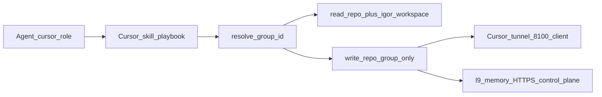

# PLAN: Materially improve `l9-graphiti-memory` skill (wrap existing stack)

### Doctrine
Proper planning prevents piss poor performance. A minute spent planning is an hour saved debugging.

### Planning Mode
**Mode:** Deep
**Justification:** Shared memory contracts across two live planes, identity/bucket correctness, and skill + rule alignment without forking the control plane.

### plan_status
ConditionallyReady — Ready when user authorizes GMP execution.

### Load log
| Fixture | Path | Status |
|---------|------|--------|
| Authority bindings | [skills/l9-plan/references/authority-bindings.md](skills/l9-plan/references/authority-bindings.md) | Read |
| Wrap/call doctrine | [rules/46-wrap-call-existing-authority.mdc](rules/46-wrap-call-existing-authority.mdc) | Read |
| Current Cursor skill | [skills/l9-graphiti-memory/SKILL.md](skills/l9-graphiti-memory/SKILL.md) | Read |
| Graphiti rule | [rules/03-graphiti-memory.mdc](rules/03-graphiti-memory.mdc) | Read |
| Memory kernel | [rules/87-cursor-memory-kernel.mdc](rules/87-cursor-memory-kernel.mdc) | Read |
| Group registry | [ops/graphiti/group_registry.yaml](ops/graphiti/group_registry.yaml) | Read |
| Agent registry | [environment/agents/agent_registry.yaml](environment/agents/agent_registry.yaml) | Read |
| Topology | [environment/agents/docs/MEMORY_TOPOLOGY.md](environment/agents/docs/MEMORY_TOPOLOGY.md) | Read |
| Work claims | [environment/agents/docs/WORK_CLAIM_PROTOCOL.md](environment/agents/docs/WORK_CLAIM_PROTOCOL.md) | Read |
| Gate lib | [ops/graphiti/graphiti_gate_lib.py](ops/graphiti/graphiti_gate_lib.py) | Read |
| Upstream skill | https://github.com/Quantum-L9/l9-graphiti-memory/blob/main/skill/SKILL.md | Read |
| Upstream README / Cursor instantiation | package README + `docs/CURSOR_INSTANTIATION.md` | Read |
| GMP lock / phase | `skills/l9-gmp-protocol/references/{modification-lock,phase-contracts}.md` | Apply at execute |
| CCP PLAN / DoD | `kernels/L9 Coding Control Plane/ai-control-plane/{PLAN,DEFINITION_OF_DONE}.md` | Apply at execute |

### Objective
Turn the Cursor skill into a **memory playbook**: agents **resolve the correct bucket**, **read memory at the right moments** (especially before launching a research subagent or broad exploratory grep of the repo), and **write durable facts to the repo group** — by wrapping what already exists in [Quantum-L9/l9-graphiti-memory](https://github.com/Quantum-L9/l9-graphiti-memory) and `ops/graphiti/`, not by rebuilding MemoryService, admission, projections, or a second skill catalog.

**Falsifiable success:**
1. Skill mandates memory search/hydrate **before** Task/explore-subagent and before exploratory codebase discovery when the question is episodic (prior decisions, lessons, “how we do X here”).
2. Skill states identity matrix: `group_id` (repo) vs `agent_id`/`role`/`source` (who) vs read fan-in (`repo` + `igor-workspace`) vs write target (repo only).
3. Skill **Load-maps** upstream `skill/SKILL.md` + local registries/rules/CLI — no pasted ADR/harvest catalogs.
4. No new memory server, store, or forked protocol in Cursor-Governance.
5. `make pr-check` PASS; Graphiti lesson written via `graphiti_memory_client.py write` to `cursor-governance`.

### Ground truth (do not conflate planes)

| Plane | Surface | Identity | Bucket |
|-------|---------|----------|--------|
| Cursor IDE (live today) | `ops/graphiti/graphiti_memory_client.py` → tunnel `:8100` | `cursor` / `cursor_agent` / `GRAPHITI_MCP_TOKEN` | Write: resolved repo `group_id` (e.g. `cursor-governance`). Read: `[repo, igor-workspace]` |
| Control plane (live for cloud agents; package) | `l9-memory` / `l9-graphite-memory` → `https://memory.quantumaipartners.com` | Bearer → `MemoryPrincipal` from [agent_registry.yaml](environment/agents/agent_registry.yaml) | Same `group_id` law; namespace grants by role |

**Agent ID is not `group_id`.** `group_resolver.py` has no agent_id. Who writes = registry principal; what bucket = `group_registry.yaml`.

### Files in scope
| Role | Paths |
|------|-------|
| Modify | [skills/l9-graphiti-memory/SKILL.md](skills/l9-graphiti-memory/SKILL.md) (SSOT; `.claude/...` is symlink) |
| Create | `skills/l9-graphiti-memory/references/authority-bindings.md` — Load map (always/conditional/forbid) |
| Create | `skills/l9-graphiti-memory/references/read-write-timing.md` — when to read/write (thin; cites gates + upstream operating sequence) |
| Create | `skills/l9-graphiti-memory/references/identity-and-buckets.md` — group/agent/role/plane matrix (pointers to registries + MEMORY_TOPOLOGY) |
| Modify | [rules/03-graphiti-memory.mdc](rules/03-graphiti-memory.mdc) — add exploratory **memory-before-explore** step without deleting cheap Grep-when-path-known |
| Modify | [rules/87-cursor-memory-kernel.mdc](rules/87-cursor-memory-kernel.mdc) — align “before Task / exploratory research” with skill timing |
| Modify | [skills/l9-plan/references/authority-bindings.md](skills/l9-plan/references/authority-bindings.md) — one-line: memory skill Load map for Gather |
| Regenerate | `rules/RULES-MANIFEST.*` via `generate_rules_manifest.py` |

### Files out of scope
| Path | Why |
|------|-----|
| `ops/graphiti/*.py` gate/resolver rewrite | Already correct; wrap/call |
| Reimplementing `l9-graphite-memory` / MemoryService / ADRs | Upstream owns it |
| Vendoring upstream skill body into this repo | Drift; cite + Load |
| Enabling `GRAPHITI_WRITE_GATES=1` by default | Ops soak; skill documents behavior |
| VPS / C1 deploy / auth_tokens render | Human gate; cite DEPLOY only |
| `WIP/**` memory wave packs | Non-SSOT |
| `kernels/**`, `skills/l9-gmp-protocol/**` | Call only |

### Constraints
**MUST:**
- Wrap/call [upstream skill](https://github.com/Quantum-L9/l9-graphiti-memory/blob/main/skill/SKILL.md), `l9-memory` CLI when installed, else Cursor `graphiti_memory_client.py`.
- Fail-closed bucket: `resolve` before write; never write `igor-workspace` / `main` / `default`.
- Mandate **task-scoped memory read before** deploying Task/explore subagent for repo research, and before **exploratory** grep/search when seeking prior decisions/lessons/gotchas (answers belong in memory).
- Keep Grep/Read-first when path/symbol is already known (cheap $0) — refine rule 03, do not invert wholesale.
- Prefer CLI over raw MCP `add_memory`.
- Atomic T2 writes (rule 87 format); search-before-write (rule 99).

**MUST NOT:**
- Distill upstream ADRs/harvest into Cursor skill patterns.
- Invent a third `group_id` scheme or agent-scoped write namespace that bypasses registries.
- Treat prefetch mention of `igor-workspace` as write target.
- Turn this into a control-plane migration GMP.

### Modification Lock
**May-modify:** paths under Files in scope / Modify+Create+Regenerate.
**Must-not-modify:** `ops/graphiti/**` (except if a one-line doc comment is required — default untouched), `kernels/**`, `skills/l9-gmp-protocol/**`, `WIP/**`, upstream package (external).

### Design: skill playbook shape (target)

1. **Bind** — cwd → `resolve`; record `group_id`, `readonly`, method; Load agent entry for this surface (`cursor` / role `orchestrator`).
2. **Choose plane** — if `l9-memory` on PATH and HTTPS plane intended → upstream operating sequence; else Cursor client + tunnel (current default for this IDE).
3. **Read timing (mandatory):**
   - Session: health → inject/search → T0 `memory-bank/activeContext.md` (existing).
   - **Before Task / explore subagent:** `search`/`inject` with task query against resolved read groups; cite hits in the subagent prompt; do not send a blind “research the repo” Task when memory already answers.
   - **Before exploratory codebase discovery** (unknown layout / “how does X work here”): Graphiti search first for decisions/lessons/CI gotchas; then Grep/code-graph for gaps.
   - Known path/symbol: Grep/Read first (unchanged).
   - On error / user correction: search then write (rule 87).
   - GMP Phase 0: conflicts (+ phase-lock when gates on).
4. **Write timing:** durable doctrine/lesson/ADR/claim — proactive T2 to **repo group** via CLI; work-claim protocol cite only (do not reimplement).
5. **Authority Load map** in `references/authority-bindings.md` (always: registries, rules 03/87/97/98/99, client; conditional: upstream skill + `l9-memory`, WORK_CLAIM, gates; forbid: raw Neo4j, Cursor native Memories, writing workspace group).

### TODO Plan (GMP-ready)
| ID | Phase | File | Op | Anchor | Description | Deps |
|----|-------|------|-----|--------|-------------|------|
| T1 | 2 | `skills/l9-graphiti-memory/references/authority-bindings.md` | Create | new | Load map always/conditional/forbid → upstream skill + local fixtures | — |
| T2 | 2 | `skills/l9-graphiti-memory/references/identity-and-buckets.md` | Create | new | group_id / agent_id / role / plane / read fan-in / write forbid — pointers only | T1 |
| T3 | 2 | `skills/l9-graphiti-memory/references/read-write-timing.md` | Create | new | Timing matrix incl. pre-Task + pre-exploratory-grep; cite gate_lib + upstream sequence | T1 |
| T4 | 2 | `skills/l9-graphiti-memory/SKILL.md` | Replace | full | v2.0.0 playbook: bind → Load → timing → CLI dual-surface → fail-closed | T1–T3 |
| T5 | 2 | `rules/03-graphiti-memory.mdc` | Replace | retrieval section | Insert memory-before-explore between known-path Grep and blind explore | T3 |
| T6 | 2 | `rules/87-cursor-memory-kernel.mdc` | Replace | add section | Before Task/explore: search/inject required | T3 |
| T7 | 2 | `skills/l9-plan/references/authority-bindings.md` | Replace | Memory row | Point at skill references Load map | T4 |
| T8 | 2 | `rules/RULES-MANIFEST.*` | Replace | regen | `generate_rules_manifest.py` + `rules-validate` | T5–T6 |
| T9 | 4 | gate + memory | — | — | `make pr-check`; CLI write lesson to `cursor-governance` | T1–T8 |

### Pre-Validation
| Check | Pass |
|-------|------|
| Branch | Continue `docs/l9-plan-kernel-pipeline` (or successor) |
| Symlink | `.claude/skills/l9-graphiti-memory` → governance skills SSOT |
| Resolve | `cursor-governance` writable |
| Upstream skill reachable | GitHub `skill/SKILL.md` |
| Dirty quarantine | Do not stage WIP/unrelated noise |
| `make pr-check` | Run before claiming done |

### Acceptance
- Agents following the skill search memory before research Task / exploratory repo dig.
- Writes never target `igor-workspace` via documented path.
- Skill text contains Load directives, not harvested upstream ADR bodies.
- Rule 03 still prefers Grep when path known.

### Assumption register
| ID | Assumption | If wrong |
|----|------------|----------|
| A1 | Cursor IDE remains on tunnel client as default write path for this skill | Document HTTPS migration separately; still cite `l9-memory` |
| A2 | Package may be absent on PATH | Dual-surface: client fallback required |
| A3 | Subagent gate may be off (`WRITE_GATES=0`) | Skill still mandates behavioral read; hooks are defense-in-depth |

### Depth / conditionals
Deep. Conditional Loads: upstream skill when editing memory behavior; WORK_CLAIM when multi-agent; gate docs when mentioning WRITE_GATES.

### Unknown / Decision
| ID | Item | Resolution |
|----|------|------------|
| U1 | Force-install `l9-graphite-memory` in this GMP? | **No** — document prefer-if-present; install is separate ops |
| D1 | Change retrieval order in rule 03? | **Yes, narrowly** — memory-before-explore only |

### Validation matrix
| Gate | Command / evidence |
|------|-------------------|
| Manifest | `make rules-validate` |
| PR | `make pr-check` |
| Bucket | `resolve` shows repo group; write receipt `group_id=cursor-governance` |
| No fixture fork | `git diff -- ops/graphiti` empty (default) |

### Plan Definition of Done
- [ ] Skill v2 playbook + 3 reference files
- [ ] Rules 03 + 87 timing aligned
- [ ] Plan bindings row updated
- [ ] Manifests regenerated
- [ ] No upstream reimplementation

### Post-implementation Definition of Done
- Named gates: `make pr-check` PASS; `rules-validate` PASS; Graphiti write receipt for doctrine/timing lesson; Phase-5 style verify may-modify paths only.

### Milestones
| M | Outcome |
|---|---------|
| M1 | Reference Load map + identity + timing live |
| M2 | Skill rewrite + rule alignment |
| M3 | Gates + memory write |

### Checkpoints
| CP | Evidence | No-go |
|----|----------|-------|
| CP1 | References cite upstream URL + registries; no ADR paste | Strip distillate |
| CP2 | SKILL has pre-Task / pre-explore MUST | Rewrite |
| CP3 | `make pr-check` PASS; write to `cursor-governance` | Repair |

### Checklist
- [ ] T1–T9
- [ ] Symlink still points at SSOT
- [ ] Proactive Graphiti write via CLI after land
- [ ] No commit/push unless requested

### Risks
| Risk | Mitigation |
|------|------------|
| Agents ignore skill when gates off | Rule 03/87 alwaysApply + loud MUST |
| Plane confusion | identity-and-buckets table + MEMORY_TOPOLOGY cite |
| Distillate creep | rule 46 + authority-bindings forbid |

### Estimate
~60–90 min · 1 GMP

### Kernel Pass Log
| Kernel | Status | Notes |
|--------|--------|-------|
| Improve | Applied | Timing + bucket clarity gaps closed by design |
| Leverage | Applied | Upstream skill, registries, client, gates — wrap only |
| Recursive Alignment | Applied | Targets match live resolve + MEMORY_TOPOLOGY two-plane truth |
| Recursive Leverage | Applied | Plan-skill Load map + work-claim cited, not rebuilt |
| Validate & Repair | Applied | Dual DoD + pr-check + CLI write; U1 closed No |

### Final Validation
Completeness T1–T9; scanners named; honesty: gates may still be off — skill behavior is primary.

### Minimum Safe Next Action
Approve → execute T1–T9 with `l9-gmp-protocol` on current docs branch.

### Handoff profile
CHANGE → `l9-gmp-protocol`
