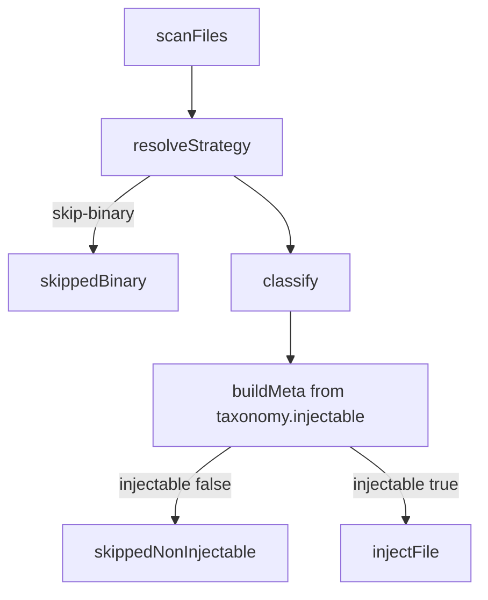

# Harden skipped-non-injectable coverage

## What the 12 were

From the zip-folder dry-run (`scanned=120`, `skippedNonInjectable=12`), every skip was `meta.injectable === false` in [`src/pipeline.ts`](src/pipeline.ts) (line ~193), driven by [`PRIMITIVE_TAXONOMY`](src/schema.ts) for `test` / `script` / `unknown`:

| Path (relative to test root) | Classified as | Why (false / weak) |
|---|---|---|
| `3D KG Embedding - HyperGraphs/KG Embedding - Compound 3D-3.md` | `unknown` | No TYPE keywords in filename + first 800 chars |
| `3D KG Embedding - HyperGraphs/evidence-report.md` | `test` | Substring `"test"` inside **"testing"** |
| `3D KG Embedding - HyperGraphs/phases-2-6-consolidated.md` | `test` | `"test suite"` table cell (weak single hit) |
| `AUTONOMOUS IMPROVEMENT SYSTEM1/AUTONOMOUS IMPROVEMENT SYSTEM1.md` | `test` | `"spec"` inside **"specification"** |
| `AUTONOMOUS IMPROVEMENT SYSTEM1/AUTONOMOUS IMPROVEMENT SYSTEM2.md` | `unknown` | No TYPE keywords |
| `AUTONOMOUS IMPROVEMENT SYSTEM1/AUTONOMOUS OS HARDENING.md` | `unknown` | No TYPE keywords |
| `AUTONOMOUS IMPROVEMENT SYSTEM1/Continuous-Gap-Analysis-Framework.md` | `test` | `"spec"` inside **"specifications"** |
| `AUTONOMOUS IMPROVEMENT SYSTEM1/Multi-Agent Critique Loop .md` | `unknown` | No TYPE keywords |
| `…/Strategic-Pivot-L9-Constellation.md` | `unknown` | No TYPE keywords |
| `…/revops_stack_blueprint.md` | `test` | `"spec"` inside **"specific"** (beats `"tool"` in `"tooling"`) |
| `TEMPLATE FOR GAP FILLING-PERPLEXITY.md` | `script` | Single `"script"` mention |
| `Tool Search/Anthropic Tool Search vs L9 Discovery.md` | `script` | Filename `"tool"` + body `"script"` (medium) |

So these are **not** binaries and **not** omit-protected files. They are markdown that either (a) got a **substring false positive** into a non-injectable type, or (b) fell through to **`unknown`**, which is intentionally non-injectable today.

## Root cause (two coupled bugs)

1. **Keyword matcher is substring `includes`**, not token-aware — so `testing`/`specification`/`specific`/`tooling`/`Tool Search.md` poison the bag ([`src/classify.ts`](src/classify.ts) `TYPE_SIGNALS` + scoring loop ~lines 67–75).
2. **Any score ≥ 1 wins**, including for types that block injection (`test`, `script`). Path-based `/tests/` skips remain correct; keyword-only score-1 skips are wrong for docs.
3. **Unclassified prose → `unknown` → not injected**, even when the file was explicitly scanned and has a yaml-frontmatter strategy — “in scope” for the operator, out of scope for the taxonomy.

Coverage only prints counts to stderr; dry-run does **not** persist `coverage.skipped.nonInjectable` to disk, which made the 12 hard to inspect after the fact ([`src/pipeline.ts`](src/pipeline.ts) ~224–242; indexes write only when `!dryRun`).

## Chosen policy (concrete)

**Minimize skips for clearly-scanned text files; keep intentional non-injection only for high-confidence test/script.**

- Markdown/txt with no strong type signal → classify as **`context`** (injectable “retrievable knowledge”), not `unknown`.
- Reserve **`unknown`** for cases we still refuse (e.g. empty body / unreadable), not for “generic prose”.
- **`test` / `script` from keywords** only when word-boundary score ≥ 2 **or** path pattern matches (`/tests/`, `/__tests__/`, `/scripts/`, …). Score-1 keyword hits must not select a non-injectable type; fall through to next best injectable type or `context`.
- Path-pattern high confidence for `test`/`script` stays non-injectable (preserves [`tests/pipeline_coverage.test.ts`](tests/pipeline_coverage.test.ts) contract).
- Do **not** flip taxonomy `test`/`script`/`unknown` injectable flags globally — fix classification so those flags fire less often incorrectly.

## Implementation plan

### 1. Harden [`src/classify.ts`](src/classify.ts)

- Replace keyword `text.includes(k)` with **word-boundary** matching (Unicode-aware enough for ASCII tokens used today; e.g. `(^|[^a-z0-9_])token([^a-z0-9_]|$)` on lowercased text).
- When the winning type is `test` or `script` and confidence would be `low` (score &lt; 2) **and** no path pattern matched, **do not accept** that type: recompute excluding those types, or default to `context`.
- Change zero-hit fallback from `unknown` → **`context`** for frontmatter prose (`.md`/`.txt` path already gated by `FRONTMATTER_EXTS`).
- Keep dot-convention and path-pattern branches unchanged.

### 2. Persist skip diagnostics (OBS-003 follow-through)

In [`src/pipeline.ts`](src/pipeline.ts):

- Always write `coverage-report.json` under `outDir` (or `indexDir`) including `skipped.binary`, `skipped.nonInjectable`, and per-path **`reason`** / `artifact_type` / `confidence` — including **dry-run**.
- Extend stderr coverage line to mention the report path when skips &gt; 0.
- Optionally enrich `CoverageSummary` with `skipped.nonInjectableDetails: Array<{ path, artifactType, confidence }>` so library callers do not need to re-classify.

### 3. Tests

- Classify regression cases mirroring the 12:
  - `"… testing, validation …"` must not become `test`
  - `"specification"` / `"specific"` must not become `test`
  - `"tooling"` / filename `Tool Search.md` alone must not become `script` at score 1
  - Lorem / signal-free markdown → `context`, injectable
  - Path `/tests/foo.md` still → `test`, non-injectable
  - Medium+ word-boundary hits still classify `test`/`script` when earned
- Update [`tests/classify.test.ts`](tests/classify.test.ts) “stays unknown when zero keywords” → expects **`context`**.
- Extend [`tests/pipeline_coverage.test.ts`](tests/pipeline_coverage.test.ts): assert coverage report file on dry-run lists skip path + type; add a “false positive prose” fixture that injects after the fix.

### 4. Docs / ADR

- ADR-018: classification injectability gate — word boundaries; weak non-injectable demotion; prose default `context`; coverage report on dry-run.
- Short note in [`docs/contracts.md`](docs/contracts.md) / README coverage section: what `skipped-noninjectable` means and how to read `coverage-report.json`.
- `npm run manifest:update` if authority-critical docs change; rebuild `dist/`; `npm run lint` + `npm run validate`.

## Expected effect on the 12

After the above, re-running the same dry-run tree should inject **all 12** (or all except any that still match a real `/tests/` or `/scripts/` path — none of these do). Remaining skips should be almost only: binary, omit/SKILL protect, and true path-taxonomy test/script.

## Out of scope for this pass

- Changing LLM assist / skills mode.
- Making `test`/`script` taxonomy entries injectable.
- Expanding keyword dictionaries (can be a later ADR once matching is safe).
