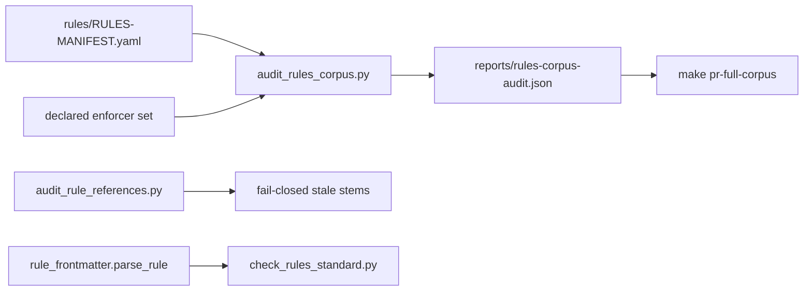

# Port remaining harvest semantics, then delete execution-governance

```yaml
evidence_quality: high
decision_risk: guarded
action: proceed_with_validation
calibration_status: none
stated_probability: null
```

**Decision.** Land the three leftover viable nuggets from [WIP/8-28-26/execution-governance-harvest/harvest.json](WIP/8-28-26/execution-governance-harvest/harvest.json) by extending live owners, then delete [execution-governance/](execution-governance/) as TODO A1. Do not restore any `_archived/` Python, Flask API, dashboard, LaunchAgent, or Suite-6 header gate.

**Decisive evidence.** Harvest receipt is PASS. C5 already lives in [ops/scripts/audit_corpus_reachability.py](ops/scripts/audit_corpus_reachability.py); C6 already lives in [ops/scripts/scan_launchagents.py](ops/scripts/scan_launchagents.py) + `--machine` in [ops/scripts/check_governance_wiring.sh](ops/scripts/check_governance_wiring.sh). [ops/scripts/audit_rule_references.py](ops/scripts/audit_rule_references.py) is a fail-closed stale-stem **gate**. [ops/scripts/audit_rules_corpus.py](ops/scripts/audit_rules_corpus.py) already owns `reports/rules-corpus-audit.json` and is the correct C3/C1 owner (harvest destination was slightly wrong). `parse_rule` in [ops/scripts/lib/rule_frontmatter.py](ops/scripts/lib/rule_frontmatter.py) already raises on non-mapping frontmatter.

**GAR (standalone).** User asked `/l9-plan-simple` + delete. Realization after Build is MUTATION. Validation required. Integration stays STANDALONE (no PE / `make campaign` / Program Lock). Delivery is this checkout.

## Execute via Cursor Build

Press **Build**. Work in the **current checkout**.

- Do not run `make campaign`.
- Do not admit a Program Lock or Controller lease.
- Do not write `Lock: origin/main = <sha>`.
- Do not open a new worktree from tip as a planning requirement.

Hook catalog for code in scope: [.pre-commit-config.yaml](.pre-commit-config.yaml). Makefile edits must be **append-only** ([ops/config/root-file-protection.json](ops/config/root-file-protection.json)).

## Architecture (smallest coherent owner)



| Nugget | Disposition | Live owner | What Build does |
|---|---|---|---|
| C5, C6 | already landed | reachability + LaunchAgent scan | Skip |
| **C3** | PORT_WITH_HARDENING | **[ops/scripts/audit_rules_corpus.py](ops/scripts/audit_rules_corpus.py)** not `audit_rule_references.py` | Inverted rule → enforcer index; empty set is a finding; missing manifest **fails closed** |
| **C1** | MERGE_WITH_EXISTING | same report | Stamp `population` + `generated_utc` on every observation. No SQLite. No `compliance_rate` gate. No host CPU/memory. |
| **C4** | MERGE_WITH_EXISTING | [ops/scripts/lib/rule_frontmatter.py](ops/scripts/lib/rule_frontmatter.py) + [ops/scripts/tests/test_rule_frontmatter.py](ops/scripts/tests/test_rule_frontmatter.py) | Regression: unparseable frontmatter is a named finding, never skipped |
| Archive | user-authorized A1 | [execution-governance/](execution-governance/) | Last todo: `git rm -r` after scrubs |

**Why not the harvest’s C3 path.** Putting advisory coverage on [ops/scripts/audit_rule_references.py](ops/scripts/audit_rule_references.py) recreates the donor defect: one name, two jobs (gate vs report). Kill pattern KP-001.

**C3 enforcer set (declared, not inferred)** — a rule is enforced if its `file` stem or `id` appears in:

- [rules/RULES-MANIFEST.yaml](rules/RULES-MANIFEST.yaml) (corpus declaration; also accept sibling `.json` if present)
- [.pre-commit-config.yaml](.pre-commit-config.yaml)
- [Makefile](Makefile)
- [ops/hooks/hooks.json.template](ops/hooks/hooks.json.template)
- [ops/scripts/check_rules_standard.py](ops/scripts/check_rules_standard.py), [ops/scripts/validate_rules_manifest.py](ops/scripts/validate_rules_manifest.py)
- `skills/**/SKILL.md` and `commands/**/*.md` (name-based, same generic-basename care as C5)

Fail closed if `rules/` is missing or the manifest is unreadable. Do not default to `[]` and print 0% coverage (donor bug).

**C1 bound.** Do not persist a time series. SessionStart + overwritten `rules-corpus-audit.json` already give a point-in-time audit. The missing semantic is a **named population**, so two runs are comparable. A git-tracked JSONL/SQLite series would add state without a consumer and invite a tolerance gate (rule 95).

## Build todos

1. **baseline** — Confirm C5/C6 files exist; confirm `rules/RULES-MANIFEST.yaml` is the live corpus; note current branch/HEAD. Do not lock `origin/main`.
2. **c3-coverage** — Extend [ops/scripts/audit_rules_corpus.py](ops/scripts/audit_rules_corpus.py): `coverage.rules[]` with `id`, `file`, `enforcers[]`, `enforcer_count`. Finding when `enforcer_count == 0`. Name the enforcer-set in the JSON. Exit 1 if manifest/`rules/` missing.
3. **c1-population** — Same report: add `population` (`source`, `entrypoint_set`, `generated_utc`). Do not add a gate field. Do not import `psutil`.
4. **c4-test** — Add a test that invalid YAML frontmatter raises / is reported; never `continue` past it. Optional one-line invariant in `rule_frontmatter.py` docstring.
5. **makefile-append** — Append one recipe line under existing `pr-full-corpus` to run `audit_rules_corpus.py`. Do not rewrite other Makefile lines. Optional additive `.PHONY` target `rules-corpus-audit` if a direct verb is needed.
6. **tests-c3** — New [tests/ops/scripts/test_audit_rules_corpus_coverage.py](tests/ops/scripts/test_audit_rules_corpus_coverage.py) covering harvest C3/C1 acceptance tests (zero-enforcer listed; missing source fails closed; population present; no implicit `compliance_rate`).
7. **delete-scrub** — Remove the dead `governance_monitor` import and stale warning in [ops/scripts/operational-oversight.py](ops/scripts/operational-oversight.py) (lines 22–32). Drop `execution-governance/` from the listing in [README.md](README.md) (`managed`). Mark TODO A1 done. Append CHANGELOG. Leave harvest WIP and built plans as historical evidence.
8. **delete-tree** — `git rm -r execution-governance/`. Do **not** delete `telemetry/`, `foundation/`, or other A-tier shells. Reachability listing those paths as unreachable is not delete authority; this user turn is.

## Acceptance (harvest, adapted)

- C3: a rule with no enforcer appears with an empty set; missing manifest fails closed and names the path.
- C1: the report states its population; a gate never reads a trend or rate from it.
- C4: unparseable frontmatter is a named failure, not a skip.
- After delete: `execution-governance/` absent; `operational-oversight.py` no longer mentions `governance-monitor.py`; targeted pytest + `audit_rules_corpus.py` PASS.

## Out of scope

- Restoring `_archived/**` or Suite-6 headers / `.suite6-config.json` / Flask / dashboard / LaunchAgents
- C2, C7, C8, C9 (REJECT / MIGRATION_CONTEXT)
- Re-doing C5/C6
- Deleting A2–A7 archive shells
- `make pr` / push (ask-first after Build)
- Mixing with the current dirty Makefile rewrite (+9 −1); this plan only **appends**

## Stress / rollback

- **Falsify if** C3 treats design-doc mentions as enforcers and floods zero-coverage, or if coverage is wired into `make pr` as a gate.
- **Assumed true:** harvest C5/C6 stay; `RULES-MANIFEST.yaml` remains generated SSOT; user authorization covers A1 only.
- **Blast:** a bad enforcer set labels live rules inert; a Makefile non-additive edit fails root-file protection; deleting the tree without the oversight scrub leaves a lying warning.
- **Rollback:** revert the commit(s). `git` history keeps `execution-governance/_archived/` (original archive was `git mv` at `268608be`).

## Doc / root surface

- [README.md](README.md): managed — surgical drop of `execution-governance/` from the dir list.
- [Makefile](Makefile): additive_only — append only.
- [TODO.md](TODO.md), [CHANGELOG.md](CHANGELOG.md): A1 closed + archive note.
- Do not edit `AGENTS.md` / `CANONICAL_LAW.md`.
