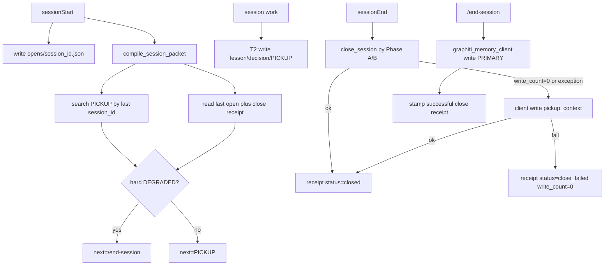

# Hydrate close visibility (l9-plan-simple)

**Skill:** `l9-plan-simple` / Cursor Build. Supporting on the ADR todo: `l9-architecture-decision-records`. Not PE. Do not run `make campaign`. Do not write `Lock: origin/main = <sha>`.

**Route:** `route_plan.py --risk high --evidence sufficient` → `depth=deep`, omit_gates=[]. Code in scope. Hook catalog: [`.pre-commit-config.yaml`](.pre-commit-config.yaml).

**Workspace bind (planning only):** this checkout is `main` @ `ac5c6d18`, ahead 3 / behind 1, dirty (`docs/plans/sessionstart_truth_report_17d39f01.plan.md` deleted). Planning stays here. **Build never starts from this `main`.** Unique open-PR chain tip is [PR 418](https://github.com/Quantum-L9/Cursor-Governance/pull/418) `agent/cursor/issue-336` (parent [417](https://github.com/Quantum-L9/Cursor-Governance/pull/417) already edits SessionStart bootstrap). Execute via `PR_STACK=auto` / `agent_worktree_start.sh`. After todos: scoped-commit, `l4_local.py authorize-release`, `PR_STACK=auto PR_REMEDIATE=0 make pr`. Finish reply must show the opened PR URL. User asked to run `/gmp` on this plan when Build is pressed.

## Objective

Make a missed or empty session close **visible and repairable** without inventing a second memory store, without using `hydration.cli close` as the `/end-session` primary, and without dumping `reports/repo-index` into Graphiti. Record the architecture as the next dedicated **memory ADR** in `docs/decisions/`.

## ADR-0028 (generate first; land Accepted in this PR)

Continue the dedicated memory series. Do **not** reuse ADR-0008 (already occupied by non-memory decisions). Next free number is **0028**.

| Field | Value |
|---|---|
| Path | [`docs/decisions/ADR-0028-session-hydrate-close-visibility.md`](docs/decisions/ADR-0028-session-hydrate-close-visibility.md) |
| Title | ADR-0028: Session hydrate/close visibility and write-primary repair |
| Skill | `l9-architecture-decision-records` (Status, Date, Context, Options Considered ≥2, Decision, Consequences, Related) |
| Status on write | `Proposed` |
| Status on merge of this PR | `Accepted` |
| Supersedes | none |
| Extends | ADR-0003 (hook vs interactive **roles**), ADR-0006 (single Graphiti front door) |
| Related | ADR-0002, ADR-0003, ADR-0004, ADR-0005, ADR-0006, ADR-0007 (cloud HTTPS); `docs/MEMORY_PIPELINE_MAP.md`; `skills/l9-graphiti-memory`; `skills/l9-end-session` |

**Does not supersede** ADR-0005 (one store) or ADR-0006 (one front door). This ADR answers a different question: how close failure becomes **loud** and how repair is **written**.

### Options the ADR must record (rejected vs chosen)

1. **A (chosen):** Hook stays `close_session.py`; skip/fail always writes a local receipt; one Graphiti `write` fallback; SessionStart prints hard `DEGRADED` + `REPAIR: /end-session`; `/end-session` primary is `graphiti_memory_client.py write`. SessionStart exit 0.
2. **B (reject):** SessionStart / sessionEnd exit non-zero. Cursor swallows hook rc; agents still miss it.
3. **C (reject):** `/end-session` prefers `hydration.cli close` (replays the heuristic closer; hides the gap).
4. **D (reject):** Restore `memory-bank/` as automatic fallback.
5. **E (reject):** Ingest `reports/repo-index` bodies into Graphiti (structural dump; T3-adjacent; wrong layer).
6. **F (reject):** Treat `.l9/memory/closes` as resume SSOT (latches only; Graphiti remains SSOT).

### Decision body the ADR must lock (same as Locked design below)

Copy the numbered invariants from Locked design into the ADR Decision section. Consequences: louder hydrate, no second store, bootstrap stays RepoManifest-only, T2 writes remain agent/CLI.

## Locked design (do not reopen on Build)

1. **Two writers, one store.** The hook owns [`ops/graphiti/hydration/close_session.py`](ops/graphiti/hydration/close_session.py). `/end-session` owns [`ops/graphiti/graphiti_memory_client.py`](ops/graphiti/graphiti_memory_client.py) `write --kind pickup_context|lesson|error`. Do not make `hydration.cli close --reason force_retry` the preferred repair. After a successful repair write, stamp a close receipt so the next hydrate can clear DEGRADED.
2. **Automatic fallback is Graphiti write, not memory-bank and not a second closer.** If `close_session.py` skips, raises, or finishes with `write_count=0`, the hook retries **once** via a **Python** helper (not inline shell JSON). Same client `write`, heuristic PICKUP from transcript, `--agent-id` stamped. If that also fails: persist a fail receipt and `ERROR` on stderr. No `memory-bank/`. `/end-session` remains the only **human/agent** repair.
3. **Receipts are latches, not SSOT.** Expand [`write_receipt`](ops/graphiti/hydration/close_session.py) statuses: `closed`, `closed_enqueue_failed`, `close_failed`, `skipped_no_project`, `skipped_disabled`, `skipped_cli_missing`. Always write a receipt on every hook path that knows the project dir (including skips). `write_count: 0` is a first-class fail. Missing receipt for a prior **opened** session is a fail.
4. **Success vs S3-loud.** `closed_enqueue_failed` with `phase_a=true` and `write_count>0` is **not** a close-gap (enqueue already fail-loud). Do not send the agent to `/end-session` for S3-only failure.
5. **One session id.** Add `resolve_session_id()` used by open latch, close, compile, and fallback. Order: stdin/hook `session_id` → `CURSOR_CONVERSATION_ID` → `CURSOR_SESSION_ID` → `default`. Document `default` as last resort (shared-id collision risk).
6. **Opened latch.** SessionStart writes gitignored `.l9/memory/opens/<session_id>.json` and `last_opened.json` from [`ops/hooks/session_start_memory_orchestrator.sh`](ops/hooks/session_start_memory_orchestrator.sh). Next compile reads **last opened**, not “any file in closes/”. First session (no prior open) is **not** receipt-degraded. Empty Graphiti / unreachable search still degrades as today.
7. **Background sessions.** `--background` / `is_background_agent` writes its own open/close under that session id. It must **not** overwrite the parent `last_opened.json`.
8. **Recent PICKUP (locked).** Close already embeds `session=<id>` in the PICKUP line. Hydrate searches for that **last opened session_id**. Close-gap DEGRADED when a prior open exists and the receipt is missing/fail/`write_count=0`, or Graphiti search returns no fact containing that session id. If the transport cannot filter, empty PICKUP search + prior open is enough. Do **not** invent a wall-clock TTL.
9. **Hard DEGRADED you cannot miss.** [`format_additional_context`](ops/graphiti/hydration/compile_session_packet.py) must **lead** with `DEGRADED` and `REPAIR: /end-session` (before objective/facts). Set `next_action` to `/end-session`. SessionStart still exits 0. Hook stderr uses `ERROR` not `WARN` on skip/fail. Keep enqueue exit 2. No v1 env kill switch (tests use tmp `project_dir`).
10. **Repair idempotency.** `/end-session` first reads the last-opened close receipt. If `status=closed` and `write_count>0`, skip a duplicate PICKUP unless the operator is superseding with a richer `next=`. Then stamp/refresh the receipt.
11. **Do not ingest `reports/repo-index`.** Structural catalogs stay on disk / code-graph. Graphiti gets the existing idempotent **RepoManifest** from `bootstrap` ([`_discover_bootstrap_sources`](ops/graphiti/graphiti_memory_client.py): `AGENTS.md`, `ARCHITECTURE.md`, `README.md`, up to 10 ADRs). Optional: add path pointer `reports/repo-index/` to manifest `sources` — never file bodies.
12. **T2 writes during work** are doctrine + skill, not a new daemon. Mid-session `write --kind lesson|insight` and a real `PICKUP|objective=…|next=…|files=…|blocker=…` stay the live path. Generic “Resume from latest Graphiti PICKUP” is a quality WARN, not hard DEGRADED, unless a prior-open close-gap also applies.
13. **Stay off** [`ops/hooks/session_start_bootstrap.sh`](ops/hooks/session_start_bootstrap.sh) (PR 417). Prefer the memory orchestrator + hydration Python.

## Scope

**In**
- ADR-0028 in `docs/decisions/` (memory series continuation)
- Close receipt always-write + opened latch + hydrate visibility
- Hook Graphiti-write fallback (Python helper)
- `/end-session` + `l9-end-session` primary = client `write`
- Bootstrap RepoManifest (run + hydrate “unseeded” WARN)
- T2 write contract in skills/map
- Tests in [`ops/graphiti/hydration/test_hydration.py`](ops/graphiti/hydration/test_hydration.py)

**Out**
- `memory-bank/` restore
- Dumping `reports/repo-index/*` into Graphiti
- Making SessionStart exit non-zero
- Replacing hook closer with `/end-session` on every X-out
- C1 deploy / docker-compose / local Mac Neo4j
- Rewriting PR 417 SessionStart runtime-report
- `CANONICAL_LAW.md` rewrite
- PE / `make campaign`
- Reusing ADR-0008 or inventing a second memory-numbering scheme
- A hydrate kill-switch env in v1

## Success criteria (falsifiable)

- [`docs/decisions/ADR-0028-session-hydrate-close-visibility.md`](docs/decisions/ADR-0028-session-hydrate-close-visibility.md) exists with Status, Date, Context, Options Considered (A–F), Decision, Consequences, Related (ADR-0002 through ADR-0007). Does not claim to supersede ADR-0005 or ADR-0006.
- Unit test: prior `opens/old.json` + missing close receipt → `degraded=true` and additional_context **starts with** `DEGRADED` and contains `REPAIR: /end-session`.
- Unit test: receipt `write_count=0` → same.
- Unit test: `closed_enqueue_failed` + `phase_a=true` + `write_count>0` → **not** close-gap DEGRADED.
- Unit test: no prior open → receipt-gap does **not** degrade; empty Graphiti still degrades as today.
- Unit test: background open does not change parent `last_opened.json`.
- Unit test: fallback helper invoked when `write_count=0`; hook skip and close exception both write a fail/skip receipt.
- Unit test: `/end-session` helper (or documented function) does not write a second PICKUP when receipt already `closed` + `write_count>0`.
- `l9-end-session` and [`commands/end-session.md`](commands/end-session.md) list `graphiti_memory_client.py write` as primary; `hydration.cli close` is not the preferred repair.
- `bootstrap --dry-run` for `cursor-governance` emits a RepoManifest whose `sources` include AGENTS/ARCHITECTURE/README (and ADR files when present). If unseeded, Build runs real `bootstrap` once.
- Hydrate does not search or ingest `reports/repo-index` file bodies.
- Build publish: stacked PR URL on tip of 418.

## Todos (Build DAG)

1. **todo-00-adr** — Write ADR-0028 from `l9-architecture-decision-records` using the table and options above. Status `Proposed` until todo-06 is green, then `Accepted` in the same PR. Files: `docs/decisions/ADR-0028-session-hydrate-close-visibility.md`. Deps: none. Risk: low. **Do this before mutating hooks.**
2. **todo-01-receipt-latch** — `resolve_session_id()`, always-write close receipts, opened/`last_opened` helpers. Files: [`ops/graphiti/hydration/close_session.py`](ops/graphiti/hydration/close_session.py), new [`ops/graphiti/hydration/session_latches.py`](ops/graphiti/hydration/session_latches.py). Deps: todo-00. Risk: medium.
3. **todo-02-hook-fallback** — [`ops/hooks/graphiti-session-end.sh`](ops/hooks/graphiti-session-end.sh): never silent skip; `ERROR` + receipt on every known-project path; if close rc not in {0, 2} or `write_count=0`, call a Python fallback write once; exit 0 except enqueue 2. Extract fallback to hydration Python so pytest can hit it. Deps: todo-01. Risk: high.
4. **todo-03-hydrate-loud** — [`compile_session_packet.py`](ops/graphiti/hydration/compile_session_packet.py) + [`session_hydration_packet.schema.yaml`](ops/graphiti/hydration/session_hydration_packet.schema.yaml) + [`session_start_memory_orchestrator.sh`](ops/hooks/session_start_memory_orchestrator.sh): write open latch (skip `last_opened` for background); compile uses session-id PICKUP search + receipt rules above; banner leads with `DEGRADED` / `REPAIR: /end-session`; RepoManifest missing is a separate WARN via `autoseed-check`. Deps: todo-01. Risk: high.
5. **todo-04-end-session-write-primary** — [`skills/l9-end-session/SKILL.md`](skills/l9-end-session/SKILL.md) and [`commands/end-session.md`](commands/end-session.md): HEALTH → client `write` → stamp receipt; skip duplicate if already closed. Cite ADR-0028. Deps: todo-00, todo-01. Risk: medium.
6. **todo-05-bootstrap-t2-docs** — `bootstrap --dry-run` then real if `autoseed-check` exits 2. Optional `reports/repo-index/` pointer in manifest `sources` only. Update [`docs/MEMORY_PIPELINE_MAP.md`](docs/MEMORY_PIPELINE_MAP.md), [`skills/l9-graphiti-memory/SKILL.md`](skills/l9-graphiti-memory/SKILL.md), append-only [`AGENTS.md`](AGENTS.md) fragment `L9_HYDRATE_CLOSE_VISIBLE_V1` (close visibility + T2 mid-session writes + bootstrap vs index dump + pointer to ADR-0028). Add Related back-links on ADR-0006/0007 only if a single “See also ADR-0028” line is additive and does not rewrite those files. Deps: todo-00, todo-03, todo-04. Risk: medium.
7. **todo-06-tests** — Extend [`ops/graphiti/hydration/test_hydration.py`](ops/graphiti/hydration/test_hydration.py) plus latch/fallback units covering every success-criterion bullet that is a unit. Confirm ADR required sections. Deps: todo-02, todo-03, todo-04. Risk: medium.
8. **todo-07-publish** — On stack tip of 418: scoped-commit, L4 authorize-release, `PR_STACK=auto PR_REMEDIATE=0 make pr`. Display PR URL. Deps: todo-05, todo-06. Risk: medium.

**Critical path:** todo-00 → todo-01 → todo-02 → todo-03 → todo-04 → todo-05 → todo-06 → todo-07

**Leverage rank:** todo-00 (contract) > todo-03 (visibility) > todo-01 (shared latch) > todo-02 (automatic Graphiti fallback) > todo-04 (repair contract) > todo-06 (proof) > todo-05 (bootstrap/T2/map) > todo-07 (publish)

## Doc / root surface

- `docs/decisions/ADR-0028-session-hydrate-close-visibility.md` — create (memory ADR series).
- `docs/MEMORY_PIPELINE_MAP.md` — update (open latch, always receipt, hook fallback write, `/end-session` write-primary, cite ADR-0028).
- `AGENTS.md` — update, append-only named fragment. No `ALLOW-ROOT-DELETION`.
- `docs/decisions/ADR-0006-single-memory-front-door-graphiti.md` / `ADR-0007-cloud-graphiti-https-reachability.md` — optional one-line Related pointer only; do not rewrite Decision bodies.
- `CANONICAL_LAW.md` — N/A (map + ADR + skills own this loop).
- `CLAUDE.md` / `README.md` — N/A unless a pointer sentence is already stale.
- Generated formatter block — do not hand-edit.

## Stress test

- **Disconfirm:** If Cursor never delivers `CURSOR_CONVERSATION_ID`, last_opened and this session id diverge — `resolve_session_id()` must be the single function on open, close, and compile.
- **Disconfirm:** If every first session of a clone is DEGRADED, agents will ignore the banner — first-open exemption is required.
- **Disconfirm:** If `/end-session` still calls `cli close`, it will write a second heuristic PICKUP and hide the gap.
- **Disconfirm:** If `closed_enqueue_failed` is treated as a close-gap, every S3-unset machine will demand `/end-session`.
- **Disconfirm:** If background agents overwrite `last_opened`, the next human session false-degrades.
- **Disconfirm:** If ADR-0028 is numbered 0008, it collides with existing rule/intent ADRs.
- **False if:** Graphiti MCP is the store (true). False if `.l9/memory/closes` is treated as resume SSOT.
- **Blast:** Noisy DEGRADED on session-id mismatch; duplicate PICKUPs; conflict with PR 417 if bootstrap.sh is edited; ADR number collision.
- **Rollback:** Revert the stacked PR. Latches are gitignored. No C1 schema migration. ADR-0028 stays in git history if already pushed (supersede later; do not delete).

## Risks / unknowns

- Cursor may omit `sessionEnd` entirely (force-quit). Open latch + next-start check is the only detector.
- Graphiti `search_memory_facts` may not return `session=` reliably — fallback is empty-search + prior open (locked). Confirm against one live search during todo-03; do not invent TTL.
- `default` session id collision if both hooks lack env — document; prefer conversation id.
- PR 417 touches bootstrap.sh; stay off that file.

## Execute via Cursor Build

Press **Build**. Plan on the current workspace. Execute on the unique open-PR chain tip.

- Open PRs exist: **never** branch from `origin/main`. Start from PR 418 / `PR_STACK=auto`. Use `agent_worktree_start.sh` when this checkout is not that tip.
- Run `/gmp` on the resolved `.plan.md` in the same Build turn (user instruction).
- Do not run `make campaign`. Do not admit a Program Lock.
- After todos: scoped-commit, `l4_local.py authorize-release`, `PR_STACK=auto PR_REMEDIATE=0 make pr`.
- Finish reply **must** display the opened PR URL.

On Build start, also emit+validate `PLAN_DOCUMENT` JSON via [`validate_plan_document.py`](.claude/skills/l9-plan/scripts/validate_plan_document.py) and project with `render_plan_pe_autonomy.py --execute-via=cursor-build` if a second projection is still required. This file in `docs/plans/` is the Build source.
