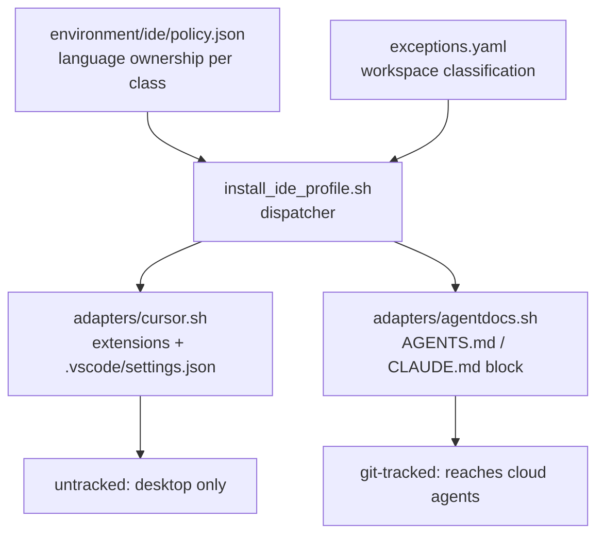

# IDE profile portability and backup trigger control

## What is already done

Four of the five backup fixes shipped last session and were re-verified against the files just now: reason filtering, debounce, activity guard, and the single-flight lock all live in [ops/scripts/backup_gate.sh](/Users/ib-mac/.cursor-governance/ops/scripts/backup_gate.sh) and [ops/hooks/session_end_governance_backup.sh](/Users/ib-mac/.cursor-governance/ops/hooks/session_end_governance_backup.sh). This plan covers only what remains.

## Verified findings

- **F-01 (Critical, confirmed).** `backup_gate.sh` honors `GOVERNANCE_BACKUP_FORCE` (line 38) but not `GOVERNANCE_BACKUP_SKIP`. When skip is set, `backup_to_github.sh` exits 0 at line 20, so the hook treats it as success and writes the stamp at line 83. The 15-minute debounce then suppresses the *next real* backup. Suppressing one backup silently disables two.
- **F-02 (High, confirmed).** Local branch is `l9-ci-core-integration-audit`, upstream is `origin/main`, and `backup_to_github.sh` line 115 pushes `HEAD:main`. Feature-branch work in the governance clone lands on `main` unannounced.
- **F-03 (confirmed).** In a governed repo the only git-tracked policy carriers are `.cursorrules`, `.editorconfig`, `AGENTS.md`, `CLAUDE.md`. `.vscode/` and `.cursor/rules` are untracked, so the entire Cursor rendering layer is invisible to cloud agents. The earlier claim that `.mdc` rules reach Cursor mobile is false in this setup.
- **F-04 (confirmed).** `environment/ide/` has no `policy.json` and no `adapters/`. Ownership rules are implicit in the `settings.*.json` payloads, so there is no IDE-neutral source to render from.
- **F-05 (confirmed).** The installer already keeps two stamps at different scopes: `$HOME/.cursor/.l9-ide-desired-hash` (extensions, machine) and `<ws>/.vscode/.l9-ide-desired-hash` (settings, workspace). Any adapter framework must preserve that split rather than collapsing to one stamp.
- **F-06 (confirmed).** SEO-Bot declares `eslint: ^9.0.0` and a `"lint": "eslint src/"` script but ships no `eslint.config.js`. ESLint 9 is flat-config-only, so `npm run lint` fails today. Website-Bot has no ESLint dependency, script, or config at all.

## Architecture

The split matters because only the tracked branch survives a `git clone` into a cloud agent sandbox.

## Wave 1 — backup gate correctness

**PI-01. Gate honors the skip switch.** In `backup_gate.sh`, check `GOVERNANCE_BACKUP_SKIP=1` immediately after the `FORCE` block and return exit 10 (`SKIP: GOVERNANCE_BACKUP_SKIP=1`). Exit 10 is the code the hook already maps to "skip without stamping" at line 72. This resolves F-01 at root cause: the decision moves into the gate, where the stamp is not written, instead of into the backup script, where exit 0 looks like success.

**PI-02. sessionStart publishes the switch.** `session_start_bootstrap.sh` already emits an `env` object that Cursor propagates to later hooks. Set `GOVERNANCE_BACKUP_SKIP=1` when a build-in-progress marker exists (`$GLOBAL_COMMANDS/.governance-build-lock`). Depends on PI-01 — without it this makes things worse, not better.

**PI-03. Push guard.** In `backup_to_github.sh`, before line 115, warn when the current branch is not `$BRANCH`. Warn only, never block: an unattended sessionEnd hook must not start failing. Resolves F-02.

**PI-09a. Extend `test_backup_gate.sh`** with skip-set and skip-unset assertions. Gate for Wave 1: `bash ops/scripts/test_backup_gate.sh` reports `FAIL: 0`.

## Wave 2 — policy and rendering split

**PI-04. `environment/ide/policy.json`.** Declare, per workspace class, which tool owns which language. IDE-neutral: no extension IDs, no `editor.*` keys. This becomes the single ownership authority; `settings.*.json` becomes a rendering of it.

**PI-05. Installer derives rendering from policy.** `install_ide_profile.sh` reads `policy.json` and produces the same managed-key set it writes today. Validation is a diff against the current `.vscode/settings.json` output for both classes — byte-identical means the refactor preserved behavior.

**PI-06. Generated ownership block in `AGENTS.md` / `CLAUDE.md`.** A delimited managed block, generated from `policy.json`, stating which formatter owns which language. These files are git-tracked (F-03), so this is the only carrier that reaches Claude Code mobile and Cursor cloud agents. Written by `adapters/agentdocs.sh`.

**PI-08. Dispatcher.** `install_ide_profile.sh` keeps classification and the managed-key merge, then dispatches to `adapters/*.sh` based on which IDE CLIs are on `PATH`. Move today's Cursor logic verbatim into `adapters/cursor.sh`. Preserve both stamp scopes from F-05 — one stamp per adapter per scope, not one global stamp. Do not write `zed.sh` or `jetbrains.sh` speculatively; add an adapter the first time a repo is opened in that editor.

**PI-09b. Extend `test_install_ide_profile.sh`** to cover dispatch and the agentdocs adapter.

## Wave 3 — make eslint_owned real

You chose to generate configs. The two repos need different treatment because their starting states differ (F-06).

**PI-10a. SEO-Bot** (`$HOME/Dropbox/Repo_Dropbox_IB/SEO-Bot`). ESLint 9 and the `lint` script already exist, so adding `eslint.config.js` (flat config, ESM, TypeScript) repairs a script that fails today. No dependency change. Validation: `npm run lint` exits 0.

**PI-10b. Website-Bot** (`$HOME/Dropbox/Repo_Dropbox_IB/Website-Bot`). No ESLint anywhere, so this means adding devDependencies plus lockfile churn in a repo outside the governance clone. Sequence it after PI-10a and treat it as a separate reviewable change.

Both are ESM TypeScript with vitest, so flat config with `typescript-eslint` fits both.

## Deferred — open decisions

- **`.editorconfig` adapter.** Held out pending your decision; see the explanation accompanying this plan.
- **Cloud-agent hooks probe.** Cursor docs confirm cloud agents run neither `sessionStart` nor `sessionEnd`, but do run some project-level `.cursor/hooks.json` events. Whether `afterFileEdit` fires there is unverified and needs an experiment, not a code change.

## Out of scope

No new IDE adapters beyond Cursor and agentdocs. No changes to the four backup fixes already shipped. No commits or pushes without a separate explicit instruction.
