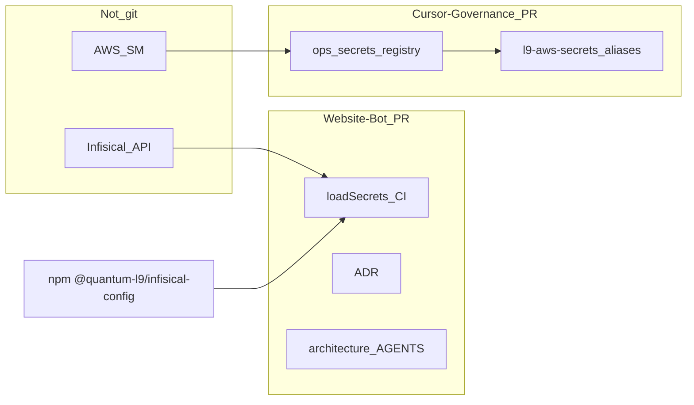
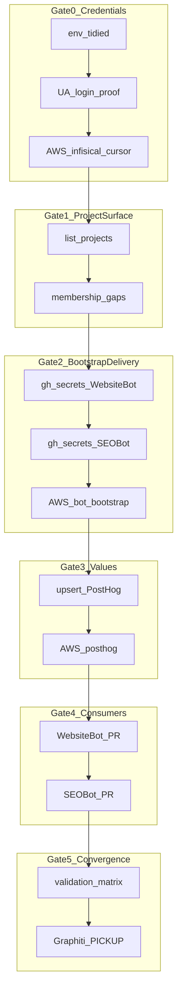

# Infisical vault unlock — improved execution plan

**Improved via** [kernels/Improve.md](kernels/Improve.md): evidence-first, granular todos, explicit validation gates (Passed/Failed/Skipped/Unknown), root-cause over UI theater, no scope drift.

**PLAN_DOCUMENT:** [memory-bank/infisical-once-plan.json](memory-bank/infisical-once-plan.json) (re-sync on execute).

**Execution mode when user says go:** full_improvement across Website-Bot + SEO-Bot + Cursor-Governance secrets surface; commit/PR authorized by autonomy surface; **no merge**.

---

## 1. Where code lands (critical)

**Primary utilization = Website-Bot.** App wiring, CI, ADR, architecture, and `AGENTS.md` land on a **Website-Bot feature branch / PR**, not inside Cursor-Governance.

| Change | Lands in | Branch? |
|---|---|---|
| `loadSecrets()`, `@quantum-l9/infisical-config` dep, `run-pipeline.ts`, CI `infisical run` | **Website-Bot** | **Yes — Website-Bot PR** |
| ADR (Infisical secrets plane) + `architecture.md` / `ARCHITECTURE.md` + `AGENTS.md` updates | **Website-Bot** | **Same Website-Bot PR** |
| SEO-Bot package migration / delete inline `secrets.ts` | **SEO-Bot** | **Separate SEO-Bot PR** |
| AWS registry YAML + `l9-aws-secrets` aliases only | **Cursor-Governance** | **Yes — small governance PR** (SSOT inventory, not bot runtime) |
| Infisical secret **values** / MI membership | Infisical API (+ AWS mirror) | **Not a git repo** |
| `@quantum-l9/infisical-config` package source | already published from **infisical-config** | consume; do not fork into Website-Bot |

**Do not** implement Website-Bot `loadSecrets` or Website-Bot ADRs on a Cursor-Governance branch. Governance owns secret *refs/registry*; Website-Bot owns how the factory loads and documents secrets.



## 2. Target binding

| Root | Role | Modify? |
|---|---|---|
| Cursor-Governance `.env` (local, gitignored) | UA credentials (tidied) | done |
| AWS `openclaw-igorbot/*` + [ops/secrets/](ops/secrets/) | Agent SSOT / registry | yes (gov PR) |
| Infisical org `infiscal-l9` (`3c670249-…`) | Vault values + MIs | yes via API |
| [Quantum-L9/Website-Bot](https://github.com/Quantum-L9/Website-Bot) | Consumer + CI + **ADR/architecture/AGENTS** | yes (**Website-Bot PR**) |
| [Quantum-L9/SEO-Bot](https://github.com/Quantum-L9/SEO-Bot) | Consumer | yes (SEO-Bot PR) |
| [Quantum-L9/l9-infra](https://github.com/Quantum-L9/l9-infra) | TF structure | **defer** unless API cannot adopt existing projects |
| [Quantum-L9/infisical-config](https://github.com/Quantum-L9/infisical-config) | Runtime package `@1.1.0` | consume only |

**Identity (authoritative):**
- MI name: `Cursor`
- identity_id: `3c78da61-c4db-44cd-8c7b-cb7a2192231b`
- Universal Auth client_id: `e976c232-5f27-413f-b7e7-cc2b1a1144ea`
- client_secret: `.env` `CURSOR_INFISICAL_CLIENT_SECRET` / `INFISICAL_CLIENT_SECRET` (never log)
- Website-Bot Infisical project: **exists**; Cursor is **Admin** (2026-08-11)

---

## 3. Locked decisions (contracts)

1. **No** personal API keys (deprecated). Ignore expired `INFISICAL_API_TOKEN`.
2. **No** Infisical “Connect to GitHub” UI.
3. **No** duplicate Website-Bot Infisical project.
4. **Bootstrap names** apps expect: `INFISICAL_CLIENT_ID`, `INFISICAL_CLIENT_SECRET`, `INFISICAL_PROJECT_ID` (+ optional `INFISICAL_ENV=prod`).
5. **Secret value names in Infisical must match app env vars** (`POSTHOG_PERSONAL_API_KEY`, `PUBLIC_POSTHOG_KEY`, `POSTHOG_PROJECT_ID`, `POSTHOG_HOST`, `POSTHOG_API_URL`, …) — contract from `@quantum-l9/infisical-config` README.
6. **Dual plane:** Infisical = bot/CI hydration; AWS = agent resolve + backup of bootstrap/PostHog.
7. **TF (`l9-infra`):** defer if Website-Bot project already usable; prefer API upsert + membership. Revisit TF only if SEO-Bot/platform-common missing and API create is insufficient.
8. **Fail-soft loaders** unless `INFISICAL_REQUIRED=true` (preserve local `.env` emergency path).



---

## 4. Baseline evidence (already collected)

| Check | Result | Classification |
|---|---|---|
| Personal API token `/api/v1/user` | 403 expired | Failed (path abandoned) |
| UA login client_id + `CURSOR_INFISICAL_CLIENT_SECRET` | 200 LOGIN_OK | **Passed** |
| Website-Bot Infisical project | exists; Cursor Admin | **Passed** |
| `.env` Client ID + secret aliases | tidied 2026-08-11 | **Passed** |
| AWS `openclaw-igorbot/infisical-*` | absent | Unknown → create |
| GitHub Actions `INFISICAL_*` on bots | absent | Unknown → create |
| `@quantum-l9/infisical-config` publish | 1.1.0 (prior session) | Passed (re-check on install) |

---

## 5. `.env` tidy (DONE)

Cursor-Governance `.env` now has (values not shown):

- `CURSOR_INFISICAL_CLIENT_ID` / `INFISICAL_CLIENT_ID` = `e976c232-5f27-413f-b7e7-cc2b1a1144ea`
- `CURSOR_INFISICAL_CLIENT_SECRET` / `INFISICAL_CLIENT_SECRET` = (same secret)
- `INFISICAL_ORG_ID`, `INFISICAL_ORG_SLUG`, `INFISICAL_SITE_URL`

---

## 6. Granular work units (each with validation)

### Gate 0 — Credentials & AWS

**T0b — UA login proof**
- Action: `POST {SITE}/api/v1/auth/universal-auth/login` with env Client ID/Secret.
- Pass: HTTP 200 + non-empty `accessToken` (log length only).
- Fail: stop; do not write AWS with bad creds.

**T0c — AWS admin secret**
- Action: put `openclaw-igorbot/infisical-cursor` =
  `{client_id, client_secret, identity_id, org_id, org_slug, host}`.
- Then: `make secrets-sync` (or `sync_secrets_registry.py`); add aliases to [skills/l9-aws-secrets/SKILL.md](skills/l9-aws-secrets/SKILL.md).
- Pass: `resolve_secret.py --ref 'openclaw-igorbot/infisical-cursor#client_id' --check` → OK.

### Gate 1 — Project surface

**T1a — List projects**
- Action: authenticated API list workspaces/projects; record **Website-Bot** `projectId` / slug.
- Pass: Website-Bot found; IDs written to session note (not secrets).
- Unknown: endpoint shape drift → try alternate routes; document.

**T1b — Membership / SEO-Bot gap**
- If SEO-Bot project missing: create via API **or** mark TF follow-up; do not block Website-Bot path.
- If Cursor not on SEO-Bot: add membership Admin/read as needed.
- Pass: Website-Bot writable; SEO-Bot either ready or explicitly Deferred with reason.

### Gate 2 — Bootstrap delivery

**T2a / T2b — GitHub Actions**
```bash
gh secret set INFISICAL_CLIENT_ID --repo Quantum-L9/Website-Bot --body "$ID"
gh secret set INFISICAL_CLIENT_SECRET --repo Quantum-L9/Website-Bot --body "$SECRET"
gh secret set INFISICAL_PROJECT_ID --repo Quantum-L9/Website-Bot --body "$PROJECT_ID"
```
- Pass: `gh secret list -R … | rg '^INFISICAL_'` shows three names (no values).

**T2c — AWS bot bootstrap**
- `openclaw-igorbot/infisical-website-bot` = `{client_id, client_secret, project_id, env}`
- Pass: resolve `--check` OK.

### Gate 3 — Secret values

**T3a — Read local PostHog** from SEO-Bot/Website-Bot `.env` (already filled earlier).
- Pass: personal + project token + project id present (prefix/len only).

**T3b — Upsert into Website-Bot Infisical** (`prod`, path `/`) names:
- `POSTHOG_PERSONAL_API_KEY`, `PUBLIC_POSTHOG_KEY` (and/or `POSTHOG_PROJECT_API_KEY`), `POSTHOG_PROJECT_ID`, `POSTHOG_HOST`, `POSTHOG_API_URL`
- Pass: list-secrets returns those **names** (not values).

**T3c — AWS mirror** `openclaw-igorbot/posthog`
- Pass: `resolve …#personal_api_key --check` OK.

### Gate 4 — Consumers

**T4a–T4e Website-Bot (single PR on Website-Bot)**
- Branch from `main` **in Website-Bot**; `NODE_AUTH_TOKEN` from `openclaw-igorbot/github#token`.
- `npm i @quantum-l9/infisical-config`.
- `await loadSecrets()` before config in [`scripts/run-pipeline.ts`](file:///Users/ib-mac/Website-Bot/scripts/run-pipeline.ts).
- CI: bootstrap-only env + `infisical run` (deferred Infisical CLI wrap item).
- **T4d docs (same PR):**
  - New ADR under Website-Bot `adr/` (or project ADR path): Infisical as secrets plane; Universal Auth bootstrap; env-name = Infisical secret name; no committed `.env` values; AWS only for agent bootstrap mirror / governance registry.
  - Update `architecture.md` / `ARCHITECTURE.md` (whichever exists): secrets hydration before pipeline; CI `infisical run`.
  - Update `AGENTS.md`: required `INFISICAL_*` bootstrap; how agents resolve via AWS then export; never ask human for PostHog values if Infisical/AWS resolve works; pointer to ADR.
- Pass: PR open with code+ADR+architecture+AGENTS; typecheck/tests green; CI green or remediation ≤3 cycles.

**T5a–T5c SEO-Bot (separate PR on SEO-Bot)**
- Replace [`src/core/secrets.ts`](file:///Users/ib-mac/SEO-Bot/src/core/secrets.ts) with package import in `index.ts` / `migrate.ts`; delete inline + fix tests.
- Pass: `vitest` secrets/posthog-auth tests green; PR CI green or remediated.
- Docs: light RUNBOOK cross-link only unless SEO-Bot already requires ADR for loader swap (prefer reuse Website-Bot ADR concept; do not duplicate long ADR into governance).

### Gate 5 — Convergence

**T6a — Cursor-Governance PR only** for `infisical-cursor` / `infisical-website-bot` / `posthog` registry + `l9-aws-secrets` aliases (no Website-Bot app files).

**T6b — Validation matrix**

| ID | Command / proof | Gate |
|---|---|---|
| V1 | UA login 200 | mandatory |
| V2 | resolve `infisical-cursor#client_id` | mandatory |
| V3 | Infisical list PostHog **names** on Website-Bot | mandatory |
| V4 | resolve `posthog#personal_api_key` | mandatory |
| V5 | `gh secret list` INFISICAL_* on Website-Bot | mandatory |
| V6 | Website-Bot PR checks green | mandatory |
| V6b | Website-Bot PR includes ADR + architecture + AGENTS updates | mandatory |
| V7 | SEO-Bot PR checks green | mandatory if SEO project ready else Skipped+reason |
| V8 | Agent clone dry-run: resolve AWS → export INFISICAL_* → `loadSecrets` inject count > 0 | mandatory |
| V9 | Cursor-Governance PR only touches secrets registry/skill (no bot code) | mandatory |

**Convergence (Improve.md):** Converged only when no unresolved critical/high in-scope issue, mandatory checks Passed, no new regression, no extra high-value pass required. Graphiti PICKUP written.

---

## 7. Out of scope (entropy control)

- Infisical GitHub App / Connect to GitHub
- Personal API key revival
- New Website-Bot Infisical project
- PostHog wizard / SDK inject into governance
- Full `l9-infra` terraform apply unless Gate 1 forces it
- Merging PRs (human merge only)
- Locking `trusted_ips` away from `0.0.0.0/0` (follow-up)

---

## 8. Risks & stop conditions

| Risk | Stop / mitigation |
|---|---|
| Secret printed to chat/logs | Never echo secrets; length/prefix only |
| Cursor org role `member` cannot create SEO-Bot project | Defer SEO Infisical; still ship Website-Bot; ask elevate only if blocked |
| GitHub Packages 401 on infisical-config | Export `NODE_AUTH_TOKEN` from AWS github |
| `infisical run` CLI flag drift | Pin CLI version; dry-run one workflow job first |
| Duplicate PostHog keys across projects | Prefer Website-Bot project first; platform-common only if import exists |

**Stop completion** if V1–V4 fail. **Do not** weaken CI or skip secret scanners.

---

## 9. Execution handoff

On user **`execute` / `go`**:
1. Run Gate 0 → 5 in order; update todo statuses as each validation Passes.
2. Open **three** PRs max: Website-Bot (code+ADR+docs), SEO-Bot (loader), Cursor-Governance (registry/aliases only).
3. Spawn `l9-pr-remediation` background per PR (no AwaitShell; no merge).
4. Final response: validation matrix + PR URLs + residual Unknowns only.
