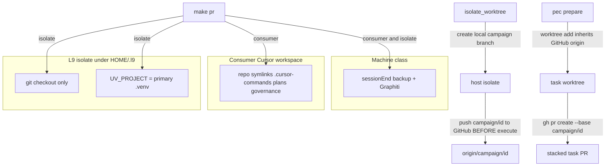

# Isolate class + campaign publish seals

**Repo:** Cursor-Governance only. Write tree: [`$HOME/.l9/gov-worktrees/pe-context7-stack`]($HOME/.l9/gov-worktrees/pe-context7-stack) on `feat/pe-context7-stack` (already branched from `origin/main` at `389b030`; keep the two stack-proof commits). Do not write the dirty `$HOME/.cursor-governance` primary. Do not edit `l9-ci-core` workflows or `MANIFEST.sha256`.

**Depth:** deep (guarded `make pr` skip + campaign remotes). **Evidence:** sufficient (live `make campaign` + `make pr` fail). **Execute:** cursor-foreground on that worktree via `PR_REMEDIATE=0 make pr`. Do **not** launch a new `make campaign` to implement this plan — that recurses through the broken publish path.

**PLAN_DOCUMENT id:** `plan.pe.isolate-wiring-and-campaign-publish.v1`
On execute, emit JSON and run `python3 ~/.claude/skills/l9-plan/scripts/validate_plan_document.py` before mutating. Project PE+autonomy `.plan.md` only if the operator wants a Cursor plan file; this CreatePlan artifact is the review SSOT.

## Locked decisions (do not reopen)

- **Skip, do not wire** `$HOME/.l9/**` isolates. `isolate_worktree` / `pec prepare` stay git-only. Never call [`setup_workspace_symlinks.sh`]($HOME/.cursor-governance/ops/scripts/setup_workspace_symlinks.sh) as isolate recovery.
- **Do not retire** Graphiti sessionEnd, `governance-backup.sh` sessionEnd, Graphiti resolve/gate/skill-router, or `/end-session` force-retry-only.
- **Keep** consumer symlink checks on real Cursor clones (`$HOME/.cursor-governance`, `l9-ci-core`, any opened consumer).
- **Keep** existing feat-branch seals: stub refuse, `origin` set-url to GitHub after `--local` clone, `github` remote + `gh pr create --repo`.
- **Still missing on the feat branch:** push `campaign/<id>` **before** first task PR; isolate `make pr` skip + toolchain bind; honest banners; nested double-run retire.
- Makefile root file is **append-only**. Fix scripts, do not rewrite the `pr:` recipe in [`Makefile`]($HOME/.cursor-governance/Makefile).

## Architecture

## Wave 0 — shared isolate predicate

Add `is_l9_isolate_workspace` to [`ops/scripts/resolve_governance_paths.sh`]($HOME/.cursor-governance/ops/scripts/resolve_governance_paths.sh) so every skip uses one test:

- `$HOME/.l9/gov-worktrees/*`
- `$HOME/.l9/programs/*/worktrees/*`
- `$HOME/.l9/programs/*` checkouts that are not a Cursor-opened consumer

Do not use `L9_GOVERNANCE_SURFACE` alone — PE isolates on this machine are still `cursor`, which is why the existing skip never fired.

## Wave 1 — retire banner lie + nested double-run

Split [`check_governance_wiring.sh`]($HOME/.cursor-governance/ops/scripts/check_governance_wiring.sh) into two modes (same file, `--workspace` / `--machine`, default both for consumer):

- `--workspace`: repo `.cursor-commands`, `.cursor/plans`, `.cursor/governance`
- `--machine`: sessionEnd backup hook + Graphiti (already `$HOME/.cursor` scoped)

Honest RESULT lines:

- missing consumer symlink → `FAIL — consumer workspace wiring`
- missing backup/Graphiti sessionEnd entry → `FAIL — sessionEnd hook incomplete`
- Graphiti resolve/router → `FAIL — Graphiti wiring`

On isolate, `--workspace` is skipped (PASS with class note). `--machine` still runs.

[`validate_governance_symlinks.sh`]($HOME/.cursor-governance/ops/scripts/validate_governance_symlinks.sh) already owns repo symlink checks. **Retire** lines 131–136 that wrap the **full** `check_governance_wiring.sh` under `=== sessionEnd hook ===`. Call `--machine` only. Delete the dead statements after `exit 1` in `check_governance_wiring.sh` (lines 317+).

Pair the isolate skip in:

- [`run_pr_precommit.sh`]($HOME/.cursor-governance/ops/scripts/run_pr_precommit.sh) `SKIP_LIST` (`symlinks-check`)
- [`run_pr_gate.sh`]($HOME/.cursor-governance/ops/scripts/run_pr_gate.sh) local-activation block (today lines 277–281)

Keep the existing CI / non-cursor surface skip. Change both together (comment already says PAIRED PREDICATE).

## Wave 2 — isolate toolchain bind (cryptography leak)

When `make pr` runs from an isolate, `GOV_ROOT` becomes the isolate (`SCRIPT_DIR/../..` / `GOV_ROOT=$(CURDIR)`), so `uv` creates a new `.venv` with miniconda 3.12 and dies on `cryptography==50.0.0 --no-build`.

In [`run_pr_gate.sh`]($HOME/.cursor-governance/ops/scripts/run_pr_gate.sh) and [`open_pr_after_gate.sh`]($HOME/.cursor-governance/ops/scripts/open_pr_after_gate.sh):

- `WS` = isolate (changed files, git)
- `GOV_TOOLCHAIN_ROOT` = donor via `git rev-parse --git-common-dir` when that tree has `.venv/bin/python`, else `$HOME/.cursor-governance`
- `PATH` prepend `$GOV_TOOLCHAIN_ROOT/.venv/bin`
- `UV_PROJECT=$GOV_TOOLCHAIN_ROOT`
- refuse `uv venv` / `uv sync` that would create `$WS/.venv` on an isolate

Do not weaken `--no-build` or scanners. Do not pin a second Python in pec trees.

## Wave 3 — remaining campaign leak (order)

Already on feat branch (keep, add tests if thin):

- [`write_and_commit_output`]($HOME/.l9/gov-worktrees/pe-context7-stack/environment/program-execution/scripts/run_campaign.py) stub refuse
- [`default_ensure_target_checkout`]($HOME/.l9/gov-worktrees/pe-context7-stack/environment/program-execution/scripts/run_campaign.py) `remote set-url origin` to GitHub after `--local` clone
- [`maybe_open_task_pr`]($HOME/.l9/gov-worktrees/pe-context7-stack/environment/program-execution/scripts/run_campaign.py) `github` remote + `gh pr create --repo`

**Still wrong:** [`push_integration_branch`]($HOME/.l9/gov-worktrees/pe-context7-stack/environment/program-execution/scripts/run_campaign.py) runs only after all tasks COMPLETED (around line 1695). Move it to immediately after isolate/arm, before `default_execute` / first `maybe_open_task_pr`. Push via GitHub remote. Fail closed if `origin/campaign/<id>` (or `github/campaign/<id>`) is missing before the first task PR.

Host `make pr` after execute stays. Campaign **task** PRs stay `PR_BASE=campaign/<id>`. `PR_BASE=origin/main` is only for this feature PR because the campaign base never reached GitHub.

Do not restore one-line auto-complete. Tests keep injecting `Hooks.write_task_output`.

## Wave 4 — tests, docs, publish

Tests (new or extend):

- isolate predicate true/false (consumer clone vs `$HOME/.l9/...`)
- banner: missing `.cursor-commands` must not print `sessionEnd hook incomplete`
- `validate_governance_symlinks.sh` does not invoke full `--workspace` gate
- `run_pr_precommit.sh` / gate skip consumer checks on isolate, still invoke `--machine`
- isolate toolchain: `UV_PROJECT` / PATH point at primary `.venv`; no isolate `.venv` created
- `push_integration_branch` invoked before first task PR; fail if remote campaign branch missing
- keep existing stub-refuse test

Docs (official sync after):

- [`skills/l9-pe-campaign-activate/references/pipeline.md`]($HOME/.l9/gov-worktrees/pe-context7-stack/skills/l9-pe-campaign-activate/references/pipeline.md) — campaign branch pushed before execute
- comments on the paired skip (not a new consumer-facing workflow)
- `python3 ops/scripts/sync_generated_artifacts.py --force` + `write_manifest` for touched PE/skill/rule surfaces

Publish from the feat worktree after Waves 1–2 so the gate can pass:

`PR_REMEDIATE=0 PR_BASE=origin/main make pr`

Then FF primary. Then `reconcile_claude_settings.py` so Context7 allow-list is live on this machine. `autonomous_merge: false`.

## Scope

**In:** isolate class + honest wiring banners; retire nested full-gate call; isolate `make pr` skip + toolchain bind; early `campaign/<id>` push; keep/prove stub + GitHub remote seals; tests; PE activate pipeline note; sanctioned PR.

**Out:** retiring automatic sessionEnd hooks; wiring isolates via `setup_workspace_symlinks.sh`; pec `prepare_worktree` consumer IDE layout; eighth Core workflow; dirty primary product edits; PE-Memory.md / live campaign as the implementer; `PR_BASE=main` for future campaign task PRs; weakening scanners / `--no-build`; force-push; forging Phase 0 ack; restoring `program-execution.intent.v1`.

## Success criteria (falsifiable)

- Isolate under `$HOME/.l9/**` with no `.cursor-commands`: `make pr-check` does not fail consumer symlink checks and does not print `sessionEnd hook incomplete`.
- Consumer clone missing `.cursor-commands`: still FAIL, banner says consumer workspace wiring.
- Machine missing `governance-backup.sh` sessionEnd entry: FAIL `sessionEnd hook incomplete`.
- `validate_governance_symlinks.sh` on a consumer does not re-run `--workspace` via the nested call.
- Isolate `make pr-check` uses `$HOME/.cursor-governance/.venv` (or donor worktree `.venv`); no new isolate `.venv`; no `cryptography==50.0.0` source-build.
- Unit test: `push_integration_branch` before first `gh pr create`; remote `campaign/<id>` required.
- Stub output still refused.
- `python3 -m unittest` for touched PE + new wiring tests PASS; `make pr-check` PASS on the feat worktree.

## Stress / leverage / rollback

**Disconfirm:** (1) Would `$HOME/.l9/gov-worktrees` ever be a Cursor-opened consumer that must keep symlink gates? (2) Does `git clone --local` of the host isolate still leave pec worktrees with a filesystem origin after set-url-on-donor? (3) Does pushing `campaign/<id>` before execute publish an empty integration branch that CI treats as releasable? (4) Can `git-common-dir` resolve to a bare git dir with no `.venv`, sending toolchain to the wrong tree?

**Assumed false ifs:** isolates stay under `$HOME/.l9/**`; primary `.venv` remains the locked 3.11+ env; `feat/pe-context7-stack` stays unpushed until gate PASS; operator does not run `setup_workspace_symlinks.sh` on isolates.

**Blast radius:** a loose isolate predicate skips wiring on a real consumer clone; a late campaign push still blocks stacked PRs; a wrong `GOV_ROOT` rewrite on a consumer clone could skip the isolate’s own scripts.

**Rollback:** revert the feat-branch commits; isolate skip is additive; no hook files removed from `~/.cursor/hooks.json`.

**Leverage order:** shared isolate predicate → split wiring modes → early campaign push → toolchain bind → paired `make pr` skip → tests → docs → publish.

**Shared causes:** one workspace class; one banner owner; campaign base must exist on GitHub before `gh`; isolate is not a uv project.

**Deletions:** nested full-gate call; dead code after `exit 1`; “run setup_workspace_symlinks” as isolate recovery text.

## GMP / PE handoff

- **may_modify:** `ops/scripts/resolve_governance_paths.sh`, `check_governance_wiring.sh`, `validate_governance_symlinks.sh`, `run_pr_precommit.sh`, `run_pr_gate.sh`, `open_pr_after_gate.sh`, `environment/program-execution/scripts/run_campaign.py`, matching tests, `skills/l9-pe-campaign-activate/references/pipeline.md`, generated artifacts via official sync.
- **must_not_modify:** `l9-ci-core` workflows/MANIFEST; dirty `$HOME/.cursor-governance` except later settings reconcile; `~/.cursor/hooks.json` sessionEnd entries; pec core templates in place; root `Makefile` existing recipes; `environment/program-execution/core/`.
- **preserved:** Graphiti + backup sessionEnd; consumer symlink gate; stub refuse; no `PR_BASE=main` for campaign task PRs; `--no-build` wheels-only.
- **validation:** new isolate/wiring tests; `python3 -m unittest` PE campaign tests; `make pr-check` from feat worktree.

**Next skill after plan accept:** cursor-foreground implement on `feat/pe-context7-stack`, then `l9-ynp`. Optional GMP Phase 0 only if the operator wants a signed lock; not required to start.

## Campaign packet stub (execute)

- `autonomous_merge: false`
- `declared_branches: [feat/pe-context7-stack]`
- `allowed`: execute plan todos, commit on declared branch, `PR_REMEDIATE=0` push after L4 `authorize-release`
- `forbidden`: new `make campaign` as implementer; force-push; merge outside L4; weaken tests; write dirty primary; wire isolates
