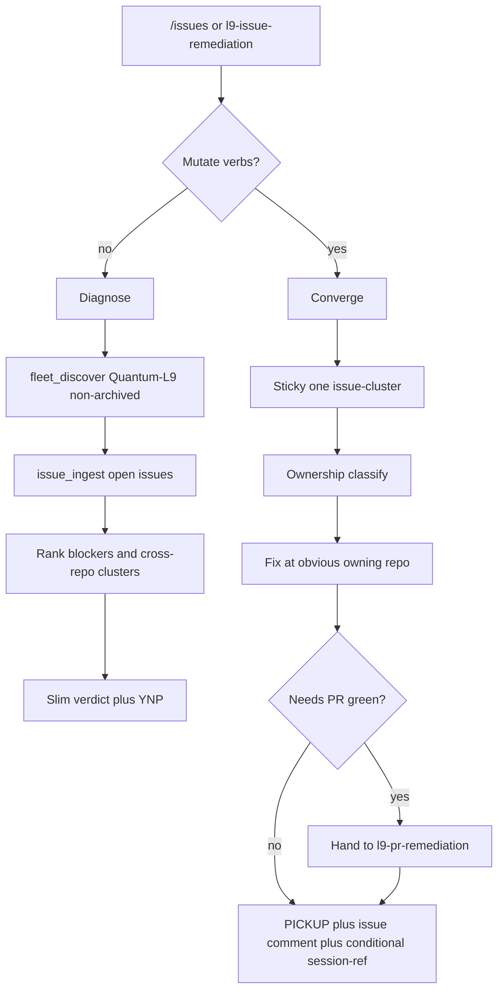

# Compile l9-issue-remediation

**PLAN_DOCUMENT:** validated PASS via `l9-plan` `validate_plan_document.py` (depth: deep).
**Next skill after approve:** `l9-skill-compiler` (build) → `l9-wire-skill-into-repo` → `make pr-check`.

## Locked decisions

- **Fleet:** all non-archived `Quantum-L9/*` via `gh` (not `group_registry.yaml`).
- **Breadcrumbs (Converge closeout):** Graphiti PICKUP **required** + issue comment **required** + update root session-reference markdown (`TODO.md`) **only if that file already exists** (never invent it).
- **Name:** `l9-issue-remediation` (sibling of [`skills/l9-pr-remediation/`](skills/l9-pr-remediation/)).
- **Safety:** `disable-model-invocation: true` + `explicit_only`; ambiguous asks → Diagnose; Converge default sticky to **1 issue-cluster** per invocation (U1 bounded).
- **PR work:** open/fix in owning repo, then **hand off** to `l9-pr-remediation` — never merge from this skill.

## Skill shape (mirror / diverge)

**Mirror** from pr-remediation: two intents, ownership-before-edit, ≤3 cycles, one commit/push per cycle, no gate weakening, slim status, stdlib fail-closed fetch scripts, authority order.

**Diverge:** org fan-out Issues API; cross-repo owner routing; no CI short-poll as primary loop; no merge-advise; breadcrumb closeout law; sticky issue-cluster not sticky PR.

## Pack to compile

Under [`skills/l9-issue-remediation/`](skills/l9-issue-remediation/):

| Path | Role |
|------|------|
| `SKILL.md` | Control plane: intents, fleet law, breadcrumb law, caps, resource map |
| `references/diagnose-workflow.md` | Read-only org inventory + rank + verdict template |
| `references/ownership-boundary.md` | CODEBASE / CROSS_REPO / HUMAN / EXTERNAL / FALSE_POSITIVE |
| `references/finding-classifier.md` | Cluster by shared root cause across repos |
| `references/cross-repo-routing.md` | Pick obvious owner (shared package/SSOT > consumer); evidence from issue body + imports |
| `references/fix-engine.md` | Concurrent safe batch → local verify → one commit |
| `references/convergence-loop.md` | Re-ingest issue state; early stop on HUMAN/EXTERNAL |
| `references/handoff-to-pr-remediation.md` | When a PR exists/needed |
| `references/unblock-breadcrumb.md` | PICKUP field shape; issue comment template; conditional session-ref prepend |
| `references/validation-checklist.md` | Done-when gates |
| `scripts/fleet_discover.py` | Non-archived `Quantum-L9` repo list → JSON |
| `scripts/issue_ingest.py` | Open issues snapshot → normalized findings JSON |
| `scripts/post_issue_comment.py` | Canonical unblock comment (no secrets) |
| `agents/meta.yaml` | Required compiler meta |

Slash command sibling: [`commands/issues.md`](commands/issues.md) → Diagnose only (mirror [`commands/pr.md`](commands/pr.md)).

## Cross-repo unblock rule (concrete)

Example pattern (SEO-Bot #5 llm-router drift): classify as `CROSS_REPO`; fix at shared package / declared SSOT owner, not both consumers ad hoc; comment on **all linked issues**; PICKUP names blocked task + files + `next=` resume; update session-ref markdown only in repos that already have it.

## Wiring / validation

1. `l9-skill-compiler` build (zero-stub; no scaffolds).
2. `l9-wire-skill-into-repo` → registry + [`skills/AUTONOMY_MANIFEST.yaml`](skills/AUTONOMY_MANIFEST.yaml) `explicit_only` + `.claude/skills/` symlink.
3. `make pr-check` on Cursor-Governance.
4. Smoke: Diagnose dry-run must surface SEO-Bot open issues without mutations.

## Out of this GMP

- Org-wide Converge campaign execution (separate explicit run after pack lands).
- Editing `l9-pr-remediation` or expanding `group_registry.yaml` as fleet SSOT.
- Creating root session-reference files where absent.
