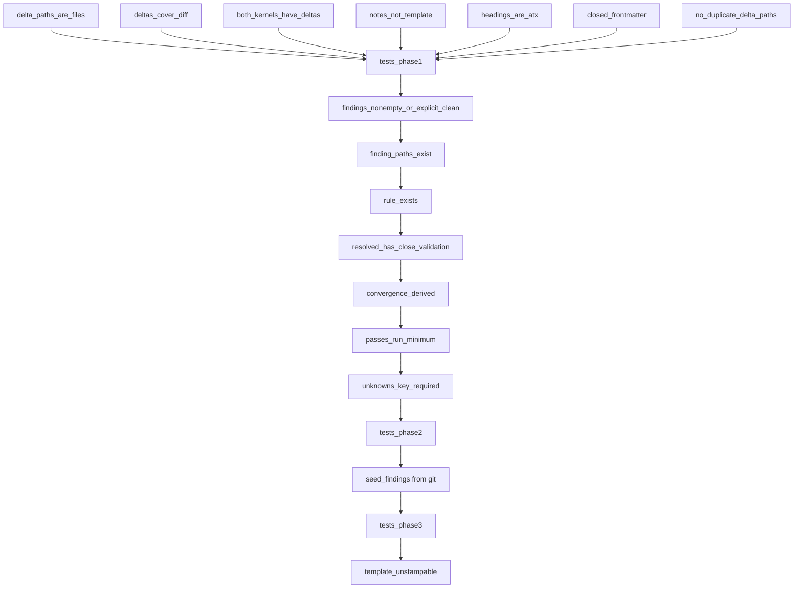

# Harden Kernel Predicates to Force Actual Audit

## Problem

`kernel_predicates.py` validates the apply report but accepts artifacts an agent can produce **without running the kernels**:

1. `delta_paths_exist` only checks `exists()` — directories and symlinks pass
2. Deltas need not match `git diff` — can omit changed files or invent extras
3. `note` and body are non-empty strings — template boilerplate passes
4. `convergence_status` is a claim — agent says "converged" without validation
5. Both kernels can be listed while one has all the deltas
6. Heading check is substring (`in`) not ATX heading match
7. Schema is open — extra/junk keys ignored
8. No finding ledger — the kernels define `violation_record` / `finding_record_schema` but the report ignores them
9. `PREDICATE_IDS` tuple is declared but never used

The v2 receipt plane work (PR `feat/make-pr-kernels`, commit `7cf5d353`) wired predicates to `kernel_gate.record`/`verify_tree`. That is not duplicated here. This plan **hardens** the predicates themselves.

## Success Criteria

- An agent cannot produce a passing report faster than applying the kernels
- Every changed path appears in deltas or is explicitly excluded
- Template/boilerplate notes fail
- Disposition of seeded findings requires stating evidence
- Existing tests still pass; new tests prove each predicate catches its skip

## Scope

**In scope:**
- [`ops/autonomy/kernel_predicates.py`](ops/autonomy/kernel_predicates.py) — new predicates
- [`ops/autonomy/kernel_gate.py`](ops/autonomy/kernel_gate.py) — wire new predicates into `record` and `verify_tree`
- [`tests/ops/autonomy/test_kernel_predicates.py`](tests/ops/autonomy/test_kernel_predicates.py) — prove each predicate
- Schema bump `l9.kernel_apply.v1` → `l9.kernel_apply.v2`
- `apply_report_template()` in kernel_gate.py — emit unstampable skeleton

**Out of scope:**
- Kernel markdown files themselves (no change)
- `l4_local.py` (CANONICAL_LAW forbids coupling authorize-release to kernel receipt)
- `l9-recursive-optimization` skill (stays optional routing, not the gate)
- Plan `kernel_pass` checker (separate receipt plane)

## Phase 1 — Close Cheap Holes (mechanical)

Add predicates in `kernel_predicates.py`:

| Predicate | What it stops | Implementation |
|-----------|---------------|----------------|
| `delta_paths_are_files` | directory/symlink as a "change" | `Path.is_file()` not `exists()` |
| `deltas_cover_diff` | omitting dirty paths; inventing extras | Input = `changed_file` from `precommit`; exempt `CORPUS_SKIP_PREFIXES` + generated |
| `both_kernels_have_deltas` | RA-only tagging | At least one delta per kernel |
| `notes_not_template` | exact template boilerplate | Refuse if `note` == template placeholder or Levenshtein ratio > 0.9 to template |
| `headings_are_atx` | substring match | `re.search(r'^## Recursive Alignment\s*$', body, re.M)` |
| `closed_frontmatter` | junk keys | Allow only `schema`, `kernels`, `convergence_status`, `deltas`, `findings`, `validation`, `unknowns`, `passes_run`, `passes_skipped` |
| `no_duplicate_delta_paths` | one file, multiple claims | `len(paths) == len(set(paths))` |

Wire into `report_structure()` / `run_predicates()`. Update `PREDICATE_IDS` tuple to the live set.

Key file: [`ops/autonomy/kernel_predicates.py`](ops/autonomy/kernel_predicates.py) lines 87–120 (`report_structure`), 148–163 (`delta_paths_exist`).

## Phase 2 — Require Finding Ledger (schema bump)

Bump schema to `l9.kernel_apply.v2`. Add required `findings:` list using fields from the kernels' `violation_record` / `finding_record_schema`:

```yaml
findings:
  - id: RA-001
    kernel: recursive_alignment
    path: ops/memory/cli.py
    severity: High          # Critical|High|Medium|Low
    confidence: Confirmed   # Confirmed|Probable|Possible|Unknown
    rule: CANONICAL_LAW.md  # must exist as workspace path
    evidence: "Writes used a CG default group-id"
    status: Resolved        # Open|Resolved|AcceptedRisk|FalsePositive|OutOfScope|Blocked|Unknown
    close_validation: tests/ops/memory/test_cli.py  # required when Resolved
```

New predicates:

| Predicate | What it stops |
|-----------|---------------|
| `findings_nonempty_or_explicit_clean` | Silent "no findings" — require `audit_scope` + `passes_run` when empty |
| `finding_paths_exist` | Invented paths |
| `rule_exists` | Invented rules — must be real path or closed rule-id set |
| `resolved_has_close_validation` | Claiming Resolved without naming the test |
| `convergence_derived` | Claiming `converged` while Open High/Critical exists |
| `passes_run_minimum` | Require at least `context_and_scope_lock` + `reconciliation_and_convergence` |
| `unknowns_key_required` | Omitting the Unknown register |

## Phase 3 — Seed Findings from Git

Add `seed_findings()` in `kernel_predicates.py`:
- Walk `changed_file` list (same input `precommit` uses)
- Emit mandatory seeds the agent cannot delete:
  - Changed `*.py` with no mapped test → seed `VR-coverage`
  - Edit under `ops/autonomy/`, `ops/memory/`, `skills/` without matching `tests/` path → seed
  - `TODO`/`pass`/`NotImplementedError` in diff hunk → seed
- `record` merges seeds; predicate `seed_findings_present` verifies all seed ids exist
- Agent may only **dispose** (Resolved + close_validation, FalsePositive + evidence, OutOfScope + reason)

## Phase 4 — Template Cannot Be Stamped

Update `apply_report_template()` in kernel_gate.py to emit:
- `findings: []` (empty list fails `findings_nonempty_or_explicit_clean`)
- `passes_run: []` (fails `passes_run_minimum`)
- `unknowns: null` (fails `unknowns_key_required`)

So a skeleton cannot be `record`ed without filling real content.

## DAG



## Risk

- **Medium** — touches shared code (kernel_predicates.py is called by kernel_gate.py on every `make pr`)
- Blast radius: every existing `.l9/autonomy/kernel-apply.md` that skipped real work will fail until re-applied
- Rollback: revert the predicates module; v1 reports continue to work until schema reject is added

## Validation

```bash
# Phase 1
.venv/bin/pytest tests/ops/autonomy/test_kernel_predicates.py -q

# Full gate
make pr-check
```

## Doc/Root Surface Impact

- `AGENTS.md` `RECEIPT_EVIDENCE_PLANE_V1` — append schema v2 note (append-only)
- `CANONICAL_LAW.md` §6.2.9 — no change needed (already says receipt binds to artifact, not HEAD)

## Execute via Cursor Build

After todos complete: scoped-commit, `l4_local.py authorize-release`, then `PR_STACK=auto PR_REMEDIATE=0 make pr`. Display the opened **PR URL**.

## Build evidence (auto)

- detected_at: `2026-09-19T15:18:09Z`
- conversation_id: `2587efae-42b3-408d-aa11-ddf2c016ac6c`
- generation_id: `c00de0ed-a8d5-42e0-ab8c-7e98f94ce545`
- transcript: `/Users/ib-mac/.cursor/projects/Users-ib-mac-Cursor-Governance/agent-transcripts/2587efae-42b3-408d-aa11-ddf2c016ac6c/2587efae-42b3-408d-aa11-ddf2c016ac6c.jsonl`
- todos at build time:
- `phase1-file-check`: completed
- `phase1-diff-cover`: completed
- `phase1-both-kernels`: completed
- `phase1-notes`: completed
- `phase1-headings`: completed
- `phase1-closed`: completed
- `phase1-dup`: completed
- `phase1-tests`: completed
- `phase2-schema`: completed
- `phase2-finding-preds`: completed
- `phase2-tests`: completed
- `phase3-seed`: completed
- `phase3-tests`: completed
- `phase4-template`: completed
- `wire-gate`: completed
- `docs`: completed
