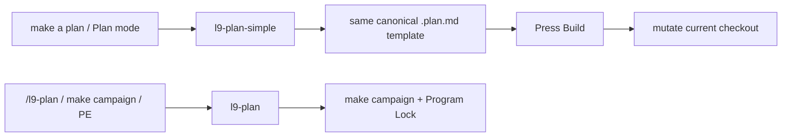

# l9-plan-simple (same template, Build not PE)

Create a new global skill that fills the **same** first-class plan template as `l9-plan`, then executes it with the **Build** button on the current checkout.

Do not fork a thinner template. Do not wire the delivered plan to Program Execution. Do not run `make campaign`. Do not lock `origin/main` to a SHA or require a new worktree from tip.

`l9-plan` stays the PE/campaign planner (same template **and** PE execute path). It is no longer the default for “make a plan” / Cursor Plan mode.

This plan itself is a simple plan: implement on this workspace, press Build, do not SHA-lock `origin/main`.

## Why the current default fails the request

[`skills/l9-plan/SKILL.md`](skills/l9-plan/SKILL.md) + [`references/plan-workflow-pe-autonomy.md`](skills/l9-plan/references/plan-workflow-pe-autonomy.md) bind the shared template to PE:

- Immutable baseline treated as `Lock: origin/main = <sha>` plus a new wired worktree
- Execute via `@environment/program-execution` and `make campaign`
- Those execute rules are what `l9-plan-simple` drops. The template sections and `PLAN_DOCUMENT` gates stay.

Cursor Plan mode is hard-wired to that path in [`rules/23-l9-skill-routing.mdc`](rules/23-l9-skill-routing.mdc) (“Planning deliverables … follow `l9-plan`”) and in `AUTONOMY_MANIFEST.yaml` route `plan` (`primary: l9-plan`).

Plan audit then marks any file without `Execute via @environment/program-execution` as `missing_execute_section` ([`skills/l9-plan-audit/scripts/audit_plans.py`](skills/l9-plan-audit/scripts/audit_plans.py) line 192). A simple plan would show as STALE unless that flag is narrowed.



## Skill contract (`skills/l9-plan-simple/`)

Same fill-in SSOT as `l9-plan`. Do not invent `cursor-build-template.md`.

Template (do not fork): [`environment/contracts/execution/templates/canonical.template.executable_plan.v1.plan.md`](environment/contracts/execution/templates/canonical.template.executable_plan.v1.plan.md)

`l9-plan` already projects this via `skills/l9-plan/references/executable-plan.pe-autonomy.template.md` (symlink). `l9-plan-simple` gets the same symlink and the same section list from [`plan-workflow-pe-autonomy.md`](skills/l9-plan/references/plan-workflow-pe-autonomy.md) (frontmatter, metadata, architect framing, baseline, objective, preflight, envelope, side effects, architecture impact, rollback, complexity, DAG, evidence matrix, stress, out of scope, convergence).

```text
skills/l9-plan-simple/
  SKILL.md
  agents/meta.yaml
  references/plan-workflow-simple.md          # fill shared template; swap execute only
  references/executable-plan.template.md     # symlink → canonical.template.executable_plan.v1.plan.md
  references/validation-checklist.md
```

Reuse, do not copy: `skills/l9-plan/schemas/plan-document.schema.json` and `scripts/validate_plan_document.py`.

**Activate** when scope should be planned before code, Cursor Plan mode is on, or the user wants a Build-button plan.

**Reject** when the user names campaign / program-execution / `make campaign` / `/l9-plan` — hand off to `l9-plan`.

**Emit** the same `.plan.md` shape (CreatePlan or `docs/plans/<slug>_<8hex>.plan.md`):

- Frontmatter: same Cursor fields as the shared template, plus `kind: simple`, `execute_via: cursor-build`
- Body: every required template section, filled
- Immutable baseline: record the **current workspace** (branch, dirty, HEAD if useful). Do **not** write `Lock: origin/main = <sha>`, do **not** require a clean tip worktree, do **not** stop-and-replan as a Program Lock
- DAG / Phase-0 table: keep the table as the todo/DAG projection; rows are Build todos, not Controller `claim`/`render` Task Cards
- Convergence `execute_via`: `cursor-build`, not PE+autonomy
- **Replace** the template’s **Execute via @environment/program-execution + autonomy** block (pipeline steps, `make campaign`, campaign packet stub) with **Execute via Cursor Build**: press Build; work in the current checkout; do not run `make campaign`; do not admit a Program Lock

Do not call [`render_plan_pe_autonomy.py`](skills/l9-plan/scripts/render_plan_pe_autonomy.py) as-is — it injects the PE execute path. Either hand-fill the shared template and swap that block, or add a thin `--execute-via=cursor-build` switch to the existing renderer so the template stays one file.

**Forbidden execute wiring:** `make campaign`, Program Lock / Controller, campaign authorization packet, `@environment/program-execution` as the run path, new worktree from `origin/main` as a planning requirement.

KERNEL pack / PE overlay landings still belong to `l9-plan` + [`rules/46-kernel-pack-new-branch.mdc`](rules/46-kernel-pack-new-branch.mdc). Simple plans escalate those.

## Split `l9-plan` so it stops stealing Build

Narrow, do not gut:

- Rewrite `l9-plan` `description` and Activation/Reject so ordinary “plan this / Plan mode / Build” is **rejected** in favor of `l9-plan-simple`
- Keep PE workflow, JSON, `make campaign`, SHA lock — only when the user asked for PE/campaign
- [`commands/l9-plan.md`](commands/l9-plan.md) stays PE-only; add a one-line pointer to `/l9-plan-simple`

## Default routing

In [`skills/AUTONOMY_MANIFEST.yaml`](skills/AUTONOMY_MANIFEST.yaml):

- Add `l9-plan-simple` to `tiers.auto_invoke` and `claude_routing.primary_skills`
- Change route `plan` `primary` to `l9-plan-simple`; keep ordinary signals (`make a plan`, `plan this`, `planning mode`, …)
- Add route `pe_plan` with `primary: l9-plan` and PE-only signals (`make campaign`, `program-execution`, `program lock`, `/l9-plan`, `PE+autonomy`)

Then regenerate — do not hand-edit:

- `ops/scripts/sync_generated_artifacts.py` → [`ops/generated/skill-registry.json`](ops/generated/skill-registry.json)
- LLM adapter reconcile / `environment/generated/llm-rules/`

Update routing tests in [`ops/skill_routing/tests/skill_routing_cases.json`](ops/skill_routing/tests/skill_routing_cases.json): existing “Create an execution plan…” and “plan this before coding” → `l9-plan-simple`. Add one PE prompt that still routes to `l9-plan`.

[`rules/23-l9-skill-routing.mdc`](rules/23-l9-skill-routing.mdc):

- Planning deliverables (including Cursor Plan mode) follow `l9-plan-simple` → `references/plan-workflow-simple.md` (shared canonical template, Build execute)
- Table: ordinary plan → `l9-plan-simple`; campaign/PE plan → `l9-plan`

Add [`commands/l9-plan-simple.md`](commands/l9-plan-simple.md), register in [`commands/COMMANDS_MANIFEST.yaml`](commands/COMMANDS_MANIFEST.yaml) and [`commands/commands-index.md`](commands/commands-index.md), and add the slash row in [`rules/02-slash-commands.mdc`](rules/02-slash-commands.mdc) if that table is still maintained by hand.

Wire with `l9-wire-skill-into-repo` (`scope: global`, `invocation: auto`). Description text must match across SKILL.md, manifest `use_when`, and registries.

## Plan audit must not punish simple plans

[`skills/l9-plan-audit/references/staleness-rules.md`](skills/l9-plan-audit/references/staleness-rules.md) + [`audit_plans.py`](skills/l9-plan-audit/scripts/audit_plans.py) + [`self_test.py`](skills/l9-plan-audit/scripts/self_test.py):

- `missing_execute_section` applies only to **PE-kind** plans
- PE-kind = frontmatter `kind: pe` / `execute_via: pe-campaign`, **or** body still contains `make campaign` / a live PE execute heading (not the swapped Build heading)
- Simple-kind (`kind: simple` / `execute_via: cursor-build`) must not get that flag even though the shared template *source* has the PE heading — the delivered plan must have swapped it
- `baseline_drift` stays SHA-vs-HEAD when a SHA is present; simple plans may record current HEAD without treating tip drift as a PE lock
- Point “author a new plan” at `l9-plan-simple` (PE remains `l9-plan`)

## Docs (additive only)

Append a short two-skill pointer on [`AGENTS.md`](AGENTS.md) (additive_only; no fold). Do not grow [`CLAUDE.md`](CLAUDE.md). Do not touch `CANONICAL_LAW.md`.

## Validation (after Build, locally)

- `python3 skills/l9-plan-audit/scripts/self_test.py`
- `python3 -m pytest ops/skill_routing/tests/test_route_prompt.py`
- `python3 ops/scripts/sync_generated_artifacts.py --check` (or `--force` then stage generated outputs)
- `python3 skills/l9-plan/scripts/validate_plan_document.py` on a simple-kind fixture (same schema)
- Confirm a simple-kind plan with the Build execute swap is **not** flagged `missing_execute_section`
- Confirm PE sample still is, if it lacks the PE execute heading

No `make campaign`. No `Lock: origin/main`. Publish later via the normal local path (`make precommit-repo` / `PR_REMEDIATE=0 make pr`) only after this work is finished — not as part of planning.
