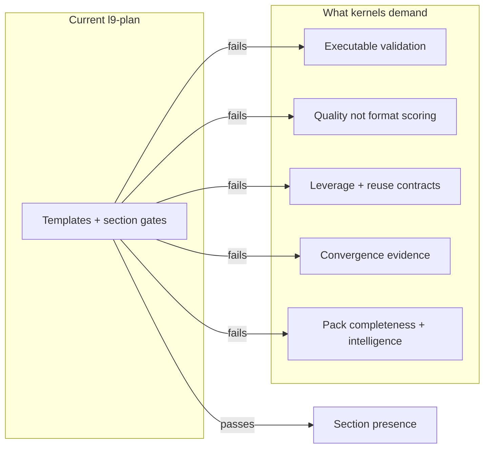

# Make l9-plan 10X Better (Exemplary Rebuild)

## Diagnosis (why kernels keep saying “still needs improvement”)

`l9-plan` at [`/Users/ib-mac/.claude/skills/l9-plan`](/Users/ib-mac/.claude/skills/l9-plan) is a competent **format-complete** planner (Pre/Final Validation, Doc/Root Surface Impact, milestones/checkpoints). It is **not** an exemplary skill pack.

Applying Improve → Leverage → Recursive Alignment → Recursive Leverage one at a time fails because each kernel scores different dimensions, and the pack currently only satisfies “required headings present”:



Highest-leverage gaps vs peers ([`l9-structured-reasoning`](/Users/ib-mac/.claude/skills/l9-structured-reasoning), [`l9-skill-compiler`](/Users/ib-mac/.claude/skills/l9-skill-compiler), [`l9-recursive-optimization`](/Users/ib-mac/.claude/skills/l9-recursive-optimization)):

1. Missing pack contract minimum: `agents/meta.yaml`
2. No `scripts/self_test.py` / exemplary validators — kernels correctly refuse Converged without evidence
3. Completeness = heading presence, not plan quality (critical path, disconfirming evidence, rollback, leverage ranking)
4. No adaptive depth — same ritual for trivial and irreversible work
5. No first-order leverage filter, stress-test protocol, or convergence block
6. No `expertise_model.yaml` / `skill_intelligence_report.yaml` (exemplary gate fields)
7. Weak machine-readable handoff into `l9-gmp-protocol` / `l9-ynp`

**Default chosen:** exemplary-tier rebuild (not lean polish, not absorbing the four kernels as the skill’s primary identity). Keep modes `plan` / `spec` / `ticket`. Product identity stays: planning-only control plane that chains to YNP/GMP.

---

## Success criteria (falsifiable)

A rebuild is done only when **all** are true:

- `python3 scripts/self_test.py` PASS (structure + fixture plans + SKILL↔validator parity)
- `python3 scripts/validate_exemplary_skill.py .` PASS (`tier_decision: exemplary`)
- Pack matches [`skill-pack-contract.md`](/Users/ib-mac/.claude/skills/l9-skill-compiler/references/skill-pack-contract.md) (`SKILL.md` + `agents/meta.yaml` + linked refs/scripts)
- Fixture golden plans fail closed when quality gates fail (missing critical path, fake validation, no Out-of-scope, no Unknown honesty)
- Inspect-only Improve + Leverage against the pack report **Converged** (or Blocked only for env Unknowns), with **zero Critical/High** residual findings
- Live smoke: one plan for a real Gate_SDK-shaped task produces adaptive depth + quality score + handoff block without inventing scope

---

## Pre-Validation (planning-only; record at execution)

| Check | Action | Pass criteria |
|-------|--------|---------------|
| P0 Target bind | Canonical pack = `/Users/ib-mac/.claude/skills/l9-plan` (Gate_SDK symlink via managed skills) | Single write root |
| P1 Baseline inventory | Current: 4 files, prose templates only; no scripts/meta/intelligence | Gap list matches diagnosis |
| P2 Clean gate | N/A for planning-only draft; at implementation run pack `self_test` + consumer `make pr-check` only if repo files change | Recorded |
| P3 Kernel baseline | Run Improve/Leverage inspect_only on current pack; capture residual High findings | Baseline “still improve” list frozen |

---

## Target architecture (post-rebuild)

```text
l9-plan/
├── SKILL.md                          # control plane: modes, router, fail-closed, resource map
├── agents/meta.yaml                  # pack contract
├── expertise_model.yaml              # exemplary intelligence
├── skill_intelligence_report.yaml    # gate results + tier_decision
├── references/
│   ├── plan-workflow.md              # keep SSOT template; add quality + convergence sections
│   ├── spec-workflow.md              # same
│   ├── engineering-ticket-template.md
│   ├── plan-router.yaml              # rapid|standard|deep × risk × evidence
│   ├── plan-quality-rubric.md        # scored dimensions + fail thresholds
│   ├── plan-stress-test.md           # disconfirming evidence, critical path, rollback
│   ├── first-order-leverage.md       # rank TODOs by unlock value / shared root cause
│   ├── convergence-block.md          # converged|partial|blocked for plan readiness
│   ├── gmp-handoff-contract.md       # Phase-0 lock shape for l9-gmp-protocol
│   └── validation-checklist.md       # fail-closed delivery gates
├── scripts/
│   ├── self_test.py                  # aggregate gate
│   ├── validate_pack_structure.py
│   ├── validate_plan_document.py     # fixture + optional stdin plan markdown
│   ├── validate_exemplary_skill.py   # port pattern from structured-reasoning
│   └── route_plan.py                 # deterministic depth router
└── fixtures/
    ├── plan_pass.md
    ├── plan_fail_format.md
    └── plan_fail_quality.md
```

Preserve existing strengths: authority order, Pre/Final Validation, Doc/Root Surface Impact, `make pr-check` when code in scope, no commit/push from plan mode, chain to `l9-ynp` / `l9-gmp-protocol`.

---

## What changes in planner behavior (the actual 10X)

Not more sections — **different decision quality**:

1. **Adaptive depth router** — classify `risk_class` × `evidence_state` × scope size → `rapid|standard|deep`. Rapid may omit ceremony that does not change the decision; deep requires stress-test + leverage ranking + rollback for irreversible work. Pattern: [`l9-structured-reasoning` Adaptive Router](/Users/ib-mac/.claude/skills/l9-structured-reasoning/SKILL.md).
2. **Plan quality rubric (scored)** — fail closed below threshold even if all headings exist:
   - falsifiable success criteria
   - explicit Out of scope
   - dependency-ordered critical path
   - every TODO has files or TBD+blocker
   - material risks with mitigations / rollback when irreversible
   - disconfirming evidence considered (stress-test)
   - leverage ranking (shared root cause / unlock value)
   - Unknown honesty (no invented facts)
   - Doc/Root Surface Impact Update or N/A with reason
   - Final Validation names real gates
3. **First-order leverage** — rank TODOs; prefer deletions/consolidations/shared-cause fixes over symptom lists.
4. **Convergence block** — every plan ends with readiness: `converged|partial|blocked`, remaining unknowns, next skill (`l9-ynp` / `l9-gmp-protocol`), stop reason.
5. **GMP handoff contract** — emit a stable machine-oriented handoff subsection (objective, scope, preserved contracts, validation commands, unknowns) that Phase 0 can lock without re-deriving intent.
6. **Executable self-test** — kernels stop saying “fake validation” because the pack can prove structure + fixture quality gates.

---

## Implementation milestones

### M1 — Pack contract + intelligence shell
- Add `agents/meta.yaml`, `expertise_model.yaml`, `skill_intelligence_report.yaml` (plan-specific experts: staff engineer planner, risk auditor, delivery architect; reject signals for “just implement” / settled execution).
- Expand `SKILL.md` frontmatter/body: activation/reject, adaptive router, quality fail-closed, resource map, Validation script list.

### M2 — Behavioral references (kernel-survival surface)
- Upgrade [`plan-workflow.md`](/Users/ib-mac/.claude/skills/l9-plan/references/plan-workflow.md) / spec workflow with Quality Score, Stress-Test, Leverage, Convergence, Handoff sections.
- Add router, rubric, stress-test, leverage, convergence, handoff, validation-checklist refs (compress Improve/Leverage/Alignment *obligations* into plan-native contracts — do not paste 800-line kernels).

### M3 — Executable validation
- Implement `validate_pack_structure.py`, `validate_plan_document.py`, `route_plan.py`, `validate_exemplary_skill.py`, aggregate `self_test.py`.
- Fixtures: one PASS plan, one FAIL format, one FAIL quality (headings present, critical path/leverage missing).
- Rule: `SKILL.md ## Validation` list stays in parity with `self_test` invoked set (same discipline as `l9-cli-optimization`).

### M4 — Kernel survival + wiring
- Re-run Improve + Leverage (+ Recursive Alignment/Leverage) inspect_only on the rebuilt pack; remediate only remaining Critical/High.
- Wire/refresh discovery via `l9-wire-skill-into-repo` (Gate_SDK managed symlink already lists `l9-plan`).
- Live smoke plan in Gate_SDK context; confirm adaptive depth + handoff shape.

---

## Doc / Root Surface Impact

| Surface | Action | Notes |
|---------|--------|-------|
| [`AGENTS.md`](AGENTS.md) | N/A | Product SDK laws unchanged; skill lives outside repo core |
| Gate_SDK `.claude/skills` registry / managed skills | Update if discovery metadata changes | Prefer `l9-wire-skill-into-repo` |
| Skill pack itself | Update | Primary write surface |
| Consumer README | N/A | No SDK API change |

---

## Out of scope

- Absorbing Improve/Leverage as the skill’s primary mode (keep planning identity; compose with `l9-recursive-optimization` when hardening packs)
- Changing Gate SDK transport/runtime contracts
- Auto-committing or auto-opening PRs from plan mode
- Pasting full kernel YAML into the pack (entropy; compress to plan-native obligations)

---

## Risks

| Risk | Mitigation |
|------|------------|
| Ritual bloat from “more sections” | Adaptive router: only load deep obligations when risk/evidence demand them |
| Format validator that cannot fail meaningfully | Quality fixtures must fail when headings exist but critical path/leverage missing |
| Exemplary report stamped PASS without substance | `validate_exemplary_skill` + kernel inspect_only survival gate both required |
| Drift from skill-compiler contract | Align structure to skill-pack-contract; wire after rebuild |

---

## Final Validation (at implementation)

| Check | Command / action | Pass criteria |
|-------|------------------|---------------|
| V1 Pack self-test | `python3 scripts/self_test.py` | PASS |
| V2 Exemplary gate | `python3 scripts/validate_exemplary_skill.py .` | PASS, `tier_decision: exemplary` |
| V3 Kernel survival | Improve + Leverage inspect_only on pack | Converged / zero Critical/High |
| V4 Live smoke | Produce one real plan with router + score + handoff | Usable by GMP Phase 0 |
| V5 Consumer repo | `make pr-check` only if Gate_SDK files changed | PASS or N/A |

---

## Recommend next

After plan approval: execute via `l9-gmp-protocol` (or skill-compiler rebuild mode) against `/Users/ib-mac/.claude/skills/l9-plan`, then `l9-wire-skill-into-repo`. Use `l9-ynp` only if sequencing across governance vs skill root is ambiguous.
