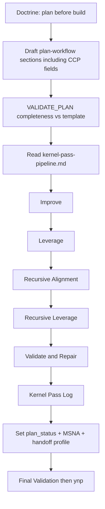

## PLAN: Harden `/l9-plan` — doctrine + CCP gold + five-kernel pipeline

### Objective
Make `/l9-plan` produce plans that prevent rework and set up strong downstream builds—by encoding repo planning doctrine, mining high-leverage patterns from [`kernels/L9 Coding Control Plane`](kernels/L9%20Coding%20Control%20Plane), and requiring the five recursive kernels as a post-draft hardening pipeline.

**Doctrine (repo spirit — already partially present):**
> Proper planning prevents piss poor performance. A minute spent planning is an hour saved debugging.

**Success (falsifiable):**
1. Doctrine appears in `SKILL.md` (already), `plan-workflow.md`, and `/plan`; `rules/92-learned-lessons.mdc` remains the always-apply lesson SSOT (already has the quote)—no competing third wording.
2. Plan template requires CCP-derived sections: Planning Mode, `plan_status`, Unknowns, Decisions, Validation matrix, inspection vs modification scope, preserved/prohibited contracts, execution waves, rollback for Med/High, Minimum Safe Next Action, handoff profile.
3. Five-kernel pipeline + Kernel Pass Log remain mandatory for plan/spec (prior plan contracts unchanged).
4. Distilled CCP patterns live in `references/ccp-plan-patterns.md` pointing at `ai-control-plane/PLAN.md`—**no** full CCP runtime, leases, RELEASE execution, or assurance crypto imported into `/plan`.
5. Net-new **key components** gates (lesson corpus, pattern harvest, failure-path map, refactor defaults, secret-surface rows, unknown-file disposition, drift watch) appear as conditional plan sections—**not** as new daemon/CLI modules.
6. `make pr-check` PASS; `git diff -- kernels` empty.

### Scope
**In:**
- [`skills/l9-plan/SKILL.md`](skills/l9-plan/SKILL.md) → **2.2.0** (Doctrine block already at 2.1.1 — preserve and extend)
- [`skills/l9-plan/references/plan-workflow.md`](skills/l9-plan/references/plan-workflow.md)
- **New** [`skills/l9-plan/references/kernel-pass-pipeline.md`](skills/l9-plan/references/kernel-pass-pipeline.md)
- **New** [`skills/l9-plan/references/ccp-plan-patterns.md`](skills/l9-plan/references/ccp-plan-patterns.md)
- [`skills/l9-plan/references/spec-workflow.md`](skills/l9-plan/references/spec-workflow.md)
- [`commands/plan.md`](commands/plan.md), [`commands/commands-index.md`](commands/commands-index.md)

**Out:**
- Edits under [`kernels/`](kernels/) (five recursive kernels **and** L9 Coding Control Plane pack stay read-only sources)
- [`CANONICAL_LAW.md`](CANONICAL_LAW.md) / new always-apply rule (doctrine already in [`rules/92-learned-lessons.mdc`](rules/92-learned-lessons.mdc))
- CCP runtime: leases, exact-SHA mutation contracts, one-writer scheduler, RELEASE deploy execution, assurance admission/attestation, full YAML output contracts
- Ticket-template overhaul; PR #56; WIP; GMP report commit
- Implementing anything under [`key components/`](key%20components/) as runtime agents/CLIs (mine concepts only)
- Re-importing key-component ideas that already duplicate CCP/kernels (listed below under Skipped)

### Mining brief — `key components/` → `/l9-plan` (**net-new only**)

Source folder: [`key components/`](key%20components/) (9 short component cards).

| Keep (net-new concept) | From | Integrate as |
|------------------------|------|----------------|
| **Lesson corpus recall** | `03_error-corrector.md` | Gather/Pre-Validate: scan [`learning/failures/repeated-mistakes.md`](learning/failures/repeated-mistakes.md) (+ `quick-fixes` if present); matched lessons → Risks/Depth; fail-closed to ignore known recurring mistakes when a match exists |
| **Pattern harvest** | `01_pattern-detector.md` | When modification scope includes skills/prompts/commands/workflows: required short **Reusable Patterns** (preserve / extract / avoid)—reasoning-chain shapes, not generic “reduce entropy” (already covered by Leverage kernel) |
| **Failure-path map** | `05_workflow-explainer.md` | When plan mutates multi-step skill/workflow packs: Depth MUST list entrypoints, expected I/O, and **failure paths** (distinct from Validation matrix check rows) |
| **Refactor suggestion default** | `06_refactor-assistant.md` | Refactor-category plans: prohibited silent auto-apply; prefer diff/candidate + confidence; `apply_suggestions: false` as default posture in prohibited_changes |
| **Secret-surface checklist rows** | `06_security-validator.md` | When secrets/credentials/config auth are in modification scope: Validation matrix MUST include no-hardcoded-secrets + authoritative secret-path rows (concrete checks; CCP only says “escalate mode for security”) |
| **Unknown-file disposition** | `10_folder-reorganizer.md` | File-move/reorg plans: Unknown/orphan artifacts MUST name a quarantine/inbox disposition path (not just Out of scope) |
| **Post-change drift watch** | `09_monitor-agent.md` | Config/schema/policy plans: Final Validation / observability MUST name **what to watch for drift** after change (paths), without requiring a background daemon |

| Skipped (overlap or out of `/l9-plan`) | Why |
|----------------------------------------|-----|
| `04_deployment-orchestrator.md` phases/push/rollback | Overlaps CCP Release (already **Out** of this plan) |
| `07_session-rebuilder.md` load sequence | Session activation / hooks / Graphiti—not plan template |
| Generic “root-cause fix from memory” engine | Overlaps Improve + Validate & Repair kernels |
| Generic reuse / entropy reduction | Overlaps Leverage / Recursive Leverage |
| Security “escalate planning mode” | Already in CCP adaptive-depth rules |
| Monitor as continuous daemon | Runtime; only drift-watch *concept* kept |
| Folder placement taxonomies (Prompts/, agents/, …) | Stale Dropbox-era paths; only unknown→inbox disposition kept |
| CLI commands (`run-pattern-detector`, etc.) | Do not resurrect; concepts only |

### Mining brief — gold from L9 Coding Control Plane → `/l9-plan`

**Primary ore:** [`kernels/L9 Coding Control Plane/ai-control-plane/PLAN.md`](kernels/L9%20Coding%20Control%20Plane/ai-control-plane/PLAN.md)
**Supporting:** [`docs/AI_CODING_CONTROL_PLANE.md`](kernels/L9%20Coding%20Control%20Plane/docs/AI_CODING_CONTROL_PLANE.md), [`AGENTS.md`](kernels/L9%20Coding%20Control%20Plane/AGENTS.md) (routing + evidence model), [`VALIDATION.md`](kernels/L9%20Coding%20Control%20Plane/ai-control-plane/VALIDATION.md), [`DEFINITION_OF_DONE.md`](kernels/L9%20Coding%20Control%20Plane/ai-control-plane/DEFINITION_OF_DONE.md)

| Nugget | Integrate into | How (not full copy) |
|--------|----------------|---------------------|
| Planning separate from implementation; never report planned work as done | SKILL + plan-workflow | Already aligned; strengthen fail-closed language |
| Lifecycle BIND→INSPECT→DEFINE→DECOMPOSE→ORDER→VALIDATE_PLAN→AUTHORIZE→HANDOFF | Compact Workflow | Name VALIDATE_PLAN + HANDOFF steps explicitly |
| Adaptive depth: Quick / Standard / Deep / Release | plan-workflow + ccp-plan-patterns | Required **Planning Mode** + one-line justification; escalate rules (no Quick for security/migration/shared contracts) |
| Unknowns are work; assumptions need validation/decision steps | plan-workflow | **Unknown register** + **Decision register** mandatory |
| plan_status Ready \| ConditionallyReady \| Partial \| Blocked \| Failed | plan-workflow | Replace binary “plan done” |
| Validation-by-design matrix (targeted / integration / final); structural ≠ runtime | plan-workflow + Final Validation | Table separate from `make pr-check` |
| Inspection scope ≠ modification scope | Scope section | Two explicit lists |
| Plan-item: preserved_invariants, prohibited_changes, acceptance, validation, rollback | Depth / TODO notes | Require on Med/High risk TODOs |
| Execution waves + write-conflict / parallelization honesty | Dependencies | Waves only when no shared write/contract dependency |
| Minimum safe next action (exactly one) | End of plan | Align with `/ynp` but **required in plan body** |
| Handoff profiles AUDIT / CHANGE / BUILD / RELEASE / USER_DECISION | Recommend | Map CHANGE→`l9-gmp-protocol`, BUILD→forge when applicable |
| Evidence classes Observed / Derived / Hypothesis / Unknown | Depth | Label claims in Depth/Pre-Validation |
| DoD ≠ lifecycle readiness (ReviewReady ≠ MergeReady ≠ ReleaseReady) | Final Validation / Risks | Explicit ban on inferring merge/release from implementation-ready |
| VALIDATION non-mutating; repairs via CHANGE | Gate rules | Plans must not “fix by weakening scanners” |
| CCP anti-patterns | Validation fail-closed | Fake validation; stubs-as-complete; hidden assumptions; cycles as one task; Quick misuse; invented paths |

**NOT imported:** CCP YAML catalogs, lease/SHA runtime, RELEASE packaging/deploy steps, assurance crypto, AUDIT scoring machinery, decorative-file BUILD catalogs.

### Pre-Validation (mandatory)
| Check | Command / action | Pass criteria |
|-------|------------------|---------------|
| P0 Target bind | `skills/l9-plan` + `commands/plan*` | Single pack |
| P1 Baseline | Doctrine already in SKILL 2.1.1 + `rules/92`; CCP not wired into template; five-kernel pipeline not wired | Gaps confirmed |
| P2 CCP source readable | `kernels/L9 Coding Control Plane/ai-control-plane/PLAN.md` | Present (read-only) |
| P3 Symlink | `.claude/skills/l9-plan` → `skills/l9-plan` | Edit `skills/` only |
| P4 Clean gate | `make pr-check` at implementation | PASS; no commit/push |
| P5 Dirty tree | Untracked WIP/ | Quarantine — do not stage |

### Design (locked)



#### Doctrine placement (T0)
| Location | Action |
|----------|--------|
| `skills/l9-plan/SKILL.md` | Keep existing `## Doctrine` block (already present) |
| `plan-workflow.md` | Add same quote under title |
| `commands/plan.md` | Add one-line Doctrine under WHAT IT DOES |
| `rules/92-learned-lessons.mdc` | **No edit** — already encodes doctrine under Ask Strategic Questions First |
| `CANONICAL_LAW.md` | **Out** — avoid law churn; skill + learned-lessons suffice |

#### Hard contracts — kernels (unchanged intent)
1. Kernel modification target = plan/spec draft only.
2. MUST NOT edit product code or `kernels/*` from plan mode.
3. MUST Read five kernels in fixed order; MUST NOT paste bodies.
4. Kernel Pass Log: five rows; `Applied`\|`Blocked` only (plan/spec); ticket mode single `N/A — ticket mode`.
5. Fail-closed on missing/fake log; Blocked → halt readiness.
6. Path strings only in `kernel-pass-pipeline.md`.

#### Hard contracts — CCP patterns (new)
7. Every plan/spec MUST declare Planning Mode + justification.
8. Every plan MUST include Unknown register and Decision register (may be empty tables with `None`).
9. Every plan MUST include Validation matrix with at least targeted + final rows; MUST distinguish structural vs behavioral evidence.
10. Every plan MUST set `plan_status`; MUST NOT claim Ready while a blocking Unknown or Failed mandatory gate remains.
11. Every plan MUST end with exactly one Minimum Safe Next Action + handoff profile.
12. Med/High risk TODOs MUST name rollback/recovery or explicit `N/A` with reason.
13. Deep/Release modes: agents SHOULD Read `ccp-plan-patterns.md` and MAY Read CCP `PLAN.md` for depth rules—MUST NOT require loading the entire CCP folder every Quick/Standard plan.

#### Hard contracts — key components (net-new only)
14. Gather/Pre-Validate MUST consult `learning/failures/repeated-mistakes.md` when accessible; record matches or `None matched`.
15. Skills/prompts/commands/workflows in modification scope → **Reusable Patterns** section required (preserve/extract/avoid).
16. Multi-step workflow/skill mutation → **Failure-path map** (entrypoints, I/O, failure paths) in Depth.
17. Refactor-category plans → default **no silent auto-apply**; diff/candidate + confidence posture in prohibited_changes / Depth.
18. Secrets/config-auth in modification scope → Validation matrix secret-surface rows (hardcoded secrets forbidden; authoritative secret paths).
19. File-move plans → Unknown/orphan **disposition path**; config/schema plans → named **drift-watch paths** in Final Validation.

#### Minimum content — `ccp-plan-patterns.md`
MUST contain: doctrine pointer; adaptive depth table (Quick/Standard/Deep/Release + escalate/prohibit); required registers (Unknown, Decision); validation matrix schema; plan_status enum; MSNA + handoff profiles mapping to L9 skills; anti-patterns list; cite path to CCP `PLAN.md` / `VALIDATION.md` / `DEFINITION_OF_DONE.md` as deep authority; explicit **Out of scope for /plan** runtime list.

#### Compact Workflow (T2) — target shape
1. Pre-Validate (+ lesson corpus recall when `learning/failures/` present)
2. Gather (+ doctrine: ask before build)
3. Decompose
4. Dependencies / waves
5. Milestones / Checkpoints / Checklist
6. Deliver draft (CCP sections + **conditional** key-component sections)
7. **VALIDATE_PLAN** — template completeness + CCP + key-component conditional gates
8. **Kernel Pass Pipeline** — five kernels on draft
9. Final Validate (`make pr-check` when code in scope; drift-watch rows when applicable)
10. Recommend / MSNA (`l9-ynp`)

### TODO Plan
| # | Task | Files | Effort | Risk |
|---|------|-------|--------|------|
| T0 | Doctrine mirrors in workflow + `/plan`; leave rules/92 alone | `plan-workflow.md`, `commands/plan.md`, SKILL verify | S | Low |
| T1 | `kernel-pass-pipeline.md` per prior minimum content contract | new ref | S | Low |
| T1b | `ccp-plan-patterns.md` distilled CCP gold | new ref | M | Med (over-import) |
| T1c | Wire key-component **conditional** sections/gates into template + Gather (concepts only; cite `key components/` as provenance, do not vendor CLIs) | `plan-workflow.md`, `SKILL.md` | S | Low |
| T2 | SKILL 2.2.0 Compact Workflow + Resource Map + fail-closed | `SKILL.md` | M | Low |
| T3 | plan-workflow full template expansion (CCP + key-component conditionals + Kernel Pass Log) | `plan-workflow.md` | M | Med |
| T4 | spec-workflow kernel + validation-level language | `spec-workflow.md` | S | Low |
| T5 | `/plan` + index thin mirror | commands | S | Low |
| T6 | `make pr-check`; kernels untouched | gate | S | Low |

### Depth
- **Root causes:** (1) no mandatory post-draft kernel hardening; (2) plan template thinner than CCP PLAN kernel; (3) doctrine not visible in `/plan` slash surface; (4) planning ignores local lesson corpus and workflow failure-path annotation.
- **Downstream leverage:** Validation matrix + DoD language → better GMP/forge acceptance; Unknown/Decision registers → fewer mid-build stalls; plan_status honesty → fewer false “ready to implement” claims; MSNA → cleaner `/ynp` handoff; lesson recall → fewer repeat failures; failure-path maps → fewer blind workflow edits.
- **Authority:** `ccp-plan-patterns.md` owns distilled CCP rules; key-component gates live in `plan-workflow.md` as **conditional** sections (provenance note pointing at `key components/`); CCP pack + key-component cards remain read-only.
- **Branch:** `docs/l9-plan-kernel-pipeline` from `main`.

### Dependencies
```text
T0 ∥ T1 ∥ T1b → T1c → T2 ∥ T3 → T4 ∥ T5 → T6
```
T3 consumes T1, T1b, and T1c. T2 Resource Map links kernel + CCP refs (key-component gates stay in template, not a third patterns file—avoids duplication).

### Milestones
| Milestone | Outcome | Unlocks |
|-----------|---------|---------|
| M0 | Doctrine visible on skill + workflow + `/plan`; rules/92 unchanged | Narrative consistency |
| M1 | Both reference files (`kernel-pass-pipeline`, `ccp-plan-patterns`) complete | Template wiring |
| M2 | Skill + plan-workflow fail-closed on CCP + key-component conditionals + Kernel Pass Log | Mirrors |
| M3 | Spec + command aligned; `make pr-check` PASS | User-authorized commit/PR |

### Checkpoints
| CP | After | Evidence | No-go |
|----|-------|----------|-------|
| CP0 | M0 | Quote present in three surfaces; rules/92 untouched | Fix wording drift |
| CP1 | M1 | CCP patterns file has Out-of-scope runtime list; kernel paths only in pipeline file | Do not wire skill |
| CP2 | M2 | Template has Planning Mode, registers, matrix, plan_status, MSNA, Kernel Pass Log, **and** conditional key-component sections with trigger rules | Fix before mirrors |
| CP3 | M3 | `make pr-check` PASS; `git diff -- kernels` empty; no new files under `key components/` | Repair |

### Checklist
- [ ] T0 doctrine mirrors
- [ ] T1 kernel-pass-pipeline.md
- [ ] T1b ccp-plan-patterns.md (incl. anti-patterns + Out list)
- [ ] T1c key-component conditional gates (lesson recall, pattern harvest, failure paths, refactor default, secret rows, disposition, drift watch)
- [ ] T2 SKILL 2.2.0
- [ ] T3 plan-workflow CCP + key-component + kernel sections
- [ ] T4 spec-workflow
- [ ] T5 `/plan` + index
- [ ] No `kernels/` edits; no `key components/` runtime edits; no CANONICAL_LAW; no rules/92
- [ ] No CCP runtime import; no resurrected key-component CLIs
- [ ] `make pr-check` PASS; no commit/push unless asked

### Failure modes
| Failure | Behavior |
|---------|----------|
| Over-import CCP runtime into skill | Reject — keep in Out list; distill only |
| Re-add skipped key-component overlap (deploy daemon, session rebuild) | Reject — already covered or out of `/plan` |
| Quick mode used for migration/security | Fail VALIDATE_PLAN — escalate mode |
| Ready with blocking Unknown | Fail — set Blocked/ConditionallyReady |
| Kernel fake Applied | Fail — require deltas or `no material delta` |
| Required conditional section omitted when trigger matches | Fail VALIDATE_PLAN |
| Doctrine wording diverges across surfaces | Normalize to the single quote + one supporting sentence |

### Unknowns
- None blocking. PR vs local commit remains user-authorized after T6.

### Risks
| Risk | Mitigation |
|------|------------|
| Template bloat / token cost | Distill CCP into short patterns file; full PLAN.md only for Deep/Release |
| Five kernels + CCP = slow plans | Parallelize Reads; apply don't paste; Quick mode still full template but shorter Depth |
| Drift vs CCP pack | Cite pack paths; patterns are adaptation layer for `/plan` only |
| Duplicate doctrine in too many always-apply rules | Skill + `/plan` + workflow + existing rules/92 only |
| Key-component folder bloat into third patterns file | Keep conditionals in `plan-workflow.md` only; cite folder as provenance |

### Estimate
**Total:** 75–105 min
**GMPs:** 1 locked docs/skill pack

### Kernel Pass Log (mandatory) — this planning pass
| Kernel | Path | Status | Material deltas |
|--------|------|--------|-----------------|
| Improve | `kernels/Improve.md` | Applied | Expanded success criteria; closed doctrine placement; CCP anti-pattern fail-closed; adaptive-depth escalate rules; filtered key-component keep vs skip |
| Leverage | `kernels/Leverage.md` | Applied | Distilled `ccp-plan-patterns.md`; MSNA/handoff; validation matrix; lesson corpus as compounding memory input without new daemons |
| Recursive Alignment | `kernels/Recursive Alignment.md` | Applied | Aligned CCP stage boundaries; rules/92 doctrine SSOT; key-component cards = provenance only, not second control plane |
| Recursive Leverage | `kernels/Recursive Leverage.md` | Applied | Compressed CCP; dropped overlapping key-component items; kept 7 conditional gates only |
| Validate & Repair | `kernels/Validate & Repair.md` | Applied | Added T1c + contracts 14–19; completeness for conditional triggers; no CLI resurrection |

### Final Validation (mandatory)
| Check | Command | Pass criteria |
|-------|---------|---------------|
| V1 Completeness | Diff vs this plan | T0–T5 + T1c done; CCP + key-component conditionals + Kernel Pass Log in SSOT |
| V2 Scanners | `make pr-check` | PASS; no commit/push |
| V3 Kernels untouched | `git diff -- kernels` | Empty |
| V4 No CCP runtime leak | Grep skill for lease/exact-sha/attestation scheduler terms | Absent (or only in Out list) |
| V5 Doctrine | Grep quote in SKILL, plan-workflow, commands/plan | Present; rules/92 unchanged |
| V6 Honesty | Status labels | Passed / Failed / Skipped / N/A / Unknown |

### Recommend (YNP)
On approval to execute: **`l9-gmp-protocol`** — one modification lock on In-scope files, branch `docs/l9-plan-kernel-pipeline`.
