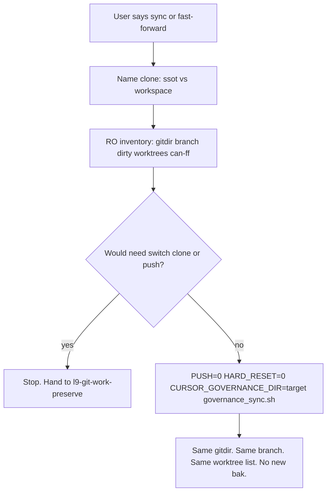

# Plan: `l9-repo-sync` skill pack (Improve-hardened)

## Objective

Stop agents from treating “fast forward / sync this repo” as bare `git switch`/`merge`/`pull`/`clone`, and stop them from using `governance_activate_fresh.sh` / `make start` as a sync.

The only mutate path is the **pull-half** of [ops/scripts/governance_sync.sh](ops/scripts/governance_sync.sh).

This lands a skill + slash command + discovery wire. It does not recover orphaned worktrees. It does not change sessionStart.

## Improve findings applied to this plan

Verified against the scripts (not prior-chat memory):

1. **`GOVERNANCE_SYNC_PUSH` defaults to 1.** After ff, the script runs [ops/scripts/backup_to_github.sh](ops/scripts/backup_to_github.sh), which `cd`s to `$HOME/.cursor-governance` (via `resolve_governance_paths`) and can **commit and push the home SSOT** even if the pull target was a different clone. The old plan’s execute line was therefore a second wipe/push footgun.
2. **Pull target and push target are different variables.** `CURSOR_GOVERNANCE_DIR` selects the ff clone. Backup always hits `$HOME/.cursor-governance`. The skill must set `GOVERNANCE_SYNC_PUSH=0` for “fast forward.”
3. **`make sync` is not equivalent** unless those env vars are exported. Bare `make sync` is forbidden in the skill.
4. **The cited validator path was wrong.** [skills/l9-skill-compiler/scripts](skills/l9-skill-compiler/scripts) does not exist. [skills/l9-git-work-preserve/scripts/validate_pack_structure.py](skills/l9-git-work-preserve/scripts/validate_pack_structure.py) is hard-coded to that pack. This pack needs its own tiny validator.
5. **`.claude/README.md` is absent.** Do not invent an L9 Global Skills table. Wire `AUTONOMY_MANIFEST.yaml` + generated artifacts + `commands/repo-sync.md`.
6. **AGENTS.md has no skills table** and is append-only. Do not create one.

## Why wrap, not rewrite

A second pull implementation would drift. The skill exists to make **clone identity** and **PUSH=0** unskippable.



## Settled decisions

- New branch `feat/l9-repo-sync` from `origin/main` in a **dedicated worktree**. Do not switch this window.
- No new pull script under `ops/scripts/`.
- Invocation: **auto** (`disable-model-invocation: false`, `tiers.auto_invoke`).
- Thin `/repo-sync` command, same shape as [commands/git-work-preserve.md](commands/git-work-preserve.md).
- If current branch cannot ff onto `origin/main`: **stop**. Do not `git switch main`. A `main` checkout is a new worktree via `worktree_add_wired.sh` only, and only if the user asked for that separately.
- Bidirectional home backup (`GOVERNANCE_SYNC_PUSH=1`) is **out of this skill**. Point at existing `backup_to_github.sh` / sessionEnd if the user explicitly asked to push the SSOT.

## Execute contract (must appear verbatim in `references/execute.md`)

```bash
GOVERNANCE_SYNC_PUSH=0 \
GOVERNANCE_SYNC_HARD_RESET=0 \
CURSOR_GOVERNANCE_DIR="<absolute-named-clone>" \
  bash "$HOME/.cursor-governance/ops/scripts/governance_sync.sh"
```

If `$HOME/.cursor-governance/ops/scripts/governance_sync.sh` is missing, use the same path from the named clone **only if that file exists**. Do not invent a third copy.

Forbidden equivalents: bare `make sync`, `make start`, `governance_activate_fresh.sh`, any `git switch`/`checkout`/`merge`/`pull`/`clone`/`reset`.

## Clone map (print every time)

| Alias | Path | Script default without env |
|---|---|---|
| `ssot` | `$HOME/.cursor-governance` | Yes (CLONE default) |
| `workspace` | Cursor folder gitdir (e.g. this clone) | No |

If the user says “this repo” and both gitdirs exist (`samefile` false): diagnose both, **stop until they name one**.

## Pack to write

All work happens in the new worktree.

[skills/l9-repo-sync/](skills/l9-repo-sync/)

- `SKILL.md` — incident 2026-08-18 (bare switch+merge **and** activate_fresh swap **and** this plan’s push-half finding). Compact workflow: name → diagnose → refuse → execute → verify. Authority: user target, then this skill, then `l9-git-work-preserve`.
- `agents/meta.yaml` — display only
- `references/clone-map.md` — two gitdirs; `CURSOR_GOVERNANCE_DIR` vs `GLOBAL_COMMANDS`
- `references/diagnose-first.md` — `git-common-dir`, branch, porcelain, `worktree list`, can-ff on **current** branch. Call [skills/l9-git-work-preserve/scripts/inventory_git_work.py](skills/l9-git-work-preserve/scripts/inventory_git_work.py) with `"$HOME/.cursor-governance/.venv/bin/python"` (or the worktree `.venv` if present). Do not copy that script.
- `references/execute.md` — the block above only
- `references/forbidden.md` — switch/checkout/reset/pull/merge/clone, `activate_fresh`, `make start`, `make sync` without the env block, `HARD_RESET=1`, `PUSH=1`, `worktree prune` as cleanup
- `scripts/validate_pack_structure.py` — **this pack only**: required files exist; `SKILL.md` contains `GOVERNANCE_SYNC_PUSH=0` and `GOVERNANCE_SYNC_HARD_RESET=0`; execute.md contains the env block; `git switch`/`git checkout`/`git merge`/`git pull`/`git clone`/`git reset` appear only under Forbidden/incident headings

Plus [commands/repo-sync.md](commands/repo-sync.md): load skill, default diagnose then sync, paste the same execute block, auto-chain `/ynp`. No extra policy.

After writing: apply `kernels/Improve.md` then `kernels/Validate & Repair.md` **to the pack only** (not to AGENTS.md, not to the SSOT clone).

## Wire

Load [skills/l9-wire-skill-into-repo/SKILL.md](skills/l9-wire-skill-into-repo/SKILL.md). Inputs:

- `skill-name`: `l9-repo-sync`
- `skill-path`: `skills/l9-repo-sync`
- `scope`: `global`
- `invocation`: `auto`
- `description`: exact `SKILL.md` frontmatter description (lowercase what+when; must mention cursor-governance / named clone / never activate_fresh)

Update:

- [skills/AUTONOMY_MANIFEST.yaml](skills/AUTONOMY_MANIFEST.yaml) `tiers.auto_invoke` only (authored SSOT; not a generated merge-driver path)
- `python3 ops/scripts/sync_generated_artifacts.py` so `COMMANDS_MANIFEST.yaml` and skill-registry pick up the new command/pack — **do not hand-edit generated files**
- Claude/Cursor skill symlink only if `l9-wire-skill-into-repo` / `setup` already does that for sibling l9 skills

Do not rewrite [AGENTS.md](AGENTS.md) or [CANONICAL_LAW.md](CANONICAL_LAW.md). Do not create `.claude/README.md`. Do not edit [ops/scripts/governance_activate_fresh.sh](ops/scripts/governance_activate_fresh.sh).

## Implementation protocol

1. Load `l9-skill-compiler` **build**, then `l9-wire-skill-into-repo`. Do not freehand a second pull script.
2. Create the worktree (do not switch this checkout):

```bash
git fetch origin
bash ops/scripts/worktree_add_wired.sh -b feat/l9-repo-sync \
  "$HOME/.l9/gov-worktrees/l9-repo-sync" origin/main
```

3. Write pack + command in that worktree.
4. Wire + regenerate artifacts.
5. Validate. Stop.

## Execution constraints (implementing agent)

Must not:

- run `governance_sync.sh`, `make sync`, `make start`, or `activate_fresh` while landing the skill
- `git switch` / `checkout` / `reset` on this window’s clone
- touch `~/.l9/gov-worktrees/*` except the new `l9-repo-sync` worktree
- drop stashes
- push or open a PR unless asked after `make pr-check` is green

## Validation

From the **new worktree**:

```bash
"$HOME/.cursor-governance/.venv/bin/python" \
  skills/l9-repo-sync/scripts/validate_pack_structure.py
make pr-check
```

Falsifiable success:

- Pack files listed above exist; frontmatter `name` matches directory; `disable-model-invocation` is false
- `AUTONOMY_MANIFEST.yaml` has `l9-repo-sync` under `auto_invoke` only
- `commands/repo-sync.md` exists; `COMMANDS_MANIFEST.yaml` changed only via the generator
- Execute path is the env block; `rg` finds `git switch|checkout|merge|pull|clone|reset` only in Forbidden/incident text
- No new file under `ops/scripts/`
- `GOVERNANCE_SYNC_PUSH=0` is in SKILL.md and execute.md
- `make pr-check` PASS
- Implementing agent’s `git worktree list` on **this window’s clone** is unchanged except the added `l9-repo-sync` worktree

## Stress test

- **Disconfirm:** Agents can ignore the skill. Mitigation: auto_invoke + `/repo-sync` + forbidden list. A `beforeShellExecution` deny of bare `git pull`/`switch` on SSOT is out of scope.
- **Assume false if:** `governance_sync.sh` stays ff-only and no-swap. If swap is later added to that script, do not “fix” the skill by teaching `activate_fresh`.
- **Blast radius:** Auto-invoke on “sync” in a consumer repo. Mitigation: description scoped to cursor-governance / named clone / fast-forward this governance clone.
- **Push-half:** If someone runs `make sync` “because the skill mentioned it” without env, home SSOT may get a session-start commit. Skill and command must say **never** bare `make sync`.
- **Rollback:** unwire + delete pack + revert branch. No production hook change.

## Scope out

- Recovering leftover `~/.l9/gov-worktrees` or the 2026-08-19 bak clone
- Changing sessionStart / `governance_activate_fresh.sh`
- Reconciling CANONICAL_LAW “session start = governance_sync” vs live activate-fresh
- Switching a feature checkout onto `main`
- `make clean`, hygiene `--apply`, stash drop
- Teaching or running the backup/push half

## Doc / root surface

- `AGENTS.md`: N/A (no skills table; do not add one)
- `CANONICAL_LAW.md`: N/A
- Generated manifests: yes, via `sync_generated_artifacts.py`
- `TODO.md`: N/A

## Critical path

`branch-worktree` → `write-pack` → `write-command` → `wire-registries` → `validate-pr-check`
