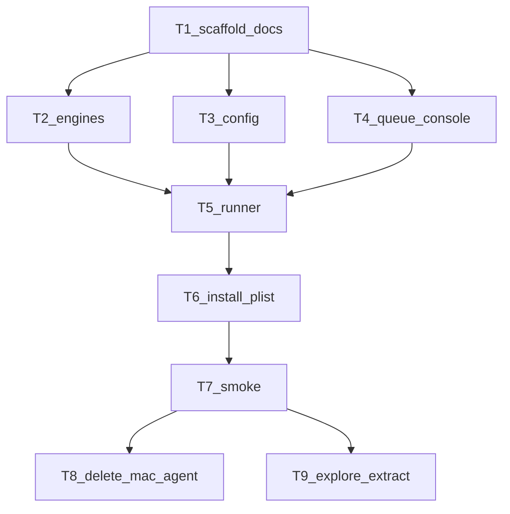

# Merge MacAgent → `l9_agent_ui_control` (improved)

**PLAN_DOCUMENT:** `/tmp/l9_agent_ui_control_plan.json` (lockstep; same plan id, not a new version)
**Improve.md:** inspect_only → contract harden → entropy cut → re-bind evidence (this revision)
**Status:** planning only — do not implement until user says execute

## Target binding

| Item | Value |
|---|---|
| SSOT write root | `~/.cursor-governance/tools/` (resolved via `.cursor-commands/tools`) |
| New pack | `l9_agent_ui_control/` (display name: Agent UI Control) |
| Source A (17 files) | `tools/mac_agent` — install/plist/tunnel kit + **local** `task_queue.py`; broken runner/install |
| Source B (10 files) | `igorbot/integrations/mac_agent` @ `dc705f3` — env-wins `config.py`; runner still monorepo-coupled |
| Delete after T7 | `tools/mac_agent/` |
| Extract landing | PlasticOS `Current Work - IGNORE/CieTrade Data Extraction/` (gitignored) |
| Corrupt baseline | `cieTrade_export_20260807_183800/` — **84/84 CSVs** size>0 but `nonzero_bytes==0` (all `\x00`) |

## Authority contracts (fail-closed)

1. **Surface:** SQL client query window already connected to `UCSCIETRADE` / `cieTrade_SM` — treat as “SQL Studio” (SSMS **or** Azure Data Studio; detect window title at runtime).
2. **Forbidden:** cieTrade ERP application UI (menus/forms).
3. **SQL authority:** Cursor **authors and executes** SQL, including writes that serve explore/extract. Human need not invent commands.
4. **Write policy:** Prefer SELECT + file export. Writes OK for temp/staging/`sqlcmd`/`bcp` out. No casual `UPDATE`/`DELETE` of live counterparty/payment rows unless extract mechanics require it (log why in task result).
5. **Transport:** Local file queue `~/.l9/mac_tasks` primary. WebSocket/reverse tunnel **opt-in, off by default**.
6. **Mission:** Explore schema first → rank → extract maximum useful data with **nonzero-byte integrity checks**.
7. **Result contract:** every completed task writes `completed/<id>.json` with non-empty `result` object (at least `status` + stdout/stderr or `export_path`).

## Verified defects this pack must fix

| ID | Evidence | Root cause | Remediation |
|---|---|---|---|
| D1 | Governance `runner.py` imports `orchestrators.agent_execution.task_queue`, `api.slack_client`, `core.decorators` (via paths); local `task_queue.py` already exists beside it and is unused | Runner never cut over to package-local queue | Import `l9_agent_ui_control.task_queue`; soft Slack; stub `must_stay_async` |
| D2 | Governance `config.py` overwrites env from yaml (`vps_url` → `l9_base_url`); `config.yaml` has `auth_token: ""` | Yaml-wins + secret-shaped keys | Adopt igorbot env-wins; remove `auth_token` from yaml |
| D3 | `com.l9.agent.plist` → `/opt/l9_agent/agent.py`; `agent.py` **absent**; `install_mac*.sh` still `cp …/agent.py` | Install kit targets nonexistent entrypoint | `install_local.sh` + plist `ProgramArguments` → pack `runner.py` only |
| D4 | Dual `install_mac.sh` / `install_mac_agent.sh` | Duplicate install surface | Single `install_local.sh` |
| D5 | Mac copy of export: 84 CSVs, all null-filled | Transfer integrity never gated | Reject extract unless `nonzero_bytes > 0` (+ sha256 in manifest) |
| D6 | Both runners call `mark_task_completed(task_id)` with no `result` on several paths | Completed JSON empty → Cursor blind | Always pass `result={...}`; smoke fails if missing/`ok` absent |

**Merge correction (entropy):** do **not** invent a new queue. Keep governance `task_queue.py` (enqueue + `poll_for_result`). Do **not** copy igorbot `runner.py` verbatim — it imports `integrations.mac_agent.*` and optional `config.settings`. Synthesize a standalone runner from both.

## Target layout (Phase A deliverable)

```text
tools/l9_agent_ui_control/
  __init__.py
  README.md
  LOCAL_CURSOR.md          # authority + CLI + integrity gate
  config.py                # env wins
  config.yaml              # non-secret defaults only; mode: local
  requirements.txt
  executor.py
  websocket_client.py      # kept; unused in local mode
  runner.py                # LaunchAgent entry
  task_queue.py            # from governance (prefer)
  local_console.py         # Cursor CLI
  helpers/{__init__,logging}.py
  install_local.sh
  install_remote_tunnel.sh # opt-in only
  reverse_tunnel.sh
  com.l9.agent_ui_control.plist
  com.l9.agent_ui_control.tunnel.plist  # not loaded by local install
```

## Execution order



- **T2 ∥ T3 ∥ T4** after T1.
- **T9 depends on T7 only** — extract does not wait on delete.
- **Hard stop:** never delete `mac_agent` before T7 PASS (C2).

## Phase A — control plane (T1–T8)

### Merge rules

| Keep | From | Notes |
|---|---|---|
| `executor.py`, `websocket_client.py`, `helpers/*` | either (engines match) | rewrite `mac_agent` → `l9_agent_ui_control`; drop orchestrator mentions from meta only |
| `task_queue.py` | **governance** (richer) | already local-first |
| env-wins `config.py`, fuller `requirements.txt` | igorbot | strip secret keys from yaml |
| install/plist/tunnel scripts | governance | rename; **remove all `agent.py` references** |
| New | — | `local_console.py`, `install_local.sh`, `LOCAL_CURSOR.md`, synthesized `runner.py` |
| Drop | — | monorepo hard deps; yaml secrets; tunnel autoload; cieTrade-app templates; dual install scripts |

### `local_console` contract

```text
local_console.py shell --cmd '...' [--cwd PATH] [--timeout SEC]
local_console.py sql-studio --sql '...' | --file PATH
local_console.py status --task-id ID
```

- **Primary bulk extract:** `shell` → `sqlcmd`/`bcp` when on PATH (IB-PC or Mac).
- **Fallback:** `sql-studio` gui typing when interactive client is the only surface.
- Roundtrip: enqueue → runner → `~/.l9/mac_tasks/completed/<id>.json`.

### Completed-result schema (smoke minimum)

```json
{
  "task_id": "task-…",
  "completed_at": 0.0,
  "result": {
    "status": "done",
    "stdout": "ok\n",
    "stderr": "",
    "exit_code": 0
  }
}
```

T7 fails if `result` missing, empty, or `stdout` does not contain `ok`.

### Install contract

- `install_local.sh`: venv/deps optional; LaunchAgent `com.l9.agent_ui_control` → absolute path to pack `runner.py`; **unload** `com.l9.agent` / `com.l9.tunnel` if present.
- Never copy or invoke `agent.py`.
- `install_remote_tunnel.sh`: explicit opt-in only; never loaded by local install.

### T7 smoke (mandatory gate C2)

1. `python3 -m compileall tools/l9_agent_ui_control` → exit 0
2. Runner running (foreground OK for smoke)
3. `local_console shell --cmd 'echo ok'` → completed JSON contains `ok`
4. Fail closed if result payload missing (guards D6)

## Phase B — explore then max-extract (T9)

Preconditions: T7 green; SQL client connected to `cieTrade_SM` **or** `sqlcmd` reachable.

1. **Census (agent-authored SQL):** tables, columns, approx row counts, payment-like name heuristic.
2. **Probe:** `TOP (N)` on candidates (Payables, Receipt, AccountingPayment, Checks, CounterParty, Address, WKSDetail, …).
3. **Rank** for PlasticOS value (payment history first among golden gaps; partner CSVs already partial).
4. **Extract** to `Current Work - IGNORE/CieTrade Data Extraction/<stamp>/`.
5. **Integrity gate (hard accept):** for every claimed data file:

```text
size = file.stat().st_size
nonzero = count of bytes != 0 in file (or sample first/last 64KiB + mid if large)
ACCEPT iff size > 0 AND nonzero > 0
REJECT otherwise → re-export / fix transfer; do not claim done
```

Refuse to treat `cieTrade_export_20260807_183800` as usable input (proven null-filled).
6. **Handoff:** `EXTRACT_MANIFEST.md` — tables, row estimates, paths, sha256, accept/reject.

PlasticOS Odoo import wiring stays **out** until extracts pass integrity.

## Out of scope

- cieTrade ERP UI automation
- Default-on OpenClaw reverse tunnel
- igorbot remote sync (unless asked)
- `l9-ui-operator` SaaS cartridges
- Requiring the human to invent SQL
- PlasticOS module version bumps (pack is Cursor-Governance tools, not `plasticos_*`)

## Rollback

```bash
# in Cursor-Governance
git restore --source=HEAD -- tools/mac_agent
launchctl unload ~/Library/LaunchAgents/com.l9.agent_ui_control.plist 2>/dev/null || true
rm -rf tools/l9_agent_ui_control   # only if incomplete
```

## Residual unknowns

| ID | Unknown | Effect | Resolution |
|---|---|---|---|
| U1 | Exact SQL client product (SSMS vs Azure Data Studio) | gui selectors/hotkeys differ | probe at Phase B; prefer sqlcmd |
| U2 | Whether `sqlcmd` exists on Mac vs only on IB-PC | chooses shell vs gui primary | probe PATH; document in LOCAL_CURSOR |
| U3 | igorbot follow-up sync PR | second-repo work | accept_bounded: leave untouched unless asked |

## Validation gates (plan readiness)

| Gate | Result |
|---|---|
| Target bound (governance tools + both sources) | Passed |
| Defect D1–D6 evidence re-checked this pass | Passed |
| Corrupt export D5 reconfirmed (84/84 null CSVs) | Passed |
| `validate_plan_document.py` | Passed (lockstep JSON) |
| Runtime pack smoke | pending (execution) |
| Phase B extract integrity | pending (execution) |

## Improve entropy removed (this revision)

- Corrected D1: queue already exists in governance — wire it; do not rebuild
- Corrected merge: igorbot runner is **not** drop-in standalone (still `integrations.*`)
- Elevated install breakage: scripts copy missing `agent.py` (D3)
- Anchored D5 to measured 84/84 null-file baseline path
- Added completed-result JSON schema so T7 is non-ambiguous
- Kept T9 → T7 only (extract independent of delete)
- Declared PlasticOS bump N/A for this pack

**Next action when user says execute:** implement Phase A T1–T7 in governance tools SSOT; then T8 + T9.
