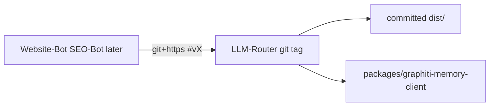

# LLM-Router git-install owner fix

## Objective

`@quantum-l9/llm-router` must install from **public git** with **no** `NODE_AUTH_TOKEN` and **no** `npm.pkg.github.com`. Hosted `npm ci --ignore-scripts` must get a real `dist/index.js`. Nested `@quantum-l9/graphiti-memory-client` must not 404 on `registry.npmjs.org`.

Execute in **Quantum-L9/LLM-Router** (empty open-PR board → `origin/main` allowed). Do not plan in Cursor-Governance and do not un-vendor Website-Bot #168 / SEO-Bot #77 in this Build.

## Why `prepare` alone is not enough

Current [`package.json`](https://github.com/Quantum-L9/LLM-Router/blob/main/package.json) on main/`v1.3.0`:

- `"main": "dist/index.js"`, `"files": ["dist", ...]`
- `"build": "tsc"` only — **no `prepare`**
- [`/.gitignore`](https://github.com/Quantum-L9/LLM-Router/blob/main/.gitignore) ignores `dist/`
- tag `v1.3.0` (`8947df5c`) has **no `dist/`**
- `"@quantum-l9/graphiti-memory-client": "^2.0.0"` + committed `.npmrc` → Packages

Hosted/CI uses `--ignore-scripts`, so `prepare` never runs. The tag must **contain built `dist/`**. Keep `"prepare": "tsc"` for local `npm install` that does run scripts.

npm 11 cannot git-install `l9-graphiti-memory/clients/typescript` (`#path:` is ignored). Operator choice: **`file:` inside LLM-Router**.



## Layout (LLM-Router)

- Copy `l9-graphiti-memory` `clients/typescript` at tag `client-v2.0.0` (`c0dd23b1`) into [`packages/graphiti-memory-client/`](https://github.com/Quantum-L9/LLM-Router) with **built `dist/` tracked**. Drop `publishConfig`. Stamp `SOURCE.txt`.
- [`package.json`](https://github.com/Quantum-L9/LLM-Router/blob/main/package.json): `"@quantum-l9/graphiti-memory-client": "file:packages/graphiti-memory-client"` plus `"overrides"` for the same path.
- **`files` must list the client** or `npm pack` / git install (honors `files`) drops it:

```json
"files": ["dist", "packages/graphiti-memory-client", "README.md", "ARCHITECTURE.md", "RUNBOOK.md"]
```

- Un-ignore: `!dist/` and `!packages/graphiti-memory-client/dist/` (same trap as consumer vendors).
- Add `"prepare": "tsc"`. Bump to **1.3.1**. Tag after merge.
- Delete scoped Packages lines from committed `.npmrc` (keep `publishConfig.registry` for operator `npm publish` only).
- Update [`scripts/verify-package.mjs`](https://github.com/Quantum-L9/LLM-Router/blob/main/scripts/verify-package.mjs): stop writing `@quantum-l9:registry=npm.pkg.github.com` for the smoke; pack+install must pass **without** `NODE_AUTH_TOKEN`.

Do **not** edit `.github/workflows/**` in this Build unless a local `npm ci --ignore-scripts` without a token already passes and CI is the only leftover Packages pin. Proof is local, not a workflow edit.

## Success (falsifiable)

1. In a clean clone of the PR tip: `unset NODE_AUTH_TOKEN`; empty userconfig; `npm ci --ignore-scripts` exits 0.
2. `test -f node_modules/@quantum-l9/llm-router` is N/A (this **is** the package). Check `test -f dist/index.js` and `test -f packages/graphiti-memory-client/dist/src/index.js`.
3. From `/tmp`: `npm install --ignore-scripts "git+https://github.com/Quantum-L9/LLM-Router.git#<pr-sha>"` (or the PR branch) exits 0; `node_modules/@quantum-l9/llm-router/dist/index.js` exists; lock/resolved has **zero** `npm.pkg.github.com`.
4. `npm run verify:package` exits 0 with no Packages token.
5. `npm run test` + `npm run verify:types` exit 0.

## Out of scope

- Website-Bot #168 / SEO-Bot #77 un-vendor (follow-up after `v1.3.1` exists).
- New graphiti-memory-client repo.
- Cursor-Governance `install.sh` / `make pr` projection conflict.
- Publishing to `registry.npmjs.org`.
- PR_Repair `router-shim` (already builds in `setup.sh`; can drop that after the tag).

## Execute via Cursor Build

Press **Build**. Workspace for mutation is an **LLM-Router** worktree from `origin/main` (no open PRs there). Do not branch CG. Do not `make campaign`. Do not write `Lock: origin/main = <sha>`.

After todos: scoped-commit in LLM-Router, `l4_local.py authorize-release`, `PR_STACK=auto PR_REMEDIATE=0 make pr` **in that repo**. Finish reply must show the opened **LLM-Router PR URL**.

Hook catalog while editing LLM-Router: that repo’s `.pre-commit-config.yaml`.

## Stress / leverage

- **Disconfirm:** Does `files` omit `packages/graphiti-memory-client` so git install still 404s? Does `prepare` get treated as sufficient while `--ignore-scripts` stays the hosted path?
- **False-if:** assuming `npm pack` embeds `file:` deps without listing them in `files`.
- **Blast:** consumers on Packages `1.3.0` unchanged until they retarget; a bad `files` list breaks every git consumer.
- **Rollback:** revert the LLM-Router PR; do not touch Website-Bot/SEO-Bot vendors.
- **Leverage:** one owner tag replaces N consumer vendors and PR_Repair’s post-install compile.

## Doc surfaces

- Update LLM-Router `README.md` / `RUNBOOK.md`: install via `git+https://…#v1.3.1`, no `NODE_AUTH_TOKEN`.
- CG `AGENTS.md` / `DEGRADED_MODE_CONTRACT.md`: N/A this PR (follow-up when consumers drop vendors).
