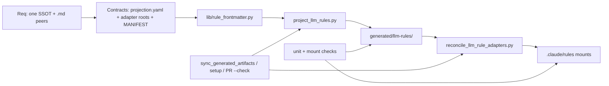

# LLM rules `.md` shim — BUILD materialization plan

Kernels applied: Improve, Recursive Alignment, Leverage, **BUILD** (PlanMaterialization / ExistingTargetExtension, Standard depth).

## BUILD binding

| Field | Value |
|---|---|
| Mode | PlanMaterialization on existing governance target |
| Depth | Standard (shared contract + multi-consumer adapters; not greenfield product) |
| Target root | `~/.cursor-governance` (SSOT); consumer mounts under `~/.claude` + workspace `.claude` |
| Intended consumers | Claude Code (user+project); future `.md` peers via adapter row |
| Handoff | Validated tree in-place (no package/commit unless separately authorized) |
| Architecture adapter | CANONICAL_LAW + rule 84 (Cursor plugin; no Cursor rules whole-dir symlinks) |

## Outcomes before structure

1. Author edits **one** place: `rules/*.mdc`.
2. Every `.md` peer mounts **only** generated `.md` (never raw `.mdc`).
3. Drift is CI-blocked; dual-maintained Claude rule prose is gone.
4. Next peer costs one YAML adapter row.

## Build graph

## Required artifact inventory (minimum complete set)

| Artifact | Class | Responsibility | Consumer |
|---|---|---|---|
| `ops/scripts/lib/rule_frontmatter.py` | implementation | Single parse/normalize for `.mdc` | manifest + projector |
| `ops/scripts/project_llm_rules.py` | implementation | Deterministic `.mdc`→`.md` emit + `--check` | sync / CI |
| `ops/config/llm_rules_projection.yaml` | configuration | deny_stems, aliases | projector |
| `environment/skill-adapters/LLM_RULE_ADAPTER_ROOTS.yaml` | configuration | peer mount paths | reconciler |
| `ops/scripts/reconcile_llm_rule_adapters.py` | implementation | Single ingress: symlink peers → generated dir | setup / sync |
| `environment/generated/llm-rules/**` | generated | Claude-facing `.md` + `MANIFEST.json` + README banner | `.claude/rules` |
| Refactor of `generate_rules_manifest.py` | implementation | Import shared parse (no behavior change) | CI manifest |
| Hook updates: `sync_generated_artifacts.py`, `setup_workspace_symlinks.sh`, PR gate | wiring | One pipeline | operators / CI |
| Thin wrap or deprecate path for `reconcile_claude_rules.py` | wiring | Back-compat → new ingress | existing callers |
| Unit tests under `environment/claude-code/tests/` or `ops/scripts/tests/` | tests | mapping / deny / alias / skip / mount | CI |
| CANONICAL_LAW + short README in generated + Claude adapter doc touch | documentation | Ownership law for operators/agents | humans / agents |

**Omit (decorative / speculative):** on-demand rule tree, new subsystem beyond adapter YAML, filler reports, second projector per peer.

## Projection contract (authoritative)

For each `rules/*.mdc` (sorted stems), via shared parse:

| Source class | Emit | Frontmatter |
|---|---|---|
| `alwaysApply: true` | `<stem-or-alias>.md` | `description` |
| `alwaysApply: false` + `globs` | `<stem-or-alias>.md` | `description` + `paths` |
| `alwaysApply: false`, no globs | **skip** | — |
| deny_stems (e.g. `84-cursor-governance-wiring`) | **skip** | — |

- Body verbatim; strip Cursor-only keys.
- Marker: `<!-- generated-from: rules/<stem>.mdc; do-not-edit -->`
- Alias map: `23-l9-skill-routing` → `l9-skill-routing.md`
- `MANIFEST.json`: stem, class (`always|paths`), source sha256, output sha256, alias
- `--check` fails on drift; rebuild fail-closed on unknown non-generated files

## Dependency order (BUILD steps)

1. Extract `rule_frontmatter.py`; refactor manifest generator to use it; run existing manifest tests/check.
2. Add `llm_rules_projection.yaml` + `project_llm_rules.py`; generate committed tree.
3. Add `LLM_RULE_ADAPTER_ROOTS.yaml` + `reconcile_llm_rule_adapters.py`; wrap old Claude reconciler.
4. Wire sync → setup → PR `--check` (single call chain).
5. Cut over mounts (replace `→ rules/` with `→ environment/generated/llm-rules`).
6. Delete hand duals (`rules/l9-skill-routing.md`, stale Claude shim); law/doc notes.
7. Run full validation; handoff = exact validated state.

## Definition of Done (BUILD gates)

| Gate | Pass when |
|---|---|
| Target bound | Governance root + adapter mounts identified |
| Contracts defined | projection.yaml + adapter roots + MANIFEST schema fields stable |
| All required artifacts complete | Inventory rows exist and are wired |
| No decorative artifacts | No on-demand tree / dual prose / unused wrappers |
| Generated-source alignment | `--check` Passed |
| Mount correct | Both Claude roots resolve to generated dir; no `.mdc` inside |
| Cursor boundary | Rule 84 intact (plugin `.mdc`; no Cursor rules whole-dir symlink) |
| Duals removed | Skill-routing authored only as `23-*.mdc` |
| Tests Passed | Unit + structural mount checks |
| Handoff verified | Delivered tree == validated tree; Unknowns listed if any |

## Acceptance criteria (plan)

- Edit one `.mdc` + sync updates every configured `.md` peer mount.
- Zero hand-maintained Claude rule bodies.
- Next peer = one adapter YAML row.
- CI blocks stale generated output.
- No competing SSOT under `environment/claude-code/` for shared routing law.

## Unknowns (explicit)

- Whether Codex (or other peers) discover a rules directory today → **Unknown**; adapter row reserved, not implemented until verified consumer exists.
- Exact Claude behavior for empty/`paths` edge cases → validate with one always + one glob fixture after cutover; adjust mapping only with evidence.

## Out of scope

- Cursor whole-dir rules symlinks
- Skill symlink redesign
- Class-addon plugin rule projection
- Committing/pushing unless separately authorized after BUILD
