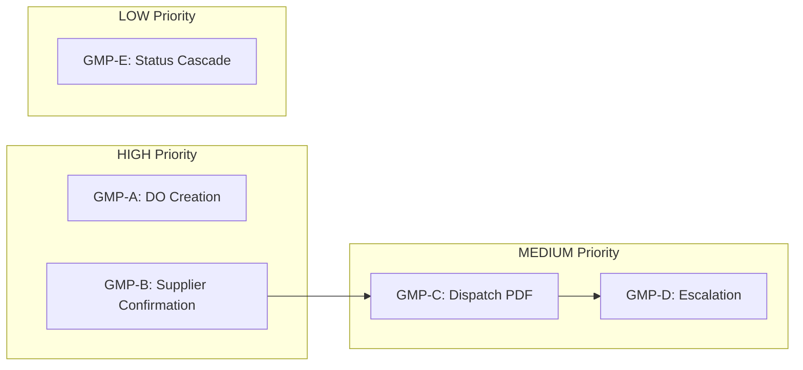

# Logistics Business Logic Implementation Plan

## Overview

This plan graduates the existing cron stubs and infrastructure to real business logic. The infrastructure (fields, states, action methods) is complete. This plan adds the actual workflow logic.

**Dependency Order:** GMP-A and GMP-B are independent. GMP-C depends on GMP-B. GMP-D depends on GMP-C. GMP-E is independent but lowest priority.




---

## GMP-A: Auto-Create Delivery Orders (HIGH)

**Scope:** Leverage native Odoo `purchase_stock` flow for DO creation, then link to TX

**Architecture Decision:** Use native `purchase.order._create_picking()` instead of manual creation.

- Native method handles: picking type selection, location routing, move creation, procurement rules
- Plasticos adds: TX linkage after picking is created

**Files to Modify:**

- [plasticos_transaction/**manifest**.py](plasticos_transaction/__manifest__.py) - Add `purchase_stock` dependency
- [plasticos_transaction/models/purchase_inherit.py](plasticos_transaction/models/purchase_inherit.py) - Hook into picking creation
- [plasticos_transaction/models/transaction.py](plasticos_transaction/models/transaction.py) - Upgrade cron to link existing pickings

### Phase 1: Add purchase_stock Dependency

**Step 1.1:** Update manifest to depend on `purchase_stock`

```python
# In __manifest__.py depends list
"depends": [
    "base",
    "sale",
    "purchase",
    "purchase_stock",  # ADD THIS - enables native PO -> picking flow
    "stock",
    "account",
    # ... other deps
],
```

### Phase 2: Hook into Native Picking Creation

**Step 2.1:** Override `button_approve` in purchase_inherit.py to link TX after picking creation

```python
def button_approve(self, force=False):
    """Override to link created pickings to transaction."""
    res = super().button_approve(force=force)

    # After native _create_picking runs, link pickings to TX
    for order in self:
        if not order.picking_ids:
            continue

        # Find TX via SO origin
        tx = None
        if order.origin:
            so = self.env["sale.order"].search([("name", "=", order.origin)], limit=1)
            if so and so.transaction_id:
                tx = so.transaction_id

        # Also check Many2many link
        if not tx:
            tx = self.env["plasticos.transaction"].search([
                ("purchase_order_ids", "in", [order.id])
            ], limit=1)

        if tx and not tx.delivery_order_id:
            # Link first outgoing picking to TX
            outgoing = order.picking_ids.filtered(
                lambda p: p.picking_type_code == "outgoing" and p.state != "cancel"
            )
            if outgoing:
                tx.delivery_order_id = outgoing[0].id
                _logger.info("Linked DO %s to TX %s from PO %s",
                           outgoing[0].name, tx.name, order.name)

    return res
```

### Phase 3: Upgrade Cron to Link Orphan Pickings

**Step 3.1:** Upgrade `_cron_auto_create_delivery_orders` to find and link existing pickings

```python
@api.model
def _cron_auto_create_delivery_orders(self):
    """Link existing pickings to transactions or trigger PO confirmation.

    Native Odoo creates pickings on PO confirm via purchase_stock.
    This cron:
    1. Finds TXs ready for DO (supplier confirmed, no DO linked)
    2. Checks if PO already has pickings -> link them
    3. If PO exists but no picking -> confirm PO (triggers native creation)
    4. Logs TXs that need manual PO creation
    """
    ready = self.search([
        ("is_supplier_confirmed", "=", True),
        ("delivery_order_id", "=", False),
        ("state", "in", ["supplier_ready", "active", "pending_supplier"]),
    ], order="supplier_confirmation_received asc", limit=100)

    linked_count = 0
    for tx in ready:
        try:
            # Check if any linked PO has pickings
            for po in tx.purchase_order_ids:
                if po.picking_ids:
                    outgoing = po.picking_ids.filtered(
                        lambda p: p.picking_type_code == "outgoing" and p.state != "cancel"
                    )
                    if outgoing:
                        tx.delivery_order_id = outgoing[0].id
                        if tx.state == "supplier_ready":
                            tx.action_mark_do_created()
                        _logger.info("Linked existing DO %s to TX %s", outgoing[0].name, tx.name)
                        linked_count += 1
                        break
                elif po.state == "draft":
                    # PO exists but not confirmed - confirm it (triggers _create_picking)
                    po.button_confirm()
                    _logger.info("Confirmed PO %s for TX %s", po.name, tx.name)
            else:
                # No PO with pickings found
                if not tx.purchase_order_ids:
                    _logger.info("TX %s ready for DO but has no PO", tx.name)

        except Exception as e:
            _logger.error("Failed to process TX %s: %s", tx.name, str(e))

    _logger.info("DO linkage cron: linked %d delivery orders", linked_count)
    return True
```

### Phase 1-3 Checkpoint

- `purchase_stock` added to dependencies
- `button_approve` override links pickings to TX
- Cron finds TXs without DO
- Cron links existing pickings from POs
- Cron confirms draft POs (triggers native picking creation)
- Cron logs TXs that need manual PO creation
- State transition to `do_created` works
- Error handling logs failures without crashing

---

## GMP-B: Supplier Confirmation Workflow (HIGH)

**Scope:** Implement email workflow for supplier confirmation requests, follow-ups, and not-ready handling

**Enhancement:** Add `supplier_not_ready` state and `action_mark_supplier_not_ready()` method

**Files to Modify:**

- [plasticos_transaction/models/transaction.py](plasticos_transaction/models/transaction.py) - State, fields, action methods, cron
- [plasticos_automation/data/email_templates.xml](plasticos_automation/data/email_templates.xml) - New template

### Phase 2: Add supplier_not_ready State

**Step 2.1:** Add new state to selection (after `pending_supplier`)

```python
state = fields.Selection(
    [
        ("draft", "Draft"),
        ("active", "Active"),
        ("pending_supplier", "Pending Supplier"),
        ("supplier_not_ready", "Supplier Not Ready"),  # NEW
        ("supplier_ready", "Supplier Ready"),
        ("do_created", "DO Created"),
        ("dispatched", "Dispatched"),
        # ... rest unchanged
    ],
    # ...
)
```

### Phase 3: Add Tracking Fields

**Step 3.1:** Add follow-up tracking fields to transaction.py

```python
# After is_supplier_confirmed field
supplier_confirmation_followup_count = fields.Integer(
    string="Followup Count",
    default=0,
    help="Number of follow-up emails sent for supplier confirmation.",
)
last_supplier_confirmation_followup_on = fields.Datetime(
    string="Last Followup",
    help="When the last follow-up was sent.",
)
supplier_not_ready_reason = fields.Text(
    string="Not Ready Reason",
    help="Reason provided when supplier indicated they are not ready.",
)
```

### Phase 4: Add Not-Ready Action Method

**Step 4.1:** Add `action_mark_supplier_not_ready()` to transaction.py

```python
def action_mark_supplier_not_ready(self, reason=None):
    """Mark supplier as not ready with reason tracking.

    Called when supplier explicitly indicates they cannot fulfill the order
    on the expected timeline. Creates escalation activity.
    """
    for rec in self:
        if rec.state not in ("pending_supplier", "active"):
            raise UserError(
                f"Cannot mark supplier not ready: transaction must be in "
                f"'Pending Supplier' or 'Active' state (current: {rec.state})."
            )

        vals = {"state": "supplier_not_ready"}
        if reason:
            vals["supplier_not_ready_reason"] = reason

        rec.with_context(bypass_state_guard=True).write(vals)

        if reason:
            rec.message_post(body=f"Supplier not ready: {reason}")
        else:
            rec.message_post(body="Supplier marked as not ready.")

        # Create escalation activity
        rec._escalate_supplier_confirmation()
```

**Step 4.2:** Add `action_mark_supplier_ready()` to allow recovery from not-ready

```python
def action_mark_supplier_ready(self):
    """Mark supplier as ready (can recover from supplier_not_ready state)."""
    for rec in self:
        if rec.state not in ("pending_supplier", "supplier_not_ready", "active"):
            raise UserError(
                f"Cannot mark supplier ready: invalid current state (current: {rec.state})."
            )

        rec.supplier_confirmation_received = fields.Datetime.now()
        rec.with_context(bypass_state_guard=True).write({"state": "supplier_ready"})
        rec.message_post(body="Supplier confirmed ready.")
```

### Phase 5: Create Email Template

**Step 5.1:** Add template to `plasticos_automation/data/email_templates.xml`

```xml
<record id="email_template_supplier_confirmation" model="mail.template">
    <field name="name">Supplier Confirmation Request</field>
    <field name="model_id" ref="plasticos_transaction.model_plasticos_transaction"/>
    <field name="subject">Readiness Confirmation Required — {{ object.name }}</field>
    <field name="email_from">{{ (object.user_id.email_formatted or user.email_formatted) }}</field>
    <field name="email_to">{{ object.supplier_id.email }}</field>
    <field name="body_html"><![CDATA[
<p>Dear {{ object.supplier_id.name }},</p>
<p>Please confirm that material for transaction <strong>{{ object.name }}</strong> is ready for pickup.</p>
<p>Product: {{ object.product_id.name or 'N/A' }}<br/>
Quantity: {{ object.quantity }} {{ object.uom_id.name or '' }}<br/>
Expected Pickup: {{ object.expected_pickup_date or 'TBD' }}</p>
<p>Please reply to confirm readiness.</p>
<p>Thank you,<br/>{{ object.user_id.name or user.name }}</p>
]]></field>
</record>
```

### Phase 6: Implement Send Action Method

**Step 6.1:** Add `action_send_supplier_confirmation()` to transaction.py

```python
def action_send_supplier_confirmation(self):
    """Send supplier confirmation request email."""
    self.ensure_one()
    if not self.supplier_id:
        raise UserError("Cannot send confirmation: no supplier assigned.")
    if not self.supplier_id.email:
        raise UserError(f"Supplier {self.supplier_id.name} has no email address.")

    template = self.env.ref(
        "plasticos_automation.email_template_supplier_confirmation",
        raise_if_not_found=False
    )
    if not template:
        raise UserError("Supplier confirmation email template not found.")

    template.send_mail(self.id, force_send=True)
    self.supplier_confirmation_sent = fields.Datetime.now()
    self.message_post(body="Supplier confirmation request sent.")
    return True
```

### Phase 7: Upgrade Cron

**Step 7.1:** Upgrade `_cron_supplier_confirmation_followup`

```python
@api.model
def _cron_supplier_confirmation_followup(self):
    """Send follow-up emails for pending supplier confirmations."""
    threshold_hours = 24
    threshold_dt = fields.Datetime.now() - timedelta(hours=threshold_hours)

    pending = self.search([
        ("supplier_confirmation_sent", "!=", False),
        ("supplier_confirmation_sent", "<", threshold_dt),
        ("supplier_confirmation_received", "=", False),
        ("state", "in", ["active", "pending_supplier"]),
    ], order="supplier_confirmation_sent asc", limit=100)

    template = self.env.ref(
        "plasticos_automation.email_template_supplier_confirmation",
        raise_if_not_found=False
    )

    for tx in pending:
        # Check if we already followed up today
        if tx.last_supplier_confirmation_followup_on:
            last_followup_date = tx.last_supplier_confirmation_followup_on.date()
            if last_followup_date == fields.Date.today():
                continue

        try:
            if template and tx.supplier_id.email:
                template.send_mail(tx.id, force_send=True)

            tx.supplier_confirmation_followup_count += 1
            tx.last_supplier_confirmation_followup_on = fields.Datetime.now()

            # Escalate after 3 follow-ups
            if tx.supplier_confirmation_followup_count >= 3:
                tx._escalate_supplier_confirmation()

            _logger.info("Sent supplier confirmation follow-up #%d for TX %s",
                        tx.supplier_confirmation_followup_count, tx.name)

        except Exception as e:
            _logger.error("Failed to send follow-up for TX %s: %s", tx.name, str(e))

    return True

def _escalate_supplier_confirmation(self):
    """Create escalation activity for unconfirmed supplier."""
    self.ensure_one()
    has_activity = self.env["mail.activity"].search_count([
        ("res_model", "=", PLASTICOS_TRANSACTION),
        ("res_id", "=", self.id),
        ("summary", "ilike", "ESCALATION: Supplier confirmation"),
        ("date_deadline", "=", fields.Date.today()),
    ])
    if has_activity:
        return

    self.activity_schedule(
        "mail.mail_activity_data_todo",
        user_id=self.user_id.id or self.env.user.id,
        summary=f"ESCALATION: Supplier confirmation pending on {self.name}",
        note=f"Supplier {self.supplier_id.name} has not confirmed after {self.supplier_confirmation_followup_count} follow-ups.",
    )
```

### Phase 2-7 Checkpoint

- `supplier_not_ready` state added to selection
- New tracking fields added (`supplier_confirmation_followup_count`, `last_supplier_confirmation_followup_on`, `supplier_not_ready_reason`)
- `action_mark_supplier_not_ready()` transitions to not-ready state with reason
- `action_mark_supplier_ready()` allows recovery from not-ready
- Email template created in `plasticos_automation`
- `action_send_supplier_confirmation()` sends email and stamps `supplier_confirmation_sent`
- Cron sends follow-up emails (max 1 per day)
- Cron increments follow-up count
- Cron creates escalation activity after 3 follow-ups
- Duplicate activity check prevents spam

---

## GMP-C: Dispatch with PDF Attachments (MEDIUM)

**Scope:** Wire `dispatch_sent` timestamp when email is sent via mail composer

**Files to Modify:**

- [plasticos_logistics/models/load.py](plasticos_logistics/models/load.py) - Update dispatch actions

### Phase 6: Wire dispatch_sent on Email Send

**Step 6.1:** Override `_open_mail_composer` to track dispatch

The challenge: mail composer is async. Solution: Use `mail.mail` `mail_message_id_success` or hook into `mail.compose.message` `action_send_mail`.

**Option A (Simpler):** Add a button that sends directly without composer:

```python
def action_send_dispatch_direct(self):
    """Send dispatch packet directly and track timestamp."""
    self.ensure_one()
    template = self._get_email_template("email_template_dispatch_packet")
    template.send_mail(self.id, force_send=True)
    self.dispatch_sent = fields.Datetime.now()
    self.message_post(body="Dispatch packet sent to carrier.")
    return True
```

**Option B (Keep composer):** Inherit `mail.compose.message` to detect when dispatch template is used:

```python
# In plasticos_logistics/models/mail_compose_inherit.py
class MailComposeMessage(models.TransientModel):
    _inherit = "mail.compose.message"

    def action_send_mail(self):
        res = super().action_send_mail()
        # Check if this was a dispatch template
        if self.template_id and "dispatch_packet" in (self.template_id.name or "").lower():
            for load_id in self.res_ids:
                load = self.env["plasticos.load"].browse(load_id)
                if load.exists() and not load.dispatch_sent:
                    load.dispatch_sent = fields.Datetime.now()
        return res
```

### Phase 6 Checkpoint

- `dispatch_sent` is set when dispatch email is sent
- Works with either direct send or mail composer
- Chatter message posted on dispatch

---

## GMP-D: Acknowledgment Escalation (MEDIUM)

**Scope:** Upgrade dispatch acknowledgment cron to create activities and resend

**Files to Modify:**

- [plasticos_logistics/models/load.py](plasticos_logistics/models/load.py) - Cron upgrade
- [plasticos_logistics/**manifest**.py](plasticos_logistics/__manifest__.py) - Add `mail.activity.mixin` if needed

### Phase 7: Add Activity Mixin to Load

**Step 7.1:** Update load model inheritance

```python
class PlasticosLoad(models.Model):
    _name = "plasticos.load"
    _description = "Plasticos Logistics Load"
    _inherit = ["mail.thread", "mail.activity.mixin"]  # Add activity mixin
```

### Phase 8: Upgrade Acknowledgment Cron

**Step 8.1:** Upgrade `_cron_check_dispatch_acknowledgments`

```python
@api.model
def _cron_check_dispatch_acknowledgments(self):
    """Check for unacknowledged dispatches and escalate."""
    threshold_hours = 4
    threshold_dt = fields.Datetime.now() - timedelta(hours=threshold_hours)

    unacknowledged = self.search([
        ("dispatch_sent", "!=", False),
        ("dispatch_sent", "<", threshold_dt),
        ("dispatch_acknowledged", "=", False),
        ("state", "in", ["dispatched", "scheduled"]),
    ], order="dispatch_sent asc", limit=100)

    for load in unacknowledged:
        # Check for existing escalation activity today
        has_activity = self.env["mail.activity"].search_count([
            ("res_model", "=", PLASTICOS_LOAD),
            ("res_id", "=", load.id),
            ("summary", "ilike", "URGENT: No carrier acknowledgment"),
            ("date_deadline", "=", fields.Date.today()),
        ])

        if has_activity:
            continue

        # Create escalation activity
        tx = self.env[PLASTICOS_TRANSACTION].search([("load_id", "=", load.id)], limit=1)
        user_id = tx.user_id.id if tx and tx.user_id else self.env.user.id

        load.activity_schedule(
            "mail.mail_activity_data_todo",
            user_id=user_id,
            summary=f"URGENT: No carrier acknowledgment for {load.name}",
            note=f"Carrier has not acknowledged dispatch sent {load.dispatch_sent}.",
        )

        # Resend dispatch
        try:
            load.action_send_dispatch_direct()
            _logger.info("Resent dispatch for load %s", load.name)
        except Exception as e:
            _logger.error("Failed to resend dispatch for load %s: %s", load.name, str(e))

    return True
```

### Phase 7-8 Checkpoint

- Load model inherits `mail.activity.mixin`
- Cron creates escalation activity (with duplicate check)
- Cron resends dispatch email
- Activity assigned to TX salesperson

---

## GMP-E: Status Cascade Service with Audit Logging (LOW)

**Scope:** Create service to cascade status changes across TX/PO/DO/SO with audit logging

**Audit Decision:** Use native `mail.thread` tracking (already implemented) + structured chatter messages for audit trail. This provides:

- Zero additional effort (already works)
- Queryable via `mail.message` model
- Visible in UI chatter
- No custom model maintenance

**Files to Create/Modify:**

- `plasticos_transaction/services/__init__.py` - Create
- `plasticos_transaction/services/status_cascade.py` - Create
- `plasticos_transaction/__init__.py` - Import services

### Phase 9: Create Status Cascade Service

**Step 9.1:** Create service module with audit logging

```python
# plasticos_transaction/services/status_cascade.py
import logging
from datetime import datetime
from odoo import fields

_logger = logging.getLogger(__name__)

VALID_CASCADES = {
    "plasticos.transaction": {
        "delivered": [
            ("stock.picking", "delivery_order_id", "done"),
        ],
        "cancelled": [
            ("purchase.order", "purchase_order_ids", "cancel"),
            ("stock.picking", "delivery_order_id", "cancel"),
        ],
    },
    "stock.picking": {
        "done": [
            ("plasticos.transaction", "_reverse_tx", "delivered"),
        ],
    },
}

class StatusCascadeService:
    """Service to cascade status changes across related records.

    Audit logging is handled via mail.thread tracking (native Odoo)
    plus structured chatter messages for cascade events.
    """

    def __init__(self, env):
        self.env = env

    def cascade_status(self, model_name, record_id, new_status, reason=None):
        """Cascade status change to related records with audit trail.

        Args:
            model_name: Source model (e.g., 'plasticos.transaction')
            record_id: Source record ID
            new_status: New status value
            reason: Optional reason for the change (for audit)

        Returns:
            dict with 'updated' list and optional 'error'
        """
        record = self.env[model_name].browse(record_id)
        if not record.exists():
            return {"error": f"{model_name} {record_id} not found"}

        old_status = record.state if hasattr(record, "state") else None
        cascades = VALID_CASCADES.get(model_name, {}).get(new_status, [])
        updated = [(model_name, record_id)]

        # Log the cascade initiation
        self._log_cascade_start(record, old_status, new_status, reason)

        for target_model, field_name, target_status in cascades:
            try:
                if field_name == "_reverse_tx":
                    # Special case: find TX from picking
                    tx = self.env["plasticos.transaction"].search([
                        ("delivery_order_id", "=", record_id)
                    ], limit=1)
                    if tx:
                        tx_old = tx.state
                        tx.with_context(bypass_state_guard=True).write({"state": target_status})
                        self._log_cascade_effect(tx, tx_old, target_status, record)
                        updated.append((target_model, tx.id))
                elif hasattr(record, field_name):
                    related = getattr(record, field_name)
                    if related:
                        for rec in related:
                            if hasattr(rec, "state") and rec.state != target_status:
                                rec_old = rec.state
                                rec.state = target_status
                                self._log_cascade_effect(rec, rec_old, target_status, record)
                                updated.append((target_model, rec.id))
            except Exception as e:
                _logger.error("Cascade failed: %s.%s -> %s: %s",
                            model_name, field_name, target_status, str(e))

        return {"updated": updated}

    def _log_cascade_start(self, record, old_status, new_status, reason):
        """Post audit message to source record chatter."""
        if not hasattr(record, "message_post"):
            return

        body = f"<b>Status Cascade Initiated</b><br/>"
        body += f"State: {old_status} → {new_status}<br/>"
        if reason:
            body += f"Reason: {reason}<br/>"
        body += f"Timestamp: {fields.Datetime.now()}"

        record.message_post(body=body, message_type="notification")

    def _log_cascade_effect(self, target_record, old_status, new_status, source_record):
        """Post audit message to cascaded record chatter."""
        if not hasattr(target_record, "message_post"):
            return

        body = f"<b>Status Updated via Cascade</b><br/>"
        body += f"State: {old_status} → {new_status}<br/>"
        body += f"Triggered by: {source_record._name} {source_record.display_name}<br/>"
        body += f"Timestamp: {fields.Datetime.now()}"

        target_record.message_post(body=body, message_type="notification")
```

**Step 9.2:** Create services **init**.py

```python
# plasticos_transaction/services/__init__.py
from . import status_cascade
```

**Step 9.3:** Update main **init**.py to import services

```python
# In plasticos_transaction/__init__.py
from . import models
from . import services  # ADD THIS
from . import wizards
```

### Phase 10: Wire Cascade into Action Methods (Optional Enhancement)

**Step 10.1:** Optionally call cascade service from action methods

```python
# In transaction.py action_close or similar
def action_close(self):
    # ... existing logic ...

    # Trigger cascade for related records
    from odoo.addons.plasticos_transaction.services.status_cascade import StatusCascadeService
    cascade = StatusCascadeService(self.env)
    for rec in self:
        cascade.cascade_status("plasticos.transaction", rec.id, "closed", reason="Transaction closed")
```

### Phase 9-10 Checkpoint

- Service module created at `plasticos_transaction/services/status_cascade.py`
- `__init__.py` files updated
- `cascade_status()` method handles TX -> DO cascade
- `cascade_status()` method handles TX -> PO cascade on cancel
- Reverse cascade from DO done -> TX delivered
- Audit messages posted to chatter on cascade start
- Audit messages posted to target records on cascade effect
- Error handling for failed cascades
- (Optional) Action methods wired to use cascade service

---

## Definition of Done (DoD)

### Code Quality

- All Python files pass `ruff check`
- All Python files pass `ruff format --check`
- All files pass `pre-commit run --all-files`
- All new methods have docstrings
- All new fields have help text

### Functional (per GMP)

**GMP-A:**

- Native `purchase_stock` creates pickings on PO confirm
- `button_approve` override links pickings to TX
- Cron links orphan pickings to TXs
- Cron confirms draft POs (triggers native creation)
- Cron transitions TX to `do_created` state
- `do_number` field populated from picking name

**GMP-B:**

- `supplier_not_ready` state exists in selection
- `action_mark_supplier_not_ready()` works with reason
- `action_mark_supplier_ready()` allows recovery
- `action_send_supplier_confirmation()` sends email
- Cron sends follow-up emails (max 1/day)
- Escalation activity created after 3 follow-ups
- Email template renders correctly

**GMP-C:**

- `dispatch_sent` timestamp set on email send
- Works with mail composer or direct send

**GMP-D:**

- Cron creates escalation activities
- Cron resends dispatch email
- No duplicate activities created

**GMP-E:**

- TX delivered cascades to DO done
- TX cancelled cascades to PO/DO cancel
- DO done cascades to TX delivered
- Audit messages posted to source record chatter
- Audit messages posted to target record chatter

### Testing

- Docker build succeeds
- Module upgrade succeeds
- Manual smoke test passes

---

## Comprehensive Checklist

### Pre-Implementation

- Read current cron stub implementations
- Verify `stock` dependency in `plasticos_transaction`
- Verify `mail.activity.mixin` availability
- Backup current state (git branch)

### GMP-A: DO Creation (Native Flow)

- Add `purchase_stock` to manifest dependencies
- Override `button_approve` in purchase_inherit.py
- Link pickings to TX after native creation
- Upgrade `_cron_auto_create_delivery_orders` to link orphan pickings
- Test PO confirm creates picking via native flow
- Test TX gets `delivery_order_id` linked
- Verify state transition to `do_created`

### GMP-B: Supplier Confirmation (with Not-Ready)

- Add `supplier_not_ready` state to selection
- Add tracking fields (`followup_count`, `last_followup`, `not_ready_reason`)
- Add `action_mark_supplier_not_ready()` method
- Add `action_mark_supplier_ready()` method
- Create email template in `plasticos_automation`
- Add `action_send_supplier_confirmation()` method
- Add `_escalate_supplier_confirmation()` method
- Upgrade `_cron_supplier_confirmation_followup`
- Test email sending
- Test follow-up logic
- Test escalation after 3 follow-ups
- Test not-ready -> ready recovery flow

### GMP-C: Dispatch PDF

- Choose implementation (direct send vs composer hook)
- Implement `action_send_dispatch_direct()` or composer override
- Test `dispatch_sent` timestamp set
- Verify PDF attachments work

### GMP-D: Escalation

- Add `mail.activity.mixin` to load model
- Upgrade `_cron_check_dispatch_acknowledgments`
- Test activity creation
- Test dispatch resend
- Verify no duplicate activities

### GMP-E: Status Cascade with Audit

- Create `plasticos_transaction/services/__init__.py`
- Create `plasticos_transaction/services/status_cascade.py`
- Update `plasticos_transaction/__init__.py` to import services
- Implement `cascade_status()` method
- Implement `_log_cascade_start()` audit method
- Implement `_log_cascade_effect()` audit method
- Test TX -> DO cascade
- Test TX -> PO cascade on cancel
- Test DO -> TX reverse cascade
- Verify audit messages appear in chatter

### Post-Implementation

- Run `pre-commit run --all-files`
- Run Docker build test
- Run module upgrade
- Complete manual smoke test
- Commit with descriptive message
- DO NOT push (wait for explicit request)

---

## Recursive Verification Pass

Before declaring complete, verify:

1. **All cron stubs upgraded:** No logging-only crons remain
2. **All fields used:** New fields are written by business logic
3. **All templates exist:** Email templates referenced are created
4. **All imports added:** `timedelta`, model references, etc.
5. **All `__init__.py` updated:** New modules imported
6. **All `__manifest__.py` updated:** Dependencies (`purchase_stock`) and data files
7. **State transitions work:** `bypass_state_guard` used correctly
8. **Error handling:** All crons have try/except with logging
9. **Duplicate prevention:** Activities checked before creation
10. **Chatter messages:** Key actions post to chatter
11. **Native Odoo patterns:** Using `purchase_stock._create_picking()` not manual creation
12. **New states added:** `supplier_not_ready` in selection with proper ordering
13. **Recovery paths:** `action_mark_supplier_ready()` allows recovery from not-ready
14. **Audit trail:** Cascade service posts structured messages to chatter

---

## Files Summary


| File                                                 | Action                                | GMP  |
| ---------------------------------------------------- | ------------------------------------- | ---- |
| `plasticos_transaction/__manifest__.py`              | Modify (add `purchase_stock`)         | A    |
| `plasticos_transaction/models/purchase_inherit.py`   | Modify (override `button_approve`)    | A    |
| `plasticos_transaction/models/transaction.py`        | Modify (state, fields, actions, cron) | A, B |
| `plasticos_automation/data/email_templates.xml`      | Modify (add template)                 | B    |
| `plasticos_logistics/models/load.py`                 | Modify (dispatch actions, cron)       | C, D |
| `plasticos_logistics/models/mail_compose_inherit.py` | Create (optional)                     | C    |
| `plasticos_logistics/models/__init__.py`             | Modify (if C uses inherit)            | C    |
| `plasticos_transaction/services/__init__.py`         | Create                                | E    |
| `plasticos_transaction/services/status_cascade.py`   | Create                                | E    |
| `plasticos_transaction/__init__.py`                  | Modify (import services)              | E    |


**Total:** 7-10 files depending on GMP-C approach
