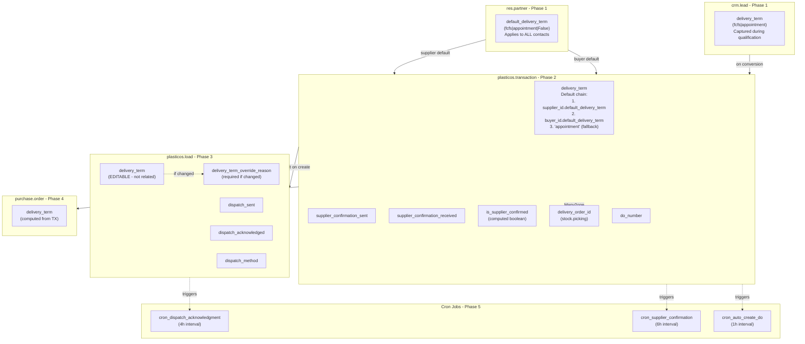
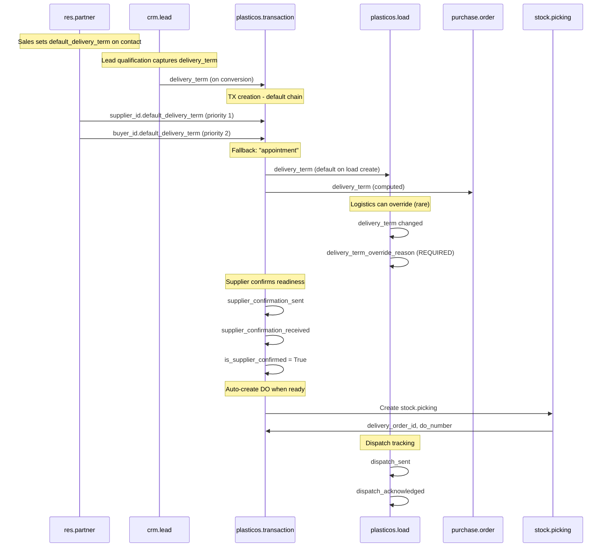

# Logistics Module Enhancement Plan (Expanded)

## Executive Summary

This plan extends the logistics module with:

1. **Partner-level** default delivery term on `res.partner` (applies to ALL contacts - suppliers AND buyers)
2. **CRM Lead** delivery term field (captured during qualification, copied on conversion)
3. **Transaction** delivery term with smart default chain: Supplier → Buyer → "appointment" fallback
4. **Load** delivery term is **editable** with required `delivery_term_override_reason` when changed
5. Dispatch tracking fields on `plasticos.load`
6. Supplier confirmation tracking on `plasticos.transaction`
7. PO-to-DO workflow support (delivery_order_id linkage)
8. Three new cron jobs for automation

**Key Design Decision:** Fallback default is `"appointment"` (safer/more conservative - ensures coordination)

**Estimated Scope:** 14 files modified/created, 3 new cron jobs, ~500 lines of code

---

## CRITICAL: Pre-Implementation Callouts

These issues were identified during code analysis and MUST be addressed:

### Callout 1: `supplier_ready` Name Collision (BLOCKING)

**Problem:** `transaction.py` line 411 already has `("supplier_ready", "Supplier Ready")` as a state selection value. Adding `supplier_ready = fields.Boolean(...)` will cause `Field 'supplier_ready' already exists` error.

**Resolution:** Rename the new boolean field to `is_supplier_confirmed` to avoid collision with the existing state value.

```python
# WRONG - will collide
supplier_ready = fields.Boolean(...)

# CORRECT - no collision
is_supplier_confirmed = fields.Boolean(
    string="Supplier Confirmed",
    compute="_compute_is_supplier_confirmed",
    store=True,
)
```

### Callout 2: `_validate_state_transition` Will Block Cron State Writes (LANDMINE)

**Problem:** The existing `write()` override in `transaction.py` (lines 783-790) raises `UserError` for any state change not going to "active" or "closed":

```python
allow = vals.get("state") == "active" or (
    vals.get("state") == "closed" and vals.get("commission_locked") is True
)
if not allow:
    raise UserError("State can only be changed via action methods.")
```

**Impact:** The harvest scripts (`update_odoo_status.py`, `confirm_supplier_ready.py`) write state directly (e.g., `tx.state = 'supplier_ready'`). These will crash on the live codebase.

**Resolution:** Current plan's stub crons are logging-only and don't write state, so they're safe. However, if graduating stubs to real logic later, state changes MUST go through dedicated `action_`* methods or use `self.env.context.get('bypass_state_guard')`.

### Callout 3: `write()` Lock on `plasticos.load` Will Block Dispatch Fields (BLOCKING)

**Problem:** `load.py` lines 134-145 define an `allowed` set of fields that can be modified after dispatch. The new dispatch tracking fields are NOT in this set.

**Current allowed set:**

```python
allowed = {
    "bol_pickup_attached",
    "bol_delivery_attached",
    "state",
    "entered_state_at",
    "dispatched_at",
    "delivered_at",
    "cycle_time_hours",
    "sla_breached",
    "message_ids",
    "message_follower_ids",
}
```

**Resolution:** Phase 3 MUST add the new fields to the allowed set:

```python
allowed = {
    # ... existing fields ...
    "dispatch_sent",
    "dispatch_acknowledged",
    "dispatch_method",
    "delivery_term",  # related field, may need write access
}
```

### Callout 4: cron.xml Uses `noupdate="0"` - New Crons Must Be INSIDE Block (BLOCKING)

**Problem:** The existing `cron.xml` wraps all records in `<data noupdate="0">` (lines 3-20). If new cron records are added OUTSIDE this block (after `</data>`), the XML will be malformed.

**Current structure:**

```xml
<?xml version='1.0' encoding='utf-8'?>
<odoo>
    <data noupdate="0">
    <record id="cron_followup" ...>...</record>
    <record id="cron_escalation" ...>...</record>
    </data>  <!-- Line 20 -->
</odoo>
```

**Resolution:** New crons MUST be inserted BEFORE line 20 (`</data>`), AFTER the existing `cron_escalation` record. The `noupdate="0"` behavior (reset on upgrade) is intentional and should be preserved.

### Callout 5: Cron Domain `state="active"` Will Miss Most Real Transactions (BLOCKING)

**Problem:** The state flow is:

```
draft → active → pending_supplier → supplier_ready → in_progress → ...
```

By the time `supplier_confirmation_sent` is stamped, the TX is typically in `pending_supplier`, NOT `active`. Searching only `state="active"` will find nothing.

**Resolution:** Update cron search domains:

```python
# _cron_supplier_confirmation_followup
("state", "in", ["active", "pending_supplier"]),  # NOT just "active"

# _cron_auto_create_delivery_orders
("state", "in", ["active", "pending_supplier", "supplier_ready"]),  # NOT just "active"
```

### Callout 6: Out of Scope (Confirmed Exclusions)

The following harvest scripts are NOT being ported (confirmed out of scope):


| Script                                      | Reason                                                          |
| ------------------------------------------- | --------------------------------------------------------------- |
| `check_fsfc_terms.py`                       | Uses FS/FC vocabulary, not Plasticos FOB/incoterm model         |
| `sm.status.updater` / `sm.audit.log`        | Harvest-only models, would corrupt Odoo inventory               |
| `sm.logistics.workflow.trigger_next_step()` | Workflow orchestrator doesn't exist; cron stubs are replacement |


---

## Architecture Overview




---

## Data Flow Diagram




---

## Milestones


| Milestone | Description                   | Phases    | Success Criteria                                |
| --------- | ----------------------------- | --------- | ----------------------------------------------- |
| M1        | Partner + Lead Infrastructure | Phase 1   | Partner and CRM lead show delivery term field   |
| M2        | Transaction Enhancement       | Phase 2-4 | TX default chain works, all fields functional   |
| M3        | Automation Layer              | Phase 5   | All 3 crons registered and executable           |
| M4        | UI Complete                   | Phase 6   | All views updated, override reason UX validated |


---

## Phase 1: Partner + CRM Lead Fields

**Milestone:** M1 - Partner + Lead Infrastructure

### Step 1.1: Add default_delivery_term to res.partner

**New file:** [plasticos_facility_profile/models/res_partner_delivery_term.py](plasticos_facility_profile/models/res_partner_delivery_term.py)

```python
from odoo import fields, models


class ResPartnerDeliveryTerm(models.Model):
    """Add default delivery term to all partners (suppliers AND buyers)."""

    _inherit = "res.partner"

    default_delivery_term = fields.Selection(
        [("fcfs", "FCFS"), ("appointment", "Appointment")],
        string="Default Delivery Term",
        help="Default delivery term for transactions with this partner. "
             "Used when this partner is supplier or buyer.",
    )
```

**Acceptance Criteria:**

- Field exists on `res.partner` model
- No default value (None means "use fallback")
- Help text explains usage for both supplier and buyer roles

### Step 1.2: Update plasticos_facility_profile models/**init**.py

**Modify:** [plasticos_facility_profile/models/**init**.py](plasticos_facility_profile/models/__init__.py)

Add import:

```python
from . import res_partner_delivery_term
```

### Step 1.3: Add delivery_term to crm.lead

**Modify:** [plasticos_crm_bridge/models/crm_lead.py](plasticos_crm_bridge/models/crm_lead.py)

Add field to `CrmLeadPlastOS` class:

```python
delivery_term = fields.Selection(
    [("fcfs", "FCFS"), ("appointment", "Appointment")],
    string="Delivery Term",
    help="Delivery term preference captured during lead qualification. "
         "Copied to transaction on conversion.",
)
```

**Acceptance Criteria:**

- Field exists on `crm.lead` model
- No default (sales captures during qualification)
- Help text explains propagation to transaction

### Step 1.4: Update Partner Form View

**Modify:** [plasticos_facility_profile/views/res_partner_views.xml](plasticos_facility_profile/views/res_partner_views.xml)

Add field to partner form (in appropriate location):

```xml
<field name="default_delivery_term"/>
```

### Step 1.5: Update CRM Lead Form View

**Modify:** [plasticos_crm_bridge/views/crm_lead_views.xml](plasticos_crm_bridge/views/crm_lead_views.xml)

Add field to lead form:

```xml
<field name="delivery_term"/>
```

### Step 1.6: Validate Phase 1

**Phase 1 Exit Criteria:**

- Partner form shows `default_delivery_term` field
- CRM Lead form shows `delivery_term` field
- Both fields are optional (no default)
- Module loads without error

---

## Phase 2: Transaction Fields (plasticos_transaction)

**Milestone:** M2 - Transaction Enhancement (Part 1)

### Step 2.1: Update delivery_term Default Chain

**Modify:** [plasticos_transaction/models/transaction.py](plasticos_transaction/models/transaction.py)

Change existing `delivery_term` field (around line 127-135):

**Before:**

```python
delivery_term = fields.Selection(
    [
        ("fcfs", "First Come First Served"),
        ("appointment", "Appointment Required"),
    ],
    string="Delivery Term",
    default="fcfs",
    tracking=True,
)
```

**After:**

```python
delivery_term = fields.Selection(
    [
        ("fcfs", "First Come First Served"),
        ("appointment", "Appointment Required"),
    ],
    string="Delivery Term",
    default=lambda self: self._get_default_delivery_term(),
    tracking=True,
    help="Default chain: Supplier → Buyer → 'appointment' fallback. Editable.",
)
```

### Step 2.1b: Add Default Chain Helper Method

**Modify:** [plasticos_transaction/models/transaction.py](plasticos_transaction/models/transaction.py)

Add method (near other helper methods):

```python
def _get_default_delivery_term(self):
    """Get delivery term default using priority chain.

    Priority:
    1. Supplier's default_delivery_term (if set)
    2. Buyer's default_delivery_term (if set)
    3. "appointment" (fallback - safer/more conservative)

    Note: At record creation, supplier_id/buyer_id may not be set yet.
    The field is editable, so user can always override.
    """
    # During create, context may have default values
    supplier_id = self.env.context.get("default_supplier_id")
    buyer_id = self.env.context.get("default_buyer_id")

    if supplier_id:
        supplier = self.env["res.partner"].browse(supplier_id)
        if supplier.default_delivery_term:
            return supplier.default_delivery_term

    if buyer_id:
        buyer = self.env["res.partner"].browse(buyer_id)
        if buyer.default_delivery_term:
            return buyer.default_delivery_term

    # Fallback: "appointment" is safer (ensures coordination)
    return "appointment"
```

**Acceptance Criteria:**

- New transactions use priority chain: Supplier → Buyer → "appointment"
- Fallback is "appointment" (NOT "fcfs")
- Existing transactions unaffected
- Field remains editable (override capability)
- Method handles case where supplier/buyer not yet set

### Step 2.2: Add Supplier Confirmation Fields

**Modify:** [plasticos_transaction/models/transaction.py](plasticos_transaction/models/transaction.py)

Add after `delivery_term` field (around line 145):

```python
# ── Supplier Confirmation Tracking ────────────────────────
supplier_confirmation_sent = fields.Datetime(
    string="Confirmation Sent",
    tracking=True,
    help="When supplier was asked to confirm readiness.",
)
supplier_confirmation_received = fields.Datetime(
    string="Confirmation Received",
    tracking=True,
    help="When supplier confirmed they are ready.",
)
# NOTE: Field named is_supplier_confirmed to avoid collision with
# existing state value ("supplier_ready", "Supplier Ready") at line 411
is_supplier_confirmed = fields.Boolean(
    string="Supplier Confirmed",
    compute="_compute_is_supplier_confirmed",
    store=True,
    help="True when supplier has confirmed readiness. Distinct from 'supplier_ready' state.",
)
```

**Acceptance Criteria:**

- Three new fields exist on model
- `is_supplier_confirmed` is computed and stored (NOT `supplier_ready` - name collision!)
- All fields have tracking enabled

### Step 2.3: Add is_supplier_confirmed Compute Method

**Modify:** [plasticos_transaction/models/transaction.py](plasticos_transaction/models/transaction.py)

Add compute method (in compute methods section):

```python
@api.depends("supplier_confirmation_received")
def _compute_is_supplier_confirmed(self):
    for record in self:
        record.is_supplier_confirmed = bool(record.supplier_confirmation_received)
```

**Acceptance Criteria:**

- Method follows Odoo ORM patterns (iterate recordset)
- Depends decorator correctly references field
- Boolean logic is simple and clear
- Method name matches field name (`_compute_is_supplier_confirmed`)

### Step 2.4: Add Delivery Order Fields

**Modify:** [plasticos_transaction/models/transaction.py](plasticos_transaction/models/transaction.py)

Add after supplier confirmation fields:

```python
# ── Delivery Order (PO-to-DO Workflow) ────────────────────
delivery_order_id = fields.Many2one(
    "stock.picking",
    string="Delivery Order",
    domain=[("picking_type_code", "=", "outgoing")],
    tracking=True,
    help="Linked delivery order for this transaction.",
)
do_number = fields.Char(
    string="DO Number",
    related="delivery_order_id.name",
    store=True,
    help="Delivery order reference number.",
)
```

**Acceptance Criteria:**

- Many2one links to `stock.picking`
- Domain filters to outgoing pickings only
- `do_number` is related and stored for search

### Step 2.5: Validate Phase 2

**Phase 2 Exit Criteria:**

- `delivery_term` default pulls from company
- `supplier_confirmation_sent` field exists
- `supplier_confirmation_received` field exists
- `is_supplier_confirmed` computes correctly (NOT `supplier_ready` - collision!)
- `delivery_order_id` links to stock.picking
- `do_number` shows picking name

---

## Phase 3: Load Fields (plasticos_logistics)

**Milestone:** M2 - Transaction Enhancement (Part 2)

### Step 3.1: Add Editable delivery_term Field with Override Tracking

**Modify:** [plasticos_logistics/models/load.py](plasticos_logistics/models/load.py)

Add after `transaction_id` field (around line 50):

```python
# ── Delivery Term (editable with override tracking) ───────
delivery_term = fields.Selection(
    [
        ("fcfs", "First Come First Served"),
        ("appointment", "Appointment Required"),
    ],
    string="Delivery Term",
    default=lambda self: self._get_default_delivery_term(),
    tracking=True,
    help="Defaults from transaction. Editable by logistics in rare cases (requires reason).",
)
delivery_term_override_reason = fields.Text(
    string="Override Reason",
    help="Required when delivery_term differs from transaction. "
         "Explain why the change was necessary.",
)
delivery_term_overridden = fields.Boolean(
    string="Delivery Term Overridden",
    compute="_compute_delivery_term_overridden",
    store=True,
    help="True if delivery_term differs from linked transaction.",
)
```

### Step 3.1b: Add Default and Compute Methods for Load delivery_term

**Modify:** [plasticos_logistics/models/load.py](plasticos_logistics/models/load.py)

Add methods:

```python
def _get_default_delivery_term(self):
    """Get delivery term from linked transaction if available."""
    tx_id = self.env.context.get("default_transaction_id")
    if tx_id:
        tx = self.env["plasticos.transaction"].browse(tx_id)
        if tx.delivery_term:
            return tx.delivery_term
    return "appointment"  # Fallback

@api.depends("delivery_term", "transaction_id.delivery_term")
def _compute_delivery_term_overridden(self):
    """Check if delivery_term differs from transaction."""
    for rec in self:
        if rec.transaction_id and rec.transaction_id.delivery_term:
            rec.delivery_term_overridden = (rec.delivery_term != rec.transaction_id.delivery_term)
        else:
            rec.delivery_term_overridden = False
```

### Step 3.1c: Add Constraint for Override Reason

**Modify:** [plasticos_logistics/models/load.py](plasticos_logistics/models/load.py)

Add constraint:

```python
@api.constrains("delivery_term", "delivery_term_override_reason")
def _check_override_reason_required(self):
    """Require reason when delivery_term is overridden."""
    for rec in self:
        if rec.delivery_term_overridden and not rec.delivery_term_override_reason:
            raise ValidationError(
                "Override reason is required when changing delivery term from transaction default."
            )
```

**Acceptance Criteria:**

- Field is EDITABLE (not related/read-only)
- Defaults from transaction on create
- `delivery_term_overridden` computed field tracks if changed
- `delivery_term_override_reason` required when overridden
- Constraint raises ValidationError if reason missing

### Step 3.2: Add Dispatch Tracking Fields

**Modify:** [plasticos_logistics/models/load.py](plasticos_logistics/models/load.py)

Add after `delivery_term`:

```python
# ── Dispatch Tracking ─────────────────────────────────────
dispatch_sent = fields.Datetime(
    string="Dispatch Sent",
    tracking=True,
    help="When dispatch notification was sent to carrier.",
)
dispatch_acknowledged = fields.Datetime(
    string="Dispatch Acknowledged",
    tracking=True,
    help="When carrier acknowledged the dispatch.",
)
dispatch_method = fields.Selection(
    [
        ("email", "Email"),
        ("sms", "SMS"),
        ("api", "API"),
        ("email_sms", "Email + SMS"),
    ],
    string="Dispatch Method",
    default="email",
    help="Method used to send dispatch notification.",
)
```

**Acceptance Criteria:**

- Three new fields exist on `plasticos.load`
- `dispatch_method` has sensible default
- All datetime fields have tracking

### Step 3.3: Update write() Allowed Fields (CRITICAL)

**Modify:** [plasticos_logistics/models/load.py](plasticos_logistics/models/load.py)

The existing `write()` method (lines 121-158) has a hardcoded `allowed` set that blocks modifications after dispatch. The new fields MUST be added to this set.

**Location:** Inside `write()` method, update the `allowed` set (around line 134):

**Before:**

```python
allowed = {
    "bol_pickup_attached",
    "bol_delivery_attached",
    "state",
    "entered_state_at",
    "dispatched_at",
    "delivered_at",
    "cycle_time_hours",
    "sla_breached",
    "message_ids",
    "message_follower_ids",
}
```

**After:**

```python
allowed = {
    "bol_pickup_attached",
    "bol_delivery_attached",
    "state",
    "entered_state_at",
    "dispatched_at",
    "delivered_at",
    "cycle_time_hours",
    "sla_breached",
    "message_ids",
    "message_follower_ids",
    # Dispatch tracking fields (added for logistics enhancement)
    "dispatch_sent",
    "dispatch_acknowledged",
    "dispatch_method",
    # Delivery term override (rare but allowed)
    "delivery_term",
    "delivery_term_override_reason",
    "delivery_term_overridden",
}
```

**Acceptance Criteria:**

- New fields added to `allowed` set
- Cron can update `dispatch_acknowledged` on dispatched loads
- Logistics can override `delivery_term` even after dispatch (with reason)
- No `UserError` raised when updating these fields

### Step 3.4: Validate Phase 3

**Phase 3 Exit Criteria:**

- `delivery_term` shows on load (read-only)
- `dispatch_sent` field exists
- `dispatch_acknowledged` field exists
- `dispatch_method` selection works
- `write()` allowed set includes new fields (verify manually)

---

## Phase 4: Purchase Order Extension (plasticos_transaction)

**Milestone:** M2 - Transaction Enhancement (Part 3)

### Step 4.1: Add delivery_term to Purchase Order

**Modify:** [plasticos_transaction/models/purchase_inherit.py](plasticos_transaction/models/purchase_inherit.py)

Add field to `PurchaseOrder` class:

```python
delivery_term = fields.Selection(
    [
        ("fcfs", "First Come First Served"),
        ("appointment", "Appointment Required"),
    ],
    string="Delivery Term",
    compute="_compute_delivery_term_from_transaction",
    store=True,
    help="Delivery term from linked transaction.",
)
```

### Step 4.2: Add Compute Method for PO delivery_term

**Modify:** [plasticos_transaction/models/purchase_inherit.py](plasticos_transaction/models/purchase_inherit.py)

Add compute method:

```python
@api.depends("transaction_id.delivery_term")
def _compute_delivery_term_from_transaction(self):
    for order in self:
        if order.transaction_id:
            order.delivery_term = order.transaction_id.delivery_term
        else:
            order.delivery_term = False
```

**Note:** This assumes `transaction_id` exists on `purchase.order`. If not, we need to add it or use a different linking mechanism.

### Step 4.3: Validate Phase 4

**Phase 4 Exit Criteria:**

- `delivery_term` shows on purchase order
- Value matches linked transaction
- Field is read-only (computed)

---

## Phase 5: Cron Jobs (plasticos_logistics)

**Milestone:** M3 - Automation Layer

### Step 5.1: Add Cron XML Definitions

**Modify:** [plasticos_logistics/data/cron.xml](plasticos_logistics/data/cron.xml)

**CRITICAL (Callout B):** The existing file uses `<data noupdate="0">` which resets crons on every upgrade. New crons MUST be added INSIDE this existing `<data>` block (before line 20 `</data>`), NOT after it.

**Location:** Insert BEFORE `</data>` (line 20), AFTER the existing `cron_escalation` record (line 19):

```xml
    <!-- Dispatch Acknowledgment Check -->
    <record id="cron_dispatch_acknowledgment" model="ir.cron">
        <field name="name">Plasticos Dispatch Acknowledgment Check</field>
        <field name="model_id" ref="plasticos_logistics.model_plasticos_load"/>
        <field name="state">code</field>
        <field name="code">model._cron_check_dispatch_acknowledgments()</field>
        <field name="interval_number">4</field>
        <field name="interval_type">hours</field>
        <field name="user_id" ref="plasticos_base.user_system_cron"/>
        <field name="active" eval="True"/>
    </record>

    <!-- Supplier Confirmation Follow-up -->
    <record id="cron_supplier_confirmation" model="ir.cron">
        <field name="name">Plasticos Supplier Confirmation Follow-up</field>
        <field name="model_id" ref="plasticos_transaction.model_plasticos_transaction"/>
        <field name="state">code</field>
        <field name="code">model._cron_supplier_confirmation_followup()</field>
        <field name="interval_number">6</field>
        <field name="interval_type">hours</field>
        <field name="user_id" ref="plasticos_base.user_system_cron"/>
        <field name="active" eval="True"/>
    </record>

    <!-- Auto-Create Delivery Orders -->
    <record id="cron_auto_create_do" model="ir.cron">
        <field name="name">Plasticos Auto-Create Delivery Orders</field>
        <field name="model_id" ref="plasticos_transaction.model_plasticos_transaction"/>
        <field name="state">code</field>
        <field name="code">model._cron_auto_create_delivery_orders()</field>
        <field name="interval_number">1</field>
        <field name="interval_type">hours</field>
        <field name="user_id" ref="plasticos_base.user_system_cron"/>
        <field name="active" eval="True"/>
    </record>
```

**Expected final structure:**

```xml
<?xml version='1.0' encoding='utf-8'?>
<odoo>
    <data noupdate="0">
    <record id="cron_followup" ...>...</record>
    <record id="cron_escalation" ...>...</record>
    <!-- NEW CRONS GO HERE -->
    <record id="cron_dispatch_acknowledgment" ...>...</record>
    <record id="cron_supplier_confirmation" ...>...</record>
    <record id="cron_auto_create_do" ...>...</record>
    </data>
</odoo>
```

**Acceptance Criteria:**

- Three new cron records defined
- All records INSIDE existing `<data noupdate="0">` block (NOT after `</data>`)
- All reference correct models
- All use `user_system_cron` for execution
- Intervals: 4h, 6h, 1h respectively
- `noupdate="0"` behavior preserved (crons reset on upgrade)

### Step 5.2: Add Dispatch Acknowledgment Handler

**Modify:** [plasticos_logistics/models/load.py](plasticos_logistics/models/load.py)

Add method:

```python
@api.model
def _cron_check_dispatch_acknowledgments(self):
    """Check for dispatches sent but not acknowledged within threshold."""
    threshold_hours = 4
    threshold_dt = fields.Datetime.now() - timedelta(hours=threshold_hours)

    unacknowledged = self.search([
        ("dispatch_sent", "!=", False),
        ("dispatch_sent", "<", threshold_dt),
        ("dispatch_acknowledged", "=", False),
        ("state", "in", ["dispatched", "scheduled"]),
    ])

    for load in unacknowledged:
        _logger.warning(
            "Dispatch not acknowledged: %s (sent %s)",
            load.name,
            load.dispatch_sent,
        )

    return True
```

**Acceptance Criteria:**

- Method is `@api.model` (no self recordset)
- Searches for unacknowledged dispatches
- Logs warnings (no business logic per user request)

### Step 5.3: Add Supplier Confirmation Handler

**Modify:** [plasticos_transaction/models/transaction.py](plasticos_transaction/models/transaction.py)

Add import at top:

```python
from datetime import timedelta
```

Add method:

```python
@api.model
def _cron_supplier_confirmation_followup(self):
    """Check for confirmation requests without response.

    State flow: draft → active → pending_supplier → supplier_ready → ...
    By the time supplier_confirmation_sent is stamped, TX is typically
    in pending_supplier, not active. Search both states.
    """
    threshold_hours = 24
    threshold_dt = fields.Datetime.now() - timedelta(hours=threshold_hours)

    # CALLOUT D FIX: Search active AND pending_supplier states
    # (TX moves to pending_supplier when confirmation is sent)
    pending = self.search([
        ("supplier_confirmation_sent", "!=", False),
        ("supplier_confirmation_sent", "<", threshold_dt),
        ("supplier_confirmation_received", "=", False),
        ("state", "in", ["active", "pending_supplier"]),  # NOT just "active"
    ])

    for tx in pending:
        _logger.warning(
            "Supplier confirmation pending: %s (sent %s, state %s)",
            tx.name,
            tx.supplier_confirmation_sent,
            tx.state,
        )

    return True
```

**Acceptance Criteria:**

- Method is `@api.model`
- Searches `["active", "pending_supplier"]` states (NOT just "active")
- Logs warnings only
- Docstring explains state flow reasoning

### Step 5.4: Add Auto-Create DO Handler

**Modify:** [plasticos_transaction/models/transaction.py](plasticos_transaction/models/transaction.py)

Add method:

```python
@api.model
def _cron_auto_create_delivery_orders(self):
    """Identify transactions ready for DO creation (stub - no business logic).

    State flow: draft → active → pending_supplier → supplier_ready → ...
    A TX ready for DO creation could be in active, pending_supplier, or
    supplier_ready state. Search all three.
    """
    # CALLOUT D FIX: Search multiple states where DO creation is valid
    ready = self.search([
        ("is_supplier_confirmed", "=", True),  # NOT supplier_ready (state collision)
        ("delivery_order_id", "=", False),
        ("state", "in", ["active", "pending_supplier", "supplier_ready"]),  # NOT just "active"
    ])

    for tx in ready:
        _logger.info(
            "Transaction ready for DO: %s (supplier confirmed %s, state %s)",
            tx.name,
            tx.supplier_confirmation_received,
            tx.state,
        )

    return True
```

**Acceptance Criteria:**

- Method is `@api.model`
- Uses `is_supplier_confirmed` field (NOT `supplier_ready` - collision!)
- Searches `["active", "pending_supplier", "supplier_ready"]` states (NOT just "active")
- Identifies ready transactions
- Logs info only (no DO creation - per user request)
- Docstring explains state flow reasoning

### Step 5.5: Add timedelta Import to load.py

**Modify:** [plasticos_logistics/models/load.py](plasticos_logistics/models/load.py)

Add import at top:

```python
from datetime import timedelta
```

### Step 5.6: Validate Phase 5

**Phase 5 Exit Criteria:**

- All 3 crons appear in Settings > Technical > Scheduled Actions
- `_cron_check_dispatch_acknowledgments` method exists
- `_cron_supplier_confirmation_followup` method exists
- `_cron_auto_create_delivery_orders` method exists
- Manual cron execution succeeds without error

---

## Phase 6: Views

**Milestone:** M4 - UI Complete

### Step 6.1: Update Load Form View

**Modify:** [plasticos_logistics/views/load_views.xml](plasticos_logistics/views/load_views.xml)

Add delivery term and dispatch tracking groups to form view:

```xml
<group string="Delivery Terms">
    <field name="delivery_term"/>
    <field name="delivery_term_overridden" invisible="1"/>
    <field name="delivery_term_override_reason"
           invisible="not delivery_term_overridden"
           required="delivery_term_overridden"/>
</group>
<group string="Dispatch Tracking">
    <field name="dispatch_method"/>
    <field name="dispatch_sent"/>
    <field name="dispatch_acknowledged"/>
</group>
```

**Acceptance Criteria:**

- New groups visible in load form
- `delivery_term` is EDITABLE (not read-only)
- `delivery_term_override_reason` only visible when term differs from TX
- Override reason is required when visible

### Step 6.2: Update Transaction Form View

**Modify:** [plasticos_transaction/views/transaction_views.xml](plasticos_transaction/views/transaction_views.xml)

Add supplier confirmation and DO fields to form view:

```xml
<group string="Supplier Confirmation">
    <field name="supplier_confirmation_sent"/>
    <field name="supplier_confirmation_received"/>
    <field name="is_supplier_confirmed" readonly="1"/>
</group>
<group string="Delivery Order">
    <field name="delivery_order_id"/>
    <field name="do_number" readonly="1"/>
</group>
```

**Acceptance Criteria:**

- Two new groups visible in transaction form
- `is_supplier_confirmed` is read-only (computed) - NOT `supplier_ready`!
- `do_number` is read-only (related)

### Step 6.3: Update Transaction Search View

**Modify:** [plasticos_transaction/views/transaction_views.xml](plasticos_transaction/views/transaction_views.xml)

Add filters for new fields:

```xml
<filter name="filter_supplier_confirmed" string="Supplier Confirmed"
        domain="[('is_supplier_confirmed', '=', True)]"/>
<filter name="filter_has_do" string="Has Delivery Order"
        domain="[('delivery_order_id', '!=', False)]"/>
<filter name="filter_no_do" string="Missing Delivery Order"
        domain="[('delivery_order_id', '=', False), ('is_supplier_confirmed', '=', True)]"/>
```

**Acceptance Criteria:**

- Three new filters in search view
- Filters use `is_supplier_confirmed` (NOT `supplier_ready` - collision!)
- Filters work correctly

### Step 6.4: Validate Phase 6

**Phase 6 Exit Criteria:**

- Load form shows dispatch tracking fields
- Transaction form shows supplier confirmation fields
- Transaction form shows delivery order fields
- Search filters work correctly

---

## Phase 7: Validation and Testing

**Milestone:** All milestones complete

### Step 7.1: Pre-commit Validation

```bash
# Run pre-commit hooks
pre-commit run --all-files
```

**Expected:** All hooks pass (including odoo-antipatterns)

### Step 7.2: Docker Build Test

```bash
# Full stack restart
docker-compose down
docker-compose up -d

# Watch logs for errors
docker-compose logs -f odoo | head -200
```

**Expected:** No module load errors

### Step 7.3: Module Upgrade Test

```bash
# Upgrade affected modules
docker-compose exec odoo odoo -d odoo -u plasticos_base,plasticos_transaction,plasticos_logistics --stop-after-init
```

**Expected:** Upgrade completes without error

### Step 7.4: Functional Smoke Test

Manual verification:

1. Navigate to Settings > Companies > [Company] > Plasticos Settings
2. Verify `default_delivery_term` field exists
3. Create new transaction, verify delivery_term defaults correctly
4. Navigate to transaction form, verify new fields visible
5. Navigate to load form, verify dispatch tracking fields visible
6. Navigate to Settings > Technical > Scheduled Actions
7. Verify all 3 new crons exist

---

## Risk Mitigation


| Risk                                     | Likelihood | Impact   | Mitigation                                          |
| ---------------------------------------- | ---------- | -------- | --------------------------------------------------- |
| Breaking existing delivery_term usage    | Low        | High     | Keep field name, only change default mechanism      |
| Partner field missing on some contacts   | Low        | Low      | Field is optional, fallback chain handles it        |
| Load override without reason             | Medium     | Medium   | Constraint enforces reason requirement              |
| Cron failures                            | Medium     | Low      | Use try/except with logging, advisory locks         |
| stock.picking dependency                 | Low        | Medium   | Already in plasticos_logistics depends              |
| View inheritance conflicts               | Low        | Medium   | Use xpath with specific positions                   |
| Missing transaction_id on PO             | Medium     | Medium   | Verify linkage exists before Phase 4                |
| **supplier_ready name collision**        | **HIGH**   | **HIGH** | **Use `is_supplier_confirmed` instead (Callout 1)** |
| **write() guard blocks dispatch fields** | **HIGH**   | **HIGH** | **Add fields to allowed set (Callout 3)**           |
| **cron.xml noupdate block placement**    | **HIGH**   | **HIGH** | **Insert INSIDE `<data noupdate="0">` (Callout 4)** |
| **Cron state domain misses TXs**         | **HIGH**   | **HIGH** | **Use `state in [...]` not `state =` (Callout 5)**  |
| State transition guard blocks crons      | Low        | Medium   | Stubs are logging-only; action_* methods for future |


---

## Rollback Plan

If issues arise:

1. **Phase 1-4 (fields):** Remove field definitions, run module upgrade
2. **Phase 5 (crons):** Set crons to `active=False` via UI
3. **Phase 6 (views):** Revert XML changes, run module upgrade

**Git rollback:**

```bash
git revert HEAD~N  # where N = number of commits to revert
```

---

## Definition of Done (DoD)

### Code Quality

- All Python files pass `ruff check`
- All Python files pass `ruff format --check`
- All files pass `pre-commit run --all-files`
- No new linter warnings introduced
- All new methods have docstrings
- All new fields have help text

### Odoo Standards

- All models use `_inherit` correctly (no duplicate `_name`)
- All fields use `fields.*` types (no raw Python types)
- All computed fields have `@api.depends` decorator
- All data files use `noupdate="1"` for master data
- All crons reference `user_system_cron`

### Functional

- Partner `default_delivery_term` field visible and editable
- CRM Lead `delivery_term` field visible and editable
- Transaction default chain works: Supplier → Buyer → "appointment"
- Transaction `delivery_term` can be overridden by sales
- Load `delivery_term` is **editable** (not read-only)
- Load override requires reason (constraint enforced)
- `delivery_term_overridden` computed correctly
- All new fields visible in UI
- All 3 crons registered and executable
- No business logic introduced (logging only)

### Testing

- Docker build succeeds
- Module upgrade succeeds
- Pre-commit hooks pass
- Manual smoke test passes
- No regression in existing functionality

### Documentation

- All new fields have help text
- Cron purposes documented in XML comments
- No orphaned code or dead imports

---

## Comprehensive Checklist

### Pre-Implementation

- Read all `.mdc` rules in `.cursor/rules/`
- Verify `plasticos_facility_profile` exists and extends `res.partner`
- Verify `plasticos_crm_bridge` exists and extends `crm.lead`
- Verify `stock` module is in dependencies
- Backup current state (git stash or branch)

### Phase 1: Partner + CRM Lead Fields

- Create `plasticos_facility_profile/models/res_partner_delivery_term.py`
- Add import to `plasticos_facility_profile/models/__init__.py`
- Add `default_delivery_term` field to `res.partner`
- Add `delivery_term` field to `crm.lead` in `plasticos_crm_bridge`
- Update partner form view to show field
- Update CRM lead form view to show field
- Verify both fields are optional (no default)

### Phase 2: Transaction Fields

- Update `delivery_term` default to use `_get_default_delivery_term()` method
- Add `_get_default_delivery_term()` helper method with chain: Supplier → Buyer → "appointment"
- **Verify fallback is "appointment" (NOT "fcfs")**
- Add `supplier_confirmation_sent` field
- Add `supplier_confirmation_received` field
- Add `is_supplier_confirmed` computed field (NOT `supplier_ready` - collision!)
- Add `_compute_is_supplier_confirmed` method
- Add `delivery_order_id` Many2one field
- Add `do_number` related field
- Verify all fields exist on model

### Phase 3: Load Fields

- Add `delivery_term` as **EDITABLE Selection field** (NOT related)
- Add `_get_default_delivery_term()` method for load
- Add `delivery_term_override_reason` Text field
- Add `delivery_term_overridden` computed Boolean field
- Add `_compute_delivery_term_overridden` method
- Add `_check_override_reason_required` constraint
- Add `dispatch_sent` field
- Add `dispatch_acknowledged` field
- Add `dispatch_method` selection field
- **Update `write()` allowed set to include ALL new fields (CRITICAL)**
- Verify constraint raises error when reason missing

### Phase 4: Purchase Order Extension

- Add `delivery_term` computed field
- Add `_compute_delivery_term_from_transaction` method
- Verify field shows on PO form

### Phase 5: Cron Jobs

- Add `timedelta` import to both files
- Add `cron_dispatch_acknowledgment` XML record **INSIDE `<data noupdate="0">` block**
- Add `cron_supplier_confirmation` XML record **INSIDE `<data noupdate="0">` block**
- Add `cron_auto_create_do` XML record **INSIDE `<data noupdate="0">` block**
- Add `_cron_check_dispatch_acknowledgments` method
- Add `_cron_supplier_confirmation_followup` method with `**state in ["active", "pending_supplier"]`**
- Add `_cron_auto_create_delivery_orders` method with `**state in ["active", "pending_supplier", "supplier_ready"]`**
- Verify all 3 crons in Scheduled Actions
- Test manual cron execution
- **Verify cron XML is INSIDE `<data>` block (not after `</data>`)**

### Phase 6: Views

- Add dispatch tracking group to load form
- Add supplier confirmation group to transaction form
- Add delivery order group to transaction form
- Add search filters to transaction search view
- Verify all UI elements render correctly

### Phase 7: Validation

- Run `pre-commit run --all-files`
- Run `docker-compose down && docker-compose up -d`
- Run module upgrade command
- Complete manual smoke test
- Verify no console errors in browser

### Post-Implementation

- Commit with descriptive message
- DO NOT push (wait for explicit request)
- Document any deviations from plan
- Note any issues for future improvement

---

## Files Summary


| File                                                             | Action | Phase |
| ---------------------------------------------------------------- | ------ | ----- |
| `plasticos_facility_profile/models/res_partner_delivery_term.py` | Create | 1     |
| `plasticos_facility_profile/models/__init__.py`                  | Modify | 1     |
| `plasticos_facility_profile/views/res_partner_views.xml`         | Modify | 1     |
| `plasticos_crm_bridge/models/crm_lead.py`                        | Modify | 1     |
| `plasticos_crm_bridge/views/crm_lead_views.xml`                  | Modify | 1     |
| `plasticos_transaction/models/transaction.py`                    | Modify | 2, 5  |
| `plasticos_logistics/models/load.py`                             | Modify | 3, 5  |
| `plasticos_transaction/models/purchase_inherit.py`               | Modify | 4     |
| `plasticos_logistics/data/cron.xml`                              | Modify | 5     |
| `plasticos_logistics/views/load_views.xml`                       | Modify | 6     |
| `plasticos_transaction/views/transaction_views.xml`              | Modify | 6     |


**Total:** 11 files (1 create, 10 modify)

---

## Related Plan: State Transition Infrastructure

The state transition infrastructure (new states, action methods, bypass context) is documented in a **separate plan**:

**File:** `state_transition_infrastructure_811cf356.plan.md`

This separation allows the logistics fields to be implemented independently of the state machine changes.

---

## Native Odoo Features to Leverage

Before implementing custom logic, evaluate these native Odoo features:


| Feature                 | Odoo Native                      | Custom Needed?  |
| ----------------------- | -------------------------------- | --------------- |
| Delivery Order creation | `stock.picking` wizard           | Evaluate first  |
| Supplier confirmation   | `purchase.order` confirm flow    | Evaluate first  |
| Dispatch notifications  | `mail.activity` / `mail.message` | Evaluate first  |
| Scheduled actions       | `ir.cron`                        | Using (correct) |
| State machine           | `mail.thread` tracking           | Using (correct) |


**Principle:** Always check if Odoo has a native feature before building custom. This plan intentionally uses stub crons (logging only) to allow evaluation of native features before committing to custom implementation.
