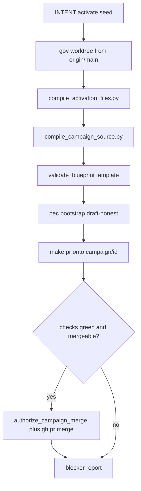

# `make campaign` front door

## What it is

A **governance-only** Make target. PE lives in Cursor-Governance, not in `l9-ci-core`.

```bash
make -C "$HOME/.cursor-governance" campaign \
  INTENT="$HOME/.l9/primed/l9-ci-core-org-runtime-v1.activate.yaml"
```

**Invocation difference:** `-C ~/.cursor-governance` is required because that repo owns `compile_activation_files.py`, the allowlist, and `pec`. A thin `make campaign` on `l9-ci-core` would only wrap the same command. Do **not** add it to Core’s generated [Makefile](/Users/macm2/l9-ci-core/Makefile) (delegation-only). If you want a short alias later, put it in a personal shell function, not in Core.

Makefile stays thin (same pattern as `start`):

```make
.PHONY: campaign
# INTENT= required. Optional: CAMPAIGN_UNTIL=activate|blueprint|bootstrap|pr|merge
campaign:
	@test -n "$(INTENT)" || (echo "INTENT= path to activate seed is required" >&2; exit 2)
	python3 environment/program-execution/scripts/run_campaign.py \
	  --intent "$(INTENT)" \
	  --until "$(or $(CAMPAIGN_UNTIL),merge)"
```

All sequencing lives in a new script: [environment/program-execution/scripts/run_campaign.py](/Users/macm2/.cursor-governance/environment/program-execution/scripts/run_campaign.py). Do not paste the pipeline into the Makefile.

## Stop condition (honest)

You asked for through-merge **and** “campaign running, blockers non-existent.”

Make can deterministically finish **activation**:

- campaign id registered
- Blueprint template-valid
- pec workspace created (draft-honest)
- host PR for the seed **merged** into Cursor-Governance so `.cursor-commands/.../campaigns/<id>` appears
- `CAMPAIGN_STATUS` = `in_progress` (not `complete`)

Make **cannot** implement TASK-001..009 on `l9-ci-core` or fix red CI. Those stay agent/L4/`l9-pr-remediation`. If target work is unfinished, the script prints them as remaining **program** blockers and still exits 0 when **activation** blockers are empty. It does **not** call `close_campaign.py` after the host PR — closing as CONVERGED after seed-only merge would be a false terminal.



## Stages the script runs

Reuse existing tools only. No second compiler.

0. **Parse seed** — require `campaign_id`, `title`, `objective`, `tasks[]` ([source-contract.md](/Users/macm2/.cursor-governance/skills/l9-pe-campaign-activate/references/source-contract.md)). Fail 2 if this is `program-execution.intent.v1` (no `campaign_id` / `tasks`).
1. **Isolate** — `git fetch origin main` on `$HOME/.cursor-governance`. Never `git switch` the dirty primary. Worktree: `$HOME/.l9/gov-worktrees/<id>` on `feat/<id>` from `origin/main`. Create `campaign/<id>` from `origin/main` if missing (PR base, not `main`).
2. **Emit** — `skills/l9-pe-campaign-activate/scripts/compile_activation_files.py --intent … --repo-root <worktree>`. Assert wrote only `CAMPAIGN_SOURCE.yaml` + receipt; patched the four host files; no `INTENT.yaml` in `campaigns/<id>/`.
3. **Blueprint** — `environment/program-execution/scripts/compile_campaign_source.py --source …/CAMPAIGN_SOURCE.yaml --target $HOME/.l9/blueprints/<id>`.
4. **Template validate** — `validate_blueprint.py $HOME/.l9/blueprints/<id> --mode template` must PASS. Do not flip `definition_status` to accepted.
5. **pec bootstrap** — `pec.py bootstrap --workspace $HOME/.l9/programs/<id> --blueprint $HOME/.l9/blueprints/<id>`. Draft refusal is success-with-note, not a fail. Do not claim Program Lock accepted.
6. **Publish host PR** — from the worktree: `PR_BASE=origin/campaign/<id> PR_REMEDIATE=0 OPEN_PR=1 make pr`. Title via [campaign_pr_copy.py](/Users/macm2/.cursor-governance/environment/program-execution/scripts/campaign_pr_copy.py): `[{id}] {title}`.
7. **Merge only if green** — poll `gh pr checks` / mergeable. If green: `authorize_campaign_merge.py --repo Quantum-L9/Cursor-Governance --pr <n>` then `gh pr merge --squash --delete-branch`. If red/unknown: print blockers, exit 2, do not merge, no `--admin`, no force-push.
8. **Report** — JSON + short text: worktree, campaign id, host PR URL/SHA, pec workspace, activation blockers `[]` or list, remaining program blockers (target clone dirty, L4, unexecuted tasks, control-plane binding pending).

`CAMPAIGN_UNTIL` cuts the chain after the named stage for debugging (`activate` = stop after emit).

## What `make campaign` will look like in the terminal

```text
$ make -C ~/.cursor-governance campaign INTENT=~/.l9/primed/l9-ci-core-org-runtime-v1.activate.yaml
campaign: isolate worktree /Users/macm2/.l9/gov-worktrees/l9-ci-core-org-runtime-v1 @ 0db3fed
campaign: emit CAMPAIGN_SOURCE.yaml + receipt (digest matches)
campaign: blueprint $HOME/.l9/blueprints/l9-ci-core-org-runtime-v1
campaign: template validate PASS
campaign: pec bootstrap draft-honest (lock not accepted)
campaign: PR Quantum-L9/Cursor-Governance#N [l9-ci-core-org-runtime-v1] L9 CI Core Organization Runtime
campaign: checks green; merged squash <sha>
campaign: activation blockers: none
campaign: program blockers: target work not started; control-plane binding pending
```

After host merge, `.cursor-commands/environment/program-execution/campaigns/l9-ci-core-org-runtime-v1` exists because the symlink follows `~/.cursor-governance` `main`.

## Tests and docs

- Unit tests next to [test_compile_activation_files.py](/Users/macm2/.cursor-governance/skills/l9-pe-campaign-activate/scripts/test_compile_activation_files.py) / [test_compile_campaign_source.py](/Users/macm2/.cursor-governance/environment/program-execution/scripts/tests/test_compile_campaign_source.py): refuse intent.v1; refuse writing the dirty primary; `--until activate` emits only the allowed set; merge is not called when checks are red (mock `gh`).
- Help line on [Makefile](/Users/macm2/.cursor-governance/Makefile) `campaign` target.
- One paragraph in [pipeline.md](/Users/macm2/.cursor-governance/skills/l9-pe-campaign-activate/references/pipeline.md): `make campaign` is the operator front door; skill remains the contract.

## Out of scope

- New skill or Cursor rule (you asked for Make).
- Implementing or merging the `l9-ci-core` runtime PR.
- Calling `close_campaign.py` on host-only merge.
- Extending closeout verdicts with `CONVERGED_WITH_CONTROL_PLANE_BINDING_PENDING` (current closer only allows `CONVERGED` / `CONVERGED_WITH_NON_BLOCKING_RISKS` / `NOT_CONVERGED`).
- Consumer-repo Makefile changes.
