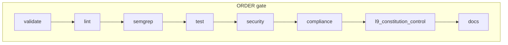

# Plan: `make pr` — full local PR pipeline (v3 — .github audit)

## Audit snapshot (`.github` vs plan v2)

**Verified:** repo has **15** workflow files under [`.github/workflows/`](.github/workflows/). Plan v2 listed the main CI/compliance/docs set but **did not include** the L9 workflows below.

### Workflows present (inventory)

| File | Notes |
|------|--------|
| [ci.yml](.github/workflows/ci.yml) | validate → lint → semgrep → test → security → sbom → scorecard → **ci-gate** |
| [compliance.yml](.github/workflows/compliance.yml) | Architecture compliance |
| [docs-consistency.yml](.github/workflows/docs-consistency.yml) | Governance markdown + ADR |
| [docs-sync.yml](.github/workflows/docs-sync.yml) | Link validation under `readme/`, `docs/` |
| **l9-constitution-gate.yml** | **NEW vs v2 plan:** `scripts/verify_node_constitution.py`; tier2 pytest (`tests/contracts/tier2/...`); **contract-bound** PR gate (python inline) |
| **l9-contract-control.yml** | **NEW vs v2 plan:** `scripts/l9_contract_control.py` verify-constitution, verify-attestation, review-signal, **select-gates** + run commands from `gates.json` |
| codeql.yml, supply-chain.yml, docker-build.yml, k8s-deploy.yml, release.yml, release-drafter.yml, refactoring-validation.yml, pr-review-enforcement.yml, coderabbit-notify.yml | As in [readme/CICD_PIPELINE.md](readme/CICD_PIPELINE.md) (table **incomplete**—see E2) |

### ci-gate correction (material)

In [ci.yml](.github/workflows/ci.yml) **ci-gate** `Evaluate All Results`, the failure branch includes **`needs.security.result`** (not only validate, lint, semgrep, test). **sbom** and **scorecard** are still **not** in that `if` chain.

**Plan v2 was wrong** stating: “security/sbom/scorecard do not fail gate.” **Update:** **security** failure **does** fail ci-gate; **sbom** / **scorecard** still do not fail ci-gate in the shown snippet.

---

## First principles (core facts) — updated

| Type | Content |
|------|---------|
| **Truth** | No `pr` target in [Makefile](Makefile); `agent-check` is 7 gates, not full CI. |
| **Truth** | `ci-gate` fails if **validate, lint, semgrep, test, or security** fails. **sbom/scorecard** failures do not fail ci-gate (current `if` chain). |
| **Truth** | **compliance.yml**, **docs-consistency.yml**, **l9-constitution-gate.yml**, **l9-contract-control.yml** are **separate** workflows; they may be **required** checks on PRs independently of ci-gate. |
| **Truth** | [readme/CICD_PIPELINE.md](readme/CICD_PIPELINE.md) workflow summary **omits** `l9-constitution-gate.yml`, `l9-contract-control.yml`, and **`docs-consistency.yml`** — documentation drift. |
| **Inference** | Local `make pr` should include **L9 phases** (constitution + contract control + tier2 tests where applicable) for “surprise-free PR,” not only ci.yml parity. |
| **Constraint** | **Contract-bound** step in `l9-constitution-gate` uses **PR base/head SHAs**; **local** `make pr` should run **constitution verify + tier2 + l9_contract_control**; **diff-based** gates require **`BASE_REF`/`HEAD_REF`** (e.g. `origin/main...HEAD`) or documented skip for non-PR runs. |

**Objective function:** Maximize P(branch passes **required** GitHub checks) including **L9** and **security**, with bisect-friendly phases.

---

## Second-order effects (selected)

- **L9 phases** add runtime and Python deps (`pyyaml`, `pytest`, `fastapi` per workflows); **cache** venv assumptions in docs.
- **select-gates** depends on **changed files**; **full-tree** local run may execute **more** commands than a small PR on GitHub — document **`PR_L9_MINIMAL=1`** (only verify-constitution + tier2) vs **full** parity.

---

## Probabilistic note

- **~0.65** confidence until L9 steps are **scripted** and timed on one laptop; L9 adds **surface area** for false positives.

---

## Inversion — top failure modes → safeguards

| Failure | Safeguard |
|---------|-----------|
| Local `make pr` ≠ L9 workflow | **B9** maps 1:1 to `verify_node_constitution.py`, `l9_contract_control.py`, tier2 paths |
| PR-only contract-bound gate | **Document:** run `git diff main...HEAD` python inline only when **PR base** known; else warn |
| Stale README table | **E2** mandatory: refresh [readme/CICD_PIPELINE.md](readme/CICD_PIPELINE.md) |

---

## Context (repo)

- **[Makefile](Makefile):** no `pr` target yet.
- **[.github/workflows/ci.yml](.github/workflows/ci.yml):** main CI; **security blocks** ci-gate.
- **[.github/workflows/compliance.yml](.github/workflows/compliance.yml):** terminology, chassis, KB, audit/verify.
- **[docs-consistency.yml](.github/workflows/docs-consistency.yml)** / **[docs-sync.yml](.github/workflows/docs-sync.yml):** governance + links.
- **[l9-constitution-gate.yml](.github/workflows/l9-constitution-gate.yml)** / **[l9-contract-control.yml](.github/workflows/l9-contract-control.yml):** constitution, attestation, tier2 tests, contract control, **select-gates**.

---

## Phase order — two supported modes

Default **`ORDER=gate`:** **validate → lint → semgrep → test → security → compliance → l9 → docs** (or **l9** immediately after **compliance** — product choice; **failfast** order may run **l9** before **test** if constitution is cheaper than Docker).

Optional **`ORDER=failfast`:** validate → compliance → **l9 (minimal)** → docs → lint → semgrep → test → security.

---

## Design decisions (locked for implementation)

1. **SSOT:** `scripts/pr_pipeline.sh`; optional `scripts/phases/`; Makefile delegates only.
2. **Deps:** `requirements-ci.txt` + L9 workflows may need **fastapi**, **pytest** (match workflow install steps).
3. **Services:** `docker-compose.pr.yml`; **`trap`** teardown.
4. **Strictness:**
   - **Blocking (ci-gate parity):** validate, lint, semgrep, test, **security** (align with current ci-gate).
   - **Also recommended blocking:** compliance, docs, **l9** phases if repo marks those checks required.
   - **Mypy / pip-audit:** same as v2 (`PR_MYPY_NONBLOCKING`, `PR_SECURITY_STRICT`).
5. **L9:** Implement **`phase_l9`** calling:
   - `python scripts/verify_node_constitution.py`
   - `pytest tests/contracts/tier2/test_node_constitution_contract.py tests/contracts/tier2/test_runtime_attestation_contract.py` (match workflow)
   - `python scripts/l9_contract_control.py verify-constitution`
   - `python scripts/l9_contract_control.py verify-attestation` (with same skip logic as workflow if app missing)
   - `python scripts/l9_contract_control.py select-gates --files "<space-separated changed files>"` **or** `git ls-files` for full run — **document** behavior.
6. **Post-run banner:** dependency-review, SBOM, Scorecard (still **not** ci-gate failures), Codecov, Sonar; optional `gh pr checks`.

---

## Environment variables (document in script header + AGENT.md)

| Variable | Purpose |
|----------|---------|
| `ORDER` | `gate` (default) or `failfast` |
| `COVERAGE_MIN` / `COVERAGE_THRESHOLD` | Default **60** |
| `PR_MYPY_NONBLOCKING` | `1` = mypy non-fatal |
| `PR_SECURITY_STRICT` | `1` = pip-audit/safety fail |
| `PR_SKIP_SEMGREP` | `1` = skip semgrep + banner |
| `PR_SKIP_INTEGRATION` | `1` = skip Docker test phase |
| `PR_PYTEST_XDIST` | `1` = `-n auto` |
| **`PR_L9_MINIMAL`** | **`1` = only verify + tier2 + verify-constitution** (skip select-gates full run) — optional |

---

## Modular boundaries

| Artifact | Owns |
|----------|------|
| `scripts/pr_pipeline.sh` | Order, env, exit codes |
| `scripts/docs_consistency_local.sh` | Docs-consistency + extended link checks |
| `docker-compose.pr.yml` | Postgres/Redis |
| `Makefile` | `pr`, `pr-*` targets |

---

## L9 alignment (this repo)

- Constitution / contract scripts are **node governance**; do not weaken to shorten `make pr`.
- **Contract-bound** PR rule (bound files without contract updates) must be **reproducible** with explicit `BASE`/`HEAD` or called out as **PR-only**.

---

## Atomic implementation todos

### A — Inventory and extract

| ID | Task |
|----|------|
| A1 | ci.yml (including **security** in ci-gate), compliance, docs-consistency, docs-sync. |
| A2 | **l9-constitution-gate.yml**, **l9-contract-control.yml** — extract every `run:` block and script path. |
| A3 | **Diff** vs [readme/CICD_PIPELINE.md](readme/CICD_PIPELINE.md) table — list **missing** rows for E2. |

### B — Scripts

| ID | Task |
|----|------|
| B1 | `scripts/pr_pipeline.sh`: `set -euo pipefail`, `ORDER`, phases. |
| B2 | `phase_validate` |
| B3 | `phase_lint` |
| B4 | `phase_semgrep` |
| B5 | `phase_test` |
| B6 | `phase_security` (**must pass** for ci-gate parity) |
| B7 | `phase_compliance` |
| **B9** | **`phase_l9`**: verify_node_constitution, tier2 pytest, l9_contract_control (verify-constitution, verify-attestation, select-gates / review-signal as specified) |
| B8 | `phase_docs` |

### C — Docker

| ID | Task |
|----|------|
| C1 | `docker-compose.pr.yml` |
| C2 | up/down + **`trap`** |

### D — Makefile

| ID | Task |
|----|------|
| D1 | `.PHONY`: add `pr-l9`, … |
| D2 | `pr` / `pr-quick` |

### E — Documentation

| ID | Task |
|----|------|
| E1 | AGENT.md: `make agent-check` vs `make pr`; **security + L9** in scope. |
| **E2** | **Refresh [readme/CICD_PIPELINE.md](readme/CICD_PIPELINE.md): all 15 workflows, blocking column, include `docs-consistency`, `l9-constitution-gate`, `l9-contract-control`.** |
| E3 | [docs/AI_AGENT_REVIEW_CHECKLIST.md](docs/AI_AGENT_REVIEW_CHECKLIST.md) Phase 0. |
| E4 | TESTING.md / CLAUDE.md / AGENTS.md pointer. |

### F — CI alignment (optional)

| ID | Task |
|----|------|
| F1 | docs-consistency → `scripts/docs_consistency_local.sh` |
| F2 | shellcheck |

### G — Verification

| ID | Task |
|----|------|
| G1 | macOS/Linux `make pr` |
| G2 | Draft PR vs GitHub required checks |

---

## Known limitations

- SBOM, Scorecard job failures: **do not** fail ci-gate today — still **not** same as local `make pr` unless you add optional `--strict-all-ci-jobs`.
- **Contract-bound** PR gate: needs **two refs**; document local equivalent (`merge-base`).

---

## Residual risks

- L9 **select-gates** runs **different** commands per changed files — **full** vs **PR** parity is subtle.
- **readme/CICD_PIPELINE.md** drift until E2 is done.

---

## Success criteria

- `make pr` covers **ci-gate blocking jobs** including **security** + **L9** scripts reflected in **l9-*.yml**.
- [readme/CICD_PIPELINE.md](readme/CICD_PIPELINE.md) lists **all** workflows and matches `.github/workflows`.
- AGENT.md + checklist reference **`make pr`** and **env flags** including **`PR_L9_MINIMAL`**.
