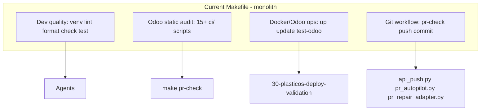
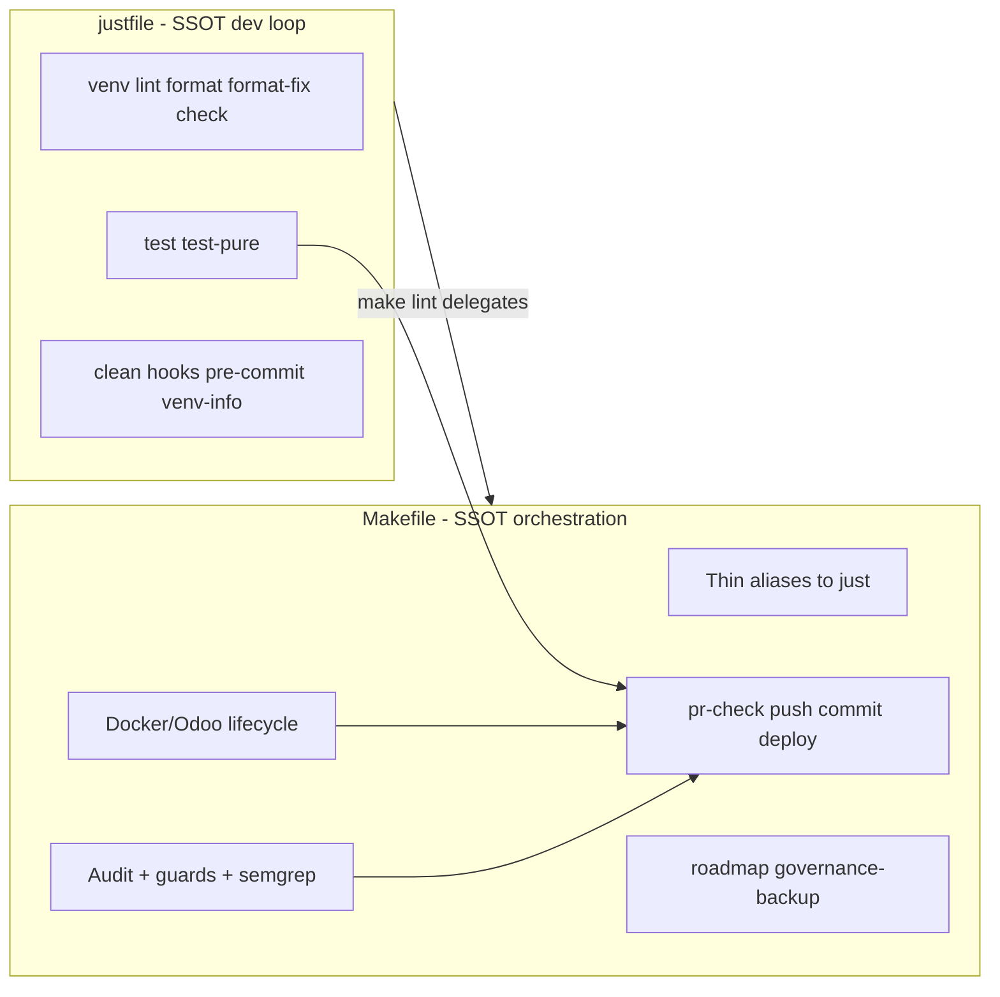

# Makefile + Justfile Boundary Realignment (PlasticOS)

## Re-evaluation (2026-08-06) — Verdict: NOT NECESSARY NOW

**Decision: Defer. Do not implement unless a concrete pain appears.**

### Why the original plan looked useful

Frontier pack examples treat `just` as the agent-facing command runner and Make as bootstrap/orchestration. That split is clean *in L9 pure-Python repos*. PlasticOS is a different workspace class.

### Why it is not needed on current HEAD

| Check | Current evidence |
|-------|------------------|
| `justfile` present? | **No** |
| Makefile size / role | Still ~604 lines; sole documented command surface |
| Agent / CI contract | `AGENTS.md`, rules, scripts all say `make pr-check` / `make push` / `make venv` |
| Script coupling | `api_push.py`, `pr_autopilot.py`, `pr_repair_adapter.py`, `pr_check.sh` subprocess `make` |
| Roadmap / TODO | **No** justfile or Makefile-split item |
| Active branch | `feat/gate-client-matcher-fallback` — Gate converge / enrichment, not tooling |
| Governance evolution | Make remains the PlasticOS SSOT; governance backup is separate (`make governance-backup`); L9 Frontier pack lives under `Current Work - IGNORE` (reference only) |
| First-order gate | Does **not** unblock intake → match → offer → transaction |

### Cost of doing it anyway

- New host dependency (`brew install just`) for zero runtime ERP value
- Dual docs (`just X` vs `make X`) while scripts stay on Make forever
- Doc churn across AGENTS.md, LOCAL_DEV_SETUP, rules, skills
- Risk of recipe drift for a cosmetic boundary

### When to reopen

Only if one of these becomes true:

1. Agents/humans regularly hit Make `.PHONY` / tab / argument-passing pain on the *dev loop* (`lint`/`format`/`test`)
2. You adopt `just` as a **governance-wide** standard and want PlasticOS to match other L9 repos
3. You deliberately want an ADR that says “Make-only forever” (cheap: write ADR, skip justfile)

### Recommended next action (not this plan)

Stay on Make. Continue Gate work on `feat/gate-client-matcher-fallback`. Treat the Frontier Justfile/Makefile examples as L9 templates, not PlasticOS requirements.

---

## Original plan (archived below — do not execute without re-approval)

## Skills Invoked

| Skill | Role in this plan |
|-------|-------------------|
| [l9-plan](file:///Users/ib-mac/.cursor/skills/l9-plan/SKILL.md) | Structured execution plan, scope in/out, file-level TODOs |
| [l9-architecture-decision-records](file:///Users/ib-mac/.cursor/skills/l9-architecture-decision-records/SKILL.md) | ADR-004 authoring template and consequences |
| [l9-structured-reasoning](file:///Users/ib-mac/.cursor/skills/l9-structured-reasoning/SKILL.md) | Trade-off analysis: split vs duplicate vs full migration |
| [l9-code-analysis](file:///Users/ib-mac/.cursor/skills/l9-code-analysis/SKILL.md) | Current [Makefile](Makefile) inventory + script coupling map |
| [l9-context7-docs](file:///Users/ib-mac/.cursor/skills/l9-context7-docs/SKILL.md) | Just + GNU Make authoritative patterns |

## Execution Pack Inputs (adapted, not copied verbatim)

Source folder: [Current Work - IGNORE/l9-execution-pack/](Current%20Work%20-%20IGNORE/l9-execution-pack/)

| Pack file | What we take | What we reject for PlasticOS |
|-----------|--------------|------------------------------|
| [AGENTS_GUIDE.md](Current%20Work%20-%20IGNORE/l9-execution-pack/AGENTS_GUIDE.md) | Decision tree: just = agent-facing commands; make = CI/bootstrap/orchestration | L9 `uv sync` / `just ci` with Pyright gate |
| [Justfile_example_Frontier_Grade](Current%20Work%20-%20IGNORE/l9-execution-pack/Justfile_example_Frontier_Grade) | Structure: `default`, variables, section headers, comment-per-recipe | `uv`, `type`, `test-unit` paths under `src/` |
| [Makefile_example_Frontier_Grade](Current%20Work%20-%20IGNORE/l9-execution-pack/Makefile_example_Frontier_Grade) | `.PHONY`, `.DEFAULT_GOAL := help`, `##` auto-help pattern | Full duplicate of just recipes as canonical bodies |
| [ODOO_LOCAL_TOOLING_GUIDE.md](Current%20Work%20-%20IGNORE/l9-execution-pack/ODOO_LOCAL_TOOLING_GUIDE.md) | Ruff authority, Pyright editor-only, venv via pip | `pip install -e .` (repo is addon suite) |

**PlasticOS invariant (non-negotiable):** per [88-plasticos-odoo-python-tooling.mdc](.cursor/rules/88-plasticos-odoo-python-tooling.mdc) and [LOCAL_DEV_SETUP.md](docs/LOCAL_DEV_SETUP.md)—no `uv`, no Pyright CI gate, no `[project]` table.

## Context7 Ground Truth (tool semantics)

**Just** (`/casey/just`):

- Recipes run unconditionally—no `.PHONY` boilerplate.
- Recipe dependencies are first-class: `check: lint format-check` chains cleanly.
- `# comment` above a recipe surfaces in `just --list` (built-in self-documentation).
- Shebang recipes (`#!/usr/bin/env bash`) for multi-line shell with `set -euo pipefail`.
- **Not** a build system—no file-timestamp dependency tracking.

**GNU Make** (manual):

- `.PHONY` required for every non-file target (silent skip if e.g. `test` file exists).
- Strong fit for orchestration chains, `include` of fragment makefiles, and subprocess delegation.
- Preinstalled on CI runners and macOS—zero extra install for git/audit scripts.

## Problem Statement

The current [Makefile](Makefile) (~605 lines, ~45 targets) is a **monolith** mixing three unrelated concerns:



**Duplication risk:** Frontier pack examples show identical bodies in both files—that is an anti-pattern. PlasticOS must pick **one SSOT per recipe** with the other file delegating.

**Hard coupling (must preserve):** these subprocess `make` explicitly:

- [scripts/api_push.py](scripts/api_push.py) → `make pr-check`
- [scripts/pr_autopilot.py](scripts/pr_autopilot.py) → `make pr-check`
- [scripts/pr_repair_adapter.py](scripts/pr_repair_adapter.py) → `VERIFY_COMMAND = ["make", "pr-check"]`
- [scripts/pr_check.sh](scripts/pr_check.sh) → `exec make pr-check`
- [.github/workflows/ci.yml](.github/workflows/ci.yml) → `make semgrep-test` (comment + job)

## Decision: Clean Boundary



### Justfile owns (canonical recipe bodies)

| Recipe | Command essence | Notes |
|--------|-----------------|-------|
| `default` | `@just --list` | Per Context7 + Frontier example |
| `venv` | `python3.12 -m venv` + pip install dev deps + pin ruff/semgrep | Port logic from [Makefile L142-154](Makefile) |
| `venv-info` | print active interpreter | Agent diagnostic |
| `lint` | `ruff check .` via pinned `.venv/bin/ruff` fallback | Variable `ruff :=` resolves path |
| `format` | `ruff format --check .` | CI-check mode (matches current `make format`) |
| `format-fix` | `ruff format .` | |
| `check` | `lint` + `format` deps | Replaces inline `check: lint format` |
| `test` / `test-pure` | `python3 -m pytest tests/ ...` | Mirrors [Makefile L393-395](Makefile) |
| `clean` | remove `__pycache__`, `.pytest_cache`, `.ruff_cache` | |
| `hooks` | `pre-commit install` (+ commit-msg if desired) | Safe agent command |
| `pre-commit` | `pre-commit run --all-files` | |

**Explicitly NOT in justfile:**

- `type` / Pyright—editor-only per repo policy
- `ci` alias duplicating `pr-check`—too heavy, wrong owner
- `uv sync`—forbidden for this repo
- Docker/Odoo targets—shell-heavy, `m=` param convention entrenched in deploy kernel

### Makefile owns (canonical recipe bodies)

| Group | Targets | Rationale |
|-------|---------|-----------|
| **Delegation aliases** | `venv lint format format-fix check test test-pure clean` | Backward compat; one-liner `just <t>` |
| **Static audit** | `xml-check odoo19-check wiring deps-check cron-check semgrep semgrep-test acl-check audit-quick audit` | Odoo-specific; 15+ `python3 ci/` invocations |
| **Hard gates** | `pipeline-guard dev-fence state-guard guards` | INVARIANT-enforced |
| **Deploy** | `deploy-check` | ICP + Neo4j preflight ([30-plasticos-deploy-validation.mdc](.cursor/rules/30-plasticos-deploy-validation.mdc)) |
| **Docker/Odoo** | `up down restart logs logs-error shell odoo-shell update update-all rebuild backup` | `docker compose` + post-upgrade verification |
| **Git/PR** | `pr-check pr-check-% pr-remote-feedback commit push api-push-check pr-autopilot pr-fix sonar changelog github-actions-kernel-check` | Complex bash; script coupling |
| **Meta** | `governance-backup roadmap roadmap-sync roadmap-list help` | Cross-repo / registry |

### pr-check chain (unchanged contract, updated internals)

```
pr-check
  ├── audit-quick
  │     ├── just lint      (via make alias)
  │     ├── just format    (via make alias)
  │     ├── xml-check odoo19-check wiring deps-check cron-check
  ├── semgrep semgrep-test
  ├── pipeline-guard
  ├── just test            (via make alias)
  └── pr-remote-feedback
```

`make pr-check` **stays the public API**—no script edits required.

## ADR-004 (new)

Create [docs/adr/ADR-004-makefile-justfile-boundary.md](docs/adr/ADR-004-makefile-justfile-boundary.md) (next sequential number after ADR-003).

**Sections to include:**

- **Context:** 605-line monolith; Frontier pack dual-file pattern; agent operability; script coupling to `make pr-check`; PlasticOS is Odoo addon suite not L9 uv project.
- **Options:**
  - A) Just-only (reject: breaks scripts, CI comments, zero-install CI)
  - B) Make-only (reject: no agent ergonomics, .PHONY bloat)
  - C) Split with Make delegation (accept)
  - D) Shared `scripts/tasks/*.sh` SSOT (defer: extra indirection without clear win)
- **Decision:** Option C—just SSOT for dev loop; make SSOT for orchestration; make thin-delegates quality targets.
- **Consequences:**
  - Devs/agents install `just` (`brew install just`) for daily work
  - All existing `make X` docs remain valid via aliases
  - CI unchanged (direct `ruff`/`pytest` in ci.yml; `make semgrep-test` preserved)
  - No uv migration path opened

## Implementation Phases

### Phase 1 — Create `justfile` (SSOT bodies)

New file: [justfile](justfile) at repo root.

**Variables block (PlasticOS-adapted):**

```just
# Pin resolver — mirrors Makefile $(RUFF) logic
ruff := if os_path_exists(".venv/bin/ruff") { ".venv/bin/ruff" } else { "ruff" }
python := if os_path_exists(".venv/bin/python") { ".venv/bin/python" } else { "python3" }
venv_dir := ".venv"
tests := "tests"
```

**Recipe style rules:**

- One-line `# description` above each recipe (shows in `just --list`)
- Use recipe dependencies for `check: lint format` (Context7 pattern)
- Port `venv` as shebang recipe if multi-line pip installs need `set -euo pipefail`
- Match exact ruff pin: `ruff==0.15.5`, `semgrep==1.164.0` from [Makefile](Makefile)

### Phase 2 — Slim Makefile (delegation + modular includes)

**2a. Replace quality target bodies** with delegation:

```makefile
lint format format-fix check test test-pure clean venv:
 just $@
```

**2b. Optional bloat cut—split into fragments** (recommended for maintainability):

```
make/
  quality.mk    # delegation aliases only
  audit.mk      # xml-check … audit
  gates.mk      # pipeline-guard … deploy-check
  odoo.mk       # up … backup
  git.mk        # pr-check … changelog
  meta.mk       # help roadmap governance-backup
```

Root [Makefile](Makefile) becomes ~30 lines:

```makefile
.DEFAULT_GOAL := help
-include .env
export
# RUFF variable kept for any make-only recipes that need it
include make/*.mk
```

**2c. Modernize `help`:**

- Replace 75-line `echo` block with `##` comment auto-help (Frontier Makefile pattern) **or** hybrid: auto-help for make-owned targets + banner pointing to `just --list` for dev loop
- Keep agent-kernel cross-references (FINAL_TOUCHES_MODE → `make audit`)

**2d. Preserve special Make features:**

- `pr-check-%` pattern rule
- `update` / `test-module` `m=` parameter validation
- `commit` / `push` interactive bash + protected branch guards
- `COMMIT_EXCLUDE`, `PROTECTED_BRANCHES`, `RUFF` resolver

### Phase 3 — Documentation alignment

| File | Change |
|------|--------|
| [docs/LOCAL_DEV_SETUP.md](docs/LOCAL_DEV_SETUP.md) | Add `brew install just`; dev loop uses `just lint/check/test`; Odoo still `make up/update` |
| [AGENTS.md](AGENTS.md) | Commands table: split "Dev loop (just)" vs "Odoo/Git (make)" |
| [.envrc](.envrc) | `run: just venv` alongside `make venv` mention |
| [.cursor/rules/00-plasticos-master-context.mdc](.cursor/rules/00-plasticos-master-context.mdc) | Project Commands table split |
| [.claude/skills/plasticos-static-audit-kernel/SKILL.md](.claude/skills/plasticos-static-audit-kernel/SKILL.md) | Note `just check` for fast loop; `make pr-check` for push |
| [docs/makefile-automation-enhancements.md](docs/makefile-automation-enhancements.md) | Add "Phase 8: Justfile boundary" section (optional, 1 paragraph) |

**Agent guidance block** (from pack [AGENTS_GUIDE.md](Current%20Work%20-%20IGNORE/l9-execution-pack/AGENTS_GUIDE.md)) to embed in ADR + AGENTS.md:

```
Daily validation ladder:
  just format-fix → just lint → just test → make pr-check (before push)

Odoo operations:
  make up / make update m=<mod> / make test-odoo

Never bypass the files for underlying tool invocations in agent workflows.
```

### Phase 4 — Validation (post-implementation)

```bash
# Install just (once per machine)
brew install just

# Parity checks
just --list
just check
just test
make lint          # must equal just lint exit code
make check
make audit-quick
make pr-check      # full gate — NOT RUN until implementation
make help
```

**Acceptance criteria:**

- Zero duplicate recipe bodies between files (grep for `ruff check`—only in justfile)
- All 8 script `make pr-check` call sites work unchanged
- `make semgrep-test` still callable from CI job
- `just` and `make` both work without `.venv` (graceful PATH fallback)

## Out of Scope

- Migrating `pr-check` to `just pr-check` (script churn, no runtime value)
- Adding `just` to GitHub Actions ci.yml (CI already calls tools directly)
- uv / `[project]` / Frontier strict Pyright platform
- Renumbering duplicate ADR-002 entries (pre-existing)
- Changing `pipeline_v2.py` or module code

## Risk Matrix

| Risk | Mitigation |
|------|------------|
| `just` not installed on dev machine | `make` aliases still work; LOCAL_DEV_SETUP documents install |
| Recipe drift (just vs make) | Make quality targets are one-line delegates only |
| `just` missing on CI | CI does not depend on just |
| Breaking `m=` / `pr=` Make variables | Keep those targets in Makefile only |

## File Change Summary

| Action | Path |
|--------|------|
| Create | `justfile` |
| Create | `docs/adr/ADR-004-makefile-justfile-boundary.md` |
| Refactor | `Makefile` (+ optional `make/*.mk`) |
| Update | `docs/LOCAL_DEV_SETUP.md`, `AGENTS.md`, `.envrc`, `.cursor/rules/00-plasticos-master-context.mdc`, `.claude/skills/plasticos-static-audit-kernel/SKILL.md` |

## Recommended Execution Mode

Use [l9-gmp-protocol](file:///Users/ib-mac/.cursor/skills/l9-gmp-protocol/SKILL.md) for implementation (locked phases + evidence report) since this touches agent contracts, Makefile orchestration, and multiple doc surfaces.
