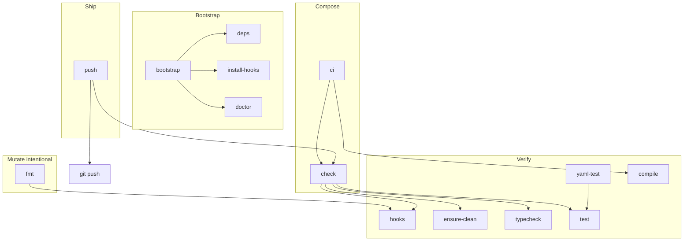

# Optimized Makefile for l9-ci-sdk (pre-commit–centered)

## Structured reasoning

**Problem.** Agents and humans currently invent ad-hoc command sequences (`ruff…`, `yamllint…`, `pytest…`, raw `git push`). That creates drift against [`.pre-commit-config.yaml`](.pre-commit-config.yaml), [`requirements-ci.txt`](requirements-ci.txt), and yaml-governance CI, and lets dirty trees reach the remote.

**Goal.** One Makefile that maximizes:

- **Leverage** — one target replaces many remembered CLI invocations
- **Autonomy** — agents/`make` can onboard, verify, and ship without reading three docs
- **Repeatability** — same recipes locally and in muscle memory as CI’s mechanical gates
- **Low drift** — Make never owns tool flags/versions; it only orchestrates SSOTs
- **Low friction** — fast inner loop (`fmt`, `test`) vs full ship gate (`check` → `push`)

**Non-goals.** Replacing GitHub Actions; hosting Semgrep/L9 analysis locally; adding force-push helpers; expanding pre-commit with actionlint in this change.

## Design laws (locked)

1. **Single source of truth per concern**
   - Hook suite / YAML+Ruff mechanical checks → [`.pre-commit-config.yaml`](.pre-commit-config.yaml) via `pre-commit run`
   - Toolchain install pins → [`requirements-ci.txt`](requirements-ci.txt) (+ `pre-commit` package)
   - Ruff rule/format settings → [`ruff.toml`](ruff.toml) (consumed by the pre-commit ruff hooks, not by Make)
   - Yamllint profiles / pin checkers → [`lint/`](lint/) (consumed by hooks / CI, not restated in Make)
2. **Make orchestrates; it does not re-specify.** No copied `yamllint --strict -c …`, no parallel `ruff check` recipe that can diverge from the hook’s `--fix` behavior.
3. **Mutate vs verify are explicit.** Autofix belongs to `fmt` (intentional). Ship path (`check`/`push`) verifies and **fails if hooks dirtied the tree**.
4. **Source-run packaging.** No `pyproject.toml`; runtime is `PYTHONPATH=.` + `$(PYTHON) -m …`, matching AGENTS.md / Core `provision-sdk`.
5. **Fail closed on ship; stay ergonomic on iterate.** `push` has no bypass flag. Escape hatch is raw `git push` (documented as “you skipped the gate”).
6. **Self-describing.** Default `make` / `make help` lists targets from `##` annotations—no stale hand-written help block.

## Ownership / drift matrix

| Concern | Authority | Make role |
|---|---|---|
| Ruff lint+format | `.pre-commit-config.yaml` + `ruff.toml` | `fmt` / `hooks` only |
| Yamllint infra/data | pre-commit hooks + `lint/yamllint-*.yml` | via `hooks` |
| Governance JSON + action pins | `lint/check_*.py` via pre-commit | via `hooks` |
| Zizmor | pre-commit hook pin | via `hooks` |
| mypy / pytest versions | `requirements-ci.txt` | `typecheck` / `test` invoke tools only |
| actionlint | CI yaml-governance only | **not** in Make v1 (known gap) |
| L9 analysis / Semgrep profiles | `.github/workflows/l9-analysis*.yml` | out of scope |

## Target graph



### Layer A — Bootstrap (autonomy)

| Target | Behavior |
|---|---|
| `deps` | `$(PYTHON) -m pip install -r requirements-ci.txt pre-commit` (idempotent) |
| `install-hooks` | `pre-commit install` (commit-time; optional but recommended) |
| `doctor` | Verify `python`, `pre-commit`, `mypy`, `pytest`, `git` exist; print versions; remind if hooks not installed (`$(GIT_DIR)/hooks/pre-commit` missing). Non-mutating, always safe. |
| `bootstrap` | `deps` → `install-hooks` → `doctor` — one-shot onboarding for humans/agents |

### Layer B — Mutate (low-friction iterate)

| Target | Behavior |
|---|---|
| `fmt` | `pre-commit run --all-files` **allowed to dirty the tree** (ruff `--fix`). Exit non-zero if hooks still fail after fixes. Operator then commits. This is the intentional autofix path—never used as a silent step inside `push`. |

### Layer C — Verify (primitives)

| Target | Behavior |
|---|---|
| `hooks` | `pre-commit run --all-files` — SSOT mechanical suite |
| `ensure-clean` | Fail if unstaged/staged diffs exist; message: “hooks mutated files — commit and re-run” |
| `typecheck` | `$(PYTHON) -m mypy l9_ci` |
| `test` | `PYTHONPATH=. $(PYTHON) -m pytest -q $(PYTEST_ARGS)` |
| `yaml-test` | `PYTHONPATH=. $(PYTHON) -m pytest -q tests/yaml $(PYTEST_ARGS)` — fast dogfood slice for governance work |
| `compile` | `$(PYTHON) -m compileall -q l9_ci tests lint` — cheap syntax gate mirrored in self-CI spirit |

### Layer D — Compose (repeatable workflows)

| Target | Behavior |
|---|---|
| `check` | **Default quality gate:** `hooks` → `ensure-clean` → `typecheck` → `test`. This is what “clean” means locally. |
| `ci` | Alias/extension of `check` + `compile` — name signals “local CI-shaped gate” without claiming full GH parity. Same fail-closed semantics. |
| `push` | `check` then `git push $(PUSH_ARGS)`. No silent skip. |

### Layer E — Convenience aliases (leverage, zero logic)

- `pre-commit` → `hooks`
- `lint` → `hooks` (so agents grepping for “lint” find the SSOT path)
- `gate` → `check`

## Variables (friction knobs without drift)

```make
PYTHON      ?= python3
PYTEST_ARGS ?=
PUSH_ARGS   ?=
export PYTHONPATH := $(CURDIR)$(if $(PYTHONPATH),:$(PYTHONPATH),)
```

- Override Python: `make check PYTHON=.venv/bin/python`
- Narrow tests: `make test PYTEST_ARGS='tests/yaml -k governance'`
- First branch push: `make push PUSH_ARGS='-u origin HEAD'`

No `VENV=` magic that fights Dropbox/shared environments—callers point `PYTHON` at whatever interpreter they bootstrapped with `deps`.

## Ship flow (fail-closed)

```text
make bootstrap          # once per machine/clone
# … edit …
make fmt                # optional autofix; commit results
make check              # or just:
make push               # check → git push
```

If `fmt`/`hooks` auto-fixed files during a path that includes `ensure-clean`, push aborts until the operator commits. That prevents “CI-clean remotely, dirty locally” and prevents pushing uncommitted ruff fixes.

## Implementation shape (Makefile mechanics)

- `.DEFAULT_GOAL := help`
- `.PHONY: …` for every recipe target
- `SHELL := /bin/bash` + `.SHELLFLAGS := -eu -o pipefail -c`
- Self-documenting `help` via awk over `^[a-zA-Z0-9_-]+:.*?## `
- Recipes stay 1–3 lines; shared prefixes via variables (`PRE_COMMIT ?= pre-commit`, `PC_RUN = $(PRE_COMMIT) run --all-files`)
- Color/noise: plain stderr messages only; no emoji; actionable remediation lines
- Do **not** use `git commit` from Make
- Do **not** pass `--no-verify` anywhere

## Docs alignment (minimize narrative drift)

1. [`README.md`](README.md) — short **Local gate** section: `bootstrap` / `check` / `push` / `fmt`
2. [`docs/architecture/yaml-governance.md`](docs/architecture/yaml-governance.md) — replace or preface the hand-maintained local command list with “preferred: `make hooks` (or `make check`)”; keep the raw commands as the expansion of what pre-commit runs for debugging
3. [`MANIFEST.md`](MANIFEST.md) — add `Makefile` if this inventory is updated in the same change set
4. Do **not** invent a new architecture doc for Make

## Known CI gaps (documented in README one-liner, not “fixed” by Make)

- `actionlint` remains CI-only until a pre-commit hook is added later
- Dogfood `enforce-zizmor: false` in GH vs pre-commit zizmor failing closed locally — **local is stricter**; that is intentional for push hygiene
- Full L9 analysis profiles stay in Actions callers

## Out of scope

- Changing `.pre-commit-config.yaml` hook set or revs
- Adding actionlint to pre-commit
- Modifying workflow YAML beyond docs pointers
- `pre-push` git hook install (Make `push` is the ship control point; commit hooks via `install-hooks` only)
- Force-push / amend / rebase helpers
