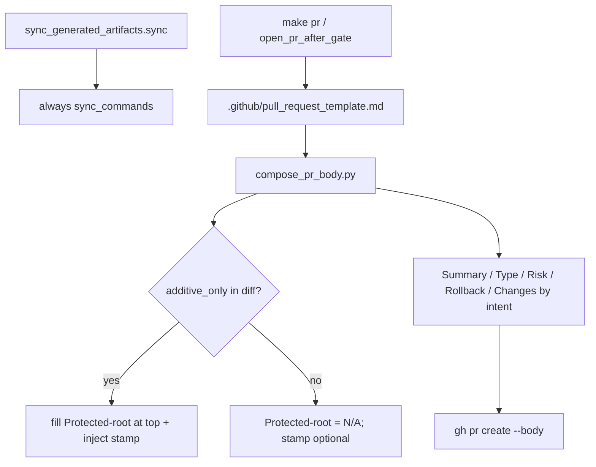

# Manifest heal + one autonomous PR template

`route_plan.py --risk medium --evidence sufficient` → `depth=standard`, `omit_gates=[]`. Skill: `l9-plan-simple`. Not PE. Do not run `make campaign`. Do not write `Lock: origin/main = <sha>`.

**Workspace bind (planning only):** this checkout is `main` @ `d2190e98`. **[PR 421](https://github.com/Quantum-L9/Cursor-Governance/pull/421)** is open (`feat/ff-shelf-20260830T205950Z`). Build **never** starts from `origin/main`. Execute on the 421 tip via `PR_STACK=auto` / `agent_worktree_start.sh`.

## Objective

1. Stop remediator hand-heals of `commands/COMMANDS_MANIFEST.yaml` after command files disappear.
2. One PR template only. `make pr` compiles a complete agent body (no human judgment leftover). Protected-root fields live at the **top** of that same template; the composer fills them whenever any `additive_only` root file is in the diff.

## Locked design



**Manifest one-liner.** In [`ops/scripts/sync_generated_artifacts.py`](ops/scripts/sync_generated_artifacts.py) `sync()`, replace the `commands/`-gated call with always-on:

```python
        sync_commands(root, wrote)
```

Delete the `if should_run(changed, ("commands/",)):` wrapper (today lines 554–555). `sync()` still only runs when `_generated_sources_changed` matches `rules/|skills/|commands/|environment/agents/|environment/program-execution/|ops/generated/` — that is enough for the 415/416 loop (skills-only PRs already enter `sync()`).

**One template.** Canonical file is [`.github/pull_request_template.md`](.github/pull_request_template.md) (GitHub default). Fold the protected-root block from [`.github/PULL_REQUEST_TEMPLATE/protected-root.md`](.github/PULL_REQUEST_TEMPLATE/protected-root.md) to the **top** of that file (stamp HTML comment first, then Paths / Edit mode / Why / Proof). Keep Problem / Fix / Risk / Evidence / Gates / Changes by intent below so `governance-pr.yml` section names still match.

Retire as files (not a second body):

- [`.github/PULL_REQUEST_TEMPLATE/protected-root.md`](.github/PULL_REQUEST_TEMPLATE/protected-root.md)
- [`.github/PULL_REQUEST_TEMPLATE/agent.md`](.github/PULL_REQUEST_TEMPLATE/agent.md) — seed/chore fills move into the composer so Enforce-PR-Policies still sees completed sections
- root [`PULL_REQUEST_TEMPLATE.md`](PULL_REQUEST_TEMPLATE.md) — **delete** (user choice). It is `managed` in [`ops/config/root-file-protection.json`](ops/config/root-file-protection.json); remove its inventory entry in the same PR. No `ALLOW-ROOT-DELETION` (not `additive_only`).

**Composer autonomy** ([`ops/scripts/compose_pr_body.py`](ops/scripts/compose_pr_body.py)):

- Always compose from `.github/pull_request_template.md`. Stop the exclusive protected-root template swap in [`ops/scripts/open_pr_after_gate.sh`](ops/scripts/open_pr_after_gate.sh).
- Pass touched additive_only paths (already available via `validate_root_file_protection.py --list-touched-additive-only`) into compose.
- When that list is non-empty: inject `<!-- L9_PROTECTED_ROOT_PR -->` if missing; fill Paths from the list; set Append-only vs Justified rewrite from `ALLOW-ROOT-DELETION` in `PR_BASE..HEAD`; fill Why from first commit subject; Proof from the marker reason or “append-only — none”.
- Always fill (no `needs_completion` leftover for these): Summary/Problem sentence = first commit subject; Type of Change from path prefixes (`docs/`/`docs/plans/` → Documentation; `commands/`/`rules/`/`skills/`/`ops/`/`.github/` → CI / governance; else Feature); Risk Low if only docs/plans, High if any additive_only rewrite, else Medium; Rollback = “revert this PR”; Changes by intent = one `path — commit-subject` line per name-status row; Evidence = existing gate/L4 receipt lines.
- Check “No secrets” `[x]` only if the security wave already passed in `gate-receipt.json`. Leave other Gates unchecked **with an n/a reason** (same pattern as retired `agent.md`) so Enforce-PR-Policies does not fail.
- Update [`ops/scripts/tests/test_compose_pr_body.py`](ops/scripts/tests/test_compose_pr_body.py): drop assertions that Type of Change / Risk stay in `needs_completion`. Assert filled Summary, one Type box, Risk, Rollback, and protected-top fill when additive paths are supplied.

**Callers / doctrine (append-only on AGENTS.md):**

- [`ops/scripts/open_pr_after_gate.sh`](ops/scripts/open_pr_after_gate.sh): single template candidate `.github/pull_request_template.md`; keep the pre-create `--require-pr-body` stamp check; rewrite WARN text that still names `protected-root.md`.
- [`ops/scripts/validate_root_file_protection.py`](ops/scripts/validate_root_file_protection.py): `PROTECTED_ROOT_PR_TEMPLATE` → `.github/pull_request_template.md`; stamp string unchanged.
- [`ops/config/root-file-protection.json`](ops/config/root-file-protection.json): `pr_template.path` → `.github/pull_request_template.md`; drop `PULL_REQUEST_TEMPLATE.md` from `protected_files`.
- [`ops/autonomy/l4_local.py`](ops/autonomy/l4_local.py) `PR_TEMPLATE_CANDIDATES`: prefer `.github/pull_request_template.md`; drop root `PULL_REQUEST_TEMPLATE.md`. Update [`tests/ops/autonomy/test_l4_local.py`](tests/ops/autonomy/test_l4_local.py).
- [`ops/config/governance-runtime-contract.yaml`](ops/config/governance-runtime-contract.yaml) `pr-template-surfaces`: one SSOT, `.github/pull_request_template.md` only.
- [`AGENTS.md`](AGENTS.md): **append** a named fragment (do not rewrite `PROTECTED_ROOT_PR_TEMPLATE_V1`). [`CLAUDE.md`](CLAUDE.md) is `managed` — update the one protected-root path line.
- [`ops/autonomy/surface_profile.yaml`](ops/autonomy/surface_profile.yaml) `pr_template` key if it still says `PULL_REQUEST_TEMPLATE.md`.

**Manifest test:** add a unit that `sync()` with `changed={"skills/l9-foo/SKILL.md"}` still runs `generate_commands_manifest.py` (mock or tmp tree with a stale manifest).

## Scope

**In:** the files above; hook catalog [`.pre-commit-config.yaml`](.pre-commit-config.yaml).

**Out:** landing 418–420 onto `main`; changing `additive_only` law; human-in-the-loop `needs_completion` gate; PE/campaign; editing `CANONICAL_LAW.md`.

## Stress / leverage

- **Disconfirm:** Does a skills-only change set still enter `sync()` via `_generated_sources_changed`? Yes (`skills/`). Would always-on stamp on every PR confuse CI? Gate only requires stamp when additive_only is touched; extra stamp is OK, but the template should show N/A when the list is empty so reviewers are not lied to.
- **False if:** `governance-pr.yml` starts requiring headings we delete (keep Problem/Fix/Risk). Case-insensitive APFS aliases `.github/PULL_REQUEST_TEMPLATE.md` to `pull_request_template.md` — existence checks must keep the `os.listdir` pattern in `resolve_pr_template`.
- **Blast:** every `make pr` body shape; root-protect CI message; GitHub web “new PR” form.
- **Rollback:** revert the stacked PR.
- **Leverage:** one composer + one file removes the 415/416 manifest loop and the “Opened: URL / empty Summary” loop together.

## Doc / root impact

- Delete managed root `PULL_REQUEST_TEMPLATE.md` + inventory drop.
- Append-only `AGENTS.md`.
- Managed `CLAUDE.md` path fix.
- No Makefile / `CANONICAL_LAW.md` / `pyproject.toml` edits.

## Execute via Cursor Build

Press **Build**. Plan on the current workspace. Execute on the unique open-PR chain tip.

- If any open PR exists: **never** branch from `origin/main`. Start from the unique chain tip (`PR_STACK=auto`). Use `agent_worktree_start.sh` when this checkout is not already that tip. Sibling open-PR chains fail closed.
- Board is not empty: tip is PR 421.
- Do not run `make campaign`. Do not admit a Program Lock. Do not write `Lock: origin/main = <sha>`.
- After todos: scoped-commit, `l4_local.py authorize-release`, `PR_STACK=auto PR_REMEDIATE=0 make pr`. Finish reply **must** show the opened PR URL.
- This PR will likely touch `AGENTS.md` (append-only): composer must fill the top protected-root block and inject the stamp.
