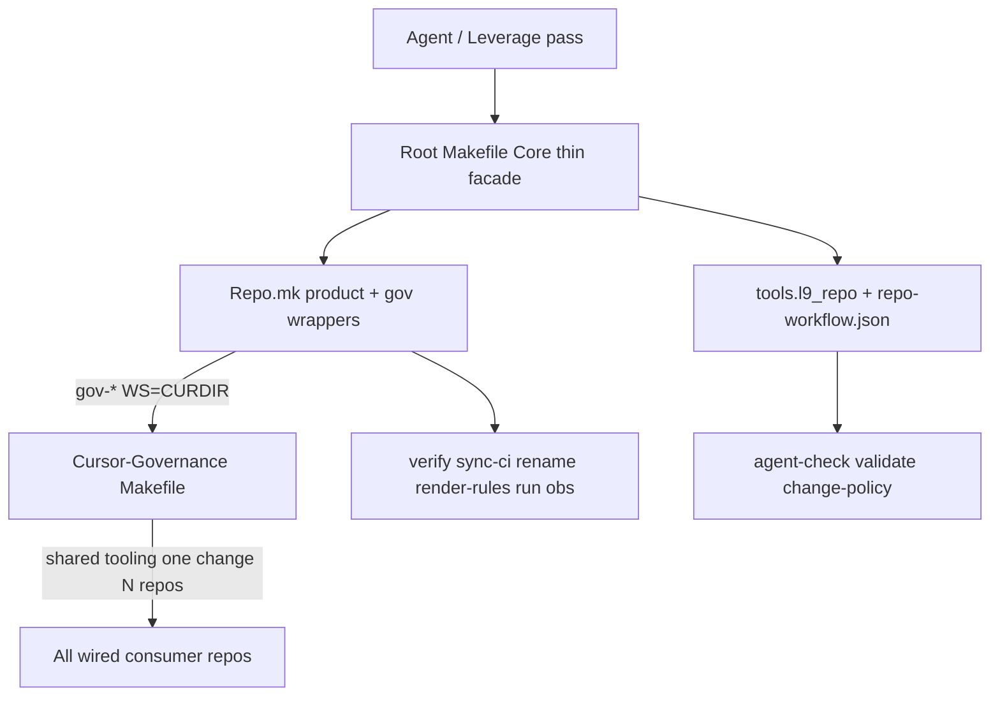

## PLAN: Museum Makefile for autonomy + Leverage

**PLAN_DOCUMENT:** validated PASS (`/tmp/l9-plan-museum-makefile.json`). Vision lock (plan iteration): **CG = shared control plane**; museum = thin product payload + `WS=` callers.

### Analysis (Cursor-Governance Makefile)

[Quantum-L9/Cursor-Governance/Makefile](https://github.com/Quantum-L9/Cursor-Governance/blob/main/Makefile) is a **governance SSOT** facade: `start`/`sync`/`wiring-check`/`claude-*`/`autonomy-validate`/`secrets-*`/`ide-profile`/`pr` with `WS=` consumer targeting.

Critical CG help line (locked law for consumers):

> Prefer **l9-ci-core thin Makefile** (identical across repos) when adopting the common workflow.
> Consumer repos: `make -C "$HOME/.cursor-governance" pr WS="$(pwd)"`

**Maximum autonomy is not “copy CG’s Makefile into the museum.”** CG Makefile changes do **not** rewrite other repos’ files. They propagate as **shared tooling behavior** only when consumers invoke CG with `WS=`. The museum encodes that habit so one CG improvement upgrades every wired repo the same day.

### Max-leverage vision (locked)

1. **One invocation habit** — governance always via CG:

```bash
make -C "$HOME/.cursor-governance" pr-check WS="$(pwd)"
make -C "$HOME/.cursor-governance" pr WS="$(pwd)"
make -C "$HOME/.cursor-governance" start WS="$(pwd)"
make -C "$HOME/.cursor-governance" wiring-check WS="$(pwd)"
```

2. **Split ownership** (never dual SSOT):

| Change belongs in | Examples |
|-------------------|----------|
| **CG Makefile / ops** | pr-check gate shape, security scanners, open-PR + remediation, wiring, ide-profile, autonomy-validate, secrets |
| **Museum `Repo.mk`** | verify, sync-ci, rename, render-rules, run, obs-up |
| **Core thin facade** (identical) | agent-check, validate, change-policy via `tools.l9_repo` |

3. **Museum is WS-ready** — thin wrappers in `Repo.mk` (implementation stays in CG):

```makefile
GOV_ROOT ?= $(HOME)/.cursor-governance

gov-pr-check:
	$(MAKE) -C "$(GOV_ROOT)" pr-check WS="$(CURDIR)"

gov-pr:
	$(MAKE) -C "$(GOV_ROOT)" pr WS="$(CURDIR)"

gov-start:
	$(MAKE) -C "$(GOV_ROOT)" start WS="$(CURDIR)"

gov-wiring-check:
	$(MAKE) -C "$(GOV_ROOT)" wiring-check WS="$(CURDIR)"
```

If `GOV_ROOT` is missing, wrappers print a clear skip/hint (do not fail `make verify`).

4. **Agent completion contract** (AGENTS.md):

1. Product green: `make verify` (in-repo product ladder)
2. Governance green when CG present: `make gov-pr-check` (or equivalent `make -C … WS=`)
3. Prefer `make gov-pr` for open+remediate; in-repo `OPEN_PR` stays **0**

5. **Anti-patterns** (kill leverage — forbidden):

- Copying CG’s full Makefile into the template
- Duplicating `run_pr_gate.sh` / security scripts per repo
- Putting museum `sync-ci`/`rename` into CG
- Expecting CG git push to rewrite other repos’ Makefiles

6. **Leverage scorecard** (done when true):

- Changing CG `pr-check` improves every wired Quantum-L9 repo without museum Makefile edits
- Museum stays Core facade + `Repo.mk` + thin `gov-*` wrappers
- Use-template docs teach both ladders on day one
- No second copy of governance scripts in product trees

### CG target classification

| CG target class | Museum action |
|-----------------|---------------|
| `pr` / `pr-check` / case aliases / `PR_BASE` | **In-repo product** `pr-check` (= verify ladder, `OPEN_PR=0`) **plus** `gov-pr-check` / `gov-pr` wrappers |
| `venv` / `uv-lock-check` / lint/test matrices | **Adapt** via Core `repo-workflow` + Repo.mk |
| `start` `sync` `wiring-check` `claude-*` `autonomy-validate` `secrets-*` `ide-profile` `integrity-*` | **`gov-*` wrappers only** — never vendor scripts |
| Wave1/2 `autonomy/` control plane | **Out** — lives in CG |

### Leverage / autonomy alignment

From [Leverage.md](.cursor-commands/kernels/Leverage.md): maximize compounding force-multipliers, deterministic validation, honest completion gates, minimum effective change. Push shared behavior **up into CG**; keep product behavior **down in `Repo.mk`**.

Museum today: hand-written `verify`/`sync-ci`/`rename` — good product DX, missing `pr-check` / `agent-check` / `gov-*` WS= habit.



### Locked design

- Root `Makefile` = Core [`Makefile.template`](https://github.com/Quantum-L9/l9-ci-core/blob/main/tools/l9_repo/Makefile.template) (delegate-only).
- Vendor `tools/l9_repo` + `.l9/repo-workflow.json` (+ schema) from **Core SHA pin** (U1: vendor).
- `Repo.mk`: product targets + **`gov-*` WS= wrappers** + in-repo `pr-check` (product-only, `OPEN_PR ?= 0`).
- Docs + AGENTS: CG-as-control-plane vision, dual ladder, agent completion contract, Use-template wiring note (`wiring-check` / symlinks so `WS=` works).
- Coordinate golden harvest: `run` / `obs-*` land in `Repo.mk`, not a second root Makefile.

### Todos

1. **T1** — Replace root Makefile with Core template; add `Repo.mk`
2. **T2** — Vendor `tools/l9_repo` + workflow schema from Core pin; probe minimal `.l9` authority stubs (U2)
3. **T3** — Configure `repo-workflow` setup/check/test matrices to museum ladder
4. **T4** — Port product targets; add in-repo `pr-check` (`OPEN_PR=0`); add `gov-pr-check` / `gov-pr` / `gov-start` / `gov-wiring-check`
5. **T5** — README/AGENTS/ARCHITECTURE: control-plane vision, dual ladder, agent contract, anti-patterns
6. **T6** — Smoke tests for product targets + wrapper recipes (skip CG invocation if `GOV_ROOT` missing)
7. **T7** — TEMPLATE_INVENTORY + inventory_check for Makefile / Repo.mk / tools/l9_repo surfaces

### Stress / rollback

- Disconfirm: copying CG Makefile; OPEN_PR=1 default; unpinned `tools/l9_repo` drift; wrappers that fail hard when CG is absent (breaks Use-template smoke).
- Assume false: CG git push rewrites consumer Makefiles; museum must vendor autonomy-validate to be autonomy-ready.
- Rollback: restore hand Makefile; remove vendored runtime and `gov-*` wrappers.

### Final validation

`make help` · `make verify` · `make pr-check` · `make agent-check` · `gov-*` recipes present and point at `GOV_ROOT` + `WS=$(CURDIR)` · no vendored CG secrets/autonomy-validate/claude-plugins scripts · `make sync-ci` works · Actions green · docs state CG control-plane law.

### Handoff

Next: `l9-gmp-protocol`. May modify museum Makefile/Repo.mk/tools/l9_repo/.l9/docs/tests only. Must not modify CG or Core product code except as read-only pin source. Must not copy CG ops scripts into the museum.
