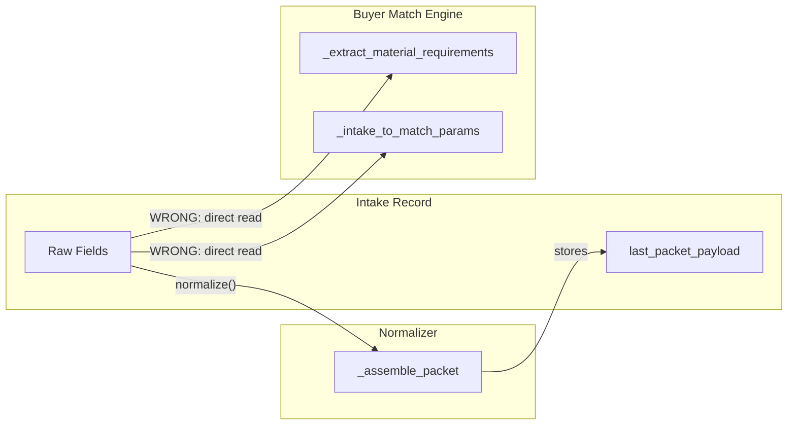
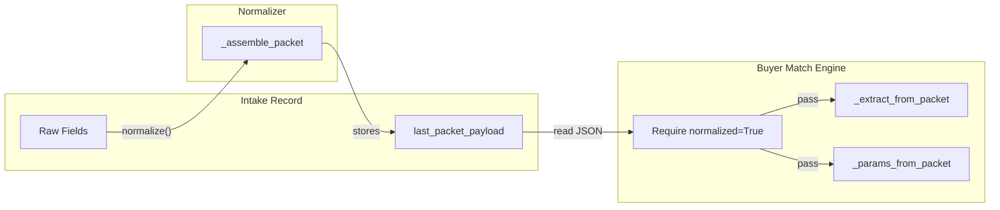

# Normalized Payload Consumption Refactor

## Problem Statement

The buyer match engine currently reads directly from raw intake ORM fields, bypassing the normalization layer. This causes:

1. **AttributeError**: `_assemble_packet()` references `self.contamination_total_pct` which doesn't exist on intake (field is `contamination_pct`)
2. **Missing fields**: Matcher reads `intake.has_metal`, `intake.has_fr`, `intake.is_metalized` which don't exist on intake (they're on `material_profile`)
3. **Architectural violation**: Normalized packet exists but is never consumed by the matcher

## Current Data Flow (Broken)




## Target Data Flow (Correct)




## Field Mapping Reference


| Packet Path                       | Intake Field                            | Matcher Param                                  |
| --------------------------------- | --------------------------------------- | ---------------------------------------------- |
| `quality.mfi_value`               | `mfi_value`                             | `mfi`                                          |
| `quality.density_value`           | `density_value`                         | `density`                                      |
| `quality.moisture_pct`            | `moisture_pct`                          | `moisture_pct`                                 |
| `quality.contamination_total_pct` | `contamination_pct`                     | `contamination_pct`                            |
| `quality.filler_pct`              | `filler_pct`                            | `filler_pct`                                   |
| `quality.filler_type`             | `filler_type_id.code`                   | `filler_type_id` (lookup)                      |
| `quality.attributes`              | `material_attribute_ids.mapped("code")` | `has_metal`, `has_fr`, `is_metalized`          |
| `origin.sector`                   | `origin_sector`                         | `origin_sector`, `food_grade`, `medical_grade` |
| `frequency.quantity_per_load_lbs` | `quantity_per_load_lbs`                 | `quantity_lbs`                                 |
| `geo.lat`                         | `lat`                                   | `latitude`                                     |
| `geo.lon`                         | `lon`                                   | `longitude`                                    |
| `material_profile.polymer_code`   | `polymer_id.code`                       | `polymer_code`                                 |
| `material_profile.form`           | `form_id.code`                          | `form_code`                                    |
| `material_profile.color`          | `color_id.code`                         | `color_code`                                   |
| `material_profile.source_type`    | `source_type_id.code`                   | `source_type_code`                             |


## Implementation Plan

### Phase 1: Fix Normalizer Field Reference

**File**: [plasticos_intake_normalizer/models/intake_normalizer.py](plasticos_intake_normalizer/models/intake_normalizer.py)

Fix line 396 in `_assemble_packet()`:

- Change: `"contamination_total_pct": self.contamination_total_pct or None,`
- To: `"contamination_total_pct": self.contamination_pct or None,`

This maps the intake field `contamination_pct` to the packet key `contamination_total_pct` which downstream systems expect.

### Phase 2: Add Packet Extraction Utility

**File**: [plasticos_buyer_match_engine/models/matcher.py](plasticos_buyer_match_engine/models/matcher.py)

Create new method `_extract_from_packet(self, payload)` that:

- Takes the JSON packet payload
- Returns the same dict structure as `_extract_material_requirements`
- Handles attribute-to-boolean conversion (`quality.attributes` contains "metal" -> `has_metal=True`)
- Handles None/missing values gracefully

### Phase 3: Add Normalization Guard

**File**: [plasticos_buyer_match_engine/models/matcher.py](plasticos_buyer_match_engine/models/matcher.py)

In `match_intake()` method (around line 80-90):

- Add validation: `if not intake.normalized: raise UserError("Intake must be normalized before matching")`
- Or auto-normalize: `if not intake.normalized: intake.action_normalize()`

### Phase 4: Refactor Matcher to Use Packet

**File**: [plasticos_buyer_match_engine/models/matcher.py](plasticos_buyer_match_engine/models/matcher.py)

Modify `_extract_material_requirements()` (lines 204-254):

- When `intake` is provided, call `_extract_from_packet(intake.last_packet_payload)` instead of reading raw fields
- Keep the supplier-only fallback path unchanged

### Phase 5: Add Graph Service Packet Extraction

**File**: [plasticos_buyer_match_engine/models/graph_service.py](plasticos_buyer_match_engine/models/graph_service.py)

Create new method `_params_from_packet(self, payload)` that:

- Takes the JSON packet payload
- Returns the same dict structure as `_intake_to_match_params`
- Maps packet keys to Cypher parameter names

### Phase 6: Refactor Graph Service to Use Packet

**File**: [plasticos_buyer_match_engine/models/graph_service.py](plasticos_buyer_match_engine/models/graph_service.py)

Modify `_intake_to_match_params()` (lines 342-355):

- Change signature to accept `intake` OR `payload`
- When intake has `last_packet_payload`, use packet extraction
- Fallback to raw fields only if packet is None (backward compatibility)

### Phase 7: Update Attribute Handling

Both matcher and graph_service need to convert `quality.attributes` list to boolean flags:

```python
def _attributes_to_flags(attributes: list) -> dict:
    attrs = set(a.lower() for a in (attributes or []))
    return {
        "has_metal": "metal" in attrs,
        "is_metalized": "metalized" in attrs,
        "has_fr": "fr" in attrs or "flame_retardant" in attrs,
    }
```

### Phase 8: Validation and Testing

- Test normalization produces valid packet
- Test matcher consumes packet correctly
- Test graph service produces correct Cypher params
- Test error handling when intake not normalized
- Test backward compatibility (intake without packet)

## Files to Modify


| File                                                      | Changes                                                                                            |
| --------------------------------------------------------- | -------------------------------------------------------------------------------------------------- |
| `plasticos_intake_normalizer/models/intake_normalizer.py` | Fix `contamination_total_pct` field reference (line 396)                                           |
| `plasticos_buyer_match_engine/models/matcher.py`          | Add `_extract_from_packet()`, add normalization guard, refactor `_extract_material_requirements()` |
| `plasticos_buyer_match_engine/models/graph_service.py`    | Add `_params_from_packet()`, refactor `_intake_to_match_params()`                                  |


## Risk Mitigation

1. **Backward compatibility**: Keep fallback to raw fields if `last_packet_payload` is None
2. **Gradual rollout**: Add feature flag `MATCH_FROM_PACKET_ONLY` (default False initially)
3. **Validation**: Require `normalized=True` before matching to ensure packet exists
4. **Logging**: Add debug logging when switching between packet/raw field consumption
