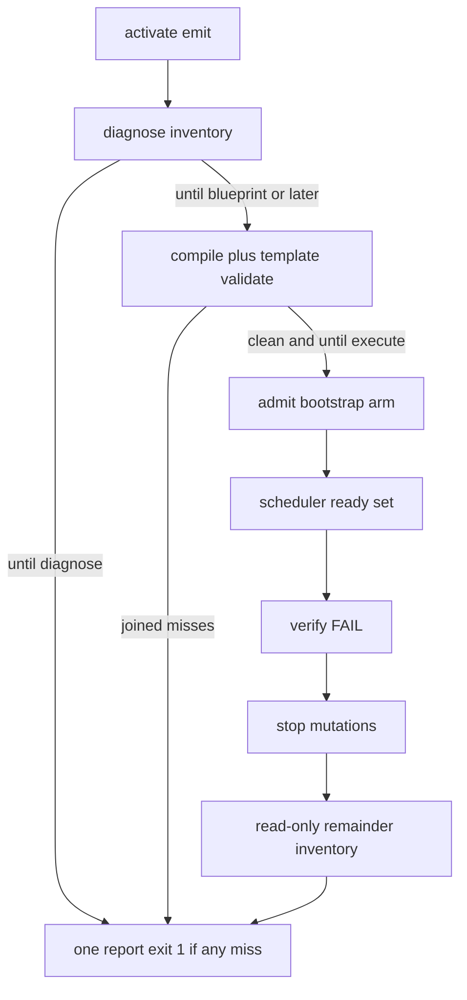

# PE campaign diagnose inventory

Diagnosis-first PE overlay on Cursor-Governance. Land on a **new branch from `origin/main`** in a clean gov worktree (not the dirty primary, not `feat/collect-all-gate-errors`). Do not edit `.claude/skills`. Peer-execution CI keep-going is already on that other branch — out of scope here.

## Why this is the gap

[`run_campaign.py`](/Users/macm2/.cursor-governance/environment/program-execution/scripts/run_campaign.py) `--until blueprint` already stops before admit/bootstrap/execute. It still **first-raises** on compile or template validate, so adapter/conformance/thin-provider/probe misses never appear.

[`compile_campaign_source.py`](/Users/macm2/.cursor-governance/environment/program-execution/scripts/compile_campaign_source.py) already joins schema errors. Later `CompileError` sites are one-at-a-time (`allowlist`, `_semantic_precheck` decisions/tasks, post-write placeholders/template validate).

[`default_execute`](/Users/macm2/.cursor-governance/environment/program-execution/scripts/run_campaign.py) is a serial claim → prepare → **render-contract (writes)** → start → write/commit → verify loop. On verify miss it raises and hides the rest. [`plan_ready_set`](/Users/macm2/.cursor-governance/environment/program-execution/peer_execution/autonomy/scheduler.py) already exists and is unused by that loop.

Kernel lock (Diagnose First): collect all independent evidence in discovery/diagnosis/verification; **stop mutating** on the first unexpected result; run additional **read-only** inspections when competing causes remain plausible. Verdict stays fail-closed.

## Design locks

- **New stage `diagnose`** in `UNTIL_STAGES` after `activate`, before `blueprint`. `--until diagnose` = activate + inventory + stop. `--until blueprint` and later run diagnose first, then compile/validate.
- Inventory calls existing scripts and **joins** results. Never admit, bootstrap, arm, execute, `make pr`, or merge.
- Diagnose compile is **dry / temp-target only**. Do not write `~/.l9/blueprints/<id>` during diagnose. Success-path `--until blueprint` still writes via `compile_source`.
- Probes that write receipts (`probe_execution_adapters.py` default `~/.l9/programs/_adapter-probe`, `probe_executable_peers.py` readiness files) must use a **throwaway `--runtime`**. Honest `BLOCKED` is inventory, not FAIL.
- After verify FAIL: **do not** call `pec render-contract` (it writes `contracts/rendered/`). Use `pec status` (already includes `eligible` / `blockers`) plus in-memory `plan_ready_set`. Do not claim the next task (including TASK-007), do not write, do not open PRs.
- Parallel execute only through `plan_ready_set` + locks + wave membership + **revalidate-before-each-mutation**. Dependent tasks stay serial. `program_control` / `local_write: false` (TASK-007) is `mutation=False` and never claimed.
- No second scheduler. No fail-open continue-after-verify-FAIL execute.

## Work items

### T1 — Collect remaining compile structural misses

File: [`compile_campaign_source.py`](/Users/macm2/.cursor-governance/environment/program-execution/scripts/compile_campaign_source.py)

- Add `collect_compile_errors(source, *, target=None) -> list[str]`.
- After schema join: accumulate allowlist, `_require_auth`, `_semantic_precheck` (today raises per decision/task), and — only if a temp/real target was instantiated — placeholder + `validate_blueprint_artifact` (today slices to `[:5]`; collect **all**).
- `compile_source` still fail-closed: one `CompileError` with `"; ".join(errors)` if the list is non-empty. Do not write the caller target until pre-write errors are empty.
- Tests in [`test_compile_campaign_source.py`](/Users/macm2/.cursor-governance/environment/program-execution/scripts/tests/test_compile_campaign_source.py): fixture with two independent structural misses (e.g. decision without options **and** bad `definition_status`) must raise **once** listing both. Existing single-miss tests stay green.

### T2 — Campaign diagnose inventory (highest leverage)

Files: [`run_campaign.py`](/Users/macm2/.cursor-governance/environment/program-execution/scripts/run_campaign.py), [`Makefile`](/Users/macm2/.cursor-governance/Makefile) `campaign` help, PE README if it lists stages.

- Insert `"diagnose"` into `UNTIL_STAGES`. `normalize_until` / argparse `choices` pick it up.
- Add `run_campaign_diagnose(...)` that records `{id, status, errors}` for:
  - compile schema + `collect_compile_errors` (temp target, no real blueprint write)
  - `validate_blueprint` if a blueprint tree already exists
  - [`validate_execution_adapters.py`](/Users/macm2/.cursor-governance/environment/program-execution/scripts/validate_execution_adapters.py)
  - [`validate_thin_providers.py`](/Users/macm2/.cursor-governance/environment/program-execution/scripts/validate_thin_providers.py)
  - [`run_conformance.py`](/Users/macm2/.cursor-governance/environment/program-execution/scripts/run_conformance.py)
  - [`probe_execution_adapters.py`](/Users/macm2/.cursor-governance/environment/program-execution/scripts/probe_execution_adapters.py) + [`probe_executable_peers.py`](/Users/macm2/.cursor-governance/environment/program-execution/scripts/probe_executable_peers.py) with temp runtime
- Print one inventory; append `diagnose` to `stages_completed`; add `diagnosis` on `CampaignReport`.
- If any check failed: `CampaignError` with the full inventory (exit 1). Do not proceed to compile-write / admit.
- On `--until blueprint` compile/validate miss: run the same remaining collectors, then raise the joined inventory (today’s first `CampaignError` at compile/validate is the hole).
- Tests in [`test_run_campaign.py`](/Users/macm2/.cursor-governance/environment/program-execution/scripts/tests/test_run_campaign.py): `--until diagnose` never calls admit/bootstrap/execute; two injected independent misses both appear; `--until blueprint` `stages_completed` includes `diagnose`. Update existing stage-list assertions (`["activate", "blueprint", ...]` → include `diagnose`).

Operator: `make campaign INTENT=... CAMPAIGN_UNTIL=diagnose`

### T3 — After verify FAIL, diagnose the rest (no execute)

File: `default_execute` in [`run_campaign.py`](/Users/macm2/.cursor-governance/environment/program-execution/scripts/run_campaign.py)

When `pec verify` is not `PASSED_LOCAL`:
1. Stop the mutation loop immediately (no further claim/prepare/start/write/PR).
2. Read-only: `pec status` for other tasks + `plan_ready_set` on a state built from the lock (ready vs deferred reasons).
3. Raise `CampaignError` that includes the failed task verdict **and** the remainder inventory.

Do not call `render-contract`. Do not claim TASK-007. Tests: after a mocked verify FAIL on TASK-001, later tasks are not claimed and the error text lists their status/readiness.

### T4 — Wire execute through existing scheduler

Files: [`run_campaign.py`](/Users/macm2/.cursor-governance/environment/program-execution/scripts/run_campaign.py), [`scheduler.py`](/Users/macm2/.cursor-governance/environment/program-execution/peer_execution/autonomy/scheduler.py) (read-only reuse), new small mapper next to campaign scripts (not a second scheduler).

- Map `program-lock.json` tasks → `ActionSpec`: `depends_on` from task `dependencies` plus predecessor-wave task ids (same rules as [`task_readiness`](/Users/macm2/.cursor-governance/environment/program-execution/core/program-execution-controller-template/scripts/pec/controller.py)); `ResourceLock` keys from writable/source-contract paths + `wave_id`; `mutation=False` when `execution_kind=program_control` or `local_write` is false.
- `default_execute` calls `plan_ready_set(state, ConcurrencyBudget(...))` each wave. Execute only `selected`. Re-read pec status + rebuild state **immediately before each mutation**.
- Serial when `selected` is one task or any selected item depends on another. Parallel only for non-conflicting ready mutations with locks held.
- Verify FAIL still takes T3 path. No new loop that continues execute after unexpected verify.

Tests: two independent ready tasks with disjoint locks can be selected together; a dependent task is deferred; TASK-007-shaped spec is never in a mutation selected set.

### T5 — Docs / root surface

- Document `--until diagnose` and the inventory list next to the `campaign` target.
- One paragraph in PE README: diagnose = discovery+diagnosis; execute still fail-fast on mutation surprise.
- Do not add a new reusable GHA workflow in `l9-ci-core` (frozen seven).

## Out of scope

- Peer-execution CI `!cancelled()` split (already on `feat/collect-all-gate-errors`).
- Continuing `default_execute` after verify FAIL.
- Calling `pec render-contract` in remainder diagnosis.
- New scheduler, fail-open loops, or flipping danger/staged flags.
- Editing `.claude/skills` or the dirty governance primary.
- Always-on `make peer-execution-conformance` (too wide: `agents-env` + extra gates). Diagnose calls the listed scripts only.

## Validation (after user confirms; worktree)

- `python3 -m unittest environment.program-execution.scripts.tests.test_compile_campaign_source environment.program-execution.scripts.tests.test_run_campaign environment.program-execution.peer_execution.autonomy.tests.test_scheduler`
- `make campaign INTENT=<fixture> CAMPAIGN_UNTIL=diagnose` on a fixture with two independent misses → one inventory, exit 1, no admit.
- `make pr-check` on the governance worktree (no commit, no push).

## Execute after confirm

`.plan.md` → `@environment/program-execution` (Program Lock / Controller) → `@autonomy` under that lease. Do not free-form mutate from plan chat. Recommended next skill after planning: `l9-ynp`.

## Stress / rollback

- If diagnose-as-a-stage breaks existing `stages_completed` tests, update those assertions (expected).
- If probe temp-runtime is omitted, diagnose would write `~/.l9/programs/_*-probe` — treat as a test-fail, not optional.
- If scheduler mapping invents lock keys, competing writes can race — fail-closed: missing lock key ⇒ `mutation_lanes=1` (serial) rather than guess.
- Rollback: revert the worktree branch; `UNTIL_STAGES` without `diagnose` restores prior CLI.

## Leverage

Shared root cause: first-raise hides independent misses. Fix once in compile collect + diagnose inventory; remainder diagnosis and scheduler reuse that inventory shape. Do not build a parallel “report aggregator” outside `run_campaign.py`.
