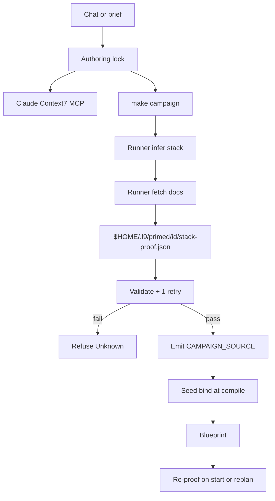

# PE Context7 stack-proof (authoring + admission)

**Target:** [Cursor-Governance](https://github.com/Quantum-L9/Cursor-Governance), not [l9-ci-core](/Users/macm2/l9-ci-core).
**Baseline:** `389b03009b33f614d0b346c8f878d842cbbdc89f` (`origin/main`).
**Write root:** [`$HOME/.l9/gov-worktrees/pe-context7-stack`](/Users/macm2/.l9/gov-worktrees/pe-context7-stack) on `feat/pe-context7-stack` (already clean, tracking `origin/main`). Do **not** write [`~/.cursor-governance`](/Users/macm2/.cursor-governance) (dirty: staged WIP + intent, modified secrets).
**Depth:** deep. **Execute after confirm:** `@environment/program-execution` then `/autonomy` under a Program lease. `autonomous_merge: false`.

## Why this exists

Claude Code already has Context7 (`context7@claude-plugins-official`) and still shows `usageCount: 0`. The skip clause (“purely local repo code”) covers upstream API payloads. A runner-only receipt does not stop chat/`l9-plan` one-liners. A green receipt with a poisoned `CAMPAIGN_SOURCE` (`language_name: "en"`) still compiles today. Both planes are one product.

## Locked laws (do not re-open)

- **Runner owns** infer + fetch + receipt + validation. Agent-written receipts are worthless.
- Infer a tool if the campaign will **call an API**, **call an MCP tool**, **install** a package/binary, or **run on Docker**, plus named products. Empty inferred set on a non-pure-file-edit campaign is **fail**.
- Context7 miss is **not** a skip: search official homepage/docs and **GET that page**. Still miss → **refuse (Unknown)**. No agent-supplied URL exception. Operator may set `docs_url` on the brief; **runner still GETs and validates**; GET fail → refuse.
- Retry: **1 automatic re-fetch per tool, then refuse**.
- Receipt path: **`$HOME/.l9/primed/<id>/stack-proof.json` only**. Do not add a third campaign emit file ([file-set.md](https://github.com/Quantum-L9/Cursor-Governance/blob/main/skills/l9-pe-campaign-activate/references/file-set.md) stays two git files). Collides neither with existing `$HOME/.l9/primed/<id>.activate.yaml`.
- Proof runs **before emit and before blueprint**, including `until=activate`.
- **No live skip env.** Tests inject `Hooks.context7_stack` only. Do not honor `L9_CONTEXT7_STACK=offline` on the live path.
- Claude allow-list + dual server names + closed skip + PreToolUse hard stop: **same change**.
- Secrets never go to Context7 queries.
- Makefile remains append-only. Never `PR_BASE=main`. Never force-push. Never forge Phase 0 `operator_ack`. Never restore `program-execution.intent.v1`. No eighth Core workflow.

## Plane 1 — Authoring lock (Claude must self-serve)

Files (edit in the worktree copies):

- [rules/22-context7-auto-invoke.mdc](/Users/macm2/.cursor-governance/rules/22-context7-auto-invoke.mdc) — name **both** `context7` (Claude plugin) **and** `user-Context7` (Cursor). Delete the skip “purely local repo code” as covering APIs/MCP/install/Docker. Keep the secrets skip.
- [skills/l9-context7-docs/SKILL.md](/Users/macm2/.cursor-governance/skills/l9-context7-docs/SKILL.md) — same dual-server names; replace “continue repo-grounded” / “Pure local/Odoo skip” with: Context7 miss → official docs GET; still miss → stop (Unknown).
- [environment/agents/adapters/claude-code/settings.template.json](/Users/macm2/.cursor-governance/environment/agents/adapters/claude-code/settings.template.json) — add Context7 tools to `permissions.allow` (inspect live Claude plugin names during implement; allow both prefixes if both exist):
  - `mcp__context7__resolve-library-id`, `mcp__context7__query-docs`
  - `mcp__plugin_context7_context7__resolve-library-id`, `mcp__plugin_context7_context7__query-docs` if that is what the plugin emits
- [environment/agents/adapters/claude-code/validate_claude_env.py](/Users/macm2/.cursor-governance/environment/agents/adapters/claude-code/validate_claude_env.py) — fail if those allow entries are missing.
- [environment/agents/adapters/claude-code/hooks/skill_usage_logger.py](/Users/macm2/.cursor-governance/environment/agents/adapters/claude-code/hooks/skill_usage_logger.py) — also log `mcp__*context7*` PreToolUse (metadata only, no prompt/query text).
- New hook: `hooks/context7_stack_pretool.py` on `Edit|Write|NotebookEdit`. **Deny** the first mutation of campaign seeds (`CAMPAIGN_SOURCE.yaml`, `*.activate.yaml`), API client/config, Docker/Compose, or install manifests unless this `session_id` already logged a Context7 MCP call **or** `$HOME/.l9/primed/<id>/stack-proof.json` exists with `status=pass`. Nudge-only additionalContext is not enough (usage is already 0).
- [ops/skill_routing](/Users/macm2/.cursor-governance/ops/skill_routing) — keep `l9-context7-docs` as primary for API/MCP/install/Docker prompts; add cases if missing.
- After merge (operator, not git): `python3 ops/scripts/reconcile_claude_settings.py` so **this machine** `~/.claude/settings.json` picks up the allow-list. Template-only leaves usage at 0.

Then `python3 ops/scripts/sync_generated_artifacts.py --force` so project copies of the rule update. Do not hand-edit `environment/generated/llm-rules/`.

## Plane 2 — Admission lock (runner, not agent)

Insert in [environment/program-execution/scripts/run_campaign.py](/Users/macm2/.cursor-governance/environment/program-execution/scripts/run_campaign.py) **after** `load_activate_seed` / isolate, **before** `compile_activation`, and **before** the `until=activate` early return (today that return is at the `should_run(until, "blueprint")` check ~1467).

Add `Hooks.context7_stack` for tests. Live default calls a new module (suggested): `environment/program-execution/scripts/context7_stack_proof.py`.

### Infer

Scan seed + brief/objective/tasks/validation_commands (not only a `stack_tools` field):

| Signal | Example |
|---|---|
| API | HTTP client, REST/GraphQL host, vendor payload fields |
| MCP | `mcp__`, MCP server names, tool calls |
| Install | pip/npm/uv/brew, `requirements`, `package.json` add |
| Docker | `Dockerfile`, Compose, `docker run` |
| Named product | DataForSEO, Context7, FastAPI, … |

Pure-file-edit exemption is fail-closed: only existing-file edits with **none** of the signals above. “Local repo code” that still talks to an upstream API is **not** exempt.

### Fetch (per inferred tool)

1. Inspect **full current** Context7 library (HTTP client + `CONTEXT7_API_KEY` from existing secrets map; bind exact URLs from official Context7 API docs at implement time — do not guess from memory).
2. If Context7 miss or incomplete for the asked config: web-search official homepage/docs, then **GET and read that page**.
3. If the tool is MCP: inspect **live tool schemas on this host** (Claude plugin cache / Cursor MCP descriptors). MCP ≠ HTTP docs.
4. Operator `docs_url`: still GET + validate; GET fail → refuse.
5. One retry per tool, then refuse.

Missing `CONTEXT7_API_KEY` on the live path is **refuse**, not skip.

### Receipt + validate

Write `$HOME/.l9/primed/<id>/stack-proof.json` with: campaign_id, tools[], source (context7 | official_docs | mcp_schema | docs_url), fetched_at, constraints[] (non-empty per tool), library_ids, page URLs, validator result. Validator requires: every inferred tool present, at least one constraint each, fetch evidence (not empty prose), no secret material. Fail → one re-fetch → fail → `CampaignError` (Unknown).

Tests must prove a **forged** receipt (agent-written, missing fetch evidence) is rejected.

### Seed bind (or the receipt is a museum)

[compile_campaign_source.py](/Users/macm2/.cursor-governance/environment/program-execution/scripts/compile_campaign_source.py) requires a PASS receipt and copies constraints into blueprint evidence.

Contradiction scan (v1, conservative): if seed/task YAML/JSON snippets assign fields that violate extracted constraints (required/mutex/enum/format — DataForSEO fixture: `language_name: "en"` vs docs “English” / `language_code: "en"`), **refuse compile**. Green receipt + poisoned seed must fail a unit test.

### Re-entry

[pec `start_task`](/Users/macm2/.cursor-governance/environment/program-execution/core/program-execution-controller-template/scripts/pec/controller.py) and `replan-activate`: re-infer from the task card / new plan. New API/MCP/install/Docker not in the receipt → re-run stack-proof for those tools or refuse start. Campaign execute already sets `L9_CAMPAIGN_TUNNEL=1`.

## Tests (fail-closed)

New: `environment/program-execution/scripts/tests/test_context7_stack_proof.py` plus extensions to `test_run_campaign.py`, `test_compile_campaign_source.py`, Claude hook/settings tests, Peer Execution Conformance if the gate is a campaign invariant.

Must cover:

- `until=activate` still writes and validates a receipt before return
- empty infer on a non-pure-file-edit seed → refuse
- Context7 miss → official GET; GET miss → refuse
- forged / empty-constraint receipt → refuse
- poisoned `language_name: "en"` + PASS-looking receipt → compile refuse
- live `run_campaign` ignores any offline/skip env
- settings.template contains Context7 allow entries; rule/skill name both servers; skip clause gone
- PreToolUse denies seed/API edit without session Context7 proof

Final: `python3 -m unittest discover` on touched tests, then **`make pr-check`** in the worktree (no commit/push from plan). After PE/rule/skill edits: controller `write_manifest` + `sync_generated_artifacts.py --force`.

## Docs / root surface

| Surface | Action |
|---|---|
| [skills/l9-pe-campaign-activate/references/pipeline.md](/Users/macm2/.cursor-governance/skills/l9-pe-campaign-activate/references/pipeline.md) | update — stack-proof before emit/blueprint |
| [skills/l9-pe-campaign-activate/references/file-set.md](/Users/macm2/.cursor-governance/skills/l9-pe-campaign-activate/references/file-set.md) | update — runtime primed receipt only; still two git campaign files |
| [skills/l9-pe-campaign-activate/SKILL.md](/Users/macm2/.cursor-governance/skills/l9-pe-campaign-activate/SKILL.md) | update — mandatory runner proof |
| [AGENTS.md](/Users/macm2/.cursor-governance/AGENTS.md) | update only if campaign front-door contract changes |
| l9-ci-core workflows / `MANIFEST.sha256` | N/A — wrong repo |
| Makefile | N/A unless a new target is required; prefer no new target |

## Out of scope

- Editing `/Users/macm2/l9-ci-core` product, workflows, or Core `MANIFEST.sha256`
- Writing the dirty `~/.cursor-governance` clone
- Launching [WIP/PE- Memory.md](/Users/macm2/.cursor-governance/WIP/PE-%20Memory.md) or live campaigns from it
- Growing the campaign emit set
- Wiring dormant SDK CLI / eighth Core workflow
- Committing `~/.claude/settings.json` (reconcile after merge)
- Autonomous merge

## Stress / disconfirm

- If allow-list is added but `~/.claude/settings.json` is not reconciled, usage stays 0 — treat reconcile as a required post-merge operator step, not optional.
- If proof runs only before `compile_source`, `until=activate` never hits it — insert before emit **and** before the activate early return.
- If seed bind is “attach notes only”, DataForSEO `language_name: "en"` still ships — contradiction refuse is in scope.
- If a live skip env exists, CI will set it and the gate dies — no live skip env.
- Wrong Context7 library id / SPA/paywall docs: miss after Context7 + GET → refuse, do not invent fields.
- Blast radius: every `make campaign` and Claude first-edit of API/MCP/install/Docker work. Rollback: revert the PR; primed receipts are runtime-only.

## GMP / PE handoff

- **May modify:** PE `run_campaign` + new stack-proof module + compile_source bind; pec start/replan; Claude settings.template + validate + hooks; rule 22; `l9-context7-docs`; activate skill refs; skill routing cases; generated artifacts via official sync; tests; PE/controller manifests via official generators.
- **Must not modify:** l9-ci-core; dirty primary; `PHASE0_USER_CONFIG.yaml` ack timestamps; `program-execution.intent.v1`; campaign emit-set (no third git file); Makefile except append-only if unavoidable; secrets values.
- **Preserved:** one-way Core→SDK; two-file campaign dir; pec tunnel (`L9_CAMPAIGN_TUNNEL`); no Phase 0 forge; `autonomous_merge: false`.
- **Validation:** worktree unit tests for new modules; `make pr-check`; `make agent-check` before declare done.

## Unknowns (bounded)

- Exact Context7 HTTP paths — probe official Context7 API docs at implement (do not hardcode from memory).
- Exact Claude plugin MCP tool prefix — inspect this host’s plugin cache / live tool names at implement; allow all observed Context7 tool names.

## Next skill

After this plan is confirmed: `@environment/program-execution` → Program Lock/Controller → `/autonomy` (`l9-bounded-autonomy`) in the `pe-context7-stack` worktree. Do not free-form mutate from this markdown alone.
