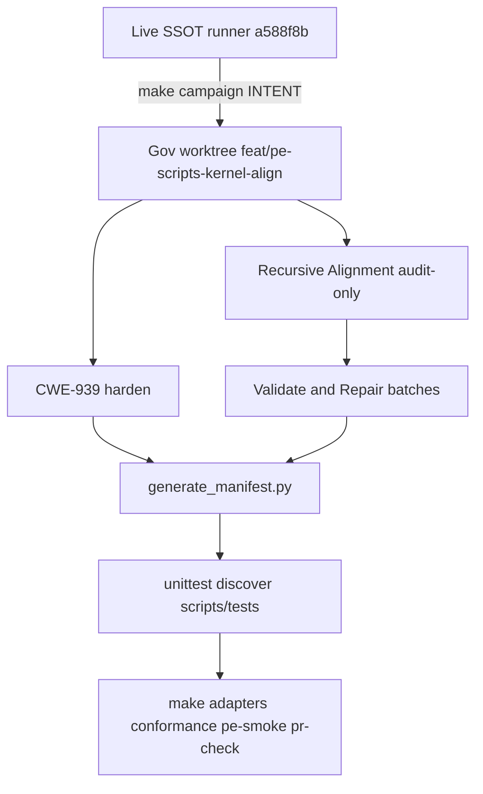

# PLAN: PE scripts kernel align and prove

> **First-class SSOT (git):** `environment/contracts/execution/templates/canonical.template.executable_plan.v1.plan.md`
> **Schema:** `canonical.schema.plan_document.v1` (status: `draft` until t0 preflight holds)
> **Execute:** when status is `executable`, run through **@environment/program-execution** with **@autonomy** / `l9-bounded-autonomy` under a Program lease. Do not free-form mutate from this markdown alone.
> **Law:** executable only when baseline matches, capability probes pass, invariants match, and envelope is respected.

## Plan Validate and Repair receipt (this pass)

Applied [Validate & Repair.md](.cursor-commands/kernels/Validate%20&%20Repair.md) to **this plan file**, not yet to the PE scripts. Mode: `bounded_repair` of the plan artifact.

| finding_id | type | severity | status | evidence | repair |
|---|---|---|---|---|---|
| P-VR-01 | alignment_gap | High | Resolved | PE template required Execute via, metadata, envelope tables, DAG, SP/EV matrix, campaign packet; prior body omitted them | Sections filled below |
| P-VR-02 | incomplete_behavior | High | Resolved | Frontmatter todos lacked phase, depends_on, evidence refs | Fields added |
| P-VR-03 | validation_quality | High | Resolved | kernel_pass missing; validate_plan_kernel_receipt would FAIL | kernel_pass stamped |
| P-VR-04 | alignment_gap | Medium | Resolved | "After approval" claimed plan mode could not fill PE sections; this file is the deliverable | This file is the PE-shaped plan; PLAN_DOCUMENT JSON emit stays inside t0 |
| P-VR-05 | incomplete_behavior | Medium | Resolved | t4 "only if T1 proved" left Makefile authorization Unknown | Default: no Makefile write; Wave A Critical/High naming that target is the only grant |
| P-VR-06 | validation_quality | Medium | Open | PLAN_DOCUMENT JSON not yet passed through validate_plan_document.py | t0 emits and validates it; plan status stays draft until then |
| P-VR-07 | incomplete_behavior | Low | Open | Improve.md was not a separate kernel run; improve.deltas record the prior plan iterations on this slug | Accept as prior-iteration Improve; do not invent a second Improve pass |

`execution_mode:` bounded_repair (plan artifact)
`status:` PartiallySucceeded (plan complete enough to execute t0; scripts work not started)
`convergence:` NotConverged for the script corpus. Plan-artifact V&R is Converged except P-VR-06 (blocked on t0).

## Execute via @environment/program-execution + autonomy (required)

**Authority order (fail-closed — see `environment/agents/PEER_EXECUTION.md`):**

```text
this .plan.md
        │ project
        ▼
@environment/program-execution
  Blueprint → Program Lock → Controller admit/claim/render/verify/handoff
        │ lease (narrow-never-widen)
        ▼
root autonomy/  +  @autonomy (/autonomy → l9-bounded-autonomy)
        │
        ▼
Peer Execution Core -> cursor-foreground
```

Program leases are authoritative. Autonomy leases must not outlive the Program lease. Never invent a second scheduler. Never widen Blueprint ceilings via the campaign packet.

### Pipeline steps

```bash
make -C "$HOME/.cursor-governance" campaign INTENT=<activate.yaml>
```

Runner: **live** `~/.cursor-governance` at locked SHA `a588f8b23212b176861dc5abf9f1172536943c77`.
Target: dedicated worktree `$HOME/.l9/program-worktrees/pe-scripts-kernel-align` on `feat/pe-scripts-kernel-align`.
Do not hand-run `pec.py bootstrap` or inner compile scripts as a substitute. Do not mutate sealed `environment/program-execution/core/` templates.

If the runner exits nonzero, stop and report.

### Adapter routing

Interactive local repair: `cursor-foreground`. Verification: worktree `make` / `unittest` (foreground). Remote PR/merge: forbidden in this campaign (local_commit_only).

### Campaign authorization packet (subordinate to Program Lock)

```yaml
packet_id: autonomy-2026-08-21-pe-scripts-kernel-align
authority: A4_CAMPAIGN_BOUNDED_EXTERNAL_WRITE
profile: pr-convergence
authority_profile: program_controller_bound
autonomous_merge: false
plan_ref: /Users/ib-mac/.cursor/plans/pe_scripts_kernel_align_89cc0e12.plan.md
plan_id: plan.program-execution.pe-scripts-kernel-align.v1
schema_ref: canonical.schema.plan_document.v1
program_execution:
  root: environment/program-execution
  program_id: pe-scripts-kernel-align-v1
  blueprint_ref: $HOME/.l9/programs/pe-scripts-kernel-align-v1/blueprint
  runtime_ref: $HOME/.l9/programs/pe-scripts-kernel-align-v1/runtime
  provider_ref: cursor-foreground
  execution_profile_ref: worker-default
  autonomy_provider_id: root-autonomy-control-plane
declared_prs: []
declared_branches: [feat/pe-scripts-kernel-align]
allowed_inside_packet:
  - execute_rendered_contract_only
  - execute_plan_todos_inside_envelope
  - commit_scoped_on_declared_branch
forbidden_inside_packet:
  - widen_blueprint_or_task_card_ceiling
  - mutate_without_program_lease
  - outlive_program_lease
  - merge_outside_l4_plan_build_stack
  - force_push
  - admin_merge
  - expand_scope
  - commit_secrets
  - weaken_tests_for_green
  - direct_graphiti_task_claim
  - push_or_open_pr_before_release_authorized
  - spawn_l9-pr-remediation
created_by: "/autonomy+program-execution"
```

### Phase-0 action table to PE Task Cards

| id | pe_task_id | wave | depends_on | mutation | lock_keys | isolation_key | kind | adapter_hint |
|---|---|---|---|---|---|---|---|---|
| t0-isolate-baseline | TASK-001 | W0 | [] | false | repo:HEAD | preflight | work | cursor-foreground |
| t1-recursive-alignment | TASK-002 | W1 | [t0] | false | path:scripts | inspect | work | cursor-foreground |
| sec-cwe939-urlopen | TASK-003 | W1 | [t0] | true | path:context7_stack_proof.py | mutate-sec | work | cursor-foreground |
| t2-repair-front-door | TASK-004 | W2 | [t1] | true | path:run_campaign+input+compile+replay | mutate-front | work | cursor-foreground |
| t3-repair-gates | TASK-005 | W2 | [t1] | true | path:validate_*+probes | mutate-gates | work | cursor-foreground |
| t4-repair-runtime-rest | TASK-006 | W2 | [t1] | true | path:pe_*+helpers+clis | mutate-runtime | work | cursor-foreground |
| t5-manifest-and-prove | TASK-007 | W3 | [sec,t2,t3,t4] | true | path:MANIFEST.json | validate | work | cursor-foreground |

**Spawn rules:** PE `claim`/`render` first for mutation rows. Autonomy must not bypass wave order. `program_lock_stale_or_invalid` → stop.

**Stop / do not execute when:** plan status is not `executable`; Blueprint not accepted; Program Lock drift; capability preflight blocked; DAG cyclic; envelope incomplete; blocking unknowns remain; autonomy lease expired.

## Metadata

| Field | Value |
|---|---|
| plan_id | `plan.program-execution.pe-scripts-kernel-align.v1` |
| name | PE scripts kernel align |
| schema_version | `1.0.0` |
| status | `draft` |
| is_project | `false` |
| owner | founder / cursor |
| created_at | `2026-08-21` |
| updated_at | `2026-08-21` |
| depth | `deep` (`route_plan.py --risk high --evidence partial`) |

## Architect framing

| Field | Value |
|---|---|
| planning_ssot | `environment/program-execution/README.md` + `validation/VALIDATION.md` + `environment/agents/PEER_EXECUTION.md` |
| plan_class | `remediation_plan` |
| redesign_allowed | `false` |
| follow_on_schema_evolution_separate | `true` |
| framing_notes | Kernel-align and prove existing PE scripts. No new PE features. No CEG product work. |

## Immutable baseline

| Field | Value |
|---|---|
| captured_at | `2026-08-21T01:21:00-04:00` |
| repository | `Quantum-L9/Cursor-Governance` |
| workspace | do not use `/Users/ib-mac/Cognitive.Engine.Graphs` |
| ssot_clone | `/Users/ib-mac/.cursor-governance` (runner only; do not mutate) |
| branch | `feat/pe-scripts-kernel-align` (create from origin/main; do not ask) |
| commit_sha | `a588f8b23212b176861dc5abf9f1172536943c77` |
| dirty | SSOT `false`. CEG checkout `true` (out of scope). |
| overlap_policy | `require_clean_tree` on the governance worktree |
| verification_rule | `reverify_at_execution_start` |
| on_drift | `stop_and_replan` |
| allowed_local_dirt | none on the worktree |

CEG dirt (`AGENTS.md`, `CLAUDE.md`, `Makefile`, deleted `.claude/rules/*`) is **not** allowed_local_dirt. It is a reason to refuse this CEG checkout as the mutation workspace.

## Objective

### Mission

Make the bound PE scripts corpus complete, contract-aligned, hardened, and proven against its designed Make/CLI gates. Preserve `make campaign` as the only live front door. Isolate mutation so the live SSOT campaign runner cannot be half-repaired under itself.

`optimized` means kernel leverage: root-cause repair, remove proven duplication, close required validation gaps. It does not authorize a performance rewrite of `run_campaign.py` or new PE features.

### Success properties

| id | property | evidence_type | proof | blocking |
|---|---|---|---|---|
| SP-01 | Worktree HEAD equals locked SHA at t0 start | `repository_state` | `git rev-parse HEAD` == `a588f8b23212b176861dc5abf9f1172536943c77` | true |
| SP-02 | `default_fetch` refuses `file://`, `http://`, and non-https redirects; `requests` not added | `runtime_behavior` | `python3 -m unittest` on `scripts/tests/test_context7_stack_proof.py` PASS; `rg requests` on that module empty | true |
| SP-03 | Zero unresolved Critical/High in-scope V&R findings on scripts | `proof_receipt` | Wave B YAML report readiness Succeeded or remaining findings Low/accepted | true |
| SP-04 | Live SSOT HEAD unchanged | `repository_state` | `git -C ~/.cursor-governance rev-parse HEAD` == locked SHA until a later authorized publish | true |
| SP-05 | RA report inventories every bound script | `filesystem` | YAML report `convergence_status` in {Converged, Partial}; every script classified | true |
| SP-06 | All scripts/tests pass | `runtime_behavior` | `python3 -m unittest discover -s environment/program-execution/scripts/tests -p 'test_*.py'` exit 0 | true |
| SP-07 | Designed PE make gates pass | `quality_gate` | `make program-execution-adapters program-execution-conformance program-execution-campaign-brief program-execution-campaign-compile program-execution-campaign-promotion pe-smoke` exit 0 | true |
| SP-08 | PLAN_DOCUMENT validates | `structural` | `python3 skills/l9-plan/scripts/validate_plan_document.py <plan.json>` PASS | true |
| SP-09 | `make campaign` input routing unchanged unless a Confirmed contract defect | `structural` | `campaign_input` classify cases in `test_run_campaign.py` still pass | true |
| SP-10 | Governance `make pr-check` PASS; no push/PR/merge | `quality_gate` | `OPEN_PR=0 make pr-check` in the worktree PASS; no remediator | true |

## Capability preflight

| Field | Value |
|---|---|
| preflight_id | `preflight.plan.program-execution.pe-scripts-kernel-align.v1` |
| source_ref | this plan_id |
| phase_id | `preflight` |
| blocking | `true` |
| baseline_verified | pending (t0) |
| drift_detected | unknown until t0 |

### Probes

| id | capability | command_or_action | pass_criteria | blocking |
|---|---|---|---|---|
| CP-01 | `branch_and_HEAD_resolution` | `git -C ~/.cursor-governance rev-parse HEAD` | equals locked SHA | true |
| CP-02 | `command_available` | `make`, `python3`, `git` on PATH | each exits 0 for `--version` or `-h` | true |
| CP-03 | `filesystem_write` | worktree path writable; SSOT not the write root | worktree exists via `worktree_add_wired.sh`; SSOT remains clean | true |
| CP-04 | `urlopen_uniqueness` | already probed 2026-08-21 | only `context7_stack_proof.py:135` | false (Closed) |

## Execution envelope

### Filesystem

- **write_allow:**
  - `environment/program-execution/scripts/**`
  - `environment/program-execution/MANIFEST.json` (regenerate only via `scripts/generate_manifest.py`)
  - `environment/program-execution/README.md` (only if a documented command or script responsibility changes)
  - Governance root `Makefile` only when Wave A records a Critical or High finding that names `program-execution-scripts-test` as the required close (append-only; do not rewrite existing recipes)
- **write_deny:**
  - live `~/.cursor-governance` working tree
  - CEG engine, chassis, domains, dirty CEG `AGENTS.md` / `CLAUDE.md` / `Makefile` / `.claude/`
  - `environment/program-execution/core/**`
  - `environment/program-execution/peer_execution/**` (inspect-only)
  - `environment/program-execution/adapters/**`
  - `environment/program-execution/campaigns/**` content except this program's activate seed if created under campaigns policy
  - nested script trees: `core/scripts/`, controller-template `scripts/`, `campaigns/scripts/`
- **delete_allow:** none unless a Confirmed dead artifact inside write_allow is proven unused

### Commands

- **allow:** `git worktree` via `worktree_add_wired.sh`; `python3`; `make` targets listed in SP-07 and SP-10; `unittest` / `pytest` on `scripts/tests`; `validate_plan_document.py`; `generate_manifest.py`; `validate_manifest.py`
- **deny:** `git push`, `gh pr create`, `make pr` with `OPEN_PR=1` during the campaign; force-push; hard-reset; `L9_PE_RELEASE_AUTHORIZED` unset publish; remediator spawn; secret echo

### Network

| Field | Value |
|---|---|
| mode | `none` for repair. `named_services_only` only if a test must hit Context7; prefer injected `fetch` fakes |
| allowed_services | none required |

### Secrets

| Field | Value |
|---|---|
| access | `none` (CONTEXT7_API_KEY must not be required for unit tests; live fetch path already refuses a missing key) |
| redaction_required | `true` |

### Autonomous merge

`autonomous_merge:` `false`

## Side effects and idempotency

| todo_id | side_effects | idempotency | retry | compensation | irreversible |
|---|---|---|---|---|---|
| t0-isolate-baseline | `filesystem_mutation` (worktree create) | `safe_with_dedupe` | `manual_only` | `git worktree remove` | false |
| t1-recursive-alignment | `filesystem_mutation` (evidence YAML under `$HOME/.l9/programs/...`) | `safe_to_repeat` | `retry_once` | delete evidence file | false |
| sec-cwe939-urlopen | `filesystem_mutation` | `safe_with_dedupe` | `manual_only` | restore those two files | false |
| t2-repair-front-door | `filesystem_mutation` | `safe_with_dedupe` | `manual_only` | restore scoped scripts | false |
| t3-repair-gates | `filesystem_mutation` | `safe_with_dedupe` | `manual_only` | restore scoped scripts | false |
| t4-repair-runtime-rest | `filesystem_mutation` | `safe_with_dedupe` | `manual_only` | restore scoped scripts | false |
| t5-manifest-and-prove | `filesystem_mutation` (MANIFEST.json) | `safe_to_repeat` (regenerate) | `retry_once` | regenerate or restore MANIFEST.json | false |

## Architecture impact

| todo_id | bounded_context | layer | owning_contract | prohibited |
|---|---|---|---|---|
| sec-cwe939-urlopen | PE stack-proof fetch | `assurance` | `l9.program-execution.stack-proof.v1` | adding `requests`; changing Context7 API constants |
| t2-repair-front-door | campaign front door | `control_plane` | PE README campaign input routing | new front-door kinds; calling `default_*` as a public API |
| t3-repair-gates | PE make gates | `assurance` | VALIDATION.md | weakening empty-gate-set fail-closed |
| t4-repair-runtime-rest | prepare/worker helpers | `runtime` | PREPARE_BASELINE.md / README worker contract | new worker scheduler |
| t5-manifest-and-prove | adapter-layer manifest | `assurance` | `program-execution-adapter-layer.manifest.v1` | hand-editing MANIFEST.json |

## Rollback

| Field | Value |
|---|---|
| rollback_id | `rollback.plan.program-execution.pe-scripts-kernel-align.v1` |
| supported | `true` |
| automatic_allowed | `false` |
| approval_required | `true` |
| trigger_conditions | baseline drift; blocking SP fail; envelope breach; SSOT dirtied |

### Strategies

| domain | mode | notes |
|---|---|---|
| code | `git_restore_scoped_paths` | worktree write_allow only |
| data | `none` | no product DB |
| external_state | `none` | no PR opened in-campaign |
| local_state | `git_restore_scoped_paths` | `git worktree remove` + delete feature branch; SSOT untouched |

### Irreversible operations

none

### Rollback verification

- `git -C ~/.cursor-governance status --porcelain` empty
- `git -C ~/.cursor-governance rev-parse HEAD` == locked SHA
- worktree path absent after remove

## Complexity and uncertainty

| Field | Value |
|---|---|
| complexity | `high` |
| uncertainty | `medium` |
| blast_radius | `high` (every consumer `make campaign`) |
| architectural_boundaries_crossed | `1` (scripts to MANIFEST.json) |
| external_systems_touched | `0` in-campaign |
| migration_required | `false` |
| unknown_dependency_count | `1` (P-VR-06 PLAN_DOCUMENT validator PASS) |

## Target binding (scripts)

**Modification scope (31 modules + tests):**

`accept_blueprint.py`, `adapter_cli.py`, `apply_repository_alignment.py`, `blueprint_ops.py`, `campaign_input.py`, `campaign_pr_copy.py`, `collect_evidence.py`, `compile_campaign_source.py`, `context7_stack_proof.py`, `generate_manifest.py`, `launchability.py`, `pe_prepare_state.py`, `pe_timing.py`, `pe_trace.py`, `pe_worker.py`, `peer_execution_cli.py`, `probe_executable_peers.py`, `probe_execution_adapters.py`, `provider_loader.py`, `render_adapter_matrix.py`, `render_capability_index.py`, `replay_campaign.py`, `router.py`, `run_campaign.py`, `run_conformance.py`, `run_parity_gate.py`, `run_peer_task_pipeline.py`, `validate_campaign_promotion.py`, `validate_execution_adapters.py`, `validate_manifest.py`, `validate_thin_providers.py`, `__init__.py`, plus `scripts/tests/`.

**Required coupled write:** regenerate `environment/program-execution/MANIFEST.json` with `scripts/generate_manifest.py` after any script change.

**Inspect-only:** `peer_execution/`, `registry/`, `adapters/`, `core/` (sealed), `campaigns/` content.

## Pinned finding — CWE-939 (Confirmed, High)

Scanner: `context7_stack_proof.py` line 135 `urllib.request.urlopen`.

`default_fetch` has no scheme allowlist. urllib supports `file://`. `official_docs_fetch` requires an `https://` prefix, and Context7 URLs are constants, but `urlopen` follows redirects, so an `https://` `docs_url` can 302 to `file://` and leak into `stack-proof.json`.

Repair: https-only parse in `default_fetch`; redirect handler re-validates https; keep stdlib urllib; do not add `requests`; add the three tests named in the prior pin.

**Uniqueness Confirmed by probe 2026-08-21.** Grep of `scripts/` for `urlopen`, `urllib.request`, `Request(`, `httpx.`, `requests.(get|post)`, `urlretrieve`, `FancyURLopener`, `build_opener` hit only this file. Wave A does not re-prove that fact.

## Designed operation

```bash
make -C "$HOME/.cursor-governance" campaign INTENT=<brief.md|activate.yaml>
```

Mandatory gates: `program-execution-adapters`, `program-execution-conformance`, `program-execution-probe`, `peer-execution-probe`, `program-execution-campaign-brief|compile|promotion`, `pe-smoke`, `peer-execution-conformance`, worktree `make pr-check`.

Coverage fact: 15 test modules exist. Make does not run all of them. Default close is `unittest discover` in t5, not a Makefile rewrite.



## Kernel sequence (script corpus)

**Wave A — Recursive Alignment (`audit_only: true`)** after t0. Do not implement. Do not reopen urlopen uniqueness.

**Wave B — Validate and Repair (`full_readiness` + `commit_readiness`)** on Confirmed findings only, order: security → entrypoints → required gaps → contracts → correctness → validation gaps → docs.

1. `sec-cwe939-urlopen` (may run in parallel with Wave A after t0)
2. Front door (after Wave A)
3. Gates (after Wave A)
4. Runtime helpers and remaining CLIs (after Wave A)
5. Manifest + prove (joins 1–4)

## Execution DAG

| id | owner | layer | depends_on | outputs |
|---|---|---|---|---|
| t0-isolate-baseline | agent | assurance | [] | worktree, baseline_receipt, PLAN_DOCUMENT PASS |
| t1-recursive-alignment | agent | assurance | [t0-isolate-baseline] | RA YAML |
| sec-cwe939-urlopen | agent | assurance | [t0-isolate-baseline] | hardened fetch + tests |
| t2-repair-front-door | agent | control_plane | [t1-recursive-alignment] | front-door repairs |
| t3-repair-gates | agent | assurance | [t1-recursive-alignment] | gate repairs |
| t4-repair-runtime-rest | agent | runtime | [t1-recursive-alignment] | helper/CLI repairs |
| t5-manifest-and-prove | agent | assurance | [sec-cwe939-urlopen, t2-repair-front-door, t3-repair-gates, t4-repair-runtime-rest] | MANIFEST.json, gate receipts |

**Critical path:** t0 → t1 → t2 → t5 (t3/t4 parallel with t2 after t1; sec-cwe939 parallel with t1 after t0).

**Forbidden edges:** mutate SSOT; t2/t3/t4 before t1; t5 before any open mutate todo; push/PR before release authorization.

## Property evidence matrix

| evidence_id | claim_id | evidence_kind | command | expected_positive | status |
|---|---|---|---|---|---|
| EV-SP-01 | SP-01 | `repository_state_evidence` | `git rev-parse HEAD` in worktree | locked SHA | `not_run` |
| EV-SP-02 | SP-02 | `runtime_behavior_evidence` | unittest `test_context7_stack_proof` | PASS; no requests import | `not_run` |
| EV-SP-03 | SP-03 | `proof_receipt` | Wave B YAML | no open Critical/High | `not_run` |
| EV-SP-04 | SP-04 | `repository_state_evidence` | `git -C ~/.cursor-governance rev-parse HEAD` | locked SHA | `not_run` |
| EV-SP-05 | SP-05 | `filesystem` | RA YAML exists | all 31 scripts classified | `not_run` |
| EV-SP-06 | SP-06 | `runtime_behavior_evidence` | unittest discover `scripts/tests` | exit 0 | `not_run` |
| EV-SP-07 | SP-07 | `quality_gate_evidence` | listed make targets | exit 0 | `not_run` |
| EV-SP-08 | SP-08 | `structural_evidence` | `validate_plan_document.py` | PASS | `not_run` |
| EV-SP-09 | SP-09 | `runtime_behavior_evidence` | `test_run_campaign.py` routing cases | PASS | `not_run` |
| EV-SP-10 | SP-10 | `quality_gate_evidence` | `OPEN_PR=0 make pr-check` | PASS | `not_run` |

## Stress and disconfirm

### Disconfirming cases

- Wave A finding's root cause sits in `peer_execution/` or sealed `core/` → stop and replan; do not absorb those trees.
- Live SSOT `make campaign` cannot drive the worktree → isolation model is wrong; fix wiring; do not edit SSOT in place.
- A repair changes `make campaign` input routing without a Confirmed contract defect → unauthorized contract change; revert.
- Tests go green via skips or weakened asserts → plan failed (rule 95).
- Worktree is created as a second checkout of CEG → wrong repository; stop.

### Assumption failure conditions

- SSOT SHA drifts from `a588f8b23212b176861dc5abf9f1172536943c77`
- Dirty CEG tree is used as write_allow
- `validate_plan_document.py` FAIL after t0 emit (P-VR-06)

### Blast radius notes

Every consumer workspace's `make campaign`, PE conformance, and peer probe. A broken `run_campaign.py` in SSOT would halt all campaigns; that is why SSOT stays frozen.

### Rollback constraints

No force-push. No history rewrite. No PR to close because none is opened in-campaign.

## Out of scope

- CEG engine, chassis, domains, this checkout's dirty `.claude/` / `AGENTS.md` / `CLAUDE.md` / `Makefile`
- Nested PE script trees listed in write_deny
- Sealed `core/` template mutation
- `peer_execution/` implementation
- New PE features, provider adapters, unrelated campaign seeds
- Performance rewrite of prepare/campaign beyond re-running `pe_prepare_bench.py` if prepare scripts actually change
- Push, PR, merge, remediator, deploy
- Editing live SSOT via the CEG `.cursor-commands` symlink
- Adding the `requests` library
- Re-proving urlopen uniqueness in Wave A

## Follow-on milestone

| Field | Value |
|---|---|
| separate_plan_required | `true` |

| priority | change | why |
|---|---|---|
| P1 | Authorized `PR_REMEDIATE=0 make pr` from the worktree | Publication is a release transition, not a campaign stage |
| P2 | Makefile `program-execution-scripts-test` if Wave A did not already authorize it | Keep discover-all coverage after this program |

## Convergence

| Field | Value |
|---|---|
| convergence_id | `conv.plan.program-execution.pe-scripts-kernel-align.v1` |
| current_state | `draft` |
| implementation_ready | `false` until t0 preflight + SP-08 PASS |

### Gates

- **executable_when:** CP-01..CP-03 pass; worktree clean at locked SHA; PLAN_DOCUMENT PASS; DAG acyclic; envelope complete
- **complete_when:** EV-SP-01..EV-SP-10 `passed`; write_deny respected; SSOT still at locked SHA
- **blocking_conditions:** preflight_blocked; envelope breach; baseline drift; failed blocking SP

### Blockers / unknowns

| kind | id | note | resolution |
|---|---|---|---|
| unknown | P-VR-06 | PLAN_DOCUMENT JSON not yet validator-PASS | t0 emit + `validate_plan_document.py` |
| closed | U-urlopen | uniqueness | probe 2026-08-21 |

### Next

| Field | Value |
|---|---|
| next_convergence_gate | `draft` → `execution_ready` (after t0) → `executing` → `converged` |
| minimum_safe_next_action | Approve execute; run t0 isolate + PLAN_DOCUMENT validate; do not free-form mutate scripts from chat |
| execute_via | `@environment/program-execution` → Program Lock/Controller → `@autonomy` under Program lease → `cursor-foreground` |
| next_skill | `l9-ynp` recommends `/autonomy` + PE; not `/gmp` |

## Doc / root surface

- `environment/program-execution/README.md`: update only if a documented command or script responsibility changes
- Governance `Makefile`: default no change; append-only only under the Wave A grant above
- CEG docs: N/A
- Kernel YAML reports: `$HOME/.l9/programs/pe-scripts-kernel-align-v1/` only
