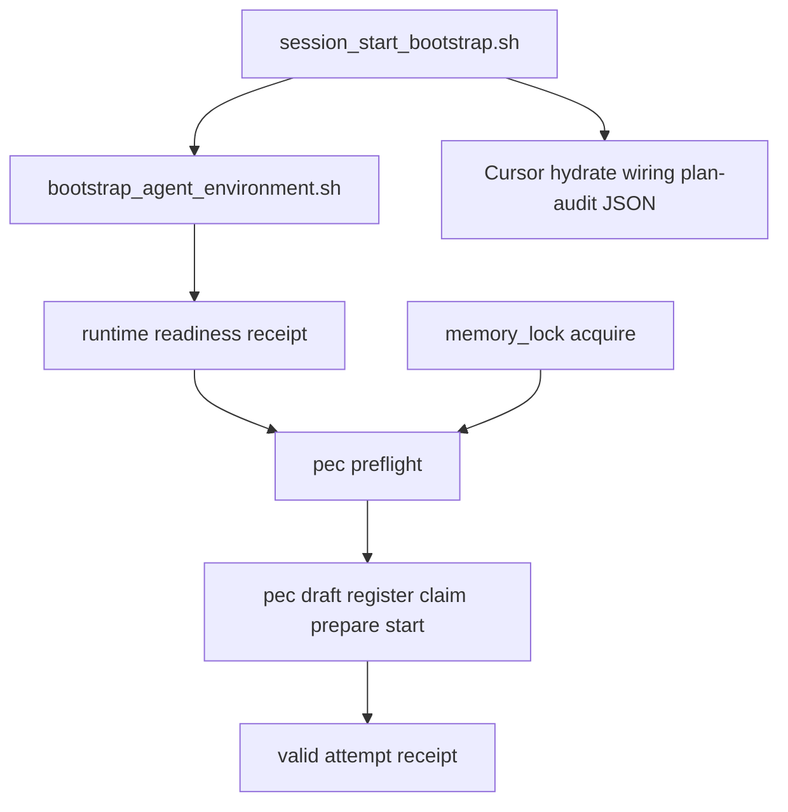

# PLAN: Make Program Execution start cleanly (T1–T6)

> **Status:** `executable` after W0 SHA re-verify. **plan_id:** `plan.pe.start-cleanly.t1-t6.v2`
> **Supersedes** `~/.cursor/plans/pe_start_cleanly.plan.json` for execution detail. That JSON remains the validated depth-gate draft.
> **This work is not a campaign.** `pec` is the product under test (T4–T6), not a wrapper that instantiates campaign sources for this change.
> **Execute:** ordinary L4 stacked commits on a new worktree from `origin/main`. Do not free-form mutate the dirty primary checkout.

## Execute via ordinary L4 (required)

```text
new worktree from origin/main @ ab46dc86
  → W0 re-verify SHA
  → T1→T6 local commits only
  → kernels/Recursive Alignment.md then kernels/Validate & Repair.md
  → python3 ops/autonomy/l4_local.py begin/record-kernels/authorize-release
  → PR_REMEDIATE=0 make pr
  → human merge only
```

MUST NOT: open campaign PRs, write `environment/program-execution/campaigns/`, spawn `l9-pr-remediation`, merge, force-push, or mix this onto an unrelated dirty branch.

## Architect framing

- **plan_class:** `remediation_plan`
- **redesign_allowed:** `false`
- **planning_ssot:** this file + landed #168/#169/#170 on `origin/main`
- **follow_on_schema_evolution_separate:** `true` (do not invent a parallel error taxonomy)

## Immutable baseline

- **repository:** `Quantum-L9/Cursor-Governance`
- **commit_sha:** `ab46dc8658daa125a7784ef3a94d3fe3059c0c4d`
- **contains:** #168 shared bootstrap, #169 publish-path/pre-commit, #170 capability plane
- **overlap_policy:** `require_clean_tree` in a dedicated worktree
- **on_drift:** `stop_and_replan`
- **verification_rule:** `git rev-parse HEAD` MUST equal the locked SHA (or a descendant that still contains those three merges) at W0 and again before first mutate
- **stale worktree:** `/Users/ib-mac/Cursor-Governance-wt-pe-start` is Unknown/stale if still at `136f38c`. Recreate; do not rebase foreign WIP onto it

## Objective

Make the next Cursor PE session reach a valid `pec start` + attempt receipt without rediscovering runtime prerequisites through command failures. Close only the six remaining seams. Preserve Graphiti, controller admission, and root-file gates.

### Success properties

- **SP-01** `repository_state` — W0 HEAD is `ab46dc8658daa125a7784ef3a94d3fe3059c0c4d` or a descendant containing #168+#169+#170. Blocking.
- **SP-02** `structural` — live path of `session_start_bootstrap.sh` (before any `exit 0`) invokes `ops/scripts/bootstrap_agent_environment.sh --surface cursor`. A test MUST fail if that call edge is removed. Blocking.
- **SP-03** `filesystem` — one `l9.agents.runtime-readiness.v1` receipt exists after shared bootstrap; required fields are present; missing values are the string `UNKNOWN`, never omitted. Blocking.
- **SP-04** `runtime_behavior` — mixed unverified revisions set receipt `overall_status=NOT_READY` and `pec preflight` refuses mutating commands. Blocking.
- **SP-05** `runtime_behavior` — lock acquire and mutation gate use the same `session_id`, workspace root, and graphiti-state file; mismatch prints both identities. Matching acquire then gate MUST allow. Blocking.
- **SP-06** `runtime_behavior` — `pec preflight` returns `ready` / `blockers` / `next_action.{command,args}` for each listed friction state without first failing `claim` or `register-contract`. Blocking.
- **SP-07** `runtime_behavior` — `draft-contract` on `make_blueprint()` is accepted unchanged by `register-contract`; a Blueprint whose `source.rollback.strategy` is missing or contains `REPLACE_WITH` makes draft fail. Blocking.
- **SP-08** `runtime_behavior` — `test_pe_clean_startup.py` reaches `start` and records a schema-valid attempt receipt via `helpers.run_cli` / real `pec.py`. Blocking.
- **SP-09** `quality_gate` — `make pr-check` PASS on the new branch. Blocking.

## Capability preflight (W0)

- **CP-01** `git rev-parse origin/main` equals locked SHA (or documented descendant). Blocking.
- **CP-02** `rg bootstrap_agent_environment.sh ops/hooks/session_start_bootstrap.sh` is empty on the bound tip (gap still present). Blocking.
- **CP-03** Worktree is clean and is not the dirty primary checkout. Blocking.
- **CP-04** Shared script exists at `ops/scripts/bootstrap_agent_environment.sh` (landed #168). Blocking.

Failed blocking probe → status `preflight_blocked`. Do not mutate.

## Desired path

```text
Cursor sessionStart
  → shared bootstrap --surface cursor --quiet
  → runtime readiness receipt
  → one Graphiti session identity
  → pec preflight (exact next_action)
  → draft (valid) → register → claim → prepare → render → start
  → valid attempt receipt
```



## Do not redo

- Recreate [`ops/scripts/bootstrap_agent_environment.sh`](ops/scripts/bootstrap_agent_environment.sh) or Claude `install.sh` delegation (#168)
- Pre-commit provision, publish-path probe, surface-gated wiring (#169)
- Secrets capability plane, broker, `.mcp.json` bearer removal (#170)
- A second bootstrap script or second PE CLI
- Campaign sources, task cards, ledgers
- Weaken Graphiti gates, `GRAPHITI_WRITE_GATES`, or controller schemas
- Rewrite root `Makefile`, `pyproject.toml`, `.mcp.json`, `CANONICAL_LAW.md`

## Contracts (MUST / MUST NOT)

### Shared ownership

- Generic hydration (uv, scratch_hold, checkers, capabilities, repo identity, shared excludes, publish-path probe) MUST live only in `bootstrap_agent_environment.sh`.
- Cursor sessionStart MUST keep tip activation, hook self-heal, IDE profile, consumer symlink wiring, Graphiti hydrate/orchestrator, plan audit, COMBINED `additional_context` JSON, and the `exit 0` hook contract.
- `pec` MUST remain the only PE controller CLI. Preflight is a new subcommand, not a new package.

### Error codes

Reuse [`ERROR_TAXONOMY.yaml`](environment/program-execution/core/shared/ERROR_TAXONOMY.yaml) and exact `task_readiness()` blocker strings.

- Receipt mixed revision → `REVISION_MISMATCH` (add this one line to the YAML if absent)
- Lock/gate identity skew → `LOCK_IDENTITY_MISMATCH` (add this one line if absent)
- Stale program lock → existing `PROGRAM_LOCK_STALE`
- Bad draft/register → existing `DEFINITION_INVALID` / `AUTHORIZATION_INFLATION`
- Dirty/unreconciled repo → existing `REPOSITORY_STATE_DRIFT`

MUST NOT invent `POLICY_REJECTION` or `RUNTIME_NOT_READY` as a parallel taxonomy. MUST NOT add a second error file.

### Secrets

Receipts, preflight JSON, and tests MUST NOT contain secret values. T6 MUST set `L9_RUNTIME_ROOT` to a temp dir and MUST NOT require live Infisical, AWS, or gitleaks download.

---

## T1 — Cursor sessionStart calls the shared bootstrap

**Verified defect:** [`ops/hooks/session_start_bootstrap.sh`](ops/hooks/session_start_bootstrap.sh) never calls the shared script. Happy-path `exit 0` runs before `l9_session_runtime_probe`, so that function is dead. The hook still inlines `scratch_hold.py restore` and `uv sync`, which the shared script already owns.

**MUST:** After `GC`/`REPO` resolve and before Cursor-only reconcilers, invoke:

```bash
bash "$GC/ops/scripts/bootstrap_agent_environment.sh" \
  --surface cursor --governance "$GC" --workspace "$REPO" --quiet
```

**MUST delete:** the unreachable `l9_session_runtime_probe` block after the final `exit 0`; hook-local `scratch_hold` restore and inline `uv sync` once the shared call is on the live path.

**MUST keep:** `governance_activate_fresh.sh`, hook self-heal copies, IDE profile, symlink wiring, memory orchestrator, plan audit, COMBINED JSON, `exit 0` always.

**Test:** static contract cloned from origin/main `validate_claude_env.py` `check_dependency_policy`. FAIL if the live hook path (text before the last `exit 0`) lacks `bootstrap_agent_environment.sh` and `--surface cursor`, or if the hook re-implements `ensure_uv_environment.sh`, `gitleaks`, `hydrate_infisical`, or `scratch_hold.py`.

**U1 (probe during T1, not a second script):** if `--quiet` shared bootstrap exceeds the 60s sessionStart budget on a warm machine, skip only already-warm steps via existing `--check` / fingerprint cache. MUST NOT add `bootstrap_agent_environment_sessionstart.sh`.

---

## T2 — One runtime readiness / revision receipt

**Verified defect:** shared bootstrap increments `DEGRADED` and prints warnings. It writes no receipt. [`probe_runtime.py`](environment/agents/readiness/probe_runtime.py) is stdout-only.

**MUST add:** `runtime_readiness_root()` beside [`peer_readiness_root()`](environment/agents/runtime_paths.py) → `~/.l9/agents/readiness/runtime/`. Writer [`ops/scripts/write_runtime_readiness_receipt.py`](ops/scripts/write_runtime_readiness_receipt.py) called at the end of the existing shared bootstrap. Digest style copied from [`environment/agents/deployment/receipts.py`](environment/agents/deployment/receipts.py).

Schema `l9.agents.runtime-readiness.v1` — every field present; missing → `"UNKNOWN"`:

- `surface`, `workspace.id`, `workspace.path`
- `governance_revision`, `runtime_script_revision`, `session_id`, `memory_state_root`, `graphiti_state_file`
- `components[]` `{name, status, detail}`
- `overall_status`: `READY` | `DEGRADED` | `NOT_READY`
- `failure_code`: empty or `REVISION_MISMATCH`
- `observed_at`, `receipt_digest`

**Owner of fail-closed:** the writer sets `NOT_READY` + `REVISION_MISMATCH` when `governance_revision` and `runtime_script_revision` are both known and differ, or when a bound PE workspace SHA is supplied and differs. `pec preflight` (T4) is the consumer: it MUST refuse mutating subcommands when receipt is missing, `UNKNOWN` on a required revision field, or `NOT_READY`. T2 tests assert the writer; T4 tests assert the consumer. MUST NOT use a stub `pec`.

**Test:** (1) omit one revision input → field equals `UNKNOWN`, status `DEGRADED` or `NOT_READY` per rule. (2) two different known SHAs → `NOT_READY` + `REVISION_MISMATCH`.

---

## T3 — One Graphiti lock / gate identity

**Verified defect (lesson #47):** three skews.

1. CLI acquire without `--session-id` uses newest receipt or `"unknown-session"`; [`memory_gate.py`](environment/agents/adapters/claude-code/hooks/memory_gate.py) uses PreToolUse `event.session_id`.
2. [`workspace_root()`](environment/agents/adapters/claude-code/memory/memory_state.py) honors only `CLAUDE_PROJECT_DIR`. Cursor sessionStart sets `CURSOR_PROJECT_DIR`.
3. [`graphiti_bridge.run_graphiti`](environment/agents/adapters/claude-code/memory/graphiti_bridge.py) uses `setdefault("CURSOR_CONVERSATION_ID")`, so a stale `default` wins. [`memory_lock status`](environment/agents/adapters/claude-code/hooks/memory_lock.py) prints `held|none` and ignores session.

**MUST (smallest unify):**

- `resolve_session_id()` in `memory_state.py`: hook event first, else required `--session-id`. Lock/gate paths MUST NOT default to `"unknown-session"`.
- `workspace_root()`: `CLAUDE_PROJECT_DIR`, then `CURSOR_PROJECT_DIR`, then walk-up for `.l9/memory`.
- `run_graphiti`: assign `env["CURSOR_CONVERSATION_ID"] = session_id` when `session_id` is passed.
- `phase_lock_satisfied`: require `{session_id}.json`. MUST NOT silently accept `default.json`.
- `memory_lock status` and gate deny: print both session ids, both workspace roots, both graphiti-state paths, and `LOCK_IDENTITY_MISMATCH` when they differ.

**Compatibility:** dropping `default.json` fallback is an authorized behavior change for this plan. Existing tests that rely on it MUST be updated to pass an explicit session id. Do not add ENFORCEMENT-off or weaken `GRAPHITI_WRITE_GATES`.

**U2 (locked):** Cursor sessionStart already hydrates `~/.cursor/graphiti-state`. MUST NOT also write Claude-shaped `.l9/memory` receipts unless a T3 reader requires them (none does today). The runtime receipt is the cross-surface stamp. Claude PreToolUse continues to use `.l9/memory` for its own gate.

**Tests** in [`test_memory_enforcement.py`](environment/agents/adapters/claude-code/tests/test_memory_enforcement.py):

- wrong session → deny + both ids printed
- wrong state root → deny + both roots printed
- stale `CURSOR_CONVERSATION_ID=default` + `phase_lock(session_id=abc)` → writes `abc.json`, not `default.json`
- matching acquire then gate → allow
- `status` includes session id and lock path

---

## T4 — `pec preflight` / exact next-action

**Verified defect:** [`pec/cli.py`](environment/program-execution/core/program-execution-controller-template/scripts/pec/cli.py) has `status` / `next` but no `preflight`. Those commands require a bootstrapped workspace and do not emit the next command+args. Readiness already lives in `task_readiness()` in [`controller.py`](environment/program-execution/core/program-execution-controller-template/scripts/pec/controller.py).

**MUST:** add `pec preflight [--task-id] [--workspace]` that composes `validate_runtime` + `task_readiness` + T2 receipt + T3 identity. No new framework. No new top-level package.

Output `program-execution-controller.preflight-receipt.v1`:

- `ready` (bool)
- `runtime` (receipt path + `overall_status`)
- `program` (workspace + lock digest or `UNKNOWN`)
- `blockers[]` `{token, error_code}` — token is the exact `task_readiness()` string
- `next_action` `{command, args}` — a real `pec` invocation

Covered friction states (one fixture each):

- no / `NOT_READY` receipt → do not mutate
- draft not registered (`source_contract_incomplete`)
- repository not reconciled / dirty
- lease missing vs held by other holder
- not `PREPARED` when start requested
- actor / writable_paths missing
- lock identity mismatch

**Test:** each fixture returns a concrete `next_action` without invoking `claim` or `register-contract` as the probe.

---

## T5 — Producer cannot succeed on a consumer-rejected artifact

**Verified defect:** [`draft_source_contract()`](environment/program-execution/core/program-execution-controller-template/scripts/pec/contracts.py) hard-codes `"rollback": "REPLACE_WITH_EXACT_ROLLBACK_OR_RECOVERY"` and `writable_paths: []`. Register and `source-contract.schema.json` reject `REPLACE_WITH`. `local_write` requires non-empty `writable_paths`.

**Verified data path:** [`blueprint.py`](environment/program-execution/core/program-execution-controller-template/scripts/pec/blueprint.py) keeps the raw task card on `lock.tasks[].source` (`rollback.strategy`, `outputs[].location`). [`StateDB.upsert_task`](environment/program-execution/core/program-execution-controller-template/scripts/pec/state.py) does **not** persist those fields onto the task row. `make_blueprint()` already supplies both (`rollback.strategy` = `delete {output}`, `outputs[].location` = path).

**MUST:** `draft_source_contract` load `workspace/runtime/program-lock.json`, find the task, read `source.rollback.strategy` and `source.outputs[].location`. Run `validate_source_contract` before writing success.

**MUST NOT:** emit `REPLACE_WITH` under any path. MUST NOT add new SQLite columns. If `source.rollback.strategy` is missing, empty, or contains `REPLACE_WITH`, draft MUST fail with `DEFINITION_INVALID`.

**Test:** `draft-contract` on `make_blueprint()` then `register-contract` with that file unchanged → `REGISTERED`. A lock whose `source.rollback.strategy` is missing or `REPLACE_WITH_*` → draft exit non-zero and no file that register would accept.

---

## T6 — Clean-temp e2e through `start` + attempt receipt

**Verified defect:** compile admission loop stops at bootstrap/validate. [`prepare_attempt()`](environment/program-execution/core/program-execution-controller-template/scripts/tests/helpers.py) reaches `EXECUTING` but skips draft, shared bootstrap, receipt, lock, and preflight.

**MUST:** one test `test_pe_clean_startup.py` using `helpers.run_cli` / real `pec.py` only.

Isolated env: `TemporaryDirectory` for repo + pec workspace; `L9_RUNTIME_ROOT` pointed at that temp tree. MUST NOT call live Infisical/AWS or download gitleaks.

Sequence:

1. Write a receipt via the T2 writer (unit, not full machine bootstrap) with matching revisions → `READY`
2. Bind `--session-id` + `CURSOR_PROJECT_DIR`/`CLAUDE_PROJECT_DIR`; acquire lock; gate precheck allows
3. `pec bootstrap` → `reconcile` → `preflight` names draft or register
4. `draft-contract` → `register-contract` with no hand-edit
5. `preflight` names `claim`
6. `claim` → `prepare` → `render-contract` → `start` → `record-attempt`
7. Assert runtime_state after `start` is `EXECUTING`, then attempt receipt schema-valid

Teardown: `cleanup_worktree`. MUST NOT import pec internals that bypass `pec.py`. MUST NOT treat helper `prepare_attempt()` as this test.

---

## Execution envelope

### Filesystem write_allow

- `ops/hooks/session_start_bootstrap.sh`
- `ops/scripts/bootstrap_agent_environment.sh` (receipt call only)
- `ops/scripts/write_runtime_readiness_receipt.py` (new)
- `ops/scripts/tests/test_cursor_shared_bootstrap_edge.py` (new)
- `ops/scripts/tests/test_runtime_readiness_receipt.py` (new)
- `environment/agents/runtime_paths.py`
- `environment/agents/adapters/claude-code/memory/memory_state.py`
- `environment/agents/adapters/claude-code/memory/graphiti_bridge.py`
- `environment/agents/adapters/claude-code/hooks/memory_lock.py`
- `environment/agents/adapters/claude-code/hooks/memory_gate.py`
- `environment/agents/adapters/claude-code/tests/test_memory_enforcement.py`
- `environment/program-execution/core/shared/ERROR_TAXONOMY.yaml` (append-only codes listed above)
- `environment/program-execution/core/program-execution-controller-template/scripts/pec/cli.py`
- `environment/program-execution/core/program-execution-controller-template/scripts/pec/controller.py`
- `environment/program-execution/core/program-execution-controller-template/scripts/pec/contracts.py`
- `environment/program-execution/core/program-execution-controller-template/scripts/pec/preflight.py` (new, inside pec package)
- `environment/program-execution/core/program-execution-controller-template/scripts/tests/test_preflight.py` (new)
- `environment/program-execution/core/program-execution-controller-template/scripts/tests/test_pe_clean_startup.py` (new)
- existing placeholder / source-contract tests if assertions must track T5

### write_deny

- `ops/secrets/capability_broker.py`, `ops/secrets/capabilities.yaml`
- `.mcp.json`, `Makefile`, `pyproject.toml`, `CANONICAL_LAW.md`
- `environment/program-execution/campaigns/`, `WIP/`
- dirty primary checkout paths not in this worktree

### Commands

- **allow:** pytest of listed tests, `pec` in temp workspaces, `make pr-check`, `l4_local.py`, `PR_REMEDIATE=0 make pr`
- **deny:** force-push, hard-reset, `gh pr merge`, live secret export, campaign compile of this work

### Network

- `existing_tunnel_only` for Graphiti identity tests that already require the tunnel; otherwise `none`. T6 MUST be offline.

### Secrets

- none in git, receipts, or chat

### Side effects / idempotency

- T1 hook copy to `~/.cursor/hooks/` is existing self-heal; MUST remain idempotent
- T2 receipt overwrite is last-write-wins per surface/workspace
- T3 lock files under workspace `.l9/memory` and `~/.cursor/graphiti-state/{session}.json` — tests MUST use temp homes / isolated state dirs
- T5 draft overwrite of the output path is expected; MUST NOT write `REPLACE_WITH` even on retry

## Execution DAG

```text
W0 → T1 → T2 → T3 → T6
              ↘ T4 → T5 ↗
                     ↘ V1
```

T3 and T4 are independent after T2. T5 depends on T4 only because preflight fixtures name `draft-contract` as `next_action`. T6 depends on all five.

## Property evidence matrix

- SP-02 ← T1 static edge test
- SP-03, SP-04 writer half ← T2 unit tests
- SP-04 consumer half + SP-06 ← T4 fixtures
- SP-05 ← T3 identity tests
- SP-07 ← T5 draft/register tests
- SP-08 ← T6
- SP-01, SP-09 ← W0 + V1

## Stress and disconfirm

- Shared bootstrap existing ≠ Cursor sessionStart done. Evidence: hook has no call edge.
- `pec next` ≠ preflight. Evidence: no `next_action.command` and requires bootstrap.
- `prepare_attempt()` ≠ T6. Evidence: it skips draft/receipt/lock/preflight.
- `task.source` on the lock ≠ `db.task()` columns. Evidence: `upsert_task` omits rollback/outputs. Draft MUST read the lock.
- Full shared bootstrap on every sessionStart may exceed 60s. Mitigation: `--quiet` + existing uv fingerprint; U1 probe; no second script.
- Removing `default.json` fallback may deny old Claude sessions that only stamped `default`. Mitigation: T3 tests + require `--session-id`; do not keep the silent fallback.

**Blast radius:** Cursor sessionStart, Graphiti mutation gates, pec CLI. A bad identity unify can deny all governed writes or falsely allow them. A bad receipt fail-closed can block all pec mutation.

**Rollback:** revert the feature branch. Shared bootstrap and capability plane on main stay. Hook self-heal recopies `session_start_bootstrap.sh` from SSOT on next session.

## Out of scope

- Campaign compile, campaign integration branch, PE program instantiation for this work
- Recreating landed #168/#169/#170
- Cursor writing Claude `.l9/memory` receipts
- New orchestration framework
- Root-file rewrites
- Implementing on the dirty primary checkout

## Unknowns

- **U1** — sessionStart wall time after `--quiet` shared bootstrap on a warm machine. Resolution: probe during T1. Decision effect: skip only proven-warm steps; never fork the script.
- **Stale worktree SHA** — `/Users/ib-mac/Cursor-Governance-wt-pe-start` tip. Resolution: recreate from `ab46dc86` at W0.

U2 is closed (do not dual-write Claude receipts).

## Convergence

- **status:** `partial` until V1
- **next:** execute W0 in a new worktree after the user Builds / says execute
- **stop_reason:** planning-only until explicit execute. Improve kernel applied in place; implementation not started.

## Kernel improve record

- **Target:** this plan file (not the repo implementation)
- **Mode:** full_improvement of the plan artifact
- **Removed:** empty frontmatter todos; stub-pec test; “or writer unit” ambiguity; line-number-only anchors as the sole contract; dual SSOT confusion; implied campaign wrapper
- **Locked:** T5 reads `program-lock.json` `tasks[].source`; T2 writer vs T4 consumer ownership; error-code mapping; T6 offline isolation; `default.json` fallback removal as authorized
- **Validation of plan:** structural (sections + todos + contracts). Runtime of T1–T6: not run (planning-only).
