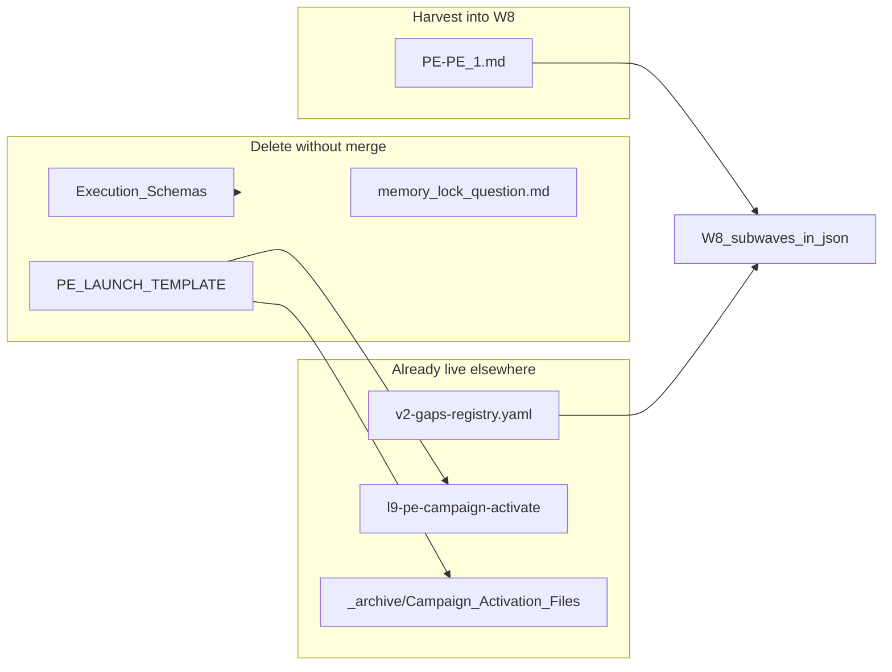

# PEC repair pipeline consolidation

## Current state (evidence)

| Artifact | Role | Problem |
|---|---|---|
| [`WIP/8-29-26/PEC/PEC-repair-pipeline.json`](WIP/8-29-26/PEC/PEC-repair-pipeline.json) | Machine SSOT | `inspected_head: 74f86226`; `live_evidence` still describes pre-W0 defects (digest-only stderr, no shadow harness, intent dead-end) while waves W0–W7 are marked `landed_shadow_build` |
| [`WIP/8-29-26/PEC/PEC-repair-pipeline.md`](WIP/8-29-26/PEC/PEC-repair-pipeline.md) | Human index | **"Live defects"** table (lines 76–85) contradicts the **Landed** wave table (lines 33–40) |
| [`WIP/8-29-26/PEC/PLAN_DOCUMENT.pec-repair-pipeline.v1.json`](WIP/8-29-26/PEC/PLAN_DOCUMENT.pec-repair-pipeline.v1.json) | Cursor Build contract | All `T-W0`…`T-W7` todos still `pending`; `convergence.status: partial`; `stress_test.assumed_false_ifs` stale |
| [`docs/plans/pec-repair-pipeline-w0-w10_056a9b48.plan.md`](docs/plans/pec-repair-pipeline-w0-w10_056a9b48.plan.md) | Built plan (reference) | Already marks W0–W7 **completed** — use as completion template |

**Repo proof W0–W7 landed** (commit `e8785018`, HEAD `35880e70`):

- W0: [`provider.py`](environment/program-execution/adapters/claude-code/provider.py) writes `stderr_excerpt` / `stderr_text` on FAIL
- W1–W2: [`compiler/tests/conformance/`](environment/program-execution/compiler/tests/conformance/) — fixtures 01–14, `shadow_runner.py`, `counterexamples.yaml`
- W3: [`compile_intent_ingress()`](environment/program-execution/scripts/campaign_input.py) — intent compiles via shadow/`--check-input`; campaign **execute** still refuses `program-execution.intent.v1` by design until post-W7 `make campaign` (updated reject message, not "convert only path")
- W4: [`test_normative_signals_retain_lowercase_material_prohibitions`](environment/program-execution/compiler/tests/test_architecture_intent.py) replaces old case-sensitivity-as-contract test
- W7: [`test_graduation.py`](environment/program-execution/compiler/tests/conformance/test_graduation.py) — golden journeys, zero blocking metrics

**Harvest source** [`WIP/PROGRAM EXECUTION PIPELINE/`](WIP/PROGRAM EXECUTION PIPELINE/) (14 tracked files):



| Source file | Verdict |
|---|---|
| [`PE-PE 1.md`](WIP/PROGRAM%20EXECUTION%20PIPELINE/PE-PE%201.md) | **Integrate** — v3 version policy, semantic-conservation / `PROGRAM_SEMANTICS` model, S0–S8 gates, two-plane bootstrap, counterexample **families** (link to live registry, do not copy 15 entries) |
| [`PE LAUNCH TEMPLATE/`](WIP/PROGRAM%20EXECUTION%20PIPELINE/PE%20LAUNCH%20TEMPLATE/) | **Skip** — duplicate of [`_archive/Campaign Activation Files/PE LAUNCH TEMPLATE/`](WIP/8-29-26/PEC/_archive/Campaign%20Activation%20Files/PE%20LAUNCH%20TEMPLATE/) and live [`skills/l9-pe-campaign-activate/`](skills/l9-pe-campaign-activate/) |
| [`Execution Schemas/*.yaml`](WIP/PROGRAM%20EXECUTION%20PIPELINE/Execution%20Schemas/) | **Skip** — already deferred; live plan schema is [`skills/l9-plan/schemas/plan-document.schema.json`](skills/l9-plan/schemas/plan-document.schema.json) |
| [`memory lock question.md`](WIP/PROGRAM%20EXECUTION%20PIPELINE/Execution%20Schemas/memory%20lock%20question.md) | **Discard** — stale 2026-08 session transcript, not PE doctrine |

Live W8 counterexample SSOT (do not duplicate): [`environment/program-execution/conformance/counterexamples/v2-gaps-registry.yaml`](environment/program-execution/conformance/counterexamples/v2-gaps-registry.yaml) (`CE-COMPILER-*`, `CE-CANDIDATE-*`, … baseline `0db3fed` — note as **historical**; W8 must freeze **fresh** SHA).

---

## Phase 1 — Evidence audit (read-only)

Run at `HEAD` and record in a short `evidence_at_head` block (replaces `live_evidence`):

```bash
git rev-parse HEAD
python3 -m pytest environment/program-execution/compiler/tests/conformance/test_graduation.py -q
python3 -m pytest environment/program-execution/adapters/claude-code/tests/test_driver.py -q
grep -n "stderr_text\|compile_intent_ingress\|landed" \
  environment/program-execution/adapters/claude-code/provider.py \
  environment/program-execution/scripts/campaign_input.py
```

Capture one residual truth for W3: `PROGRAM_INTENT_V1` ∉ `SUPPORTED_KINDS` for **campaign execute**; compile ingress is the landed path until a later plan authorizes `make campaign`.

---

## Phase 2 — Prune stale / completed from trio

### [`PEC-repair-pipeline.json`](WIP/8-29-26/PEC/PEC-repair-pipeline.json)

**Remove or rewrite:**

- Entire `live_evidence` object → replace with `evidence_at_head` (HEAD SHA, pytest pass lines, 3–5 bullet facts)
- `no_shadow_harness` claim
- Stale `program_intent_dead_end` / `normative_signals_are_case_sensitive` / `stderr_digest_only` as *open* defects

**Add to `completed_removed_from_pipeline`:**

- W0–W7 waves with `status: complete`, `evidence: e8785018`, pointer paths above

**Keep pipeline array W0–W7** but set `status: complete` (not `landed_shadow_build`) and trim per-wave `work` arrays to one-line `evidence` each — detail lives in git/tests, not the queue doc.

**Enrich W8** from `PE-PE 1.md` (non-duplicative only):

- `v3_surface_versions`: `program-execution-system.v3`, `program-execution-blueprint.v3`, `program-execution-controller.v3`; v2 receipts immutable
- `two_planes`: pinned orchestrator checkout (A) vs editable implementation (B); **fresh baseline at W8 start** — do not copy `0db3fed` / `7517f377` as live pins
- `s0_counterexamples_ssot`: path to `v2-gaps-registry.yaml` + S8 exit = zero hardening xfails
- `s1_semantic_conservation`: `PROGRAM_SEMANTICS` / derived projections rule; prohibition vs filesystem_scope split
- Expand each W8 `subwave` with 2–4 acceptance bullets distilled from PE-PE S1–S8 (not the full 2000-line prose)

**Update metadata:** `updated: 2026-08-30`, `inspected_head: <HEAD>`, `execution_mode` note that W7 shadow graduation is complete; `make campaign` remains blocked until separate W8+ plan.

### [`PEC-repair-pipeline.md`](WIP/8-29-26/PEC/PEC-repair-pipeline.md)

- Bump header: W0–W7 **complete** at `e8785018`; next = W8
- **Delete** "Live defects this pipeline still owns" section (lines 76–85)
- **Delete** redundant W0/W1 execution prose (lines 53–72) — keep one paragraph + link to conformance tests
- Replace with short **"Verified at HEAD"** table (3–4 rows max)
- Add **"W8 prep (from PE-PE 1)"** subsection: two-plane rule, v3 naming, link to `v2-gaps-registry.yaml`
- Add **campaign activation** pointer: `skills/l9-pe-campaign-activate` (not WIP template paths)

### [`PLAN_DOCUMENT.pec-repair-pipeline.v1.json`](WIP/8-29-26/PEC/PLAN_DOCUMENT.pec-repair-pipeline.v1.json)

Transition from W0–W7 Build plan → **W8-forward plan**:

- Rewrite `objective` / `success_criteria`: W0–W7 done; scope = W8–W10 only
- Mark `T-W0-*` … `T-W7-graduate` todos **completed** (mirror [`docs/plans/pec-repair-pipeline-w0-w10_056a9b48.plan.md`](docs/plans/pec-repair-pipeline-w0-w10_056a9b48.plan.md))
- Set `convergence.status: w7_complete_w8_blocked`
- Resolve unknowns: U1–U3 → `resolved_at_head`; U4–U5 remain for W8/W9
- Update `pre_validation` P1: drop requirement for `_archive/PEC/pec1.md` if absent; check `_archive/DEPRECATED.md` + live conformance dir instead
- Update `final_validation` V-shadow/V-compiler → `status: passed` with HEAD evidence
- Add `absorbed_from.program_execution_pipeline`: list PE-PE sections merged into W8
- Add `deletions_or_consolidations` entry: delete `WIP/PROGRAM EXECUTION PIPELINE`

---

## Phase 3 — Delete harvest source

After integration is committed in the trio:

```bash
git rm -r "WIP/PROGRAM EXECUTION PIPELINE/"
```

No content move to `_archive` — duplicates already exist under [`WIP/8-29-26/PEC/_archive/`](WIP/8-29-26/PEC/_archive/).

---

## Phase 4 — Zero-drift validation

**Cross-file sync checks (manual + scripted):**

| Check | Pass criteria |
|---|---|
| Wave order | W0→W7 complete; W8 depends W7; W9 depends W8; W10 depends W9 |
| `next.id` | `W8` in JSON; MD agrees |
| No contradiction | No section says "open defect" for W0–W6 while status is `complete` |
| SHAs | No bare `74f86226`, `c3081ee` as *current* inspection; historical baselines labeled |
| PLAN ↔ JSON | Every open W8+ subwave in JSON has matching PLAN todo or explicit `blocker` |
| Schema | `python3 skills/l9-plan/scripts/validate_plan_document.py WIP/8-29-26/PEC/PLAN_DOCUMENT.pec-repair-pipeline.v1.json` exit 0 |
| Tests | `pytest environment/program-execution/compiler/tests/conformance/ -q` green |

**Drift grep** (must return zero false-positive hits in active pipeline sections):

```bash
rg -n "live_evidence|no shadow|digest-only|case_sensitive|dead-end|landed_shadow|pending" \
  WIP/8-29-26/PEC/PEC-repair-pipeline.{json,md} \
  WIP/8-29-26/PEC/PLAN_DOCUMENT.pec-repair-pipeline.v1.json
```

---

## Phase 5 — Commit

Scoped commit on current branch (`main`):

```bash
git add WIP/8-29-26/PEC/PEC-repair-pipeline.json \
        WIP/8-29-26/PEC/PEC-repair-pipeline.md \
        WIP/8-29-26/PEC/PLAN_DOCUMENT.pec-repair-pipeline.v1.json
git add -u "WIP/PROGRAM EXECUTION PIPELINE/"
git commit -m "chore(pec): consolidate repair pipeline; harvest W8 prep; delete stale PE corpus"
```

---

## Risk notes

- **Do not** re-open W0–W7 implementation — documentation-only pass unless validation finds a regression (then file a W7.1 fix, not revert landed status).
- **Do not** integrate draft Execution Schemas — creates a second schema SSOT.
- **Do not** copy stale baseline SHAs from PE-PE 1 into executable fields; W8 prep must say "freeze fresh at start."
- W3 residual (intent.v1 not in campaign `SUPPORTED_KINDS`) is **intentional** until a post-W7 plan — document as residual, not stale defect.
