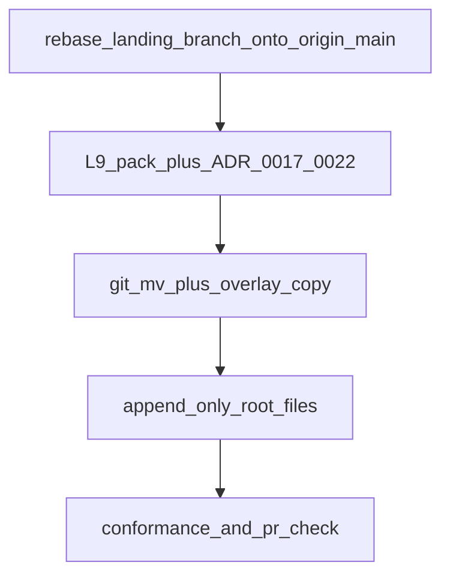

# Peer Execution Core landing (named branch, L9-compliant)

**This file is the plan.** Freshness check 2026-08-14 — revise in place, not a sidecar.

## Built vs not (2026-08-14 evidence)

**Built (local only — not the pack port):**

- Doctrine files exist as commit `d6fd081` on **`feat/kernel-pack-new-branch-default`** (AGENTS.md, rule 46, planning-doctrine, l9-plan SKILL, commands/l9-plan.md, RULES-MANIFEST).
- The same doctrine text is also **dirty** on the current checkout (`backup/local-unpushed-2026-08-14`): staged rule 46 + l9-plan refs; unstaged `AGENTS.md` + `skills/l9-plan/SKILL.md`.
- **U1 probed:** no `docs/decisions/ADR-0017*` (catalog is 0001–0016 plus a pre-existing duplicate ADR-0007). Slot 0017–0022 is still free.
- Pack directory still present as untracked `WIP/llm_peer_execution_core/`.
- Blocker tests were **7/7 PASS** on 2026-08-13.

**Not built:**

- Doctrine is **not** on `origin/main`.
- No `environment/program-execution/peer_execution/` (live tree still has `adapters/common/` including `models.py`).
- No `environment/contracts/execution/adr/`.
- No ADR-0017–0022 pointers in `docs/decisions/`.
- No supersession note on `docs/decisions/ADR-0001-claude-code-bounded-concurrent-autonomy.md`.
- `Makefile` still has `validate_execution_adapters.py` only — no `validate_thin_providers.py`.
- `conftest.py` has no `peer_execution` collect_ignore.
- Stock porter rewrite, land, conformance, and `make pr-check` for this port — not done.

**Stale facts removed from the prior revision of this file:**

- Checkout is **not** `feat/kernel-pack-new-branch-default`. Current branch is `backup/local-unpushed-2026-08-14` at `fa4bf3fd1d73fc163a81a73a5b80340301f2f5f0` (equals `origin/main`, 0/0).
- Improve-era lock `HEAD d6fd081` / `origin/main 8c061c4` / ahead 1 behind 1 is **dead**. `origin/main` moved 14 commits past the landing branch.
- “Doctrine already landed on this checkout at d6fd081” is **false**. `d6fd081` is not an ancestor of current HEAD.
- Wave 0 is no longer “rebase the current checkout.” It is rebase the **named landing branch** onto current `origin/main`. Do not port on the backup branch (mixed dirty doctrine + Legal Defense residue + other untracked WIP).

## Locked (do not re-ask)

- Landing branch name stays **`feat/kernel-pack-new-branch-default`**. Do **not** create `feat/peer-execution-core`.
- Do **not** land on `feat/wip-legal-defense-26cr-ingest` (`d59d5d1`) or on `backup/local-unpushed-2026-08-14`.
- Do **not** run `WIP/llm_peer_execution_core/scripts/apply_pr_pack.py` as shipped (exact-SHA gate + `git reset --hard` + additive-only overwrites). Last full script read: 2026-08-13; WIP is sacred/cursorignored on 2026-08-14 so that read was not repeated.
- Isolation of 26CR is `write_deny` on `WIP/Legal Defense/**`. `origin/main` already contains #119.

**Execute via:** [@environment/program-execution](environment/program-execution/) → Program Lock/Controller → [@autonomy](commands/autonomy.md) under Program lease → `cursor-foreground`. `autonomous_merge: false`. L4 local commits; `make pr` after kernels. Force-push / hard-reset / `git clean -fd` remain forbidden.

**Status:** `draft` until Wave 0 rebases the landing branch onto `fa4bf3f` (or newer `origin/main`) and locks that SHA. Then `executable`.

## Baseline (re-verify at execute start)

- **Current checkout (do not port here):** `backup/local-unpushed-2026-08-14` @ `fa4bf3fd1d73fc163a81a73a5b80340301f2f5f0`
- **`origin/main` at this freshness check:** `fa4bf3fd1d73fc163a81a73a5b80340301f2f5f0`
- **Landing branch tip:** `feat/kernel-pack-new-branch-default` @ `d6fd08107086c3344edfd9eb837a5d93fd42a623` (14 behind `origin/main`, 1 ahead — doctrine only)
- Dirty on current checkout: `true` (doctrine WT + untracked pack + other WIP). Allowed dirt for the **port** is `WIP/llm_peer_execution_core/` on the landing branch only.
- On drift: `stop_and_replan`. After rebase, **write the new 40-char landing-branch SHA into this section**.

## Envelope

**write_allow:** `WIP/llm_peer_execution_core/**`, `environment/program-execution/**` except sealed `core/`, Claude `autonomy/**`, `environment/agents/PEER_EXECUTION.md`, `environment/contracts/execution/**`, `docs/decisions/ADR-0017*`–`ADR-0022*`, append-only on existing `docs/decisions/ADR-0001-claude-code-bounded-concurrent-autonomy.md`, append-only `CANONICAL_LAW.md` / `AGENTS.md` / `Makefile` / `conftest.py`, `validation/history/**`.

**write_deny:** `WIP/Legal Defense/**`, `pyproject.toml`, `ops/scripts/_archived/**`, `ORG_INVARIANTS.yaml`, `.env`, `ops/secrets/**`, `environment/program-execution/core/**`, other untracked WIP, committing onto `backup/local-unpushed-2026-08-14`.

**deny commands:** `git reset --hard`, `git clean -fd`, `git push --force`, stock `apply_pr_pack.py`, autonomy `gh pr merge`.

## Success properties (blocking)

- **SP-01** Landing-branch `git rev-parse HEAD` equals the SHA locked in Baseline after Wave 0; `git merge-base --is-ancestor origin/main HEAD` is true.
- **SP-02** `environment/program-execution/peer_execution/models.py` exists because `git mv` ran **before** overlay; existing PE tests import `peer_execution.models`.
- **SP-03** `python3 WIP/llm_peer_execution_core/scripts/validate_pack.py` PASS (last inspect 2026-08-13: FAIL, four `.DS_Store`; not re-run 2026-08-14).
- **SP-04** ADR-0017–0022 exist under execution/adr and as docs/decisions pointers; this pack does not add ADR-0001–0006 files.
- **SP-05** Landing porter has no `_rollback_clean_base` and no exact-base pin to `0fbd477`.
- **SP-06** `make program-execution-conformance` and `make pr-check` PASS on the landing branch.

## Wave 0 — Rebase the landing branch; lock SHA

Do this **off** `backup/local-unpushed-2026-08-14`.

1. `git fetch origin`.
2. Rebase `feat/kernel-pack-new-branch-default` onto `origin/main` (`fa4bf3f` at this check, or newer tip).
3. Keep `KERNEL_PACK_NEW_BRANCH_DEFAULT_V1` **and** additive appends already on main.
4. **U1:** already free as of 2026-08-14 — re-check after rebase.
5. **U2:** AGENTS.md conflict → keep main lines + KERNEL block; never drop main.
6. Paste the new landing-branch HEAD into Baseline. Do not create another branch. Do not commit the dirty doctrine copies on the backup branch (they would duplicate `d6fd081`).

## Wave 1 — L9-harden the pack

Pack: untracked `WIP/llm_peer_execution_core/`. Overlay is not standalone (`peer_execution/base.py` appears only after `git mv adapters/common`). Live `environment/program-execution/adapters/common/` still present (14 files including `models.py`).

**KERNEL L9 bar (locked):**

- **Do:** `structlog`; pydantic v2 for `CanonicalExecutionRequest` / `CanonicalProviderResult`; timeouts on every `subprocess`; typed `AdapterFailure`; CLI JSON stdout; tests + `make pr-check`.
- **Do not:** async `subprocess_runner`; httpx; `PacketEnvelope`.
- Delete `.DS_Store`; exclude them in the inventory walker; refresh `VALIDATION.md` to observed counts; timeout on `scripts/export_patch.py`.
- Gate: `validate_pack.py` PASS and blocker tests 7/7 before any port.

## Wave 2 — Renumber and add ADRs (0017–0022)

Map unchanged: 0001→0017 … 0006→0022 (slugs unchanged).

**Dual-home (locked):** body SSOT `environment/contracts/execution/adr/`; `docs/decisions/` one-paragraph pointers; rename pack + overlay copies; append `adr/` to live `environment/contracts/execution/MANIFEST.yaml`; rewrite this-family citations only; append-only supersession on existing ADR-0001 dated 2026-08-13 pointing at `peer_execution/autonomy/` + ADR-0017/0021. Do not retitle that ADR-0001.

## Wave 3 — Replace stock apply with a governed port

Do not call shipped `apply_pr_pack.py` until rewritten.

**Allowed:** `git mv` `adapters/common` → `peer_execution`; `git mv` Claude `autonomy` → `peer_execution/autonomy`; overlay thin providers/schemas/conformance/`PEER_EXECUTION.md`; `git rm` retired `delete_paths`; `patch_peer_execution_base`; archive under `validation/history/`.

**Forbidden:** `_rollback_clean_base`; `require_exact_base` pinned to `0fbd477` (retarget to **landing-branch HEAD**); in-place replace of `CANONICAL_LAW.md`, `AGENTS.md`, `Makefile`, `conftest.py`; wholesale overlay `repo_overlay/conftest.py`.

**Additive-only:** append thin-adapter law block; append `peer_execution/autonomy/` path; append `validate_thin_providers.py` after existing `validate_execution_adapters.py`; append `peer_execution` to `collect_ignore` and keep live entries.

## Wave 4 — Land on the landing branch

1. Tree is `feat/kernel-pack-new-branch-default` rebased onto current `origin/main`.
2. Keep the pack under `WIP/` until port succeeds.
3. Run the governed porter **only** there. `git mv` must precede overlay.
4. L4 local commits. No mid-execution push until kernels + `make pr`.

## Wave 5 — Prove (fail-closed)

On the landing branch: `validate_pack.py` PASS; blocker 7/7; retarget `validate_applied_repo.py` off `0fbd477`; `make program-execution-conformance`; `make pr-check`; prove `peer_execution.models` import after the `git mv`.

## Stress / rollback / out of scope

**Disconfirm:** If main moved past inspected adapter paths → `stop_and_replan`. If ADR-0017 appears after rebase → next free id (U1). If rebase conflicts in additive_only roots → keep main + KERNEL (U2). If someone ports on the backup branch → stop; that mixes Legal Defense residue.

**Rollback:** revert local commits on `feat/kernel-pack-new-branch-default`; restore scoped paths. Leave `origin/main`, the backup branch, and `WIP/Legal Defense` untouched. No hard-reset of main.

**Out of scope:** DeepSeek provider; Codex/Gemini/Manus live transports; applying on `feat/wip-legal-defense-26cr-ingest` or `backup/local-unpushed-2026-08-14`; creating `feat/peer-execution-core`; autonomous merge; PacketEnvelope; async subprocess rewrite; stock `apply_pr_pack.py` on a dirty checkout; mutating `WIP/Legal Defense`.

## Convergence

Not `executable` until Wave 0 completes on the landing branch. Complete when SP-01–SP-06 pass.

**Next action:** Wave 0 — rebase `feat/kernel-pack-new-branch-default` onto `origin/main`. Do not apply the pack from this checkout.
