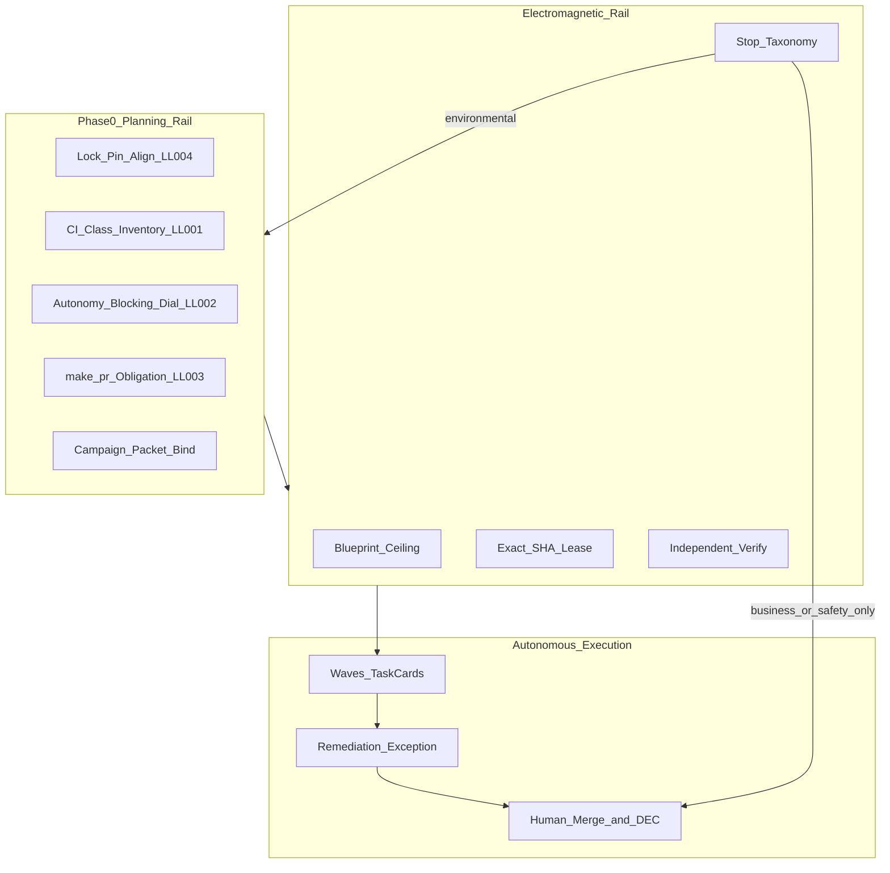

## PLAN: PES Electromagnetic Autonomy Rail

### Doctrine
Proper planning prevents piss poor performance. A minute spent planning is an hour saved debugging.

Planning is the rail bed; autonomy is the train. Friction dies when every stop reason is classified **before** the wheels spin, and only business-logic / hard-safety decisions remain as true brakes.

### Planning Mode
**Mode:** Deep
**Justification:** Shared contracts (Blueprint + Controller + autonomy packet), multi-surface promotion (WIP → `environment/program-execution/core`), authorization/parallelism policy, and long-running autonomous execution risk.

### plan_status
ConditionallyReady — executable once DEC-R1 (promotion dual-write) and DEC-R2 (deploy parallelism profile) are accepted as locked below; both are decided in this plan (no user fork).

### Objective
Identify and implement the planning + autonomy bindings that let [`WIP/_program-execution-system-v2.0.0`](WIP/_program-execution-system-v2.0.0) operate like a high-speed train on an electromagnetic rail: **pre-cleared ambiguity**, **maximum autonomy within ceiling** when a program is deploying, **local Core-CI-mirror gates**, and **true stops only** for business decisions + hard safety—grounded in existing [`autonomy/`](autonomy/), [`environment/claude-code/autonomy/`](environment/claude-code/autonomy/), and [`skills/l9-bounded-autonomy`](skills/l9-bounded-autonomy) (never a third scheduler).

**Success (falsifiable):**
1. Phase 0 user-config artifact exists, schema-validated, required before mutating waves.
2. LL-001–004 are marked `implemented` with file evidence in WIP and mirrored into [`environment/program-execution/core`](environment/program-execution/core).
3. Stop taxonomy splits `business_logic | hard_safety | environmental_clearable`; environmental clears are Phase-0 obligations.
4. Deploy profile: max autonomy within ceiling; `autonomous_merge: false`; push/PR remediation pre-authorizable via exact approval + adapter path; `make pr` + lock/pin alignment required before push/PR admission.
5. Task Card ↔ campaign action/lease mapping documented; PES does not reimplement Claude/Cursor schedulers.
6. `python scripts/validate_pair.py . --mode template` PASS on WIP and core after changes; local `make pr-check` PASS on touched files.

### Scope
**Inspection:** WIP pack, promoted core, autonomy layers, ADR-0001, bounded-autonomy skill, AGENTS/`make pr` law, LL-001–004.
**Modification:** WIP PES templates/policies/schemas/shared + mirror into `environment/program-execution/core/**`; cross-link bounded-autonomy packet fields; update LEARNED_LESSONS + README; reseal MANIFESTs.
**In:** Phase 0, gate/waiver/stop/evidence/error taxonomy, RUNBOOK/waves/DoD/task cards, deploy autonomy + parallelism profiles, vocabulary bridge, kill-switch posture, promotion mirror.
**Out:** Rewriting Claude Python scheduler in Cursor; enabling autonomous merge; emptying adapters with full Wave-3 production gateway wiring (document + stub contract only); weakening secrets/org-invariant/human-merge; implementing a live program instance fill of REPLACE_* stubs.

### Locked decisions (no optionality)
| ID | Decision |
|----|----------|
| DEC-R1 | Edit **WIP first**, then **byte-promote** the same relative paths into `environment/program-execution/core/` in the same implementation GMP (single SSOT promotion). |
| DEC-R2 | Add Controller profile `program_deploy_max_autonomy`: autonomy max-within-ceiling; keep one-writer-per-repo; raise `global_max_workers` to **4** with **2** mutation-equivalent only when Phase 0 sets `program_deploying: true` and tasks are dependency-independent across repos—matching ADR-0001 4/2 intent without violating one-writer-per-repo. Default template stays `bounded_local_execution` / workers=1 until Phase 0 selects deploy profile. |
| DEC-R3 | Bridge authority via **campaign authorization packet** fields inside Phase 0 (cite `skills/l9-bounded-autonomy/references/campaign-authorization-packet.md`); never use “envelope.” Machine `autonomy/` campaign JSON remains optional later adapter—PES Program Lock is authoritative for program state. |
| DEC-R4 | Human merge / publish / deploy remain denied; remediation push/PR allowed only when Phase 0 pre-authorizes exact approval + adapter present. |



### Pre-Validation (mandatory)
| Check | Command / action | Pass criteria |
|-------|------------------|---------------|
| P0 Target bind | Write root = Cursor-Governance; PES paths under WIP + `environment/program-execution/core` | Single authorized repo |
| P1 Baseline inventory | WIP vs core diff; LL file; autonomy policies | Gap list = briefing above |
| P2 Clean gate | `make pr-check` before/after implementation | PASS; no commit/push from plan |
| P3 Wiring | N/A for docs/policy pack | Skipped — not symlink work |
| P4 Lesson corpus | `learning/failures/repeated-mistakes.md` + WIP `LEARNED_LESSONS.md` | Matched lessons listed |

Planning-only now: P2 recorded at implementation time. Do not claim code readiness without Observed PASS.

### Lesson matches (from corpus)
| Lesson / pattern | Relevance | Action in this plan |
|------------------|-----------|---------------------|
| WIP LL-001 | False CI blocks | Phase 0 CI inventory + gate class + waivers |
| WIP LL-002 | Autonomy dial / max default | PHASE0_USER_CONFIG + deploy profile |
| WIP LL-003 | `make pr` over remediation | DoD / evidence / stop on skip |
| WIP LL-004 | uv.lock / pins | Phase 0 alignment checklist + stop code |
| lesson-005-ask-first / planning doctrine | Ambiguity before build | Phase 0 is the ask/dial surface |
| lesson-024-resource-hygiene | Hung subagents / idle Docker | Phase 0 + RUNBOOK resource note (cite, don’t fork) |
| AGENTS `make pr` / CANONICAL_LAW §12 | Already law | Cite; bind into PES—do not fork pipeline |

### How planning eliminates ambiguity (rail inventory — beyond LL alone)

These are the additional planning rails that turn PES + autonomy into frictionless motion:

1. **Stop taxonomy planning** — every Controller `stop_when` and CI check classified before Wave 0; only `business_logic` and `hard_safety` may halt a deploying program mid-flight.
2. **Authority object unification** — Phase 0 binds Program Lock digest ↔ campaign packet fields (repos/PRs/branches/ops/budgets); dual stores (`.l9/autonomy` vs PES `runtime/`) stay separate but **field-aligned**.
3. **Task↔action map** — each Task Card declares `autonomy_action_id` / lease class so Cursor `/autonomy` Tasks and PES tasks are not two vague graphs.
4. **Wave admission Definition of Ready** — explicit checklist: Phase 0 complete, locks aligned, `make pr` green on prior wave outputs, no open environmental stops.
5. **Pre-authorized approval ledger** — Phase 0 lists routine approvals (push/PR remediation) with expiry bound to program digest; mid-flight asks only for DEC-* / merge / destructive.
6. **Simulation / dry-run gate** — optional but planned: `autonomy` wave3 simulate or PES negative tests before first mutation lease (fail-closed if deploy profile selected and sim missing).
7. **Kill-switch posture** — Phase 0 names revoke path + operator action (`runtime suspend` / touch `.l9/autonomy/revoke`); document that file-watch is not yet auto-enforced in `autonomy/runtime`.
8. **Ambiguity quarantine** — UNKNOWN/DECISION registers must list every “we’ll figure it out later”; empty implicit asks forbidden under deploy profile.
9. **Evidence classes on receipts** — `local_pr_gate` vs `remote_ci` vs `business_decision` so remediation cannot masquerade as planning success.
10. **Promotion seal** — MANIFEST + validate_pair after edits; LEARNED_LESSONS marked implemented only with paths.

### TODO Plan
| # | Task | Files | Effort | Risk | Rollback |
|---|------|-------|--------|------|----------|
| T1 | Add Phase 0 artifact + schema; wire EXECUTION_INDEX + waves entry gate | [`PHASE0_USER_CONFIG.yaml`](WIP/_program-execution-system-v2.0.0/program-execution-blueprint-template/PHASE0_USER_CONFIG.yaml) (new), `schemas/phase0-user-config.schema.json` (new), [`EXECUTION_INDEX.yaml`](WIP/_program-execution-system-v2.0.0/program-execution-blueprint-template/EXECUTION_INDEX.yaml), [`EXECUTION_WAVES.yaml`](WIP/_program-execution-system-v2.0.0/program-execution-blueprint-template/EXECUTION_WAVES.yaml), [`INSTANTIATION_GUIDE.md`](WIP/_program-execution-system-v2.0.0/program-execution-blueprint-template/INSTANTIATION_GUIDE.md) | M | Med | Delete new files; revert index/waves |
| T2 | LL-001: gate class + waiver pattern + RUNBOOK CI hygiene | [`CONVERGENCE_GATES.yaml`](WIP/_program-execution-system-v2.0.0/program-execution-blueprint-template/CONVERGENCE_GATES.yaml), schema, [`WAIVER_REGISTER.yaml`](WIP/_program-execution-system-v2.0.0/program-execution-blueprint-template/WAIVER_REGISTER.yaml), [`RUNBOOK.md`](WIP/_program-execution-system-v2.0.0/program-execution-blueprint-template/RUNBOOK.md), [`APPROVALS_WAIVERS_AND_HANDOFF.md`](WIP/_program-execution-system-v2.0.0/program-execution-controller-template/references/APPROVALS_WAIVERS_AND_HANDOFF.md) | M | Med | Revert YAML/MD |
| T3 | LL-002: deploy autonomy profile + stop taxonomy split | [`policy/autonomy.yaml`](WIP/_program-execution-system-v2.0.0/program-execution-controller-template/policy/autonomy.yaml), [`stop-conditions.yaml`](WIP/_program-execution-system-v2.0.0/program-execution-controller-template/policy/stop-conditions.yaml), [`parallelism.yaml`](WIP/_program-execution-system-v2.0.0/program-execution-controller-template/policy/parallelism.yaml), [`CONTROLLER.yaml`](WIP/_program-execution-system-v2.0.0/program-execution-controller-template/CONTROLLER.yaml), [`STATE_MACHINE.md`](WIP/_program-execution-system-v2.0.0/program-execution-controller-template/references/STATE_MACHINE.md), [`AUTHORIZATION_MODEL.yaml`](WIP/_program-execution-system-v2.0.0/shared/AUTHORIZATION_MODEL.yaml) | L | High | Revert policies; keep workers=1 default |
| T4 | LL-003: bind `make pr` into DoD/evidence/stops | [`DEFINITION_OF_DONE.md`](WIP/_program-execution-system-v2.0.0/program-execution-blueprint-template/DEFINITION_OF_DONE.md), [`TASK_CARDS.yaml`](WIP/_program-execution-system-v2.0.0/program-execution-blueprint-template/TASK_CARDS.yaml), [`EVIDENCE_CATALOG.yaml`](WIP/_program-execution-system-v2.0.0/program-execution-blueprint-template/EVIDENCE_CATALOG.yaml), [`policy/evidence.yaml`](WIP/_program-execution-system-v2.0.0/program-execution-controller-template/policy/evidence.yaml), [`VERIFICATION_AND_RECEIPTS.md`](WIP/_program-execution-system-v2.0.0/program-execution-controller-template/references/VERIFICATION_AND_RECEIPTS.md), [`EVIDENCE_MODEL.yaml`](WIP/_program-execution-system-v2.0.0/shared/EVIDENCE_MODEL.yaml) | M | Med | Revert |
| T5 | LL-004: lock/pin alignment obligations | Phase 0 schema fields; RUNBOOK; EVIDENCE_CATALOG; stop code `lock_or_pin_misalignment`; cite `make uv-lock-check` | S | Low | Revert |
| T6 | Error taxonomy + shared codes for all LL + rail | [`ERROR_TAXONOMY.yaml`](WIP/_program-execution-system-v2.0.0/shared/ERROR_TAXONOMY.yaml) | S | Low | Revert |
| T7 | Task↔autonomy bridge doc + packet field alignment | New `references/AUTONOMY_BRIDGE.md` under controller; update [`skills/l9-bounded-autonomy/references/doctrine-map.md`](skills/l9-bounded-autonomy/references/doctrine-map.md) with PES Phase 0 row (cite only) | M | Med | Revert docs |
| T8 | Validator requires Phase 0 in instantiated mode | [`scripts/validate_pair.py`](WIP/_program-execution-system-v2.0.0/scripts/validate_pair.py), blueprint `validate_blueprint.py` if needed | M | Med | Revert scripts |
| T9 | Mark lessons implemented; README; reseal MANIFESTs | [`LEARNED_LESSONS.md`](WIP/_program-execution-system-v2.0.0/LEARNED_LESSONS.md), [`README.md`](WIP/_program-execution-system-v2.0.0/README.md), generate_manifest | S | Low | Revert |
| T10 | Promote WIP → `environment/program-execution/core/**` same relative paths; run validate_pair on both | `environment/program-execution/core/**` | M | Med | git revert core tree |
| T11 | Hostile/negative tests for Phase0 incomplete, local_pr_gate_skipped, pin drift | `tests/` / controller scripts/tests | M | Med | Remove tests |

### Depth
**Root cause of friction:** PES is structurally APPROVED_EXECUTION_READY as a **template verifier**, while autonomy’s high-speed path (ADR-0001 remediation-on, 4/2 lanes, campaign packet) is a **separate runtime**. Without Phase-0 planning, conservative PES defaults (`bounded_local_execution`, push denied, `global_max_workers: 1`, stub DEC/UNK) + advisory CI + skipped `make pr` + lock drift guarantee remediation loops.

**Evidence class:** Observed (policy files, LL text, empty adapters, dual state dirs) + Derived (rail design) — Hypothesis only where kill-switch file-watch gap noted.

**Preserved invariants:** narrow-never-widen; human merge; exact SHA + one-writer-per-repo; worker claim ≠ verdict; secrets/org invariants fail-closed; no second Cursor scheduler.

**Prohibited changes:** autonomous_merge true; weakening scanners; Dropbox/SSOT regressions; CCP “envelope” vocabulary; editing `kernels/` from this work.

#### Failure-path map
| Entrypoint | Expected I/O | Failure paths |
|------------|--------------|---------------|
| Phase 0 incomplete + deploy profile | Refuse wave admission | Error `phase0_incomplete` |
| Push/PR without `make pr` receipt | Stop / non-admission | `local_pr_gate_skipped` |
| Environmental CI still blocking | Phase 0 fail | `advisory_ci_noise` uncleared |
| Packet fields ≠ Program Lock scope | Refuse autonomy start | `authority_misaligned` |
| Ceiling widen attempt | Fail closed | existing AUTHORIZATION_INFLATION |

#### Reusable Patterns
| Preserve | Extract | Avoid |
|----------|---------|-------|
| Campaign **packet** term + ADR-0001 | Phase 0 as dial-in SSOT | Envelope / dual schedulers |
| `make pr` / `uv lock --check` | Evidence method IDs | Forking pin tables into every Blueprint |
| LL lesson format | Implemented evidence checklist | Treating LEARNED_LESSONS as runtime alone |

#### Unknown-file disposition
**N/A — trigger not met** (no reorg)

### Dependencies
```text
T1 → T2,T3,T4,T5
T3 → T7,T8
T2+T4+T5+T6 → T9
T1–T9 → T10 → T11 (tests may parallel T8 after schema freeze)
```

#### Execution waves
| Wave | Items | Parallel OK? | Conflicts |
|------|-------|--------------|-----------|
| W1 Schema spine | T1, T6 | yes | none |
| W2 Policy fold-in | T2–T5 | partial (same MANIFEST reseal last) | shared RUNBOOK |
| W3 Bridge + validate | T7, T8 | yes after W2 | none |
| W4 Seal + promote | T9, T10 | no (ordered) | dual-home |
| W5 Assurance | T11 + `make pr-check` | after W4 | none |

### Unknown register
| ID | Unknown | Blocks | Resolution |
|----|---------|--------|------------|
| UNK-1 | Whether any consumer already instantiates PES outside this repo | T10 messaging only | Grep org at implement time; no design change |
| UNK-2 | Adapter install path for first real push/PR | Runtime push until adapter exists | Phase 0 records `adapter_status: absent\|present`; deny push if absent |

### Decision register
| ID | Decision | Status |
|----|----------|--------|
| DEC-R1..R4 | Locked above | Accepted in plan |

### Validation matrix
| Level | Check | Structural vs behavioral | Pass criteria |
|-------|-------|--------------------------|---------------|
| Targeted | Schema validate Phase 0 + gates | structural | validate_blueprint/pair PASS |
| Targeted | Stop taxonomy codes present | structural | ERROR_TAXONOMY contains LL codes |
| Integration | WIP vs core relative parity | structural | diff clean on promoted paths |
| Integration | Doctrine-map cites PES Phase 0 | structural | link present |
| Final | `make pr-check` | scanners | PASS; no commit/push |
| Final | Secret-surface | N/A — trigger not met | N/A |
| Final | Drift watch | config/schema/policy | Watch listed paths below |

### Milestones
| Milestone | Outcome | Unlocks |
|-----------|---------|---------|
| M0 | Plan accepted | Implementation GMP |
| M1 | Phase 0 + taxonomy exist | Policy fold-in |
| M2 | LL-001–004 encoded in WIP | Bridge + validator |
| M3 | validate_pair PASS; lessons marked implemented | Promotion |
| M4 | core mirrored; `make pr-check` PASS | First real program instantiate (separate effort) |

### Checkpoints
| CP | After | Evidence | No-go |
|----|-------|----------|-------|
| CP1 | T1 | Schema file + wave gate text | Do not touch autonomy defaults |
| CP2 | T2–T5 | LL acceptance checkboxes tickable | Do not promote |
| CP3 | T8 | validate_pair template mode PASS | Fix validator |
| CP4 | T10 | core paths match WIP | Do not claim done |
| CP5 | T11 + make pr | PASS logs | No PR open on FAIL |

### Checklist
- [ ] Phase 0 artifact + schema + wave entry
- [ ] CI advisory vs blocking + waiver pattern
- [ ] Deploy autonomy profile + stop taxonomy + parallelism rule under Phase 0
- [ ] `make pr` + uv-lock evidence obligations
- [ ] ERROR_TAXONOMY codes
- [ ] AUTONOMY_BRIDGE + packet field alignment (no envelope)
- [ ] Validators enforce Phase 0
- [ ] LEARNED_LESSONS implemented + README
- [ ] Promote to environment/program-execution/core
- [ ] make pr-check PASS
- [ ] Pre-Validation / Kernel Pass Log / MSNA present
- [ ] No commit/push unless user requests
- [ ] Not claiming merge/release ready

### Risks
| Risk | Mitigation |
|------|------------|
| Dual SSOT WIP vs core | DEC-R1 same-GMP promote |
| Over-autonomy / merge creep | autonomous_merge false invariant + hostile test |
| Parallelism races | Keep max_writers_per_repository: 1 |
| Paper policy without enforcement | T8 validator + T11 tests; controller stop codes |
| Adapter absent | Phase 0 adapter_status fail-closed for push |

### Estimate
**Total:** ~2–3 focused GMPs (schema/policy; bridge/validate; promote/test)
**GMPs:** 3

### Kernel Pass Log (mandatory)
| Kernel | Path | Status | Material deltas |
|--------|------|--------|-----------------|
| Improve | kernels/Improve.md | Applied | Added stop taxonomy, Task↔action bridge, DoR, sim/kill-switch posture beyond LL-only |
| Leverage | kernels/Leverage.md | Applied | Reuse packet/ADR-0001/`make pr`/`uv-lock-check`; no third scheduler |
| Recursive Alignment | kernels/Recursive Alignment.md | Applied | Aligned WIP targets with core promotion + autonomy state split |
| Recursive Leverage | kernels/Recursive Leverage.md | Applied | Phase 0 as single dial compounding LL-001–004 |
| Validate & Repair | kernels/Validate & Repair.md | Applied | Validation matrix, CP fail-closed, hostile test TODOs |

### Final Validation (mandatory)
| Check | Command | Pass criteria |
|-------|---------|---------------|
| V1 Template completeness | Review vs plan-workflow | All sections present |
| V2 Scanners | `make pr-check` at implement | PASS; no commit/push from plan |
| V3 Honesty | This plan is planning-only | P2 = pending Observed at GMP |
| V4 Drift watch | Phase0 schema, autonomy/stop/parallelism policies, ERROR_TAXONOMY, LEARNED_LESSONS, core mirror | Named |

### Minimum Safe Next Action
Execute **T1** (create `PHASE0_USER_CONFIG.yaml` + schema and wire wave entry) under `l9-gmp-protocol` after user says to implement—do not edit until then.

### Handoff profile
CHANGE
**Maps to:** `l9-gmp-protocol` (then `l9-ynp` after M2 for promote vs test ordering)

### YNP recommendation (post-plan)
Primary play: **GMP Wave W1 — Phase 0 spine (T1+T6)** with confidence ~0.88. Alternate if user wants docs-only first: draft AUTONOMY_BRIDGE.md alone (lower leverage).
