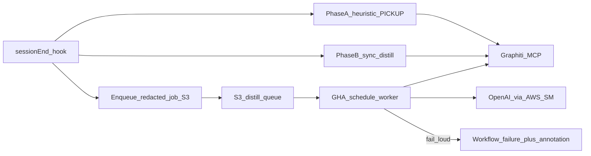
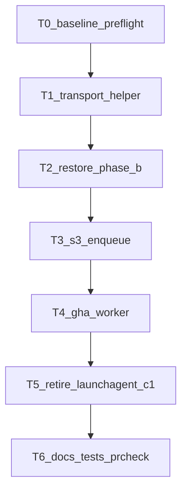

# PLAN: SessionEnd Phase B + autonomous GHA distill

> **Skill SSOT:** `skills/l9-plan` PE+autonomy projection
> **Execute:** [@environment/program-execution](environment/program-execution/) + [@autonomy](commands/autonomy.md) under Program lease
> **Default decided:** Job egress = **AWS S3** + OpenAI/Graphiti secrets from **AWS Secrets Manager** (not Mac LaunchAgent, not Dropbox, not C1 `save_memory`).

## Architect framing

Two broken paths today:

1. **SessionEnd Phase B** — stubbed in [`ops/graphiti/hydration/close_session.py`](ops/graphiti/hydration/close_session.py) (`_distill_signal_packet` always returns deferred).
2. **Daily batch distill** — unloaded LaunchAgent `com.l9.transcript-distiller` still points at Dropbox; [`ops/scripts/transcript_distiller.py`](ops/scripts/transcript_distiller.py) still targets deprecated C1 MCP and looks for flat `*.txt` (Cursor writes nested `.jsonl`).

Target architecture:

**Why this never needs the Mac at 5am:** SessionEnd (Mac online) only **uploads a redacted job**. GHA runs on GitHub runners anytime and completes LLM + Graphiti ingest.

## Immutable baseline

- Repo: `Cursor-Governance` @ `4b92550f32cc135d26ddca52e8497c8354f54115` (refresh SHA at execute Preflight).
- Authority: ADR-0006, `docs/MEMORY_PIPELINE_MAP.md` (T3 full-chat ingest forbidden — **excerpts only**), `ops/graphiti/docs/MACHINE-ENV-POLICY.md` (no long-lived OpenAI on Mac for Graphiti server; ephemeral resolve OK for distill), CANONICAL_LAW §8.

## Objective + success properties

**Objective:** Richer-than-heuristic close atomics via restored Phase B; batch catch-up via GHA; remove Mac/Dropbox cron dependency; failures visible.

| ID | Property | Evidence |
|----|----------|----------|
| SP-01 | Phase B can produce `SessionSignalPacket` and promote atomics when key+budget available | Unit tests with mocked transport; close receipt `phase_b=true` fixture |
| SP-02 | Phase B transport is Sonar-clean (no new-code SSRF sink regression) | Shared HTTPS helper + `make pr-check` / Sonar on PR |
| SP-03 | SessionEnd enqueues redacted job to S3 (content-hash idempotent); enqueue failure is fail-loud in receipt + stderr | Integration test + receipt schema field |
| SP-04 | GHA workflow runs on schedule + `workflow_dispatch` without Mac; missing secrets / Graphiti errors fail the job | Workflow + dry-run docs |
| SP-05 | Distill sink is Graphiti only (no C1 `save_memory`) | Code + tests assert Graphiti client |
| SP-06 | LaunchAgent Dropbox cron retired/unloaded; docs match | Plist update or delete + MEMORY_PIPELINE_MAP |
| SP-07 | `make pr-check` PASS on final tip | Gate log |

## Capability preflight

- AWS account already used for `openclaw-igorbot/*` + `l9/OPENAI_API_KEY`.
- Public Graphiti MCP path exists for non-tunnel: `https://memory.quantumaipartners.com/graphiti/mcp` (cloud agents).
- SessionSignalPacket schema already at [`ops/graphiti/hydration/session_signal_packet.schema.yaml`](ops/graphiti/hydration/session_signal_packet.schema.yaml).
- Probe at execute: AWS creds for S3 bucket create/use; SM read for OpenAI + Graphiti token; GHA OIDC or repository secrets mapping.

## Execution envelope

**Allowed writes:**

- `ops/graphiti/hydration/**` (Phase B restore, enqueue, transport helper)
- `ops/hooks/graphiti-session-end.sh` / hooks template only if needed for env
- New: `ops/graphiti/distill_queue/**` (or `ops/scripts/distill_*`) for S3 job schema + GHA entrypoint
- `.github/workflows/memory-distill.yml` (new)
- Docs: `docs/MEMORY_PIPELINE_MAP.md`, CANONICAL_LAW distill bullets, LaunchAgent notes
- Retire/redirect: `ops/scripts/run_distiller.sh`, LaunchAgent plist instructions, deprecate C1 path in `transcript_distiller.py` (rewrite or thin wrapper → Graphiti queue worker)

**Denied:**

- Reintroducing Dropbox SSOT/cron
- C1 `save_memory` as primary sink
- Full raw transcript upload (PII) — redacted excerpt ≤ close cap only
- Storing OpenAI key in git / `.mcp.json` / committed env
- Weakening Sonar/security to pass
- `autonomous_merge: true`

**Secrets:** `l9/OPENAI_API_KEY` (SM); Graphiti MCP token (SM or existing registry); S3 bucket credentials via GHA OIDC role (preferred) or scoped IAM user secret.

## Side effects + idempotency

| Todo | Side effect | Idempotency |
|------|-------------|-------------|
| Phase B restore | Extra Graphiti episodes on close | Near-dupe supersede; promotion caps from `promotion_rules.yaml` |
| S3 enqueue | Objects in distill queue bucket | Key = `sha256(session_id+excerpt)` ; overwrite-same OK |
| GHA worker | Graphiti writes + object → `done/` or delete | Skip if content-hash already ingested (state object or Graphiti search) |
| LaunchAgent retire | Local plist unload | Document one-time `launchctl bootout` |

## Architecture impact

- SessionEnd remains fail-open for Graphiti **availability**, but **Phase B enqueue** becomes hard-fail (loud) when memory enabled and AWS configured — so silent “never distilled” cannot recur.
- Batch distill moves from Mac LaunchAgent → GitHub-hosted runner (no laptop).
- Aligns distiller with Graphiti SSOT (finishes GMP Phase 3b deprecation of C1 path).

## Rollback

- Feature-flag `MEMORY_PHASE_B=0` / `MEMORY_DISTILL_ENQUEUE=0` to restore Phase-A-only.
- Disable workflow `memory-distill.yml` via GitHub UI.
- Revert PR; S3 objects retained for replay.

## Complexity and uncertainty

- **High leverage / medium risk:** Sonar transport helper design; GHA↔AWS auth.
- **Unknown until execute probes:** Exact bucket name/account; whether GHA OIDC already exists for this repo (assume create if absent).
- Stress: GHA cannot see Mac disk — mitigated by SessionEnd enqueue (requires user to actually end sessions while online; backlog only grows when SessionEnd runs).

## Execution DAG / todos

1. **T0** — Bind SHA; confirm AWS/SM/Graphiti HTTPS; inventory LaunchAgent + distiller callers.
2. **T1** — Sonar-reviewed shared HTTPS helper for OpenAI chat completions (fixed host `api.openai.com`; no tainted URL); used by Phase B + GHA worker.
3. **T2** — Restore `_distill_signal_packet` + promotion writes; ephemeral OpenAI resolve via `ops/secrets/resolve_secret.py` / SM `l9/OPENAI_API_KEY`; receipt fields; tests for success + skip paths.
4. **T3** — SessionEnd enqueue redacted job JSON to S3 (`ops/graphiti/distill_queue/`); fail-loud on enqueue error when enabled; schema + unit tests.
5. **T4** — `.github/workflows/memory-distill.yml`: `schedule` (e.g. `0 */6 * * *` UTC) + `workflow_dispatch`; pull pending; distill; Graphiti write; `::error::` + non-zero exit on secret miss / empty mandatory config / ingest failure; optional sticky GH issue on repeated failure.
6. **T5** — Point LaunchAgent docs to retired; unload instructions; rewrite or tombstone `transcript_distiller.py` C1 path → Graphiti queue worker module.
7. **T6** — Update MEMORY_PIPELINE_MAP + CANONICAL_LAW distill wording; `make pr-check`; stop before push unless Build authorizes.

## Stress / disconfirm

- Fail plan if GHA still needs Mac awake (must not).
- Fail if OpenAI key lands in committed files or long-lived `~/.cursor/graphiti.env`.
- Fail if full unredacted transcripts uploaded.
- Fail if C1 remains the ingest sink.
- Fail if Phase B “restored” but still stubbed.
- Fail if workflow uses `continue-on-error: true` on the distill job.

## Out of scope

- Rebuilding full T3 chat archive search product
- Changing SessionStart hydrate
- VPS Graphiti embedding pipeline
- activate-fresh / WIP campaigns

## Convergence

`executable` when SP-01…SP-07 have owners and tests sketched; PE Blueprint can bind Task Cards; no Critical Unknown on transport store (S3 chosen).

## Execute via @environment/program-execution + autonomy

1. Attach PE + autonomy; project this plan → Blueprint under `$HOME/.l9/programs/<program_id>/`.
2. Program Lock to baseline SHA; waves: transport → Phase B → enqueue → GHA → retire → validate.
3. Autonomy packet: `autonomous_merge: false`; PR poll after `make pr`.
4. L4: local commits on stacked branch; kernels; authorize-release; push/PR; remediate; merge per L4 Build doctrine.
