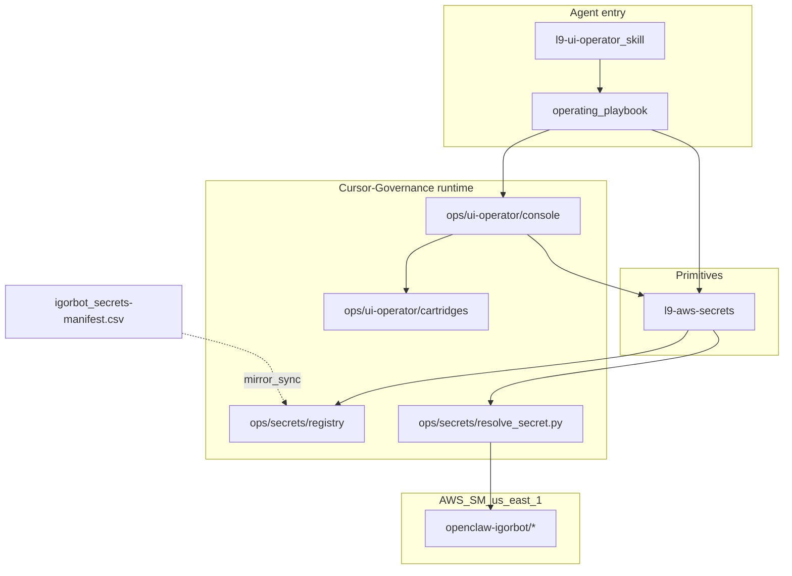

# PLAN: Portable UI Operator — build-ready

Status: **BUILD COMPLETE** (GMP-1…3 validated 2026-08-06). Registry SSOT = Cursor-Governance AWS sync (user-directed supersession of igorbot CSV mirror).

## Locked layer model (skill vs playbook vs cartridge)

Do not demote the operator to a “playbook” merely because it sequences other skills.

| Layer | Name | What it is |
|---|---|---|
| Primitive skill | `l9-aws-secrets` | Resolve `openclaw-igorbot/<name>#<field>`; registry lookup; fail-closed |
| Orchestrator skill | `l9-ui-operator` | Discoverable control plane; API-first; loads `l9-aws-secrets`; drives console |
| Operating playbook | `saas-dashboard-when-api-insufficient` | Altitude procedure owned by `l9-ui-operator`: triggers, skill/tool sequence, phase contracts, hard stop rules |
| Cartridge | e.g. `github-packages-actions-access` | Site/journey data only: URLs, secret refs, selectors, mutation allowlist — not a separate skill |

**Playbook altitude (locked):** one (or few) multi-skill operating playbooks — not one playbook per button. Narrow step lists belong inside cartridges when needed.

**Compiler note:** `l9-skill-compiler` treats “domain playbook” as a *source* that compiles into skills. Here the operating playbook ships as a first-class artifact under the UI-operator skill pack (`references/` or `playbooks/`), not as a substitute for the skill entrypoint.

## Answer: separate AWS secrets skill?

**Yes.** Ship thin exemplary `l9-aws-secrets`, then have `l9-ui-operator` load it.

- Reusable beyond UI (Graphiti, OpenClaw, deploy, CI).
- Igorbot owns the CSV SSOT; Governance **mirrors and resolves**.
- Do not embed AWS resolve only inside the UI skill.

## Ground truth from Quantum-L9/igorbot

| Artifact | Role |
|---|---|
| [secrets-manifest.csv](https://github.com/Quantum-L9/igorbot/blob/main/workspace/contracts/secrets-manifest.csv) | Machine-readable inventory |
| [secrets_structure.md](https://github.com/Quantum-L9/igorbot/blob/main/docs/secrets_structure.md) | Namespace `openclaw-igorbot/*`, region `us-east-1` |
| [openclaw-aws-resolver.py](https://github.com/Quantum-L9/igorbot/blob/main/bin/openclaw-aws-resolver.py) | ID format `secret_id#json_field` |
| [secure-env.sh](https://github.com/Quantum-L9/igorbot/blob/main/bin/secure-env.sh) | Boot-time env export |

UI-relevant existing refs: `openclaw-igorbot/github#token`, `openclaw-igorbot/vercel#token`.

**Missing today:** Playwright `storage_state` secrets. Convention to add to registry (provision in AWS separately): `openclaw-igorbot/ui-session-<site>` JSON key `storage_state`, `provisioned: false` until created.

Cursor-Governance today has **no** openclaw inventory mirror (only Graphiti docs for `l9/OPENAI_API_KEY`).

## Objective

Portable browser UI-operator so agents configure SaaS dashboards when APIs are insufficient (GitHub Packages Manage Actions, Vercel settings, Meta/WhatsApp, etc.), **without Keychain or daily-Chrome cookie decrypt**.

**Success:**
1. Resolve any registered secret by ref on any machine with AWS creds (value never logged/committed).
2. Universal console + JIT-draftable cartridges; operating playbook at campaign altitude.
3. GitHub Packages Actions-access cartridge completes with before/after evidence receipt.
4. Playwright + boto3 via `[project.optional-dependencies].ui-operator` in [pyproject.toml](pyproject.toml) (append-only).
5. `uv sync --extra ui-operator` documented; Playwright **not** on default `dev` / every `make pr`.

## Architecture

## Scope

**In:**
- Registry mirror + sync from igorbot CSV
- `ops/secrets/resolve_secret.py` (igorbot resolver protocol)
- Skills: `l9-aws-secrets`, `l9-ui-operator` (compile + wire)
- Operating playbook: configure SaaS when API insufficient
- Console runtime + receipt schema
- Cartridge schema + JIT drafter
- First cartridge: `github-packages-actions-access`
- pyproject `ui-operator` extra; requirements.txt pointer comment only
- UI session secret registry convention
- Root / protected-file documentation updates (see below)

**Out:**
- Keychain / browser-cookie3 as primary auth
- Editing igorbot as inventory SSOT (mirror only)
- Product E2E rule [rules/51-qa-playwright.mdc](rules/51-qa-playwright.mdc)
- Playwright on `dev` extra
- 1Password / Infisical (v1 = AWS only)
- Committing secret values or live `storage_state`
- Rewriting large sections of additive-only root files (append only; use `ALLOW-ROOT-DELETION` only if proven necessary)

## Concrete defaults (locked)

| Decision | Choice |
|---|---|
| Secret namespace | `openclaw-igorbot/*`, `us-east-1` |
| Governance inventory | Mirror YAML from igorbot CSV; sync script; refs only |
| Resolver ID format | `secret_id#json_key` (identical to igorbot) |
| Dep home | `pyproject.toml` `[project.optional-dependencies].ui-operator` |
| Playwright pin | `playwright==1.56.0` (matches verified local; pin exact) |
| boto3 | `boto3>=1.34,<2` (resolver may use AWS CLI subprocess like igorbot; boto3 available for future) |
| Runtime home | `ops/secrets/` + `ops/ui-operator/` |
| Profiles dir | `~/.l9-ui-profiles/<site>/` seeded from vault `storage_state` when provisioned |
| First cartridge | GitHub Packages Manage Actions |
| GitHub UI evidence | Settings URL `…/packages/npm/graphiti-memory-client/settings`; form `#repo-add-access-selector-actions` → `bulk_add_actions_access`; role Read = permission `contents`; source repo Admin left alone |
| Execution protocol | `l9-gmp-protocol` (protected `pyproject.toml` = append-only) |

## Pre-Validation (run at build start)

| Check | Action | Pass |
|---|---|---|
| P0 | Bind write root: `ops/secrets`, `ops/ui-operator`, `skills/` | Bound |
| P1 | Fetch igorbot CSV; list enabled secret_ids | Matches known inventory |
| P2 | `aws sts get-caller-identity`; resolve check for `openclaw-igorbot/github#token` without printing value | AWS OK |
| P3 | `make pr-check` before claiming done | PASS; no commit/push unless asked |
| P4 | `pyproject.toml` changes append-only | No key overwrite |

## Build sequence (GMP)

**GMP-1 — Secrets foundation (M0+M1)**
1. `ops/secrets/sync_igorbot_manifest.py` → `openclaw-igorbot.registry.yaml` + schema
2. `ops/secrets/resolve_secret.py` (`--ref`, `--check`, never echo values)
3. Compile/wire `l9-aws-secrets`
4. Append `ui-operator` optional-deps to pyproject; pointer in requirements.txt
5. Unit tests with mocked AWS CLI

**GMP-2 — UI console + playbook + first cartridge (M2)**
1. Console runner + receipt schema
2. Operating playbook artifact under UI-operator skill pack
3. Cartridge schema + JIT drafter
4. `github-packages-actions-access` cartridge from tonight’s form evidence
5. Wire `l9-ui-operator`

**GMP-3 — Expansion stub + root docs (M3 + M4-root-docs)**
1. JIT-draft Vercel cartridge stub (no requirement to complete Meta/WhatsApp in v1)
2. Document `uv sync --extra ui-operator` + `playwright install`
3. Apply root / protected-file doc updates (section below)
4. Final `make pr-check`

## Root and protected-file documentation updates (required before merge)

Root-file protection ([ops/config/root-file-protection.json](ops/config/root-file-protection.json) / AGENTS.md): **canonical = append-only**; **managed = editable with CODEOWNERS review**. Do not invent a second secrets narrative that contradicts igorbot.

### Canonical (append-only)

| File | Update |
|---|---|
| [AGENTS.md](AGENTS.md) | New subsection after toolchain / Graphiti: **AWS secrets registry + UI operator** — namespace `openclaw-igorbot/*`, mirror at `ops/secrets/`, skills `l9-aws-secrets` / `l9-ui-operator`, `uv sync --extra ui-operator`, no Keychain, refs-only in git, Diagnose-before-mutate for vault writes |
| [requirements.txt](requirements.txt) | Append comment block pointing at `pyproject` extra `ui-operator` (playwright/boto3); clarify **not** required for `make pr` |
| [pyproject.toml](pyproject.toml) | Append `[project.optional-dependencies] ui-operator = [...]` only (already in plan) |
| [Makefile](Makefile) | Append targets: `secrets-sync` (run mirror script), `secrets-check` (resolve `--check` without printing values), `ui-operator-sync` (`uv sync --extra ui-operator`); extend `help` echo lines |
| [CANONICAL_LAW.md](CANONICAL_LAW.md) | Append short anti-pattern: do not use macOS Keychain / daily-Chrome cookie decrypt for governed UI automation; use AWS SM refs via `ops/secrets` + `l9-aws-secrets` |
| [SECURITY.md](SECURITY.md) | Append bullet: secret **values** never in repo; inventory is IDs/keys only; UI receipts must redact values |

### Managed (edit freely under owner review)

| File | Update |
|---|---|
| [README.md](README.md) | Directory tree: add `ops/secrets/`, `ops/ui-operator/`; skill index bullets for `l9-aws-secrets` and `l9-ui-operator`; one-liner install for UI extra |
| [CHANGELOG.md](CHANGELOG.md) | Unreleased / dated entry describing secrets mirror, skills, UI operator, pyproject extra |
| [.gitignore](.gitignore) | Ignore local UI profile/runtime residue if not already covered: `~`-style is OS-local, but ignore any in-repo paths such as `ops/ui-operator/receipts/*.local.*`, `.l9-ui-profiles/` if ever created under repo, and keep `.env.local` / `env.local` ignored |
| [TODO.md](TODO.md) | Only if build leaves follow-ups (e.g. provision `ui-session-*` in AWS); otherwise skip |

### Do not require for v1 (unless drift forces it)

| File | Why skip unless needed |
|---|---|
| `ORG_INVARIANTS.yaml` | No new org invariant required if AGENTS + CANONICAL_LAW cover operator rules |
| `CODEOWNERS` | Unchanged ownership |
| `.env.example` / `.env.template` | Machine AWS creds are IAM/profile, not repo env files |
| `CLAUDE.md` | Not a root protected peer of AGENTS in this repo layout; skill wiring covers Claude discovery |
| Product E2E `rules/51-qa-playwright.mdc` | Different concern (app tests vs admin UI operator) |

### Non-root docs that still benefit (include in GMP-3)

| Path | Update |
|---|---|
| `ops/secrets/README.md` | New — how to sync, resolve, registry schema, link to igorbot CSV SSOT |
| `ops/ui-operator/README.md` | New — console, playbook, cartridges, install extra, receipt location |
| Skill packs’ own `SKILL.md` | Created by compiler (not root) |
| Run `l9-update-agent-docs` / wire skill | Ensures agent skill registries mention the new skills |

## Operating playbook outline (must ship in GMP-2)

`saas-dashboard-when-api-insufficient`:
1. Bind target site + goal; fail-closed if mutation exceeds allowlist
2. Load `l9-aws-secrets`; resolve required refs
3. Prefer API/CLI path; record why UI is required if API insufficient
4. Load cartridge or JIT-draft → **human approve** if new/changed
5. Console execute journey; capture before/after evidence
6. Emit receipt (actor, refs used [ids only], actions, verdict)
7. Stop conditions: missing AWS, missing approve, visibility/destructive change, PAT creation requested

## First cartridge outline (must ship in GMP-2)

`github-packages-actions-access`:
- Package settings URL for `@quantum-l9/graphiti-memory-client`
- Preserve visibility; do not remove unrelated entries
- Ensure Read on Website-Bot, LLM-Router, SEO-Bot
- Do not add publisher as consumer; leave `l9-graphiti-memory` Admin
- Selectors: `#repo-add-access-selector-actions` summary “Add Repository”; post `bulk_add_actions_access`
- Auth: `openclaw-igorbot/github#token` for API verify; `openclaw-igorbot/ui-session-github#storage_state` when provisioned

## Milestones

| M | Outcome |
|---|---|
| M0 | Registry mirror + resolve `--check` for github token (no value printed) |
| M1 | `l9-aws-secrets` wired; pyproject `ui-operator` extra present |
| M2 | Console + operating playbook + GitHub cartridge + `l9-ui-operator` wired |
| M3 | JIT Vercel stub; root/protected docs updated; install docs; `make pr-check` PASS |

## Checkpoints

| CP | Evidence | No-go |
|---|---|---|
| CP0 | Registry enabled IDs match igorbot CSV | Inventing secret IDs |
| CP1 | Resolve succeeds; logs/receipts show refs only | Keychain or value echo |
| CP2 | GitHub cartridge receipt before/after | Claiming all-SaaS done |
| CP3 | `make pr-check` PASS | Open/push PR on fail |

## Risks

| Risk | Mitigation |
|---|---|
| Manifest drift | Sync script + hash check vs fetched CSV |
| UI sessions absent in AWS | Registry `provisioned: false`; human provisions once |
| pyproject protected | Append-only optional extra |
| Playwright on PR gate | Keep off `dev` |
| Narrow playbook trap | One altitude playbook; site detail in cartridges |
| Fragile DOM | Version cartridges; JIT + approve; role/label first |

## Final Validation

- [x] `make pr-check` PASS
- [x] Registry SSOT at `ops/secrets/` synced from AWS (refs only; Governance-owned — supersedes igorbot CSV mirror)
- [x] `resolve_secret --ref openclaw-igorbot/github#token --check` exits 0, no value printed
- [x] Skills wired: `l9-aws-secrets`, `l9-ui-operator`
- [x] Operating playbook present under UI-operator pack
- [x] GitHub cartridge + receipt path documented
- [x] Root docs: AGENTS.md, README.md, CHANGELOG.md, requirements.txt pointer, Makefile help targets updated per table
- [x] Canonical files changed **append-only** (root-file-protection gate green via `make pr`)
- [x] Explicit: no Keychain, no Chrome Safe Storage, no secret values in git

## Initiate build

User command: execute this plan with **`l9-gmp-protocol`**, starting **GMP-1 (M0+M1)**. Do not skip Pre-Validation P0–P2.
