# Publish-path writers-first + scoped suites

Kernel pass: `Validate & Repair` on this plan (not on product code). Defects below were verified against `origin/main` artifacts and repaired in this document.

## What those three suites check

They are isolated product suites, not generic PR health. On `origin/main`, [`run_pr_gate.sh`](ops/scripts/run_pr_gate.sh) runs all four local suites from [`ops/config/python-contract.json`](ops/config/python-contract.json) whenever any changed path ends in `.py`.

- **claude-code-autonomy** — [`environment/program-execution/peer_execution/autonomy/`](environment/program-execution/peer_execution/autonomy/): scheduler ready-set, claim/lease, worker lanes, join/merge, state store, CLI. Not Cursor [`ops/autonomy/`](ops/autonomy/) (L4 / merge). Those stay repo-root.
- **Wave 3** — [`environment/agents/generated-data/`](environment/agents/generated-data/): packet harvest, YAML routes, Graphiti/Odoo adapters, outbox, fail-closed routing, golden pipeline.
- **PE controller** — [`environment/program-execution/core/program-execution-controller-template/`](environment/program-execution/core/program-execution-controller-template/): template/schema presence, lease/verify/recovery/wave unittest, negative matrix (creates/abandons git worktrees).

**Locked:** do not filter on “PE campaign PR”. Filter by **exclusive `owned_paths` ∩ changed files**. A campaign that only edits `INTENT.yaml` pays nothing. A non-campaign edit to `scheduler.py` or the controller template pays that suite only. Full corpus stays `make test` / `make pr-full` / nightly `--profile ci` (no `--changed-file`).

`repo-root` today is `owned_paths: ["."]` plus argv `pytest .` with three `--ignore`s. That is why one `ops/scripts/*.py` change still collects PE compiler/adapter tests and bills ~1240 cases. The Makefile line “CHANGED FILES ONLY” is true for pre-commit/ruff/gitleaks and false for pytest.

```mermaid
flowchart TD
  subgraph today [Today make pr]
    A[precommit skips sync-generated] --> B[gate reruns precommit]
    B --> C[all 4 pytest suites]
    C --> D[sync-generated --check]
    D --> E[heal commit]
    E --> F[full suites again]
  end
  subgraph next [Target]
    K[kernel verify invariants plus kernel SHAs] --> R[eof trailing ruff]
    R --> S[sync-generated writer]
    S --> T[fail-closed tracked dirt]
    T --> Z[kernel seal post-writer digest]
    Z --> U[cheap contract surface]
    U --> V[owned_paths scoped suites]
    V --> W[changed-file security]
    W --> X[push]
  end
```



## Defects this kernel found in the prior plan (repaired)

- **Digest vs writers contradiction.** A first-hook check of `worktree_digest` is invalidated by ruff/eof/sync. That would fail the same `precommit-repo` run and force a second kernel stamp. **Repair:** two-phase receipt (verify before writers, seal after).
- **Placeholder owned_paths.** “`ops/`, `tests/ops/`, … etc.” is not executable. **Repair:** exclusive partition below; repo-root is “not the other three prefixes”.
- **Either/or locks.** Post-pytest sync “drop or keep”; generated-after-authorize “fold or exempt”. **Repair:** one behavior each.
- **Forgeable `findings_digest`.** An agent-written JSON with a nonempty string is honor-system. **Repair:** only `kernel_gate.py` writes the receipt; invariants are observed exit codes from named commands.
- **Assumed 243 Makefile.** `origin/main` [`Makefile`](Makefile) does **not** have `pr-check: precommit-repo`. Double-run today is `run_pr_gate.sh` calling precommit internally. **Repair:** one hook owner (`precommit-repo`); gate never reruns hooks. Add Makefile dep if missing.
- **`check_ignore_ownership`.** [`validate_python_contract.py`](ops/scripts/validate_python_contract.py) assumes repo-root `owned_paths == ["."]`. That check must be updated when root no longer claims `.`.
- **AGENTS.md** still says `sync_generated_artifacts.py` is WARN-to-stage after the gate. That sentence becomes false and must be appended-over.

## Locked contracts

### Exclusive owned_paths

| Suite | `owned_paths` (implementation + tests) |
|---|---|
| `claude-code-autonomy` | `environment/program-execution/peer_execution/autonomy/` |
| `subagent-generated-data-wave3` | `environment/agents/generated-data/` |
| `program-execution-controller` | `environment/program-execution/core/program-execution-controller-template/` |
| `repo-root` | every other pytest-collected tree (implicit complement). Do **not** keep `owned_paths: ["."]`. Store the three specialized prefixes as `foreign_owned_paths` on repo-root, or list the complement explicitly. Validator: every specialized ignore has exactly one owner; no prefix is owned by two suites. |

`--changed-file` skip: if no changed path is under a suite’s prefixes, print `SKIP suite=… reason=owned_paths` and do not start it. No `.py`/`.pyi` in the change set → skip **all** suites (same as today’s “skip pytest” branch, without the full-run trigger).

### repo-root collector (deterministic, no `pytest .` on the PR path)

Input: changed paths not owned by the three specialized suites. Output: pytest file args, or skip.

For each changed `*.py` / `*.pyi`:

1. If the path is already a test (`test_*.py`, `*_test.py`, or under a `tests/` directory) → include it.
2. Else try, in order, and include every path that exists:
   - same dir `test_<stem>.py` / `<stem>_test.py`
   - same dir `tests/test_<stem>.py`
   - `tests/<parent-rel>/test_<stem>.py` (repo-root `tests/` mirror)
3. If none exist: include sibling `test_*.py` in the same directory only.
4. If still none: **skip that file** with `NOTE: no mapped tests for <path>`. Do **not** walk up to repo root. Do **not** run another suite.

`--profile ci` / `make test` / `make pr-full` keep current argv (`pytest .` + ignores). They must not pass `--changed-file`.

### Hook order (one pass)

Exact catalog order in [`.pre-commit-config.yaml`](.pre-commit-config.yaml):

1. `l4-kernel-verify` — invariants + kernel file SHAs + `head`; **does not** bind porcelain digest
2. Existing read-cheap scanners that cannot rewrite (merge-conflict, yaml, large-files, path-contract) may sit here or after writers; they must not run after a dirty fail
3. Writers: `end-of-file-fixer`, `trailing-whitespace`, `ruff`, `ruff-format`
4. `sync-generated-artifacts` — **not** on `SKIP_LIST`
5. Remaining read-only (rules-check, skills-check, hygiene, wiring)
6. Locked `lint-ruff` already in [`run_pr_precommit.sh`](ops/scripts/run_pr_precommit.sh)
7. Fail-closed if tracked porcelain dirty — generated paths included. Message names `WROTE:` paths. No auto-stage. No post-pytest heal.
8. `l4-kernel-seal` — writes `post_writer_digest` from current HEAD + porcelain (generated paths **included** once staged; unstaged generated dirt already failed step 7)

[`run_pr_gate.sh`](ops/scripts/run_pr_gate.sh): **no** `_gate_run_precommit`; **no** `sync_generated_artifacts.py` writer. Optional 1s `--check` after precommit-repo only to assert generated prefixes match HEAD (must be empty-diff). Delete the `any .py → run everything` branch.

Makefile: `pr-check` and `pr` depend on `precommit-repo` first (add the dep on main; it is missing today).

### Kernel receipt (machine, not honor-system)

Schema `l9.l4_kernel_receipt.v1` at `.l9/autonomy/kernel-receipt.json` (gitignored).

**Only** [`ops/autonomy/kernel_gate.py`](ops/autonomy/kernel_gate.py) may write it.

```bash
# After the agent applied Recursive Alignment + Validate & Repair (may edit code):
"$GOV/.venv/bin/python" ops/autonomy/kernel_gate.py verify
# precommit-repo runs verify (hook) → writers → seal (script tail)
"$GOV/.venv/bin/python" ops/autonomy/kernel_gate.py seal
```

Receipt fields:

- `schema`, `head`, `kernel_shas` (sha256 of `kernels/Recursive Alignment.md` and `kernels/Validate & Repair.md`)
- `invariants`: list of `{id, argv, exit_code}` from **named** existing checkers (`validate_governance_contract_surface.py`, `validate_legacy_doctrine_residue.py`, `assert` no live-deprecated skills, generated-prefix ownership). Fail-closed on nonzero.
- `applied_at`, `agent_id` from env (`L9_MEMORY_AGENT_ID`)
- `post_writer_digest` — set only by `seal`

`l4_local.py record-kernels` **loads a sealed receipt**. It must not accept `--status passed` without the file. `authorize-release` requires `head` + `post_writer_digest` to match the current tree. No generated-only second commit path: generated dirt fails precommit-repo before authorize.

Hook does not invoke an LLM. Agent applies the two kernel docs **before** `kernel_gate.py verify`. That is the before-ruff rule.

### Other locked waste

- Do not export `PR_STACK` into pytest. Regression: `make pr-check` child env must not contain `PR_STACK=auto`.
- Gate receipt skip stays. Because generated heal happens inside precommit-repo **before** pytest, a passing tree is not re-billed 1240 tests.
- No PacketEnvelope. No rebase onto 243. **New branch from `origin/main`**.

## Files

- [`ops/scripts/run_python_test_suites.py`](ops/scripts/run_python_test_suites.py) — `--changed-file`, skip, collector
- [`ops/config/python-contract.json`](ops/config/python-contract.json) — exclusive owned_paths
- [`ops/scripts/validate_python_contract.py`](ops/scripts/validate_python_contract.py) — ignore-ownership without `owned_paths == ["."]`
- [`ops/scripts/run_pr_gate.sh`](ops/scripts/run_pr_gate.sh) — scoped runner only
- [`ops/scripts/run_pr_precommit.sh`](ops/scripts/run_pr_precommit.sh) — un-skip sync; seal at end
- [`.pre-commit-config.yaml`](.pre-commit-config.yaml) + [`ops/config/precommit-hook-contract.json`](ops/config/precommit-hook-contract.json)
- new `ops/autonomy/kernel_gate.py` + hook; [`ops/autonomy/l4_local.py`](ops/autonomy/l4_local.py)
- [`Makefile`](Makefile) — `pr-check: precommit-repo` / `pr: precommit-repo` additive
- [`tests/ops/scripts/test_pr_lifecycle.py`](tests/ops/scripts/test_pr_lifecycle.py) + new collector/kernel tests
- [`AGENTS.md`](AGENTS.md) append-only: writers-first, scoped suites, heal-after-pytest retired, `make pr-full` is full corpus

## Out of scope

- Weakening scanners
- pytest-testmon / new plugins
- LLM inside the hook
- Merging 242/243
- Changing nightly `--profile ci` topology
- Re-applying kernels as an LLM on every ruff-only whitespace change (verify+seal are enough when invariants still pass)

## Success (falsifiable)

- Change only `ops/scripts/pr_gate_failure.py` → runner SKIPs autonomy, Wave 3, PE controller; repo-root argv is the mapped test file(s), not `.`
- Change `peer_execution/autonomy/scheduler.py` → autonomy runs; Wave 3 and PE controller SKIP
- No `.py` in the change set → all four SKIP
- `SKIP_LIST` does not contain `sync-generated-artifacts`
- Stale `RULES-MANIFEST` fails in `precommit-repo` before any pytest line
- `run_pr_gate.sh` has no second precommit invocation
- `kernel_gate.py verify` without a prior apply/invariants pass exits nonzero; `record-kernels` without a sealed receipt exits nonzero
- After ruff rewrites a file in the same `precommit-repo` run, `seal` succeeds (verify did not require the pre-writer digest)
- `make pr-check` in final validation; `PR_REMEDIATE=0 make pr` after L4 on the new branch

## Stress

- **False skip:** collector finds no tests and skips a real regression. Mitigation: sibling `test_*.py` rule; nightly `pr-full`; do not invent `pytest .` fallback.
- **Kernel theater:** only `kernel_gate.py` writes the receipt; invariants are observed subprocesses.
- **Seal after dirty fail:** unstaged generated dirt fails before seal; authorize never sees a sealed-but-dirty tree.
- Rollback: revert the branch. Old behavior is `SKIP_LIST` + `any .py` full run.

## Execute

New branch from `origin/main`. `@environment/program-execution` + `/autonomy` under a Program lease. `autonomous_merge: false`.
