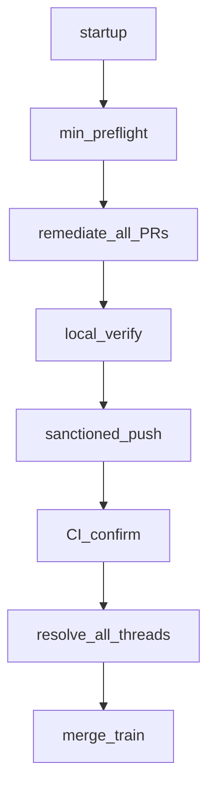

# PR remediation skill 4.0

```yaml
plan_identity:
  plan_id: pr_remediation_v4_run_contract
  command_surface: /l9-plan
  mode: FORMAL_L9_PLAN
  date: "2026-08-16"
  skill: l9-pr-remediation
  target_version: "4.0.0"
  source_versions:
    ssot_main: "3.2.0"
    pr_192_worktree: "3.5.0"
  landing_branch: feat/l9-pr-remediation-cra-one-and-done
  landing_pr: "Quantum-L9/Cursor-Governance#192"
  skill_root_for_edits: /Users/macm2/.l9/gov-worktrees/l9-pr-remediation-cra/skills/l9-pr-remediation
  ssot_main_root_do_not_edit_in_place: /Users/macm2/.cursor-governance/skills/l9-pr-remediation
  source_findings: PREVIOUS_TURN skill_refinement_findings.yaml
  recursive_passes_completed: 3
  second_order_refinement: COMPLETE
  status: executable_after_user_confirm
  autonomous_merge: false

objective: >
  Permanently remove the test-run waste paths (blocked git push, repeated ABI
  venv repair, oldest-first merge churn, duplicate CI, exhaustive census) from
  l9-pr-remediation while keeping codebase-only edits, no --admin, no gate
  weakening, and GitHub conversation-resolution as a hard merge predicate.

source_findings:
  consumed: true
  p0: [S01, S02, S03, S04, S05, S14]
  p1: [S06, S07, S08, S09, S10]
  p2_included: [S11, S12, S13]
  p3: []
  exclusions:
    - finding: S10
      implementation: detect_and_cache_only
      reason: >
        Host Makefile / run_pytest_suites.sh UV_PYTHON pin is a Cursor-Governance
        runtime defect, not a skill-pack mutation. Skill must detect arch/ABI
        mismatch and export UV_PYTHON for the run. Do not edit host Makefile
        in this plan unless a separate authorized host change is added.

verified_problem_statement: >
  Version 3.2.0 (and 3.5.0 on #192) still treat Converge as
  census-everything then remediate-and-merge each PR oldest-createdAt-first,
  document raw git push, and assume make pr-check is a code gate. The 2026-08-16
  Cursor-Governance test-run showed those three assumptions created ~30m
  avoidable latency, 6 venv repairs, 2 blocked pushes, 2 merge-conflict events,
  and 5 avoidable CI runs. #192 already added CRA + resolve-all conversations
  but kept merge-as-you-go (merge then update-branch). That is recovery, not
  prevention.

target_state: >
  One 4.0.0 pack on #192. Startup emits a cached RUN_CONTRACT. Mutation uses
  the sanctioned publish target only. Environment is fingerprinted once and
  reused. All in-scope PRs are inventoried and overlap-scored before any merge.
  Remediation commits are pushed and greened first. Merge happens only as a
  conflict-aware train. Threads of any author are resolved before merge.
  Final status reports timing counters. self_test.py locks the contract strings.

scope:
  in:
    - "#192 skill pack files listed in file_change_map"
    - "host companions required by a SKILL.md description change: ops/generated/skill-registry.json and environment/agents/adapters/claude-code/generated/skill-registry.json"
    - "absorb #192 references/code-review-agents.md and references/remediation-plan.md into the 4.0.0 contract"
  out:
    - "Merging #192 as part of this implementation"
    - "Editing Cursor-Governance Makefile / run_pytest_suites.sh / run_pr_gate.sh (S10 host pin)"
    - "Editing .github/workflows/**"
    - "Rebuilding ~/.cursor-governance/.venv in-place"
    - "New PE kernels, new reusable Core workflows, org pack sync"
    - "Live re-remediation of already-merged #186/#191"
    - "On-disk run-state artifact inside the skill pack (causes registry/MANIFEST churn)"
    - "Separate preflight.md / venv.md / topology.md / ci-efficiency.md files"

architecture_changes:
  - id: A1
    change: "Split Converge into REMEDIATE_ALL then MERGE_TRAIN. Delete merge-on-green-oldest-first."
  - id: A2
    change: "Add one run-contract reference as the only new behavior home (command surface, venv, topology, session cache, fast path)."
  - id: A3
    change: "Add ENVIRONMENT ownership class. Native-ext/ABI failures are not CODEBASE."
  - id: A4
    change: "Publish verb becomes sanctioned target from preflight, not git push."
  - id: A5
    change: "Conversation merge predicate is GraphQL isResolved=false count == 0 for any author, not CRA membership."

second_order_refinement:
  pass_name: SECOND_ORDER_SKILL_REFINEMENT
  rejected_as_overbuilt:
    - "Five extra reference files; collapsed into references/run-contract.md"
    - "On-disk .l9/pr-remediation-run.yaml in the skill pack"
    - "Live GitHub integration tests; use string/contract self_test.py"
    - "#192 default pre-commit --all-files plus Makefile (duplicate latency); Makefile primary + planned/cited paths"
    - "#192 Law 12 update-branch-after-each-immediate-merge as the strategy (still merge-as-you-go)"
    - "Mandatory full Sonar/CodeQL/debt census when those checks are green"
    - "Lock-unpinning cryptography as an env repair"
    - "L9_PUBLISH_PATH_OVERRIDE retry after first git push deny"
  kept_after_challenge:
    - "CRA class + inspect/fix/reply (user-requested, already on #192)"
    - "Resolve every review thread before merge (S05; GitHub hard gate)"
    - "One commit per PR cycle (prevents CI amplification)"
    - "PR_REMEDIATE=0 so make pr does not spawn a competing poll worker"
    - "Explicit-path staging (host blocks git add -u/-A and reset --hard)"
  critical_path_after_refinement:
    - startup
    - minimum_preflight
    - first_useful_remediation
    - remediation_batch
    - validation
    - sanctioned_push
    - CI_confirm
    - merge_train

skill_behavior_changes:
  - change_id: C01
    source_issue_ids: [S01, S14]
    problem: "Oldest-first merge-as-you-go made later PRs CONFLICTING."
    root_cause: "Merge is treated as per-PR success instead of a repo-level train."
    exact_skill_behavior_to_change: "SKILL.md Law 12 / hot path 8–9 / Done When; merge-advise.md oldest-first; #192 Law 12 update-branch-after-merge; convergence-loop.md converged→merge then next."
    intended_new_behavior: "FIRST_MERGE_GATE. Remediate+push+green the set. Then merge train. update-branch only as a train primitive after an authorized merge, and only for PRs whose overlap predicted material effect."
    implementation_surface: [SKILL.md, references/merge-advise.md, references/convergence-loop.md, references/run-contract.md, references/remediation-plan.md]
    dependency: [C11]
    regression_test: T_merge_train
    speed_impact: "Removes ~8–15m conflict+CI per extra PR."
    correctness_impact: "Prevents false done on an earlier PR that poisons later PRs."
    risk: "Train delay if one PR stays HUMAN-blocked; remaining green PRs with empty overlap may merge if the gate documents independence."
    done_condition: "No skill text instructs merge-oldest-first or merge-on-first-green."

  - change_id: C02
    source_issue_ids: [S02, S13]
    problem: "Skill documents git push and git add -A; host blocks both."
    root_cause: "Host-agnostic mutation verbs; no cached command surface."
    exact_skill_behavior_to_change: "remediation-plan.md §4 git push; fix-engine.md step 8–9 git add -A && git push; merge-advise.md git push origin main."
    intended_new_behavior: "Preflight once. If Makefile has pr/pr-check, publish=PR_REMEDIATE=0 make pr. Stage explicit planned paths only. First publish-path deny is a skill defect, not a retry cue. Read-only git inspection remains allowed."
    implementation_surface: [SKILL.md, references/run-contract.md, references/fix-engine.md, references/remediation-plan.md, references/merge-advise.md]
    dependency: [C11]
    regression_test: T_make_only
    speed_impact: "Saves 2–5m probe loop every governed host."
    correctness_impact: "Stops override/breakglass as the path."
    risk: "Repos without Makefile keep workflow run: fallback (already specified)."
    done_condition: "self_test fails if skill text tells an agent to git push when a pr target exists."

  - change_id: C03
    source_issue_ids: [S03, S04, S10]
    problem: "Six venv repairs; SSOT/miniconda x86_64 cryptography 50 ABI; uv sync wiped pins."
    root_cause: "Competing venvs; uv picks Rosetta 3.12; gate always uv sync --extra dev; skill has no fingerprint."
    exact_skill_behavior_to_change: "Hot path treats make pr-check red as CODEBASE by default."
    intended_new_behavior: >
      Authoritative runtime is UV_PYTHON = native CPython matching requires-python/.python-version.
      Worktree .venv is built from that interpreter. .cursor-commands/.venv is an alias of
      $GOV_ROOT/.venv via the governance symlink — not a third authority; reject if
      pyvenv.cfg home is x86_64/miniconda on arm64. Fingerprint once
      (python, version, arch, cryptography+pytest import). Repair only on invalidation.
      Never symlink a failing SSOT venv. Never pip-downgrade lock pins.
    implementation_surface: [references/run-contract.md, references/ownership-boundary.md, references/finding-classifier.md, SKILL.md, references/validation-gates.md]
    dependency: []
    regression_test: T_venv
    speed_impact: "Removes the ~20m ABI loop on this machine class."
    correctness_impact: "ABI is ENVIRONMENT, not a code or lock-pin defect."
    risk: "Host still resyncs on make pr; persistence requires exporting UV_PYTHON for every subsequent make pr in the run."
    done_condition: "Skill states fingerprint, invalidation, and UV_PYTHON reuse; forbids SSOT-venv symlink and crypto unpin."

  - change_id: C04
    source_issue_ids: [S05]
    problem: "Green CI then merge blocked on unresolved conversations; CodeQL re-files on new lines."
    root_cause: "Merge gate keyed on CRA membership / leave-human-open, not isResolved."
    exact_skill_behavior_to_change: "SSOT Law 11 leave human-decision open; ownership-boundary HUMAN leave thread open; CRA closed set excludes github-advanced-security."
    intended_new_behavior: "Keep #192 resolve-all. Re-query after every push and immediately before merge. HUMAN: name decision in reply, resolve thread, do not merge that PR until decided. Re-files are new threads."
    implementation_surface: [SKILL.md, references/review-replies.md, references/code-review-agents.md, references/ownership-boundary.md, references/convergence-loop.md]
    dependency: [C11]
    regression_test: T_conversations
    speed_impact: "Avoids a human interrupt after 'green'."
    correctness_impact: "GitHub conversation resolution cannot block merge unexpectedly."
    risk: "Resolving a true undecided HUMAN thread could hide the decision; mitigated by not merging that PR."
    done_condition: "Merge predicate is zero unresolved reviewThreads any author."

  - change_id: C05
    source_issue_ids: [S06]
    problem: "Companion generated manifests missed; remote CI discovered them."
    root_cause: "One-commit plan has no generator companions."
    exact_skill_behavior_to_change: "remediation-plan.md clusters.files lists only edited sources."
    intended_new_behavior: "If plan touches pec/*, skills/*, rules/*, name generator refresh on the plan and include outputs in the same commit. This implementation itself must refresh the two skill-registry.json copies."
    implementation_surface: [references/remediation-plan.md, references/run-contract.md]
    dependency: [C11]
    regression_test: T_companions
    speed_impact: "Saves one full CI per miss."
    correctness_impact: "Restores one-and-done."
    risk: "Host generator command names vary; table is pattern + Cursor-Governance examples, not a universal script."
    done_condition: "Companion miss is a plan-gate failure."

  - change_id: C06
    source_issue_ids: [S07]
    problem: "Fresh worktrees fail symlinks-check; detached HEAD; L4 SHA stale; wire rewrites AGENTS.md."
    root_cause: "Skill assumes cwd is the PR branch."
    exact_skill_behavior_to_change: "Hot path 0 jumps to gh pr list with no worktree/wire/L4/UV_PYTHON bootstrap."
    intended_new_behavior: "Bootstrap once: worktree add -B; setup_workspace_symlinks; do not commit wire/AGENTS.md; checkout not detached; L4 after the remediation commit when required; reuse cached UV_PYTHON."
    implementation_surface: [references/run-contract.md, SKILL.md]
    dependency: []
    regression_test: T_bootstrap
    speed_impact: "First make pr-check can be the real one."
    correctness_impact: "Prevents accidental AGENTS.md/registry commits."
    risk: "setup_workspace_symlinks host-specific; document as Cursor-Governance example."
    done_condition: "Bootstrap block exists; dirty AGENTS.md after wire is not a finding."

  - change_id: C07
    source_issue_ids: [S08]
    problem: "Full census/re-ingest did not prevent the expensive failures."
    root_cause: "Law 1 + #192 plan-before-patch equate more cataloging with safety."
    exact_skill_behavior_to_change: "SSOT Law 1 always ingest all; #192 mandatory full census before any edit; no resume-locked-plan."
    intended_new_behavior: "Required preflight is closed: command surface, venv, PR inventory+overlap, known blockers, verify path. Per-PR finding ingest only for the PR about to be edited. Locked plan → execute. Lazy Sonar/CodeQL/debt unless check failing or configured-and-blocking. Resume discovery on unexpected failure."
    implementation_surface: [SKILL.md, references/remediation-plan.md, references/signal-ingestion.md, references/run-contract.md]
    dependency: [C11]
    regression_test: T_fast_path
    speed_impact: "Cuts time-to-first-useful-action on resume and multi-PR runs."
    correctness_impact: "Keeps the high-leverage planning (overlap/venv/commands)."
    risk: "Lazy scanner miss if a green check hides an open alert; Law 13 pending-remote still applies when a scanner check exists."
    done_condition: "Skill text marks extra catalog steps optional; closed preflight list."

  - change_id: C08
    source_issue_ids: [S09]
    problem: "make pr spawned a poll worker that later claimed merge_eligible on stale d51f893."
    root_cause: "PR_REMEDIATE default 1; worker merge gate SHA-stale."
    exact_skill_behavior_to_change: "Hot path does not set PR_REMEDIATE=0; no stale-SHA rule."
    intended_new_behavior: "Converge publish always PR_REMEDIATE=0. Poll workers never merge. merge_eligible older than HEAD or older than last repo merge is invalid."
    implementation_surface: [SKILL.md, references/run-contract.md, references/convergence-loop.md]
    dependency: [C02]
    regression_test: T_poll_stale
    speed_impact: "Avoids dual-agent fights."
    correctness_impact: "Prevents stale merge."
    risk: "None if autonomous_merge stays false."
    done_condition: "Skill forbids trusting poll-worker merge_eligible after another PR merged."

  - change_id: C09
    source_issue_ids: [S11]
    problem: "Default ruff/pre-commit skip WIP; CQ still flags those files."
    root_cause: "Local verify ≠ review-bot surface."
    exact_skill_behavior_to_change: "validation-gates / #192 pre-commit --all-files as the verify list."
    intended_new_behavior: "Makefile primary is the gate. Also run the relevant hook/compiler on cited/planned paths even when excluded from default ruff. Do not require --all-files."
    implementation_surface: [references/validation-gates.md, references/remediation-plan.md]
    dependency: [C11]
    regression_test: T_cited_paths
    speed_impact: "Small; avoids a false-green then extra compile."
    correctness_impact: "Cited WIP/CQ files get a real local check."
    risk: "None."
    done_condition: "Verify list includes cited paths."

  - change_id: C10
    source_issue_ids: [S12]
    problem: "sonar_fetch.py --output /tmp blocked."
    root_cause: "Examples use paths outside CWD."
    exact_skill_behavior_to_change: "signal-ingestion.md / sonar examples."
    intended_new_behavior: "Write fetch outputs under $PWD. Path-blocked fetch does not block Converge when that check is green."
    implementation_surface: [references/signal-ingestion.md, references/sonarcloud-remediation.md]
    dependency: []
    regression_test: T_sonar_cwd
    speed_impact: "Small."
    correctness_impact: "Scanner census can actually run."
    risk: "None."
    done_condition: "No example uses /tmp for fetch output."

  - change_id: C11
    source_issue_ids: [S05, S08]
    problem: "SSOT 3.2.0 lacks CRA/one-and-done files; #192 3.5.0 has them but keeps merge-as-you-go and full census."
    root_cause: "Two pack lineages."
    exact_skill_behavior_to_change: "Entire #192 SKILL.md hot path 8–9 and remediation-plan census-mandatory / git push."
    intended_new_behavior: "Absorb CRA + resolve-all + structured plan ledger. Rewrite merge, push, census, and verify defaults to 4.0.0. Bump version 4.0.0 (breaking Converge semantics)."
    implementation_surface: [SKILL.md, references/code-review-agents.md, references/remediation-plan.md]
    dependency: []
    regression_test: T_version_and_resource_map
    speed_impact: "Enables C01/C02/C07 without a second PR."
    correctness_impact: "One contract."
    risk: "Large SKILL.md rewrite; mitigate by keeping Diagnose read-only unchanged in intent."
    done_condition: "Pack version 4.0.0; resource map lists run-contract.md; no oldest-first merge."

  - change_id: C12
    source_issue_ids: [S01, S02, S03, S05, S08, S09]
    problem: "Pack has no self_test; regressions can return as prose drift."
    root_cause: "No executable contract."
    exact_skill_behavior_to_change: "None today (gap)."
    intended_new_behavior: "scripts/self_test.py string/contract tests listed in regression_tests. SKILL.md Validation section must invoke it."
    implementation_surface: [scripts/self_test.py, SKILL.md]
    dependency: [C01, C02, C03, C04, C07, C08, C11]
    regression_test: T_self_test_runs
    speed_impact: "Seconds per change; prevents recurrence."
    correctness_impact: "Fail-closed on instruction drift."
    risk: "String tests are brittle to wording; test invariants not full paragraphs."
    done_condition: "python3 scripts/self_test.py exits 0 on the edited pack."

  - change_id: C13
    source_issue_ids: [S08]
    problem: "No timing counters, so the next test-run cannot prove improvement."
    root_cause: "Final Status has no metrics."
    exact_skill_behavior_to_change: "SKILL.md Final Status block."
    intended_new_behavior: "Required counters: time_to_first_useful_action, blocked_command_attempts, environment_repair_count, ci_run_count, merge_conflict_count, repeated_command_count. No new observability subsystem."
    implementation_surface: [SKILL.md, references/run-contract.md]
    dependency: []
    regression_test: T_status_counters
    speed_impact: "Near zero."
    correctness_impact: "Makes the next replay measurable."
    risk: "None."
    done_condition: "Final Status requires the counters."

  - change_id: C14
    source_issue_ids: [S03, S04]
    problem: "ABI failures were treated as code/lock defects."
    root_cause: "Ownership enum has no ENVIRONMENT."
    exact_skill_behavior_to_change: "ownership-boundary.md and finding-classifier.md four-class tables."
    intended_new_behavior: "ENVIRONMENT: interpreter/arch/ABI/venv. Do not edit source. Run venv preflight once. Continue other clusters."
    implementation_surface: [references/ownership-boundary.md, references/finding-classifier.md]
    dependency: [C03]
    regression_test: T_venv
    speed_impact: "Stops the pin-downgrade detour."
    correctness_impact: "Keeps lock integrity."
    risk: "None."
    done_condition: "ENVIRONMENT is a first-class ownership class."

  - change_id: C15
    source_issue_ids: [S05]
    problem: "HUMAN 'leave thread open' conflicts with conversation-resolution merge gate."
    root_cause: "Two laws."
    exact_skill_behavior_to_change: "ownership-boundary.md HUMAN action."
    intended_new_behavior: "Reply with the decision named (or Deferred + linked issue), resolve the thread, do not merge that PR until the human decision exists."
    implementation_surface: [references/ownership-boundary.md, references/review-replies.md]
    dependency: [C04]
    regression_test: T_conversations
    speed_impact: "None."
    correctness_impact: "Removes the Law 11 vs HUMAN contradiction."
    risk: "Operators must read remaining HUMAN blockers in Final Status."
    done_condition: "HUMAN no longer says leave the thread open."

preflight_redesign:
  closed_list:
    - P_cmd: "Parse Makefile for pr / pr-check / open_pr_after_gate; cache publish=PR_REMEDIATE=0 make pr when present."
    - P_venv: "Read .python-version, .venv/pyvenv.cfg, python arch, cryptography+pytest import; set UV_PYTHON; reject x86_64 python on arm64."
    - P_prs: "gh pr list + per-PR files via gh pr view --json files; overlap matrix; generated-output overlap."
    - P_wire: "Worktree not detached; required symlinks; do not commit wire artifacts."
    - P_blockers: "Known HUMAN / CI_PIPELINE / ENVIRONMENT."
    - P_verify: "Makefile primary target name + cited-path hook list."
  stop_cataloging_when: "RUN_CONTRACT is filled and the next PR to edit has a finding list sufficient to patch without predictable rework."
  resume_discovery_when: [unexpected_failure, scope_change, new_dependency, environment_drift, PR_topology_change, conflicting_evidence]
  session_cache: "Emit RUN_CONTRACT once in the first status (in-run). Reuse until invalidation. Do not write it into the skill pack."

pr_topology_and_merge_strategy:
  inventory: "All open PRs; number, base, head SHA, createdAt, files[].path."
  edges: [base_dependency, stacked_dependency, file_overlap, semantic_overlap, generated_output_overlap, merge_effect_dependency]
  stacked_detection: "head of PR A is base of PR B, or PR B branch contains PR A commits."
  independent: "empty file overlap and not stacked."
  first_merge_gate_forbids_until:
    - entire_PR_inventory_complete
    - overlap_matrix_known
    - remediation_plan_complete_for_required_sequence
    - expected_merge_effect_on_remaining_PRs_known
    - merge_strategy_selected
  remediation_rule: "Push intended fixes across the planned set before any merge."
  merge_train: "Order by predicted blast radius, not createdAt. Prefer merging a PR that does not invalidate remaining green heads. After each merge, update-branch only PRs with predicted material overlap. Revalidate CI only when HEAD changed."
  anti_pattern_forbidden: "remediate A → merge A → discover B conflicts → remediate B → rerun CI → repeat"
  test_run_reconstruction_note: >
    #186/#191/#192 were independent branches sharing AGENTS.md, RULES-MANIFEST.*,
    and skill-registry.json. createdAt order was the worst merge order.

command_surface_enforcement:
  this_host:
    verify: "make pr-check"
    publish: "PR_REMEDIATE=0 make pr"
    merge: "gh pr merge --squash --delete-branch"
    readonly_git: allowed
  forbidden_after_P_cmd:
    - git push
    - git push with L9_PUBLISH_PATH_OVERRIDE
    - gh pr create when make pr opens the PR
    - git add -u / git add -A
    - git reset --hard
  cache: "RUN_CONTRACT.command_surface for the entire run."

venv_and_environment_authority:
  authoritative_runtime: "UV_PYTHON native CPython matching requires-python (test-run success: uv-managed aarch64 CPython 3.12.13)."
  authoritative_venv_after_build: "worktree .venv created by uv sync using that UV_PYTHON."
  cursor_commands_venv: >
    /Users/macm2/.cursor-commands does not exist as a standalone tree. In a wired
    worktree .cursor-commands → ~/.cursor-governance, so .cursor-commands/.venv
    is ~/.cursor-governance/.venv. That SSOT venv pyvenv.cfg home is
    /Users/macm2/miniconda3/bin CPython 3.12.11 macos-x86_64. cryptography import
    failed (_BIO_ADDR_free). It is not authoritative on arm64.
  why_another_venv_was_created: "uv run --no-build and uv sync --extra dev create/resync worktree .venv; default 3.12 resolver picked miniconda."
  why_abi_broke: "x86_64 Rosetta interpreter + cryptography 50 abi3 .so / OpenSSL symbol mismatch."
  why_repairs_did_not_persist: "run_pytest_suites.sh always uv sync --extra dev, restoring lock pin 50.0.0 onto the default interpreter unless UV_PYTHON is exported."
  make_pr_behavior: "Mutates/resyncs worktree .venv. Does not use a persistent good env unless UV_PYTHON is set."
  fingerprint: [python_path, version, arch, pyvenv_home, cryptography_import, pytest_import, UV_PYTHON]
  invalidation: [".python-version change", "uv.lock change", "pyvenv.cfg home change", "import fail", "arch mismatch", "UV_PYTHON unset on a new worktree"]
  repair_allowed_when: "Fingerprint invalid. Once per invalidation. Then reuse."
  repair_forbidden: ["symlink SSOT venv", "pip install cryptography==<not lock>", "retry make pr-check as CODEBASE"]

execution_fast_path:
  - "If locked Remediation-Cycle / plan exists and files still match, skip re-diagnosis; run P_cmd+P_venv if uncached; verify+publish."
  - "After RUN_CONTRACT, start the first PR that has CODEBASE findings. Do not wait for green-check scanner fetches."
  - "Parallelize independent PR worktrees after the overlap matrix exists. Serialize merge."
  - "If make pr-check fails on native-ext import, stop CODEBASE diagnosis; P_venv once."
  - "If git push is denied with make pr message, do not retry git push."
  - "If CI is green and only conversations are open, reply+resolve; no new code cycle."

ci_efficiency_strategy:
  when_CI_is_worth_running: "After one locally green sanctioned push per PR, or after a train update-branch that changed HEAD."
  batch_before_CI: "All planned CODEBASE clusters + companions + conversation replies that need no code."
  independent_CI: "Each PR needs its own confirmation on its head SHA."
  revalidate_after_merge: "Only PRs whose overlap predicted material effect and whose HEAD changed."
  green_remains_valid: "Same SHA, no new required check, no new unresolved thread."
  invalidates_green: "New commit, update-branch, required-check rename, new review thread after push."
  never: "push-to-probe; update-branch before the train; merge-then-hope."

error_recovery_strategy:
  environment_failure: "Classify ENVIRONMENT; P_venv once; do not loop lock pins."
  command_rejection: "If message names make pr / explicit paths, cache and switch. Do not probe a second forbidden verb."
  PR_state_drift: "Re-query that PR only (mergeable, HEAD, threads). Do not re-census the fleet."
  merge_conflict: "If unpredicted, topology preflight failed — rebuild overlap for remaining PRs before the next merge. If predicted, apply the planned resolve (usually regenerate generated outputs) on that branch before merging it."
  stale_poll_worker: "Ignore. Never merge from worker merge_eligible."

observability_and_timing:
  required_in_final_status:
    - time_to_first_useful_action
    - blocked_command_attempts
    - environment_repair_count
    - ci_run_count
    - merge_conflict_count
    - repeated_command_count
  no_new_scripts: true

file_change_map:
  - path: /Users/macm2/.l9/gov-worktrees/l9-pr-remediation-cra/skills/l9-pr-remediation/SKILL.md
    authoritative_role: skill_entrypoint
    change_type: MODIFY
    reason: "4.0.0 laws, hot path REMEDIATE_ALL/MERGE_TRAIN, resource map, Validation, Final Status counters."
    related_change_ids: [C01, C02, C03, C04, C06, C07, C08, C11, C12, C13]
    dependent_files: [references/run-contract.md, references/merge-advise.md, references/remediation-plan.md]
    validation: self_test + pack structure

  - path: /Users/macm2/.l9/gov-worktrees/l9-pr-remediation-cra/skills/l9-pr-remediation/references/run-contract.md
    authoritative_role: run_preflight_cache_topology_venv
    change_type: ADD
    reason: "Single new reference. Do not add more behavior files."
    related_change_ids: [C01, C02, C03, C05, C06, C07, C08]
    dependent_files: [SKILL.md]
    validation: linked from SKILL.md Resource Map

  - path: /Users/macm2/.l9/gov-worktrees/l9-pr-remediation-cra/skills/l9-pr-remediation/references/remediation-plan.md
    authoritative_role: per_PR_ledger
    change_type: MODIFY
    reason: "Keep ledger; drop mandatory full census and git push; add companions + cited-path verify."
    related_change_ids: [C01, C02, C05, C07, C09, C11]
    dependent_files: [SKILL.md]
    validation: self_test

  - path: /Users/macm2/.l9/gov-worktrees/l9-pr-remediation-cra/skills/l9-pr-remediation/references/code-review-agents.md
    authoritative_role: CRA_protocol
    change_type: MODIFY
    reason: "Keep CRA closed set; point merge gate to any-author isResolved (C04). File already exists on #192; ADD equivalent if implementing from 3.2.0 only — not this landing."
    related_change_ids: [C04, C11]
    dependent_files: [references/review-replies.md]
    validation: self_test

  - path: /Users/macm2/.l9/gov-worktrees/l9-pr-remediation-cra/skills/l9-pr-remediation/references/merge-advise.md
    authoritative_role: merge_policy
    change_type: MODIFY
    reason: "Delete oldest-first immediate merge and raw git push origin main."
    related_change_ids: [C01, C02]
    dependent_files: [SKILL.md]
    validation: self_test

  - path: /Users/macm2/.l9/gov-worktrees/l9-pr-remediation-cra/skills/l9-pr-remediation/references/fix-engine.md
    authoritative_role: fix_batch
    change_type: MODIFY
    reason: "Replace git add -A / git push with explicit add + sanctioned publish."
    related_change_ids: [C02]
    dependent_files: [references/run-contract.md]
    validation: self_test

  - path: /Users/macm2/.l9/gov-worktrees/l9-pr-remediation-cra/skills/l9-pr-remediation/references/convergence-loop.md
    authoritative_role: poll_and_decide
    change_type: MODIFY
    reason: "Converged ≠ merge. Train + conversation re-query + stale worker ignore."
    related_change_ids: [C01, C04, C08]
    dependent_files: [SKILL.md]
    validation: self_test

  - path: /Users/macm2/.l9/gov-worktrees/l9-pr-remediation-cra/skills/l9-pr-remediation/references/review-replies.md
    authoritative_role: replies
    change_type: MODIFY
    reason: "Resolve every thread; HUMAN synthesis."
    related_change_ids: [C04, C15]
    dependent_files: [references/ownership-boundary.md]
    validation: self_test

  - path: /Users/macm2/.l9/gov-worktrees/l9-pr-remediation-cra/skills/l9-pr-remediation/references/ownership-boundary.md
    authoritative_role: ownership
    change_type: MODIFY
    reason: "Add ENVIRONMENT; rewrite HUMAN."
    related_change_ids: [C14, C15]
    dependent_files: [references/finding-classifier.md]
    validation: self_test

  - path: /Users/macm2/.l9/gov-worktrees/l9-pr-remediation-cra/skills/l9-pr-remediation/references/finding-classifier.md
    authoritative_role: classifier
    change_type: MODIFY
    reason: "ENVIRONMENT row."
    related_change_ids: [C14]
    dependent_files: [references/ownership-boundary.md]
    validation: self_test

  - path: /Users/macm2/.l9/gov-worktrees/l9-pr-remediation-cra/skills/l9-pr-remediation/references/validation-gates.md
    authoritative_role: local_verify
    change_type: MODIFY
    reason: "Makefile primary + cited paths; env smoke; no --all-files default."
    related_change_ids: [C03, C09]
    dependent_files: [references/run-contract.md]
    validation: self_test

  - path: /Users/macm2/.l9/gov-worktrees/l9-pr-remediation-cra/skills/l9-pr-remediation/references/signal-ingestion.md
    authoritative_role: ingest
    change_type: MODIFY
    reason: "Lazy scanners; CRA pointer; sonar $PWD."
    related_change_ids: [C07, C10, C11]
    dependent_files: [references/sonarcloud-remediation.md]
    validation: self_test

  - path: /Users/macm2/.l9/gov-worktrees/l9-pr-remediation-cra/skills/l9-pr-remediation/references/sonarcloud-remediation.md
    authoritative_role: sonar
    change_type: MODIFY
    reason: "Output path must stay in CWD."
    related_change_ids: [C10]
    dependent_files: [scripts/sonar_fetch.py]
    validation: self_test T_sonar_cwd

  - path: /Users/macm2/.l9/gov-worktrees/l9-pr-remediation-cra/skills/l9-pr-remediation/references/diagnose-workflow.md
    authoritative_role: diagnose
    change_type: MODIFY
    reason: "Overlap advisory; CRA blockers; still read-only / no merge."
    related_change_ids: [C01, C11]
    dependent_files: [SKILL.md]
    validation: Diagnose forbidden verbs unchanged

  - path: /Users/macm2/.l9/gov-worktrees/l9-pr-remediation-cra/skills/l9-pr-remediation/scripts/self_test.py
    authoritative_role: pack_gate
    change_type: ADD
    reason: "Contract tests."
    related_change_ids: [C12]
    dependent_files: [SKILL.md]
    validation: exit 0

  - path: /Users/macm2/.l9/gov-worktrees/l9-pr-remediation-cra/ops/generated/skill-registry.json
    authoritative_role: generated_companion
    change_type: MODIFY
    reason: "SKILL.md description/version drift (S06 applied to this change)."
    related_change_ids: [C05, C11]
    dependent_files: [environment/agents/adapters/claude-code/generated/skill-registry.json]
    validation: make pr-check / governance-self-check

  - path: /Users/macm2/.l9/gov-worktrees/l9-pr-remediation-cra/environment/agents/adapters/claude-code/generated/skill-registry.json
    authoritative_role: generated_companion
    change_type: MODIFY
    reason: "Pair of the ops registry."
    related_change_ids: [C05, C11]
    dependent_files: [ops/generated/skill-registry.json]
    validation: pair digest

  unchanged_on_purpose:
    - scripts/sonar_fetch.py
    - scripts/codeql_fetch.py
    - scripts/debt_audit.py
    - references/review-angles.md
    - references/codeql-remediation.md
    - references/debt-remediation.md

dependency_topology:
  unlock_order:
    - C11
    - C02
    - C03
    - C14
    - C01
    - C07
    - C04
    - C15
    - C05
    - C06
    - C08
    - C09
    - C10
    - C13
    - C12
  note: "C12 last so tests lock the rewritten text. C11 first because #192 files are the edit base."

implementation_phases:
  - id: phase_1_execution_contract
    goals: [authorized_command_surface, authoritative_environment, minimum_preflight_contract]
    changes: [C11, C02, C03, C14, C06]
  - id: phase_2_pr_topology
    goals: [PR_inventory, dependency_graph, overlap_detection, merge_train_strategy]
    changes: [C01]
  - id: phase_3_fast_remediation
    goals: [remove_redundant_cataloging, reuse_verified_context, critical_path_execution, safe_parallelism]
    changes: [C07, C09]
  - id: phase_4_ci_efficiency
    goals: [prevent_duplicate_CI, define_CI_trigger_points]
    changes: [C05, C08]
  - id: phase_5_failure_recovery
    goals: [environment_failure_handling, command_rejection_handling, PR_state_drift, merge_conflict_prevention]
    changes: [C04, C15, C10]
  - id: phase_6_observability
    goals: [counters_in_final_status]
    changes: [C13]
  - id: phase_7_regression_validation
    goals: [behavioral_tests, negative_tests]
    changes: [C12]
    then: "python3 scripts/self_test.py; PR_REMEDIATE=0 make pr-check in the #192 worktree with cached UV_PYTHON. Do not merge #192."

pr_merge_plan:
  for_this_implementation: "Do not merge #192. Only publish skill commits via sanctioned make pr if the user later authorizes execution."
  for_refined_skill_runtime:
    nodes: all_open_PRs
    edges: as_above
    remediation_rule: complete_then_merge_train
    merge_gate: first_merge_gate
    anti_pattern: forbidden

venv_plan:
  authoritative_venv: "worktree .venv built with native UV_PYTHON"
  cursor_commands_venv_role: "alias of SSOT .venv; not authoritative when arch-mismatched"
  consumer: "make pr-check / uv run / run_pytest_suites.sh"
  invalidation: as_above
  cryptography: "ABI break from Rosetta miniconda 3.12.11 + cryptography 50; not a missing wheel in the abstract"
  make_pr_mutates: true
  persist_by: "export UV_PYTHON for every make pr in the run"
  detect_valid: "fingerprint match + imports succeed"
  repair_again_only_when: invalidation

ci_strategy:
  objective: minimize_total_CI_runs_without_weakening_validation
  points: as_ci_efficiency_strategy

regression_tests:
  - id: T_make_only
    assert: "No instruction to bare git push when Makefile pr exists; first deny does not retry git push."
  - id: T_bare_git_never
    assert: "fix-engine/remediation-plan/merge-advise do not contain a standalone `git push` success path."
  - id: T_venv
    assert: "x86_64/miniconda pyvenv.cfg ⇒ ENVIRONMENT reject; UV_PYTHON required; no cryptography unpin; no SSOT symlink repair."
  - id: T_venv_persist
    assert: "Text requires UV_PYTHON reuse across subsequent make pr; repair only on invalidation."
  - id: T_abi_before_pr
    assert: "P_venv before first make pr-check."
  - id: T_no_premature_merge
    assert: "No oldest-first / merge-on-first-green."
  - id: T_stack_detect
    assert: "Stacked = head-is-base or contained commits."
  - id: T_overlap_before_merge
    assert: "FIRST_MERGE_GATE requires overlap matrix."
  - id: T_merge_train
    assert: "Remediate-all then train; update-branch only predicted-overlap PRs."
  - id: T_ci_not_repeated
    assert: "Green SHA remains valid until HEAD/check/thread change."
  - id: T_fast_path
    assert: "Closed preflight; locked-plan resume; lazy scanners."
  - id: T_conversations
    assert: "isResolved=false any author blocks merge; HUMAN does not leave threads open."
  - id: T_companions
    assert: "pec/skills/rules edits require generator outputs on the plan."
  - id: T_poll_stale
    assert: "PR_REMEDIATE=0; ignore stale merge_eligible."
  - id: T_cited_paths
    assert: "Cited paths verified even if toolchain excludes them."
  - id: T_sonar_cwd
    assert: "Fetch output under $PWD."
  - id: T_bootstrap
    assert: "Wire artifacts not findings; no detached HEAD."
  - id: T_status_counters
    assert: "Final Status lists the six counters."
  - id: T_self_test_runs
    assert: "scripts/self_test.py exit 0."
  - id: T_version_and_resource_map
    assert: "version 4.0.0; run-contract.md linked."

validation_evidence:
  implementation_gate:
    - "python3 scripts/self_test.py (pack)"
    - "PR_REMEDIATE=0 make pr-check in #192 worktree with UV_PYTHON cached (host)"
    - "Do not merge #192"
  later_replay_metrics:
    - before_vs_after_total_runtime
    - before_vs_after_time_to_first_useful_action
    - blocked_command_attempt_count
    - environment_repair_count
    - CI_run_count
    - repeated_command_count
    - merge_conflict_count
    - remediation_rework_count
  success_rule: >
    Not improved merely because new rules exist. Next Converge replay must show
    lower avoidable latency and equal or greater correctness. Baseline from
    findings: 43m continuation, ~30m avoidable, 18 failed commands, 6 venv
    repairs, 9 CI runs / 5 avoidable, 2 merge conflicts.

rollback_plan: >
  Revert the #192 skill commit(s). Pack has no runtime hook in consumer CI.
  Do not revert already-merged #186/#191. Do not rebuild venvs as rollback.

risks:
  - "Large SKILL.md rewrite can drop a Law; C12 string tests mitigate."
  - "Host UV_PYTHON remains unpinned (S10); recurrence if agent forgets export — skill can only detect."
  - "Resolving HUMAN threads may look like agreement; Final Status must list HUMAN blockers."
  - "#192 worktree gitdir was broken at last local inspect; implementation must re-attach or recreate the worktree (UNKNOWN until execute)."
  - "Skill-registry companions can CONFLICT with origin/main again; regenerate, do not hand-merge JSON."

unknowns:
  - "Whether the #192 worktree gitdir is still valid (last inspect: fatal not a git repository)."
  - "Exact optimal train order for a future 3-PR set; skill computes from overlap, does not hardcode 192-then-191-then-186."
  - "Whether SSOT .venv can be rebuilt to aarch64 without a host Makefile change (out of scope)."
  - "Sonar findings on the test-run PRs (fetch path-blocked)."
  - "PLAN_DOCUMENT JSON file will be emitted at execute-prep if the user chains PE; this Cursor plan is the confirmable projection."

acceptance_criteria:
  - Every P0 has a change_id (C01, C02, C03, C04, C14, C15).
  - Every P1 has a change_id or evidence-backed exclusion (S10 detect-only).
  - PR topology resolved before merge execution in the refined skill.
  - Bottom-up premature merging prohibited.
  - Makefile-only mutation explicit for this host.
  - Bare git mutation prevented before execution.
  - Venv authority and persistence deterministic (UV_PYTHON fingerprint).
  - Repeated cryptography ABI repair prevented unless inputs changed.
  - Minimum sufficient preflight replaces exhaustive census.
  - Verified context reused until invalidated.
  - CI points are dependency-aware.
  - Regression tests cover high-recurrence failures.
  - Second-order pass removed extra files, --all-files default, merge-then-update-as-strategy, lock-unpin repair.
  - Implementation ordered by dependency unlock.

convergence:
  status: converged
  recursive_passes: 3
  second_order_refinement_required: true
  require:
    no_unmapped_P0_or_P1_finding: true
    no_known_recurrence_path_without_prevention: true
    no_predictable_PR_conflict_path: true
    no_repeated_environment_repair_path: true
    no_known_blocked_command_path: true
    no_unnecessary_CI_path: true
    no_redundant_planning_step: true
    same_implementation_plan_after_multiple_passes: true
  remaining_unknown_ids:
    - worktree_gitdir_health
    - ssot_venv_rebuild
    - sonar_test_run
  next_skill: l9-ynp
  execute_via: "@environment/program-execution then @autonomy under Program lease"
  stop_reason: "Plan ready for user confirm. Do not edit the skill until authorized."
```

Critical path after the second-order pass:



Execute via @environment/program-execution + autonomy after confirm. Do not free-form mutate from this plan. Do not merge #192 during implementation. Recommended next skill after confirm: `l9-ynp` to pick the execute path.
