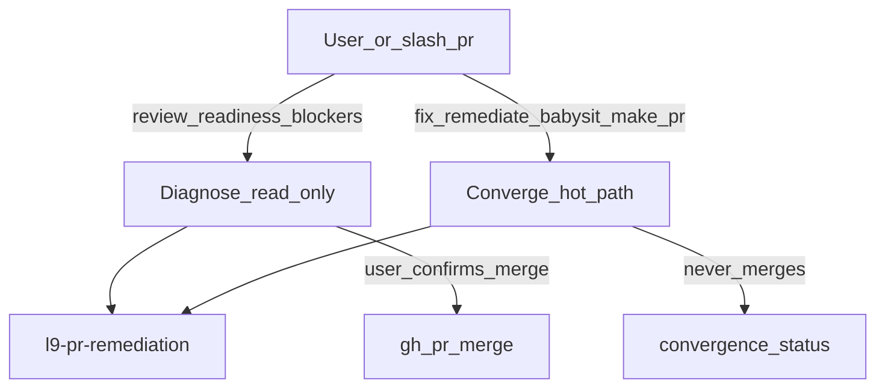

# PLAN: Fold PR analysis into l9-pr-remediation

*(Improved via `kernels/Improve.md` — plan artifact only; execution not started.)*

### Objective
Consolidate the PR lifecycle into **one live pack** [`skills/l9-pr-remediation`](skills/l9-pr-remediation): **Diagnose** (read-only status/review/merge-advise) + existing **Converge** hot path. Archive [`skills/l9-pr-analysis`](skills/l9-pr-analysis) to `skills/_archived/l9-pr-analysis/`. **Do not rename** `l9-pr-remediation` — leave make-pr / autonomy / [`ops/scripts/open_pr_after_gate.sh`](ops/scripts/open_pr_after_gate.sh) skill strings untouched.

**Success (falsifiable):**
- Live discovery has exactly one PR skill: `skills/l9-pr-remediation/` (no top-level `skills/l9-pr-analysis/`)
- `l9-pr-analysis` exists only under `skills/_archived/l9-pr-analysis/` and is absent from both AUTONOMY tiers + `ops/generated/skill-registry.json`
- Live remediation content has no alignment %, gap matrix, deep-eval, or `pr-babysitting`
- Review prompts route primary → `l9-pr-remediation` with `hint_allowed` (Read ≠ mutate)
- “Implement fixes, push, merge” still does **not** auto-authorize Converge (`expected_primary: null`, remediation still `forbidden` without packet/explicit)
- `open_pr_after_gate.sh` still emits `"skill": "l9-pr-remediation"`
- `python3 environment/claude-code/validate_skill_activation.py` PASS
- `make pr` PASS on the change set

### Scope
**In:**
- Expand remediation `SKILL.md` + three thin diagnose refs
- Port keepers: review angles, slim status/verdict, don’t-unpack, merge-after-confirm
- Unwire/archive `l9-pr-analysis` per [`skills/l9-wire-skill-into-repo/references/unwire-deprecate.md`](skills/l9-wire-skill-into-repo/references/unwire-deprecate.md)
- Retarget analysis-only discovery + slash `/pr` surfaces
- bounded-autonomy babysit **wording** only
- Include current uncommitted remediation WIP in the **same** change set (do not reset Sonar/CodeQL/debt work)
- After unwire: `make sync-generated` (registry, adapters, projected llm-rules)

**Out:**
- Renaming `l9-pr-remediation`
- Editing make-pr handoff skill-name strings (rule 98, `open_pr_after_gate.sh`, Makefile make-pr skill literal)
- Restoring gap/alignment/deep-eval or nested babysit
- Changing Sonar/CodeQL/debt Converge mechanics (aside from description/trigger text)
- Porting `pr-template-github.md` (PR body authoring; not Diagnose/Converge)
- Cursor platform `babysit` skill
- Re-unwiring `l9-pr-remediation-deprecated` — **already** at [`skills/_archived/l9-pr-remediation-deprecated`](skills/_archived/l9-pr-remediation-deprecated) (verify absence from live tiers only)
- ADR-0001 rewrite — ADR already names remediation for Converge only; Diagnose add-on does not contradict it (N/A)

### Locked design



| Intent | Mutates | Triggers | Behavior |
|--------|---------|----------|----------|
| **Diagnose** | no | review / readiness / blockers / `/pr` / “ready to merge?” | Fetch PR+reviews+CI; slim verdict; optional review angles; YNP; **never** commit/push |
| **Converge** | yes | fix / remediate / babysit / make-pr poll / autonomy packet | Existing v3 hot path; **never** merges (law 12) |

**Merge** is not a third intent — it is a **Diagnose exit** after explicit user confirm (`gh pr merge` only; never unpack diffs into the worktree).

**Intent precedence (hard):**
1. If mutate language is present (`fix`, `remediate`, `babysit`, `push`, make-pr handoff, autonomy packet) → **Converge** (Diagnose may run as cycle-0 status inside Converge, but must not stop at advise-only).
2. Else if review/readiness/blockers/`/pr` → **Diagnose** only.
3. Ambiguous mixed ask without mutate verbs → **Diagnose**; ask one question before Converge.

**Invocation:** keep `disable-model-invocation: true`. Route `pr_analysis` → `primary: l9-pr-remediation` + `hint_allowed: true`. Remove `l9-pr-analysis` from `auto_invoke`. Drop `l9-gap-analysis` from `pr_analysis.supporting` (gap scoring deleted). Keep `l9-structured-reasoning` as optional supporting only if still useful for hard blocker judgment — default **drop** to one primary.

**Doctrine edit:** replace “No modes” with: “One pack, two intents (Diagnose | Converge). No packaging theater. Converge remains one path, max depth.”

### Pre-Validation
| id | Action | Pass criteria | Status |
|----|--------|---------------|--------|
| P1 | Confirm packs | `skills/l9-pr-analysis` live; remediation live; deprecated already under `_archived/` | Passed (observed) |
| P2 | Dirty tree | Inventory uncommitted remediation diffs; fold Diagnose on top | Pending at execute |
| P3 | Routing SSOT | Cases live at `ops/skill_routing/tests/skill_routing_cases.json` (validator path); `environment/claude-code/tests/skill_routing_cases.json` is **stale duplicate** — update SSOT then delete or sync shim | Passed (path verified) |
| P4 | Registry SSOT | `ops/generated/skill-registry.json` (not only `environment/claude-code/generated/`) | Passed |

### TODO Plan

1. **`expand-skill`** — [`skills/l9-pr-remediation/SKILL.md`](skills/l9-pr-remediation/SKILL.md)
   Intent gate + precedence table; description covers review **and** remediate; version `3.1.0`; keep explicit-only; resource-map diagnose refs; Converge laws unchanged except doctrine sentence.

2. **`add-diagnose-refs`** — `skills/l9-pr-remediation/references/`
   - `diagnose-workflow.md` — metadata, unresolved reviews, CI rollup, optional protected/size **if** policy files exist, blockers, verdict `MERGE | MERGE WITH CONDITIONS | BLOCKED`, YNP; **forbid** alignment/gap/deep-eval/index theater
   - `review-angles.md` — port from analysis `pr-review-angles.md`
   - `merge-advise.md` — don’t-unpack CRITICAL + post-confirm `gh pr merge` methods only
   - Do **not** port `pr-babysitting.md`, intelligence scoring, or `pr-template-github.md`

3. **`retarget-discovery`** (before unwire — no discovery gap)
   - [`skills/AUTONOMY_MANIFEST.yaml`](skills/AUTONOMY_MANIFEST.yaml): remove analysis from `auto_invoke`; set `pr_analysis.primary: l9-pr-remediation`, `hint_allowed: true`; strip `l9-gap-analysis` from that route’s supporting; update negative_signals so “implement fixes / push” still refuse silent Converge
   - [`rules/23-l9-skill-routing.mdc`](rules/23-l9-skill-routing.mdc): PR review row → `l9-pr-remediation` (hint)
   - [`commands/pr.md`](commands/pr.md): thin → load remediation Diagnose; delete v12 intelligence body
   - [`rules/02-slash-commands.mdc`](rules/02-slash-commands.mdc): `/pr` description → Diagnose (drop “gap assessment”)
   - [`commands/COMMANDS_MANIFEST.yaml`](commands/COMMANDS_MANIFEST.yaml): align `/pr` blurb if present
   - **SSOT cases:** [`ops/skill_routing/tests/skill_routing_cases.json`](ops/skill_routing/tests/skill_routing_cases.json)
     - Review case: `expected_primary: l9-pr-remediation`; supporting `[]` or only structured-reasoning if kept
     - Mutate/merge case: keep `expected_primary: null`, `forbidden` includes `l9-pr-remediation`; drop `l9-pr-analysis` from forbidden once archived **or** keep as regression that it never routes
   - Delete or re-sync stale [`environment/claude-code/tests/skill_routing_cases.json`](environment/claude-code/tests/skill_routing_cases.json) so it cannot drift (prefer delete if shim; else copy from ops SSOT)

4. **`unwire-analysis`** — `l9-wire-skill-into-repo` unwire
   - `git mv skills/l9-pr-analysis skills/_archived/l9-pr-analysis`
   - Frontmatter: `status: deprecated`, `superseded_by: l9-pr-remediation`, `disable-model-invocation: true`
   - `do_not_migrate_to_skills` entry for archived path
   - Clear managed skills / adapter symlink
   - `make sync-generated` (or `python3 ops/scripts/sync_generated_artifacts.py --root …`)
   - Prove absence checklist from unwire ref
   - Verify `l9-pr-remediation-deprecated` remains archived-only (no live tier row)

5. **`babysit-ref-cleanup`** — [`pr-poll-subagent.md`](skills/l9-bounded-autonomy/references/pr-poll-subagent.md), [`prompt-templates.md`](skills/l9-bounded-autonomy/references/prompt-templates.md): replace “babysit / pr-babysitting structure” with “remediation Converge loop”. Skill name strings unchanged.

6. **`validate-pr`**
   ```bash
   make sync-generated
   python3 environment/claude-code/validate_skill_activation.py
   make pr
   rg -n 'l9-pr-analysis' skills/AUTONOMY_MANIFEST.yaml ops/generated/skill-registry.json rules/23-l9-skill-routing.mdc || true
   # expect: no live activation refs (archived path / history only)
   rg -n '"skill": "l9-pr-remediation"' ops/scripts/open_pr_after_gate.sh
   ```

### Critical path
`expand-skill` → `add-diagnose-refs` → `retarget-discovery` → `unwire-analysis` → `babysit-ref-cleanup` → `validate-pr`

(Retarget before unwire so review prompts never orphan.)

### Stress test
- **Disconfirming:** Does `hint_allowed` authorize push? → No — Diagnose laws forbid commit/push; Converge requires mutate triggers / handoff / packet.
- **Disconfirming:** “Review and fix PR” without clear verbs? → Precedence: if `fix` present → Converge; else Diagnose + one clarify.
- **Assumed false if:** Agents load `skills/l9-pr-analysis`, `/pr` still runs gap matrix, or stale `environment/claude-code/tests/skill_routing_cases.json` keeps expecting analysis.
- **Blast radius:** discovery, slash `/pr`, routing cases, generated registry/adapters; **not** make-pr skill-name literals.
- **Rollback:** `git mv` archive back to `skills/l9-pr-analysis`; revert manifest/rule23/`/pr`/cases; drop Diagnose section from remediation SKILL; `make sync-generated`.

### Leverage
- Ranked: intent gate in one SKILL → retarget route → unwire analysis → thin `/pr` → kill stale cases duplicate
- Shared cause: two packs + nested babysit owning “fix PR”
- Deletions: live analysis pack, babysitting ref, PlasticOS scoring, fat `/pr`, stale routing cases copy

### Doc / Root Surface Impact
| Surface | Action |
|---------|--------|
| `skills/l9-pr-remediation/**` | Expand + diagnose refs |
| `skills/l9-pr-analysis/**` → `skills/_archived/l9-pr-analysis/` | Unwire |
| `skills/_archived/l9-pr-remediation-deprecated/` | Verify only |
| `AUTONOMY_MANIFEST.yaml` + `ops/generated/skill-registry.json` | Retarget + sync |
| `rules/23-*.mdc` + generated `environment/generated/llm-rules/l9-skill-routing.md` | Retarget via sync |
| `commands/pr.md`, `rules/02-slash-commands.mdc`, `COMMANDS_MANIFEST.yaml` | Thin Diagnose |
| `ops/skill_routing/tests/skill_routing_cases.json` | SSOT update |
| `environment/claude-code/tests/skill_routing_cases.json` | Delete or sync |
| `l9-bounded-autonomy` poll refs | Wording only |
| `AGENTS.md` / rule 98 / `open_pr_after_gate.sh` | **No skill-name change** |
| ADR-0001 | N/A (already Converge-only) |

### Risks
| Risk | Mitigation |
|------|------------|
| Explicit-only loses ambient PR review | `hint_allowed` + thin `/pr` |
| Stale duplicate routing cases | Fix ops SSOT; delete/sync env copy |
| Mixed “review and fix” → wrong intent | Precedence law in SKILL |
| Dirty WIP conflict | Same change set; don’t reset remediation tree |
| Discovery gap during cutover | Retarget before unwire |

### Unknowns
- None material for archive path (resolved: `skills/_archived/<name>/`).
- Whether `environment/claude-code/tests/skill_routing_cases.json` has any remaining consumer besides drift — at execute, `rg` for importers; if none, **delete**; if shim tests import it, make shim load ops SSOT.

### Final validation
- Unwire prove-absence checklist PASS
- Grep live trees: no `pr-babysitting`, no mandatory gap/alignment in remediation
- `validate_skill_activation.py` PASS
- `make pr` PASS
- Handoff script still `"skill": "l9-pr-remediation"`

### GMP handoff
- **May modify:** remediation pack, analysis archive, AUTONOMY_MANIFEST, rule 23, `/pr`+02+commands manifest, ops routing cases, stale cases file, generated registries via sync, bounded-autonomy wording
- **Must not modify:** skill-name string in make-pr handoff scripts/rules; force-push; Dropbox SSOT
- Execute with normal edits + wire/unwire + `make sync-generated` — KERNEL GMP not required unless protected hooks touched (not expected)

### Convergence
Plan improved and execution-ready. Wait for explicit execute approval.
