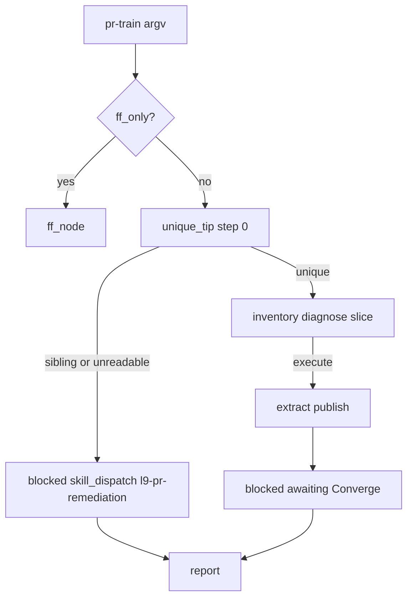

# PLAN: Make /pr-train --execute usable

> **Execute:** when status is `executable`, press **Build** and work in the **current checkout**. Do **not** run `make campaign`, admit a Program Lock, or free-form mutate from this markdown alone.
> **Cursor todos:** frontmatter `todos` project to Build todos. Body is the binding contract.
> **Law:** executable only when baseline matches, capability probes pass, invariants match, and envelope is respected.

## Execute via Cursor Build

Press **Build**. Work in the **current checkout**.

- Do not run `make campaign`.
- Do not admit a Program Lock or Controller lease.
- Do not write `Lock: origin/main = <sha>`.
- Do not open a new worktree from tip as a planning requirement.

## Metadata

| Field | Value |
|-------|-------|
| plan_id | `plan.pr_train_execute_usable.v1` |
| name | Make /pr-train --execute usable |
| schema_version | `1.0.0` |
| status | `executable` |
| is_project | `false` |
| owner | governance-control-plane |
| created_at | `2026-08-28` |
| updated_at | `2026-08-28` |
| execute_via | `cursor-build` |
| PLAN_DOCUMENT | `docs/plans/pr_train_execute_usable.json` |

## Architect framing

| Field | Value |
|-------|-------|
| planning_ssot | `commands/pr-train.md` + `workflows/dags/pr_train_dag.py` (`pr-train-v1`) |
| plan_class | `remediation_plan` |
| redesign_allowed | `false` |
| follow_on_schema_evolution_separate | `true` |
| framing_notes | `--execute` must OPEN_TRAIN or fail-closed halt for remediator. Graph does not merge. |

`--execute` is ornamental today because (1) the slash recipe FileNotFounds on this branch, (2) plan-only reports `complete` while sibling chains block the unique tip, (3) step 0 unique-tip halt is not the first execute node.

## Immutable baseline

| Field | Value |
|-------|-------|
| captured_at | `2026-08-29T03:28:00Z` |
| repository | `Quantum-L9/Cursor-Governance` |
| workspace | `/Users/ib-mac/Cursor-Governance` |
| ssot_clone | `/Users/ib-mac/.cursor-governance` |
| branch | `feat/plan-skills-precommit-catalog` |
| commit_sha | `fe0f3d662348e00e63ea46ae781271aed6b926c2` |
| dirty | `true` |
| overlap_policy | `explicitly_allow_listed_paths` |
| verification_rule | `reverify_at_execution_start` |
| on_drift | `stop_and_replan` if HEAD is not this SHA and may_modify is already dirty from someone else |
| allowed_local_dirt | `docs/plans/pr_train_execute_usable.json`, `docs/plans/pr_train_execute_usable_02340546.plan.md` |

Foreign dirty on this branch (intelligence harvest, Makefile rewrite, WIP) is **write_deny**. T0 is `git checkout origin/main --` of the four pr-train paths only.

## Objective

### Mission

Make `/pr-train --execute` a usable OPEN_TRAIN: if the unique stack tip cannot be proven, halt for `l9-pr-remediation` Converge **before** extract; if it can, slice and remediator-publish. Fix the documented DAG path so the slash runs when this checkout lacks the file. Stop reporting `complete` while siblings block. Prove or fail-close remainder extract (#365 / H4). Do not MERGE_TRAIN inside the graph.

### Success properties

| id | property | evidence_type | proof | blocking |
|----|----------|---------------|-------|----------|
| SP-01 | execute + sibling tip error → `status=blocked`, `skill_dispatch=l9-pr-remediation`, `opened_prs=[]`, extract not called | `runtime_behavior` | `pytest tests/workflows/test_pr_train_dag.py` | true |
| SP-02 | plan-only + sibling tip FAIL → `status=blocked` not `complete` | `runtime_behavior` | same pytest | true |
| SP-03 | slash recipe finds DAG when `$PWD/workflows/dags/pr_train_dag.py` is absent; `--repo` is workspace | `structural` | `test_command_is_thin_trigger` + recipe contains `$HOME/.cursor-governance` or `GOV_ROOT` | true |
| SP-04 | catalog gate green on authored paths | `quality_gate` | `make precommit-repo` bound to `.pre-commit-config.yaml` | true |
| SP-05 | H4 remainder: fail-closed publish **or** bounded skip with inspect evidence | `proof_receipt` | new test **or** written skip in T3 | true |

## Capability preflight

| id | capability | command_or_action | pass_criteria | blocking |
|----|------------|-------------------|---------------|----------|
| CP-01 | branch_and_HEAD_resolution | `git rev-parse HEAD` | `fe0f3d662348e00e63ea46ae781271aed6b926c2` at plan lock; re-verify at Build | true |
| CP-02 | origin/main has DAG | `git cat-file -e origin/main:workflows/dags/pr_train_dag.py` | PASS | true |
| CP-03 | this checkout lacks DAG | `test ! -f workflows/dags/pr_train_dag.py` until T0 | PASS at plan lock | true |
| CP-04 | pytest interpreter | `$PWD/.venv/bin/python -c "import langgraph"` | import ok | true |

## Execution envelope

### Filesystem

- **write_allow:** `workflows/dags/pr_train_dag.py`, `workflows/dags/__init__.py`, `tests/workflows/test_pr_train_dag.py`, `commands/pr-train.md`, `docs/plans/pr_train_execute_usable.json`, `docs/plans/pr_train_execute_usable_02340546.plan.md`
- **write_deny:** `AGENTS.md`, `Makefile`, `CANONICAL_LAW.md`, `ops/autonomy/authorize_merge.py`, `skills/l9-pr-remediation/`, foreign dirty, secrets

### Commands

- **allow:** `git checkout origin/main -- <pathspecs>`, pytest targeted, `make precommit-repo`, `gh pr view 365` (read), `gh pr diff 365` (read)
- **deny:** `make campaign`, `make pr` unless the human typed it, `git push`, `gh pr merge`, `authorize_merge.py --run`, force-push, hard-reset, `/pr-train --execute` as this plan's publish

### Network

| Field | Value |
|-------|-------|
| mode | `read_only` |
| allowed_services | GitHub `gh` read of PR 365 for T3 |

### Secrets

| Field | Value |
|-------|-------|
| access | `none` |
| redaction_required | `true` |

### Autonomous merge

`autonomous_merge:` `false`. This plan does not merge #364/#365/#366. Remediator Converge is a **later slash**, after `--execute` is actually runnable.

## Side effects and idempotency

| todo_id | side_effects | idempotency | retry | compensation | irreversible |
|---------|--------------|-------------|-------|--------------|--------------|
| T0 | `filesystem_mutation` | `safe_to_repeat` | `retry_once` | `git checkout HEAD --` those paths if T0 was wrong | false |
| T1 | `filesystem_mutation` | `safe_with_dedupe` | `manual_only` | restore scoped DAG | false |
| T2 | `filesystem_mutation` | `safe_with_dedupe` | `manual_only` | restore command file | false |
| T3 | `filesystem_mutation` | `safe_with_dedupe` | `manual_only` | skip remainder change if inspect rejects H4 | false |
| T4 | `filesystem_mutation` | `safe_to_repeat` | `retry_once` | restore tests | false |
| T5 | `filesystem_read` | `safe_to_repeat` | `retry_once` | none | false |

## Architecture impact

| todo_id | bounded_context | layer | owning_contract | prohibited |
|---------|-----------------|-------|-----------------|------------|
| T1 | pr-train-v1 LANGGRAPH_RUNTIME | `control_plane` | `commands/pr-train.md` FORBIDDEN MERGE_TRAIN | `register_session_dag`; `authorize_merge` from the graph |
| T2 | slash recipe | `ops` | plugin loads SSOT command; `--repo` is workspace | `$PWD`-only DAG as the sole recipe |
| T3 | remainder extract | `ops` | `extract_remainder` last-writer unique paths | conflict resolution / rebase |

## Rollback

| Field | Value |
|-------|-------|
| rollback_id | `rollback.plan.pr_train_execute_usable.v1` |
| supported | `true` |
| automatic_allowed | `false` |
| approval_required | `true` |
| trigger_conditions | pytest fail; unique_tip calls authorize_merge; command recipe loses `--repo` |

| domain | mode | notes |
|--------|------|-------|
| code | `git_restore_scoped_paths` | write_allow only; origin/main already has pre-step-0 DAG |
| data | `none` | |
| external_state | `none` | this Build must not open or merge PRs |
| local_state | `git_restore_scoped_paths` | |

## Complexity and uncertainty

- **Depth:** standard
- **Unknown U1:** PR 365 Lint/Test — remainder incompleteness vs protected-root. T3 probes. Resolution: `probe`.
- **Accepted bound:** unique_tip before inventory hides the slice plan while siblings exist. That is the usability fix (false `complete` is worse). After remediator, re-run plan-only.

## Execution DAG / Phase-0

| id | after | action |
|----|-------|--------|
| T0 | — | bring sources from origin/main; strip debug logs |
| T1 | T0 | unique_tip step 0; H2+H3 |
| T2 | T1 | H1+H5 command fallback |
| T3 | T1 | H4 inspect |
| T4 | T1,T2,T3 | tests |
| T5 | T4 | pytest + `make precommit-repo` |

## Property evidence matrix

| SP | how | when |
|----|-----|------|
| SP-01 | pytest execute sibling | T4/T5 |
| SP-02 | pytest plan-only sibling | T4/T5 |
| SP-03 | command file + `test_command_is_thin_trigger` | T4/T5 |
| SP-04 | `make precommit-repo` | T5 |
| SP-05 | remainder test or skip note | T3 |

## Stress and disconfirm

- Unique_tip-before-inventory loses slice preview while blocked: accept; halt first.
- SSOT fallback running a different DAG than the PR under edit: prefer `$PWD` file when present.
- Step 0 must not call MERGE_TRAIN: tests boom `authorize_merge`.
- Remainder fail-closed dropping unique paths: inspect first; bounded skip if H4 rejected.

## Out of scope

- Graph MERGE_TRAIN / `authorize_merge.py` writes
- `make pr` as remediator publish
- Merging #364 #365 #366 from this Build
- Rebase, force-push, splitting merge-tree collisions
- `AGENTS.md` / `Makefile` / `CANONICAL_LAW.md`
- `make campaign` / Program Lock
- Landing `debug-9f32a0` instrumentation

## Convergence

| Field | Value |
|-------|-------|
| status | `complete` (U1 closed: H4 bounded skip) |
| remaining_unknown_ids | |
| next_skill | none |
| execute_via | Cursor Build on the current checkout |
| stop_reason | unique_tip step 0 + SSOT DAG fallback landed; pytest 45 passed |

minimum_safe_next_action: After remediator Converge collapses sibling chains, run `/pr-train --execute`. Do not MERGE_TRAIN from this graph.

Companion JSON: `docs/plans/pr_train_execute_usable.json` (`validate_plan_document.py` PASS).
