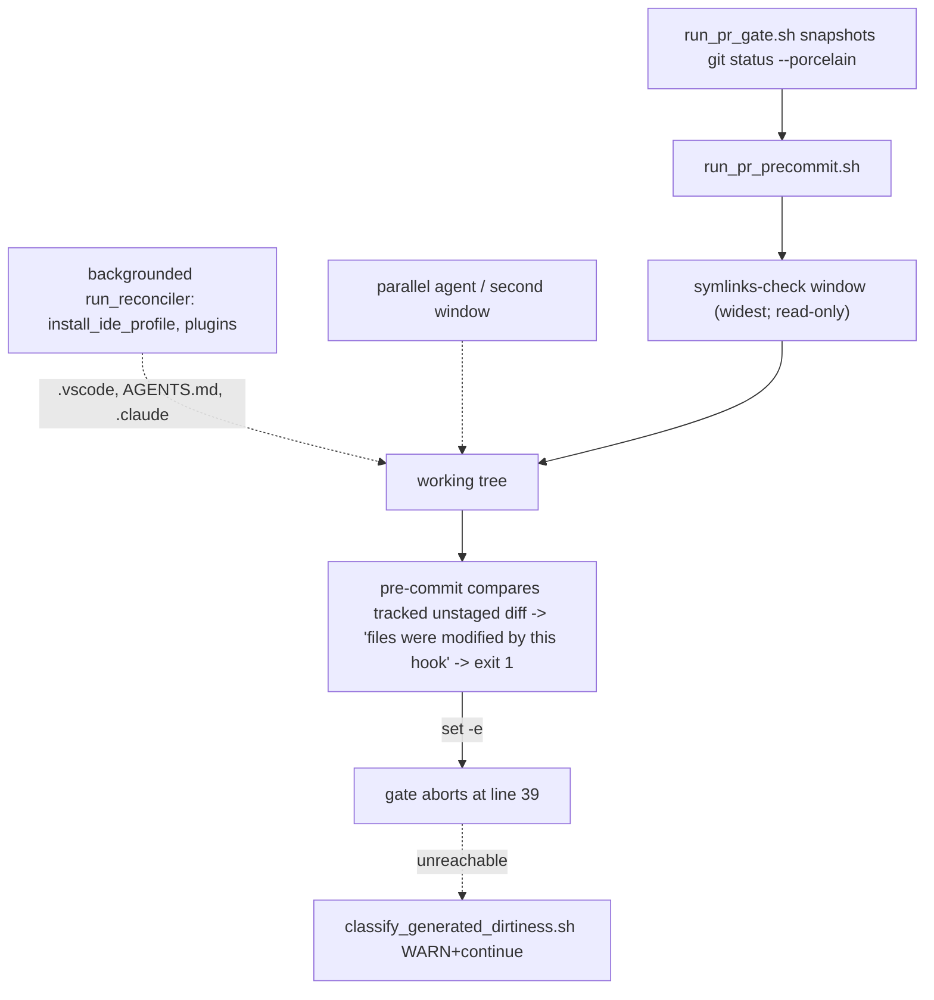

# Remedy: pre-commit "files were modified by this hook" false failure

## Root cause

### D1 - the gate's own tolerance is dead code (primary, verified)

[ops/scripts/run_pr_gate.sh](/Users/ib-mac/Cursor-Governance/ops/scripts/run_pr_gate.sh) runs pre-commit bare under `set -euo pipefail`:

```39:50:ops/scripts/run_pr_gate.sh
bash "$SCRIPT_DIR/run_pr_precommit.sh" "$WS"

if ! git status --porcelain | diff -q "$status_before" - >/dev/null; then
  if bash "$SCRIPT_DIR/classify_generated_dirtiness.sh" "$WS" "$status_before"; then
    echo "WARN: generated artifacts updated by pre-commit — stage them with your commit:"
```

pre-commit returns non-zero for two unrelated conditions - `files_modified or bool(retcode)` (`run.py:235`). `set -e` kills the gate at line 39, so the classify/WARN-continue branch at 41-50 is unreachable on the exact condition it was written to absorb. Every other dirtiness branch in the file (lines 92-101) is reachable only because `sync_generated_artifacts.py --check` does not exit non-zero on churn.

### D2 - the message names a time window, not a writer (verified against pre-commit 4.5.1)

`_run_single_hook` compares the tracked unstaged diff before and after each hook and threads the result forward as the next hook's baseline:

```203:228:/Users/ib-mac/Library/Python/3.9/lib/python/site-packages/pre_commit/commands/run.py
        diff_after = _get_diff()

        # if the hook makes changes, fail the commit
        files_modified = diff_before != diff_after
...
        if files_modified:
            _subtle_line('- files were modified by this hook', use_color)
```

So the verdict is "the tree changed during this hook's wall-clock window", regardless of who changed it. `symlinks-check` has by far the widest window in this repo's hook set - [ops/scripts/validate_governance_symlinks.sh](/Users/ib-mac/Cursor-Governance/ops/scripts/validate_governance_symlinks.sh) delegates to `check_governance_wiring.sh`, which does a `git fetch` and a graphiti resolve - so it collects the blame. It is also provably repo-read-only: its only write is `mkdir -p "$HOME/.cursor/plans"` at line 95. Nothing in the repo declares that, so the false claim cannot be refuted mechanically and an agent burns a cycle inspecting the wrong script.

### D3 - there are real concurrent writers into the workspace

- [ops/hooks/session_start_bootstrap.sh](/Users/ib-mac/Cursor-Governance/ops/hooks/session_start_bootstrap.sh) backgrounds workspace-mutating reconcilers through one choke point, `run_reconciler` (line 20): `setup_claude_code_plugins.sh` (line 178, writes `.claude/`), `install_ide_profile.sh` (line 204, writes `.vscode/settings.json` and the AGENTS.md formatter-ownership block via `ops/scripts/adapters/agentdocs.sh`), and a cold `uv sync` (line 195). None takes a lock.
- Parallel agents or a second Cursor window on the same clone. This class is already documented doctrine: [ops/autonomy/worktree_isolation_gate.py](/Users/ib-mac/Cursor-Governance/ops/autonomy/worktree_isolation_gate.py) records the 2026-08-12 incident where a parallel agent scooped and reverted another chat's in-flight `commands/plan.md`, and `rules/49-shared-worktree-isolation.mdc` owns the policy.
- The agent's own editor/tooling writing during the gate's several-minute run.

### D4 - the gate and pre-commit measure different things

pre-commit's detector is tracked-and-unstaged only:

```274:279:/Users/ib-mac/Library/Python/3.9/lib/python/site-packages/pre_commit/commands/run.py
def _get_diff() -> bytes:
    _, out, _ = cmd_output_b(
        'git', 'diff', '--no-ext-diff', '--no-textconv', '--ignore-submodules',
        check=False,
    )
    return out
```

The gate snapshots `git status --porcelain`, which also includes untracked files. Consequences: newly created generated files (untracked) can never trigger pre-commit's message but do trip the gate's snapshot comparison, and a tracked-file edit trips both with different remedies. The two detectors must be reported separately or the diagnosis stays ambiguous.

### D5 - latent: the generated allowlist is hand-maintained

`GENERATED_PATH_PREFIXES` in [ops/scripts/sync_generated_artifacts.py](/Users/ib-mac/Cursor-Governance/ops/scripts/sync_generated_artifacts.py) (lines 32-52) is decoupled from the generators it describes, so a future generator output would classify as "non-generated autofix" and hard-fail. Not a cause of the observed failure; hardened with a validator only.



## Corrections to the first draft of this plan (kernel pass 2)

- **Dropped as false:** "pre-commit's `staged_files_only` stash/restore mutates the tree mid-run during `make pr`." `_unstaged_changes_cleared` returns early when `git diff-index` against `git write-tree` reports no staged changes (`staged_files_only.py:57-61`), and `make pr` runs with nothing staged. The stash path is real only on the `git commit` route with partially-staged changes, where the "Stashed changes conflicted with hook auto-fixes... Rolling back fixes" branch (`staged_files_only.py:88-96`) can discard hook output. Recorded as a separate documented failure mode, not as this bug's cause.
- **Dropped as unsound:** proving read-only hooks by replaying them in a scratch worktree. `symlinks-check` validates live workspace symlink wiring and would fail in a detached worktree for reasons unrelated to writes. Replaced by observational per-hook attribution (T5).
- **Corrected:** the new rule number. `rules/47-agent-pattern-activation.mdc` and `rules/49-shared-worktree-isolation.mdc` already exist; the doctrine gets appended to `rules/48` and `rules/49` instead of minting a rule.
- **Added:** D4 domain mismatch, and parallel agents as a writer class the first draft omitted.
- **Demoted:** the generated-allowlist item from a config relocation to a validator, since no evidence ties it to the observed failure.
- **Unknown, stated rather than guessed:** who edited `rules/45-pre-action-verification.mdc` and `rules/46-kernel-pack-new-branch.mdc` in the failing run. No generator writes `rules/*.mdc` (`sync_rules` only regenerates `RULES-MANIFEST.*`; `project_llm_rules` only writes `environment/generated/llm-rules/`), so those were almost certainly authored edits, not hook output. This plan does not claim to explain them and does not revert them.

## Design

1. **One shared lock, no duplicate policy.** `ops/scripts/lib/repo_write_lock.sh` lifts the proven flock-plus-macOS-mkdir idiom from [ops/scripts/governance_sync.sh](/Users/ib-mac/Cursor-Governance/ops/scripts/governance_sync.sh) lines 44-68 and adds a ledger for attribution. It is machine-local and short-lived; the tracked `.governance-build-lock` remains an independent long-lived human kill switch.
2. **The gate holds the lock; automated reconcilers yield to it.** `run_reconciler` waits briefly, then skips fail-soft in the existing bootstrap style. This serializes automation only - per-agent worktrees remain the answer for parallel humans/agents per `rules/49`.
3. **The gate reads pre-commit's exit instead of dying on it**, separates modified-files from validator failure using the verified marker strings, and routes dirtiness through the existing classifier so the WARN-continue path finally executes.
4. **Attribution is measured, not asserted.** On dirtiness the gate re-runs hooks one at a time under the lock with per-hook tracked-diff and untracked-set snapshots, then names the writing hook or the concurrent holder. Non-generated dirt: quiesce, retry once, then FAIL naming exact paths.

## Validation

- `bash ops/scripts/run_pr_gate.sh` against temp git fixtures for each of the five scenarios in T9.
- `make repo-write-lock-test`, `make ide-profile-test`, `make backup-gate-test`.
- `python3 ops/scripts/validate_precommit_hook_contract.py`; repo-root pytest suite via `ops/scripts/run_pytest_suites.sh`.
- `make pr-check` on the real repo last, after fixtures pass.

## Safety and scope

- New branch from `origin/main`; the current checkout carries unrelated `WIP/` and PE work (`rules/46-kernel-pack-new-branch.mdc`).
- `ops/hooks/session_start_bootstrap.sh` is AGENTS.md 5.2 high-risk: the change is confined to `run_reconciler`.
- `L9_GATE_STRICT_LEGACY=1` restores today's abort behavior, so a regression cannot brick `make pr` for consumers.
- `AGENTS.md` is a protected append-only root file: append the doctrine block, delete nothing.
- New fixture tests write only under `$TMPDIR`, matching `ops/scripts/test_install_ide_profile.sh`.

## Adjacent findings, reported not fixed

- `.governance-build-lock` exists in this working tree (empty, dated 2026-08-12) and is why this session reported `backup: SKIPPED — .governance-build-lock present`. Session-end governance backup has therefore been disabled since then. Removing it is a one-line decision that belongs to the user, not to this change set.
- The `git commit` route's stash-conflict rollback (`staged_files_only.py:88-96`) can silently discard hook auto-fixes. Out of scope here; worth its own issue.

## Out of scope

Rewriting pre-commit, changing which hooks exist, reverting the `rules/45`-`rules/46` edits from the earlier PR, and relocating `GENERATED_PATH_PREFIXES`.
