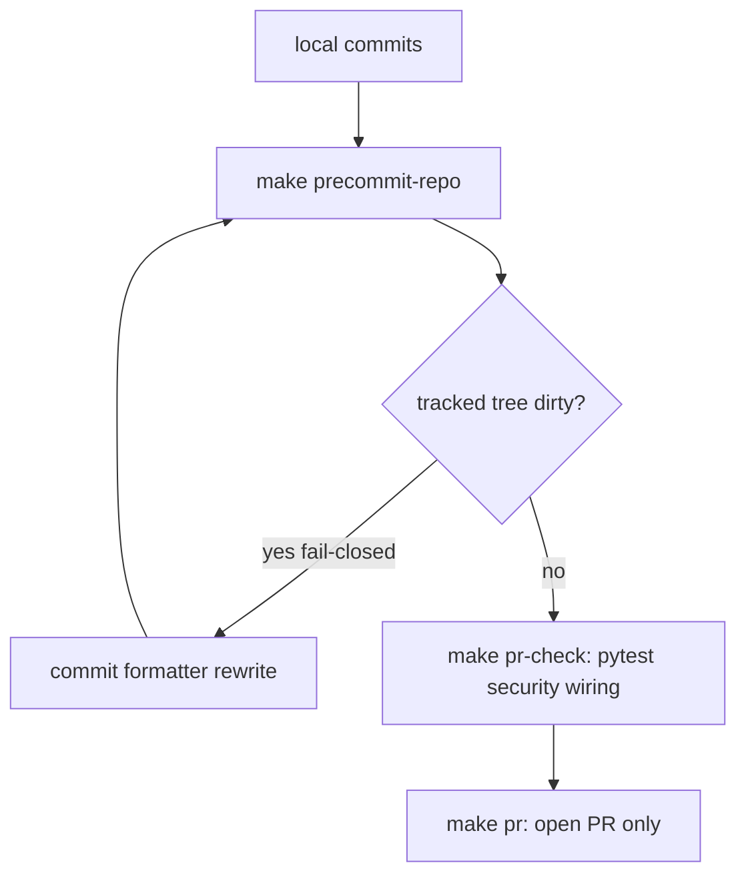

# Precommit owns ruff/lint; port agreed WIP pieces

## What is already true

- [`.pre-commit-config.yaml`](.pre-commit-config.yaml) already has `ruff --fix` and `ruff-format` (pin `v0.16.1`) and `pre-commit-hooks` **`v6.0.0`** with only `check-merge-conflict`.
- [`make precommit-repo`](Makefile) already runs that catalog on **changed files** via [`ops/scripts/run_pr_precommit.sh`](ops/scripts/run_pr_precommit.sh).
- [`make pr`](Makefile) is `pr-preflight` → `pr-check` → open. `pr-check` is [`ops/scripts/run_pr_gate.sh`](ops/scripts/run_pr_gate.sh), which **already calls** `run_pr_precommit.sh`, then runs a **second** locked `ruff check` + `ruff format --check`, then pytest/security.
- This repo has **no git commit hook**. Do not `pre-commit install`.
- Do **not** copy [WIP/8-20-26/pre-commit-config/.pre-commit-config.yaml](WIP/8-20-26/pre-commit-config/.pre-commit-config.yaml) or overwrite live `l9-lint-test.yml` / `codeql.yml`.

The last publish failed later in `make pr` because I skipped a standalone precommit/`pr-check` after commit. `ruff-format` rewrote files **during** the long gate; the gate classified dirt and continued; the PR kept the unformatted commits.

## Target flow

- **Ruff/lint fire only in `precommit-repo`** (hooks + locked `lint-ruff` on changed `.py`).
- **`make lint` stays off this path.** Full-tree ruff + mypy (advisory mypy debt).
- **`make pr` does not run ruff again.** Pytest/security/wiring stay in `pr-check`.
- **Formatter dirt is a hard fail** on `precommit-repo`. Commit the rewrite, re-run, then `make pr`.

## Two different autofixes (keep both)

The thing that makes **clean code get pushed** is local, and it already exists. Decision locked: **local + post-merge janitor**.

| Name | When | What |
|---|---|---|
| **Local autofix** (`ruff --fix` / `ruff-format` / eof / trailing-ws in `make precommit-repo`) | After commit, **before** `make pr` | Rewrites the worktree. Fail-closed if dirty. You commit the rewrite. **This is the pre-push clean.** |
| **`lint-autofix.yml`** | `push` to **`main`** only (after merge) | If `main` still has ruff-fixable drift, CI opens a cleanup PR. Never pushes to protected `main`. Safety net, not the first lint pass. |

There is no git commit hook, so local autofix does **not** run inside `git commit`. The agent contract is: commit → `make precommit-repo` → if dirty, commit the rewrite → `make pr`. That is how clean code is what gets pushed.

`lint-autofix.yml` cannot do that job: hooks do not dispatch Actions, and a feature-branch GHA fixer would fight local ruff.

## Hooks do not run workflows

`.pre-commit-config.yaml` is local only (`make precommit-repo` / first slice of `pr-check`). There is **no git commit hook** and **no hook → Actions dispatch**. GitHub workflows fire on `push` / `pull_request` / cron after `make pr` publishes.

### What `make precommit-repo` runs (changed files)

Order is the hook catalog, then locked `lint-ruff`, then fail-closed if tracked dirt remains.

| Hook / step | What it runs | Writer? |
|---|---|---|
| `check-merge-conflict` | conflict markers | no |
| `end-of-file-fixer` | newline at EOF | yes |
| `trailing-whitespace` | strip trailing space | yes |
| `check-added-large-files` | reject >1000 KB | no |
| `check-yaml` | parse YAML, **no `--unsafe`** | no |
| `no-hardcoded-paths` | `validate_governance_no_hardcoded_paths.sh` | no |
| `symlinks-check` | `validate_governance_symlinks.sh` (skipped on non-Cursor / isolate) | no |
| `legacy-doctrine-residue` | Dropbox / `L9_MEMORY_HTTP` residue | no |
| `gh-package-deps-preflight` | only if package-lock files changed | no |
| `sync-generated-artifacts` | **skipped** on this path (gate heals later with WARN) | yes, when run |
| `rules-check` | `check_rules_standard.py` if `rules/` changed | no |
| `skills-check` | `check_skills_standard.py` if `skills/` changed | no |
| `repo-hygiene` | `tools/check_repo_hygiene.py` | no |
| `ruff` | `ruff --fix` | yes |
| `ruff-format` | format Python | yes |
| `lint-ruff` (script, not a hook id) | locked `ruff check` + `ruff format --check` | no |

**Deliberately not in the hook file** (keep in `pr-check`; mypy stays advisory). Decision locked: **keep the split** (writers in `precommit-repo`; validators in `pr-check`).

## Why the layers exist (not “security waits for CI”)

The sentence “security and tests stay one step later in pr-check, then CI confirms after make pr” is the **order**. It is not the **reason**.

All of these already run **locally before GitHub**. `make pr` always runs `pr-check`. CI after push is a second machine with the same pins, not the first time pytest or gitleaks run.

| Layer | Job | May rewrite the tree? | Cost |
|---|---|---|---|
| `make precommit-repo` | Hygiene + ruff | Yes (eof, whitespace, `ruff --fix`, format) | Seconds |
| `make pr-check` | Validators on a **frozen** tree | No | Minutes (pytest + security + wiring) |
| `make pr` | Publish after a clean gate | No | Push + open |
| CI (`l9-lint-test`, CodeQL, …) | Confirm on another runner | No | After the PR exists |
| `lint-autofix.yml` | Janitor on **merged `main`** | Yes, via its own PR | After merge, not on feature branches |

**Reason for the split:** writers vs validators, cheap vs expensive.

1. Precommit may change files. Validators must see the tree you will publish. If pytest/gitleaks sit in the same catalog as ruff, you pay minutes, then format dirt appears, fail-closed, commit, pay minutes again — the last PR failure.
2. Fail cheap first. Format/EOF/ruff in seconds; only then run ~1200 tests and scanners.
3. This repo has **no git commit hook**. Putting a tool in `.pre-commit-config.yaml` does not make it run on `git commit`. It only runs when `make precommit-repo` (or the first slice of `pr-check`) runs. So “put them in precommit” here means “make the cheap target as slow as the gate,” not “catch them earlier than `make pr`.”

### What is in `make pr-check` today ([`run_pr_gate.sh`](ops/scripts/run_pr_gate.sh))

Yes for four of five; mypy is present but does not fail the gate:

- **pytest** — when any `.py` changed (`run_pytest_suites.sh`).
- **gitleaks / bandit / semgrep** (+ pip-audit) — always, via `run_pr_security.sh` (`--- security ---`).
- **mypy** — skipped unless `PR_MYPY_STRICT=1`. Default prints `mypy: advisory on PR gate`. Blocking full-tree mypy is `make lint-mypy` / CI with `continue-on-error`.

Today the gate also **re-runs precommit first**, then a **second** locked ruff. This plan drops that second ruff; it does not move pytest/security into the hook file.

### Why `lint-autofix.yml` fires later

It is the **janitor**, not the pre-push autofix. The pre-push autofix is `make precommit-repo` (table above).

- Trigger: `push` to **`main`** + `workflow_dispatch` only.
- Job: if merged `main` still has ruff-fixable drift, CI opens an autofix PR. It never pushes to protected `main`.
- It must not run on feature branches (two writers: local ruff vs GHA opening PRs).
- “Later” is intentional: catch what slipped past a merge, not replace local ruff.

Do not copy pack 2’s `pytest-unit` (`|| true`) or `mirrors-mypy` excludes for `app/` / `engine/`.

### What fires later (not from hooks)

| When | What |
|---|---|
| After a clean `precommit-repo`: `make pr-check` | pytest, wiring, `run_pr_security.sh` (gitleaks / bandit / semgrep / pip-audit). No second ruff. |
| After `make pr` push/PR | Live: `l9-lint-test.yml`, `codeql.yml`, `governance.yml`, hygiene, peer-execution, org-policy, root-file-protection. New: `lint-autofix.yml` (push `main` only), baseline-ratchet caller, `supply-chain.yml`. |

`l9-lint-test.yml` re-runs ruff on CI. That is remote confirmation, not the local hook invoking a workflow.

## Implementation (new branch from `origin/main`)

Per `rules/46-kernel-pack-new-branch.mdc`: do not mix this onto dirty `main` or PR #240.

### 1. Hygiene hooks on the live `v6.0.0` repo

In [`.pre-commit-config.yaml`](.pre-commit-config.yaml), under the existing `pre-commit/pre-commit-hooks` `rev: v6.0.0` block (not WIP `v4.5.0`), add:

- `end-of-file-fixer` — writer
- `trailing-whitespace` — writer
- `check-added-large-files` (`--maxkb=1000`) — read_only
- `check-yaml` with `--allow-multiple-documents` **and no `--unsafe`**. Exclude generated / PE-core YAML if the first run proves custom tags: `environment/generated/` and `environment/program-execution/core/` as needed.

Keep the top-level `exclude:` that already skips `WIP/`, archives, `current_work/`, `reports/`.

Register every new id in [`ops/config/precommit-hook-contract.json`](ops/config/precommit-hook-contract.json). `validate_precommit_hook_contract.py` fail-closes if an id is missing.

`end-of-file-fixer` / `trailing-whitespace` will rewrite on first touch. That is why fail-closed dirt (step 2) is required. Do not run a full-tree `--all-files` hygiene sweep in this PR unless the changed-file set is already clean.

### 2. `precommit-repo` owns lint + dirt

[`ops/scripts/run_pr_precommit.sh`](ops/scripts/run_pr_precommit.sh): after hooks, run locked `lint-ruff` (`ruff check` + `ruff format --check`). If tracked porcelain is dirty, print paths and exit 1. Do not auto-stage.

### 3. Drop ruff from the long gate

[`ops/scripts/run_pr_gate.sh`](ops/scripts/run_pr_gate.sh): delete `--- ruff (changed Python) ---`. Keep non-ruff dirt classification and pytest/security/sync-generated WARN.

[`Makefile`](Makefile): `pr-check` and `pr` depend on `precommit-repo` first. `make precommit` stays full-tree `--all-files` (INTERNAL / nightly).

### 4. Port `lint-autofix.yml` (modify, do not copy)

New [`.github/workflows/lint-autofix.yml`](.github/workflows/lint-autofix.yml) from [WIP lint-autofix.yml](WIP/8-20-26/pre-commit-config/workflows/lint-autofix.yml):

- Trigger: push `main` + `workflow_dispatch` only. No `develop`.
- Toolchain: `uv sync --locked --extra dev` + `uv run --frozen ruff`, same as live `l9-lint-test.yml`. **Not** `pip install -r requirements-ci.txt` (that file does not exist here).
- Actions SHA-pinned like live lint (not floating `checkout@v6` / `setup-python@v7`).
- Respect live scratch excludes (`WIP/**`).
- GHA may open the autofix PR via a SHA-pinned `create-pull-request`. That is CI automation, not an agent `make pr` substitute. Do not document raw `git push` for agents.
- Prefer an existing App/PAT if `GITHUB_TOKEN` would skip required checks; otherwise draft PR + comment that checks need a real token.

### 5. Upgrade baseline-ratchet — pack 2 concept, Cursor-Governance terms

Pack 1 caller is **superseded**. PacketEnvelope is **deprecated and not part of this repo** (`kernels/Recursive Alignment.md`: reject it; live wire name is **TransportPacket**). Use pack 2’s *thin caller + human-owned ledgers* idea only. Do not copy pack 2 filenames, comments, or input vocabulary that keep PacketEnvelope alive.

Sole structural donor: [WIP/8-20-26/pre-commit-config 2/workflows/baseline-ratchet-caller.yml](WIP/8-20-26/pre-commit-config%202/workflows/baseline-ratchet-caller.yml)

**Keep (concept)**

- Thin `uses:` caller to l9-ci-core `baseline-ratchet.yml` (re-verify SHA on `Quantum-L9/l9-ci-core`).
- `on: pull_request` + `push` to `main`. `permissions: contents: read`.
- Optional human-owned **test quarantine** ledger under `.l9/baselines/test-quarantine.yml` if the reusable job needs one. CODEOWNERS-protected. CI never writes it.

**Change for this repo (terminology lock)**

- Do **not** add `.l9/baselines/packet-envelope.yml`, `packet-envelope-ledger`, `packet-envelope-declaration-paths`, or engine/EIE packet files.
- Do **not** mention PacketEnvelope in new workflow comments except as “deprecated / forbidden,” if a comment is required at all.
- If the reusable workflow’s input keys are still named `packet-envelope-*` in l9-ci-core, **omit those inputs**. If they are required and cannot be omitted, stop and record that core’s API is stale — do not create a CG file that teaches PacketEnvelope. Do not invent a second wire type. Live term is TransportPacket-only.
- Drop EIE `pytest-args: --continue-on-collection-errors`.
- `requirements-files: requirements.txt`. `pytest-paths` from [`ops/config/python-contract.json`](ops/config/python-contract.json).

### 6. Upgrade supply-chain — pack 2 v1.1.2 is the sole donor

Pack 1 `supply-chain.yml` is **superseded** (`develop`, fail-open SBOM, substring `gpl` vs `lgpl`).

Sole donor: [WIP/8-20-26/pre-commit-config 2/workflows/supply-chain.yml](WIP/8-20-26/pre-commit-config%202/workflows/supply-chain.yml)

**Keep from pack 2 v1.1.2**

- Triggers: `main` PR/push, weekly Monday 03:00 UTC, `workflow_dispatch`. No `develop`.
- Exact SPDX token set (not substring `gpl`). Inspect license name + id.
- SBOM install fail-closed (no `|| true`). Pinned `cyclonedx-bom`. `persist-credentials: false` on SBOM checkout.
- `pip-licenses` format `plain` (not dropped `table`).
- Dependency-review fail-open if GitHub dependency-graph is off.

**Change for this repo**

- SHA-pin every action the way live [`l9-lint-test.yml`](.github/workflows/l9-lint-test.yml) does. Pack 2 still floats `checkout@v7` / `setup-python@v7`.
- No `SDK_TOKEN` git-insteadOf rewrite and no `pip install -e ".[dev]"` / `requirements-ci.txt`. Use `uv sync --locked --extra dev`.
- Prefer existing `make pr` `pip-audit` over a second unlocked license install if they overlap; keep Scorecard + dependency-review + CycloneDX SBOM.
- No new secrets.

### 7. Docs and tests

Append-only [`AGENTS.md`](AGENTS.md) §4: run `make precommit-repo` after commit; commit formatter/hygiene rewrites; then `PR_REMEDIATE=0 make pr`. No git commit hook.

Tests: [`tests/ops/scripts/test_pr_lifecycle.py`](tests/ops/scripts/test_pr_lifecycle.py), hook-contract validator coverage for the new ids, and a workflow-pin check if one already exists for SHA-pinned actions.

## Agent contract after this lands

I will run `make precommit-repo` after commit and before `make pr`. I will not treat `make pr` as the first formatter pass.

## Pack 2 vs live Cursor-Governance (no duplicate ports)

Source: [WIP/8-20-26/pre-commit-config 2](WIP/8-20-26/pre-commit-config%202/) — Cognitive.Engine.Graphs / enrichment sibling (`app/`, FastAPI, `requirements-ci.txt`, `|| true` pytest). Compare to **https://github.com/Quantum-L9/Cursor-Governance** live files, not to pack 1.

### Already aligned on GitHub — do not port

- Live [`.pre-commit-config.yaml`](.pre-commit-config.yaml) ruff `v0.16.1` (pack 2 is `v0.15.8`)
- Live `check-merge-conflict` + `pre-commit-hooks` `v6.0.0` (pack 2 is `v4.5.0`)
- Live gitleaks **8.24.3** in `make pr` / [`run_pr_security.sh`](ops/scripts/run_pr_security.sh) + [`.gitleaks.toml`](.gitleaks.toml) (pack 2 hook is `v8.21.2` staged-only; pack 2 `gitleaks.yml` needs `GITLEAKS_LICENSE`)
- Live [`sonar-project.properties`](sonar-project.properties) for `Quantum-L9_Cursor-Governance` (pack 2 keys `app,engine`)
- Live [`.github/copilot-instructions.md`](.github/copilot-instructions.md)
- Live [`.github/workflows/l9-lint-test.yml`](.github/workflows/l9-lint-test.yml), `codeql.yml`, `governance.yml`, hygiene, peer-execution, org-policy, memory-distill
- Live pytest topology: `pyproject.toml` + `ops/config/python-contract.json` (pack 2 `pytest.ini` is `--cov=app` / 60% — would break this repo)
- Live toolchain: [`requirements.txt`](requirements.txt) + `uv.lock` (pack 2 `requirements-ci.txt` is enrichment runtime + floating ruff)

### Same capability as pack 1 — pack 2 upgrades the two workflow ports

- Hygiene hooks stay step 1 (live `v6.0.0`, not either WIP rev).
- **Baseline ratchet + supply-chain: pack 1 ports are withdrawn. Implement steps 5–6 from pack 2 only.**
- `lint-autofix.yml` remains pack 1 only (step 4).

### Do not port from pack 2 (duplicate or not applicable)

- `Install: pre-commit install` — forbidden
- `gitleaks` hook + `workflows/gitleaks.yml` — duplicates live `make pr` security
- `gitguardian.yml` — second secret scanner; soft-skip without key; duplicates gitleaks
- `mirrors-mypy` + `pytest-unit` (`|| true` swallows failures) — live CI / `pr-check`
- `block-fastapi-in-engine`, terminology-guard on `app|tests`, `l9-contract-audit` if `tools/audit_engine.py` exists
- `pr-pipeline.yml` — product `local_pr_pipeline`; live already has lint/test + governance
- `l9-constitution-gate.yml` / `l9-contract-control.yml` — `node.constitution.yaml` / Gate node
- `sonarcloud.yml` — would **duplicate** SonarCloud Automatic Analysis already bound to live `sonar-project.properties`
- `.semgrep/semgrep-rules.yaml` — live `run_pr_security.sh` already runs `p/python p/secrets`
- `.coderabbit.yaml` / `coderabbit-notify.yml` / `pr_review_config.yaml` / `perplexity-code-review.yml`
- `k8s-deploy.yml` / `docker-build.yml` / `release.yml` / `release-drafter.yml` / `docs-sync.yml` / `docs-consistency.yml` / `audit-pr-review.yml` / `ci.yml` / `compliance.yml` / `refactoring-validation.yml`

## Still not in this change

- Git `pre-commit install`
- Any pack 1/2 hook or workflow listed as duplicate or product-only above
- Overwriting live `l9-lint-test.yml`, `codeql.yml`, `sonar-project.properties`, `requirements.txt`
- Moving pytest or gitleaks/bandit/semgrep out of `pr-check`
