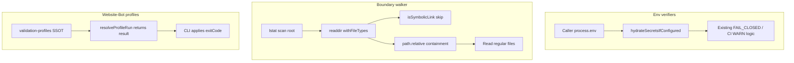

# PLAN: Preflight blocker repair (Improve-hardened)

### Improve / revision record (plan artifact)
- **execution_mode:** `patch` on plan document only (no code execution this turn)
- **target_binding:** `/Users/ib-mac/.cursor/plans/preflight_blocker_repair_32cd5cd5.plan.md`
- **pass_1–2:** prior Improve hardening (U1/U2 closed, halt gates, failure template)
- **pass_3:** structural path containment; single profile SSOT; policy result vs CLI exit; parser-boundary tests; repair vs repo-convergence split; exact TESTING.md; `.mjs`/TS caution; minimal hydration fields
- **pass_4 (PR #108 impact):** rebased plan baseline to `origin/main@592f5e1`; confirmed #108 does not close any of the three blockers; added secureExecution constraints; narrowed hydrate task to extract existing `#109` `loadSecrets` call
- **convergence (plan):** Converged for execution handoff

### Post-merge baseline (PR #108 + #109)

**Cut branch from:** `origin/main` at `592f5e1` (`fix: shell allowlist + allowShell opt-in for secureExecution (#53)` / PR #108). That tip already includes PR #109 Infisical secrets plane.

| Merged PR | What it changed | Effect on this repair |
|-----------|-----------------|------------------------|
| [#108](https://github.com/Quantum-L9/Website-Bot/pull/108) | `packages/validation-executor` only: `secureExecution` allowlist + `allowShell` opt-in; adapters/`cli.ts` call `executeAdapterCommand` | **Does not fix** boundaries, Website-Bot profile allowlist, or verifier hydration. **Do not reopen** package `cli.ts` / adapter shell work in this repair. |
| [#109](https://github.com/Quantum-L9/Website-Bot/pull/109) | `loadSecrets()` in `scripts/run-pipeline.ts` + ADR-0009 docs | Pipeline hydration **exists**; verifiers still do **not** hydrate. Helper work is **extract + share**, not greenfield Infisical wiring. |

**Still open on `origin/main` (re-verified):**
- `scripts/validation-executor.ts` `validProfiles` still env-named (`default|ci|development|…`) — package `verify:preflight|…` still rejected.
- `scripts/validate-l9-boundaries.mjs` still uses follow-`stat` walk (no lstat / Dirent symlink skip / structural containment).
- `scripts/verify-launch-env.mjs` / `verify-deploy-secrets.mjs` still have no `loadSecrets` / hydrate helper.

**Removed / narrowed relative to earlier plan drafts:**
- Do **not** treat “add Infisical to pipeline” as a deliverable — already on main via #109; only extract into shared helper and wire verifiers.
- Do **not** modify `packages/validation-executor/src/{cli.ts,adapters/*,utils/secureExecution.ts}` for this repair (freshly landed in #108). Profile allowlist fix stays in **`scripts/validation-executor.ts`** only.
- Do **not** keep or reintroduce `echo 'Profile … requires implementation'` (or other shell-feature placeholders) as e2e commands. Even with #108’s `executeAdapterCommand` (`allowShell: true`, `echo` allowlisted), a zero-exit `echo` would still create a **false PASS**. Unimplemented profiles must short-circuit via `resolveProfileRun` before the executor runs commands.

### Objective
Restore honest offline/local preflight gates for Website-Bot by fixing three repo defects only: Infisical hydration parity for env verifiers, symlink-safe boundary walking, and validation profile allowlist alignment with false-PASS prevention for unimplemented site profiles.

### Success criteria (split — falsifiable)

**A. Repair success** (required to claim this repair done):
1. Boundary blocker fixed: `npm run alignment:boundaries` → exit 0 on a checkout that still has dangling `.cursor-commands` skill symlinks; unit fixtures prove dangling skip, no external symlink traversal, and structural containment (including `/repo/foo` vs `/repo/foo2`).
2. Profile allowlist blocker fixed: every `package.json` `verify:{preflight,source,build,smoke,form,analytics,crm,seo,rollback}` profile is accepted at the **parser/configuration boundary** (direct unit assertion against SSOT / `validateWebsiteBotConfiguration` — not by running full profile suites).
3. False-PASS blocker fixed: `npm run verify:form` and the same for `analytics`, `crm`, `seo`, `rollback` → exit **2**, stdout/report contain `INCOMPLETE` and `non_evidence: true` (fixed markers); never `Verdict: PASS`.
4. Env hydration blocker fixed: `verify:launch-env` / `verify:deploy-secrets` call shared hydrate helper before reading env; production FAIL_CLOSED and `--ci` warn/exit-0 unchanged; persisted reports include only minimal source-mode fields (`source_mode`, `bootstrap_present`); **no secret values** in stdout/stderr/reports.
5. Diff hygiene: scoped repair files only; zero `~/.cursor-governance` edits; no secrets committed.

**B. Repository convergence** (separate outcome — not implied by A):
- `npm run verify:all` → exit 0.

**C. Allowed execution result:**
- A may pass while B fails if a **fourth** (or further) independently classified blocker remains. That does **not** count as repair success failure, and must use the failure-classification template. Do **not** declare overall “success” when only A holds and B is red without stating the split.

**Explicit non-goals:**
- `make verify` all-green is not repair success and not repository convergence. After profile honesty, unimplemented profiles keep `make verify` intentionally red until real site-level checks exist.

### Scope
**In:**
- Shared Infisical bootstrap helper + wire into launch/deploy verifiers + pipeline entry reuse.
- Harden [`scripts/validate-l9-boundaries.mjs`](scripts/validate-l9-boundaries.mjs) symlink traversal + export for unit tests.
- Single profile SSOT + policy function + CLI adapter exit + `tests/unit` regression tests.
- Docs: `DEPLOYMENT.md`, `docs/architecture/ADR-0009-infisical-secrets-plane.md`, `TESTING.md` (exact INCOMPLETE / `make verify` section below).

**Out:**
- Mutating or restoring `~/.cursor-governance/skills/l9-pr-analysis` (or any user-home governance state).
- Renaming/removing public `verify:*` package script names.
- Any further edits to [`packages/validation-executor/`](packages/validation-executor/) for this repair (shell allowlist already shipped in #108; package `--profile ci` allowlist stays as-is).
- Re-wiring Infisical into `run-pipeline.ts` from scratch (already present via #109) beyond extracting the existing call into the shared helper.
- Inventing form/analytics/CRM/SEO/rollback integration checks.
- Weakening required-variable / legal / domain / credential gates.
- Treating Infisical connectivity/access as a launch/deploy PASS.
- Extra secret-plane operational detail in persisted reports beyond proving source mode.
- `better-sqlite3` work (closed unless clean install reproduces).
- Unrelated refactors; committing generated validation reports unless already required.

### Locked decisions (authoritative)
1. **Env:** `effective env = caller-supplied env + optional Infisical hydration` → **existing** fail-closed validation. Bootstrap absent ⇒ process-env-only remains valid.
2. **Boundaries:** harden repo walker only; structural containment; lstat roots; do not fix local governance FS.
3. **Profiles:** one canonical SSOT; tests assert `package.json` parity independently; `--environment` stays the environment axis.
4. **No false PASS:** unimplemented site profiles return INCOMPLETE non-evidence; CLI applies exit 2.
5. **Hygiene:** branch `fix/preflight-blockers` from `origin/main@592f5e1` (or newer main that still contains #108+#109); scoped diff.

### Resolved from evidence (former Unknowns)
| ID | Finding | Evidence | Plan impact |
|----|---------|----------|-------------|
| U1 | `loadSecrets()` is **non-destructive** (never overwrites already-set vars unless `overwrite: true`); fail-soft by default; no-op when bootstrap absent; returns `{ loaded, injected, source }` | `@quantum-l9/infisical-config@1.1.0` README | Helper calls `loadSecrets()` without `overwrite: true`; map to minimal metadata |
| U2 | No Website-Bot script caller uses env-named `--profile` values; CI uses package CLI `--profile ci` | repo grep + workflow | Safe to narrow Website-Bot script allowlist |

### Remaining Unknowns (environment / impl gated)
| ID | Question | Effect | When closed |
|----|----------|--------|-------------|
| E1 | Live Infisical bootstrap available? | Hydration-path evidence may be Skipped | `evidence-run`; never fake PASS |
| E3 | Do `.mjs` helpers import cleanly from both `.mjs` verifiers and `tsx` TypeScript entrypoints under this repo’s Node/module config? | May force `.ts` helpers or explicit extension strategy | **First step of `branch-setup` / before standardizing on `.mjs`** — smoke-import both consumers; halt and switch extension if broken |

---

### Chosen implementation approach



#### A. Shared hydration helper (contract)
**File:** prefer [`scripts/lib/hydrate-secrets.mjs`](scripts/lib/hydrate-secrets.mjs) **after** E3 smoke check; if `.mjs`↔TS import is unclean, use `.ts` instead and keep one extension for all shared helpers in this repair.

**Starting point on main (#109):** [`scripts/run-pipeline.ts`](scripts/run-pipeline.ts) already has `await loadSecrets()` at boot. This repair **moves that call** into the shared helper and adds the same await to the two verifiers — it does not add a second Infisical integration path.

```js
// Pseudo-contract (implementation must match)
export async function hydrateSecretsIfConfigured(options = {}) {
  // 1. Detect bootstrap: INFISICAL_CLIENT_ID && INFISICAL_CLIENT_SECRET && INFISICAL_PROJECT_ID
  // 2. await loadSecrets({ ...options, overwrite: false })  // NEVER overwrite:true on boot path
  // 3. Return / persist MINIMAL metadata only:
  // {
  //   bootstrap_present: boolean,
  //   source_mode: 'process_env_only' | 'infisical_hydrated' | 'infisical_unavailable',
  // }
  // Do NOT persist injected_count, injected name lists, vault paths, or other secret-plane ops detail
  // unless a failing test/contract absolutely requires it (default: omit).
}
```

**Wire:**
- [`scripts/verify-launch-env.mjs`](scripts/verify-launch-env.mjs) — `await hydrate…` before presence checks; merge **minimal** metadata into JSON report.
- [`scripts/verify-deploy-secrets.mjs`](scripts/verify-deploy-secrets.mjs) — same.
- [`scripts/run-pipeline.ts`](scripts/run-pipeline.ts) — replace the existing direct `loadSecrets()` import/call with the helper (behavior-preserving).

**Invariants:**
- Do not change required key lists, legal/domain gates, or CI vs production exit rules.
- Infisical success ≠ gate PASS.
- Logging/report: variable **names** for missing/required checks (existing behavior), plus `source_mode` / `bootstrap_present` only for hydration provenance.

#### B. Boundary walker (contract)
**File:** [`scripts/validate-l9-boundaries.mjs`](scripts/validate-l9-boundaries.mjs)

1. **Root symlink guard:** `lstatSync` (or Dirent on the root path) each scan root **before** walking. If the root itself is a symlink → skip that root (or deterministic skip with counter); do **not** follow it into an external tree. A symlink supplied as a root must not bypass “do not follow symlinks.”
2. Use `readdirSync(dir, { withFileTypes: true })`.
3. If `dirent.isSymbolicLink()`: **do not recurse**; do not `stat`/`readFile` through it; increment `skipped_symlinks` (optional observability in final JSON — keep minimal).
4. Dangling symlink must not throw unhandled `ENOENT`.
5. **Structural containment** (not string prefix):
   ```js
   function isInsideRoot(root, candidate) {
     const rel = relative(resolve(root), resolve(candidate));
     return rel !== '' && !rel.startsWith('..') && !isAbsolute(rel);
     // also allow rel === '' only when candidate === root itself (directory identity)
   }
   ```
   Reject cases like `/repo/foo2` when root is `/repo/foo` (naïve `startsWith` would wrongly accept).
6. Export `walkRoots(roots, options)` (or equivalent) for tests; CLI keeps current classification/LLM guards.
7. Policy: no existing “symlinks forbidden” rule → skip is correct; do **not** invent forbid-all-symlinks violations.

#### C. Profile SSOT + policy result + CLI exit (contract)
**New:** [`scripts/lib/validation-profiles.mjs`](scripts/lib/validation-profiles.mjs) (or `.ts` per E3) — **exactly one canonical definition; no second package-profile list:**

```js
export const IMPLEMENTED_VALIDATION_PROFILES = [
  'preflight', 'source', 'build', 'smoke',
];

export const UNIMPLEMENTED_SITE_PROFILES = [
  'form', 'analytics', 'crm', 'seo', 'rollback',
];

export const WEBSITE_BOT_VALIDATION_PROFILES = [
  'default',
  ...IMPLEMENTED_VALIDATION_PROFILES,
  ...UNIMPLEMENTED_SITE_PROFILES,
];

/** Pure policy — no process.exit */
export function resolveProfileRun(profile) {
  if (!WEBSITE_BOT_VALIDATION_PROFILES.includes(profile)) {
    return { status: 'INVALID_PROFILE', exitCode: 1, nonEvidence: true, reason: 'unknown_profile' };
  }
  if (UNIMPLEMENTED_SITE_PROFILES.includes(profile)) {
    return {
      status: 'INCOMPLETE',
      exitCode: 2,
      nonEvidence: true,
      reason: 'site_level_validation_unimplemented',
    };
  }
  return { status: 'RUN', exitCode: 0, nonEvidence: false, reason: null };
}
```

**Tests** independently read `package.json` `verify:*` scripts and assert every exposed validation profile ∈ `WEBSITE_BOT_VALIDATION_PROFILES`. **Do not** maintain `PACKAGE_VERIFY_PROFILES` or any mirrored list in the SSOT module.

**[`scripts/validation-executor.ts`](scripts/validation-executor.ts):**
- Import SSOT; configuration allowlist = `WEBSITE_BOT_VALIDATION_PROFILES`.
- Help text lists exactly those profiles.
- `--environment` allowlist unchanged: `development|staging|production|test|ci`.
- Call `resolveProfileRun(profile)`:
  - `INVALID_PROFILE` / `INCOMPLETE` → CLI adapter prints fixed markers and `process.exit(result.exitCode)` **only at the CLI edge**.
  - `RUN` → proceed to existing executor command maps for `default|preflight|source|build|smoke`.
- **Delete** `echo 'Profile … requires site-level implementation'` branches. Do not replace them with any executor-run placeholder command (see #108 note above).
- Domain/policy modules must remain free of `process.exit`.

**Do not modify** package CLI / adapters / `secureExecution` in this repair (#108 owns that surface).

#### D. Tests (concrete paths)
| Test file | Asserts |
|-----------|---------|
| [`tests/unit/validation-executor-profiles.test.ts`](tests/unit/validation-executor-profiles.test.ts) | (1) Read `package.json` → every `verify:{preflight…rollback}` ∈ `WEBSITE_BOT_VALIDATION_PROFILES`. (2) Direct allowlist/config assertions for **all** profiles (including implemented) — **no** full `run --profile preflight/source/build/smoke` execution. (3) Spawned-process tests **only** for the five unimplemented profiles: exit 2, `INCOMPLETE`, `non_evidence: true`, not PASS. (4) Unit-test `resolveProfileRun` return shapes without exiting the test process. |
| [`tests/unit/l9-boundaries-walk.test.ts`](tests/unit/l9-boundaries-walk.test.ts) | Dangling symlink skipped; symlink-dir to external path not traversed; containment rejects sibling prefix (`foo` vs `foo2`); symlink-as-root is not followed |

#### E. Docs (exact contracts)

| File | Change |
|------|--------|
| [`DEPLOYMENT.md`](DEPLOYMENT.md) | Launch/deploy verifiers hydrate via shared helper when Infisical bootstrap present; FAIL_CLOSED unchanged; reports may include `source_mode` / `bootstrap_present` only |
| [`docs/architecture/ADR-0009-infisical-secrets-plane.md`](docs/architecture/ADR-0009-infisical-secrets-plane.md) | Entrypoint list includes `verify-launch-env.mjs`, `verify-deploy-secrets.mjs`, and the shared hydrate helper |
| [`TESTING.md`](TESTING.md) | Add the exact section below (replace any truncated/malformed note) |

**Exact `TESTING.md` addition (required text intent — keep wording equivalent if lightly edited for house style):**

> ### Unimplemented validation profiles
>
> The package scripts `verify:form`, `verify:analytics`, `verify:crm`, `verify:seo`, and `verify:rollback` are accepted by the Website-Bot validation executor allowlist, but they do **not** perform site-level validation yet.
>
> For each of those five profiles the CLI reports status `INCOMPLETE` with `non_evidence: true` (reason `site_level_validation_unimplemented`) and exits with code **2**. A successful `echo` or other placeholder command is not validation evidence and must not produce `PASS`.
>
> Because `make verify` includes these profiles, `make verify` may remain intentionally non-green until real site-level checks exist. That redness is honesty, not a regression of the offline gate. Use `npm run verify:all` for the offline factory gate; treat the five profiles as incomplete non-evidence until implemented.

---

### Pre-Validation
| Check | Evidence | Status |
|-------|----------|--------|
| Blockers still present | Live probes: boundaries ENOENT; profiles REJECTED; env keys missing; sqlite OK | Passed |
| Infisical caller-wins | package README non-destructive / overwrite default false | Passed |
| Package CLI vs Website-Bot CLI | CI uses package `cli.ts --profile ci`; #108 did not change that allowlist | Passed |
| PR #108 overlap | Shell-only; three blockers still open on `592f5e1` | Passed |
| `.mjs`↔TS import smoke | Pending first exec step (E3) | Pending |
| Branch hygiene | Create `fix/preflight-blockers` from `origin/main@592f5e1` | Pending (exec) |

### TODO Plan
| # | ID | Task | Files | Effort | Risk | Deps | Leverage |
|---|----|------|-------|--------|------|------|----------|
| 1 | branch-setup | Branch from `origin/main@592f5e1` (+ pull); E3 import smoke; choose `.mjs` or `.ts` | git + tiny probe | S | low | — | 8 |
| 2 | hydrate-helper | Extract #109 `loadSecrets` into helper; minimal metadata | `scripts/lib/hydrate-secrets.*`, `scripts/run-pipeline.ts` | S | medium | 1 | 1 |
| 3 | wire-verifiers | Hydrate + minimal `source_mode` in both verifiers | `scripts/verify-launch-env.mjs`, `scripts/verify-deploy-secrets.mjs` | S | medium | 2 | 2 |
| 4 | boundary-harden | lstat roots; Dirent skip; `path.relative` containment; export walk | `scripts/validate-l9-boundaries.mjs` | M | medium | 1 | 3 |
| 5 | profile-ssot | Single SSOT + `resolveProfileRun` + CLI exit adapter | `scripts/lib/validation-profiles.*`, `scripts/validation-executor.ts` | M | high | 1 | 4 |
| 6 | regression-tests | Parser-boundary + five spawned INCOMPLETE + boundary fixtures | `tests/unit/validation-executor-profiles.test.ts`, `tests/unit/l9-boundaries-walk.test.ts` | M | medium | 4,5 | 5 |
| 7 | docs-sync | DEPLOYMENT + ADR-0009 + exact TESTING.md section | those three files | S | low | 3,5 | 7 |
| 8 | evidence-run | Prove A (repair); separately record B or classified blocker | commands below | M | medium | 2–7 | 6 |

### Critical path
`branch-setup` → `hydrate-helper` → `wire-verifiers` → `boundary-harden` → `profile-ssot` → `regression-tests` → `docs-sync` → `evidence-run`

### Execution stop conditions (halt affected change)
Stop and report (do not workaround) if:
1. Helper would need `overwrite: true` to “make gates pass”.
2. Any change weakens required/legal/domain/credential lists or turns Infisical access into PASS.
3. Unimplemented profile can reach `Verdict: PASS` or exit 0.
4. Boundary walker still throws on dangling symlink, follows external symlink targets, follows symlink roots, or uses unsafe string-prefix containment.
5. Fix requires mutating `~/.cursor-governance` or inventing site-level CRM/form checks.
6. Authoritative conflict with ADR-0009 / AGENTS.md fail-closed rules.
7. Shared helper extension cannot be imported cleanly from both `.mjs` and TS consumers and no equivalent single-extension approach works.

### Newly unmasked failure classification template
When `verify:all` fails for reasons **outside** the three blockers, record under **repository convergence**, not repair failure:

```yaml
failure:
  command: "<exact>"
  exit_code: <n>
  classification: repo_defect | external_environmental | test_harness | unknown
  blocks: repository_convergence   # not repair_success
  evidence: "<path or log excerpt without secrets>"
  next: "separate ticket/plan — not part of preflight-blocker repair"
```

### Stress Test
- Disconfirming: naïve prefix containment accepts `/repo/foo2` under `/repo/foo`? Must fail unit test; use `path.relative` rule.
- Disconfirming: symlink root bypasses no-follow? Must `lstat` root and refuse follow.
- Disconfirming: allowlist tests accidentally run full `verify:build`? Forbidden — parser-boundary only for acceptance.
- Disconfirming: `process.exit` inside `resolveProfileRun` breaks unit tests? Forbidden — exit only at CLI edge.
- Disconfirming: After #108, could an `echo` placeholder still PASS via `executeAdapterCommand`? Yes (`allowShell: true`, `echo` allowlisted) — therefore short-circuit before executor is mandatory, not optional.
- Assumed false if: Infisical success ≡ gate PASS; or a second mirrored package-profile list reappears; or this repair edits `packages/validation-executor` shell code.
- Blast radius: CI launch/deploy preflight, local `verify:all`, boundary gate, Makefile verify (expected honesty red).
- Rollback: delete/revert `fix/preflight-blockers`; no governance FS undo needed.

### Leverage
1. Shared hydrate helper (one contract for pipeline + verifiers)
2. Single profile SSOT + pure policy result (allowlist + honesty + clean tests)
3. Symlink-safe + structurally contained walk (unblocks boundaries without home-governance surgery)

### Doc / Root Surface Impact
| Surface | Action | Notes |
|---------|--------|-------|
| `DEPLOYMENT.md` | update | Verifier hydration; minimal source_mode fields |
| ADR-0009 | update | Entrypoint list |
| `TESTING.md` | update | Exact unimplemented-profile / `make verify` honesty section |
| `AGENTS.md` | n_a | Already documents Infisical plane |
| `package.json` script **names** | n_a | Must remain unchanged |
| `~/.cursor-governance` | n_a | Forbidden |

### Milestones
| Milestone | Outcome | Unlocks |
|-----------|---------|---------|
| M1 Hydration parity | Verifiers share runtime env contract | Honest FAIL_CLOSED after vault hydrate |
| M2 Boundary hardens | Boundaries green + containment fixtures | Unblocks offline gate past walker crash |
| M3 Profile honesty | Allowlist accepted; five INCOMPLETE via CLI | No false PASS |

### Checkpoints
| CP | After | Evidence | No-go |
|----|-------|----------|-------|
| CP0 | branch-setup | E3 import smoke passes for chosen helper extension | Cannot import shared helper |
| CP1 | wire-verifiers | Report has minimal `source_mode`; missing env still FAIL_CLOSED (non-CI) | Soft-fail Infisical ⇒ PASS; bloated secret-plane fields |
| CP2 | boundary-harden | Fixtures (containment + symlink root + dangling) + `npm run alignment:boundaries` | Prefix-only containment; ENOENT; follows symlink root |
| CP3 | profile-ssot | Parser-boundary accept all; five spawned exit 2; `resolveProfileRun` pure | form PASS; exit inside policy; mirrored package list |
| CP4 | evidence-run | Repair success (A) proven; B green **or** classified blocker | Claiming success when A incomplete; folding 4th defect into A |

### Risks
| Risk | Mitigation |
|------|------------|
| Secret leakage / over-reporting | Persist only `source_mode` + `bootstrap_present`; never log secrets |
| `.mjs` import friction under tsx | E3 smoke before standardizing |
| Expensive allowlist tests | Parser-boundary only; spawn only five INCOMPLETE |
| `make verify` red after honesty | Documented expected; not repair success |
| Accidental edit of #108 shell surfaces | `packages/validation-executor/**` out of scope for this repair |
| Branch cut from stale local main | Must include `592f5e1` (#108) and Infisical (#109) |

### Estimate
**Total:** ~0.5–1.0 day implementation + evidence

### Final Validation (mandatory evidence)

**Repair success (A) — all required:**
| Check | Command / method | Pass criteria |
|-------|------------------|---------------|
| Profile/package parity | `node --import tsx --test tests/unit/validation-executor-profiles.test.ts` | `package.json` profiles ⊆ SSOT; `resolveProfileRun` shapes correct; **no** full suite execution for implemented profiles |
| Allowlist acceptance | Direct unit/config-boundary assertions for every SSOT profile | No unknown-profile rejection |
| Unimplemented honesty | Spawn `npm run verify:form` (+ analytics/crm/seo/rollback) only | exit 2; INCOMPLETE + non_evidence; not PASS |
| Boundary fixtures | `node --import tsx --test tests/unit/l9-boundaries-walk.test.ts` | containment + symlink-root + dangling/external pass |
| Boundaries live | `npm run alignment:boundaries` | exit 0 |
| Launch FAIL_CLOSED | `npm run verify:launch-env` (non-CI, missing required) | FAIL_CLOSED exit 1; minimal `source_mode` fields only |
| Deploy FAIL_CLOSED | `npm run verify:deploy-secrets` (no `--ci`) | FAIL_CLOSED exit 1; minimal metadata |
| Hydration path | Same two with `INFISICAL_*` when available | `source_mode` set; no secret values | Passed **or** Skipped (E1) |
| CI mode | `node scripts/verify-launch-env.mjs --ci`; `node scripts/verify-deploy-secrets.mjs --ci` | exit 0; warnings informational |
| Diff scope | `git status` / `git diff` | Only scoped repair files |

**Repository convergence (B) — separate:**
| Check | Command | Pass criteria |
|-------|---------|---------------|
| Offline gate | `npm run verify:all` | exit 0 = converged; nonzero = classify with template (`blocks: repository_convergence`) |

### Convergence
- **Plan status:** ready for execution
- **Claim rules after impl:** claim **repair success** only when A is fully evidenced; claim **repository convergence** only when B is green; if A holds and B fails, report PartiallySucceeded / repair-done + classified residual blocker
- **next action:** implement on `fix/preflight-blockers`

### GMP Handoff
- **may_modify:** `scripts/lib/hydrate-secrets.*` (new), `scripts/lib/validation-profiles.*` (new), `scripts/verify-launch-env.mjs`, `scripts/verify-deploy-secrets.mjs`, `scripts/run-pipeline.ts` (extract existing `loadSecrets` only), `scripts/validate-l9-boundaries.mjs`, `scripts/validation-executor.ts`, `tests/unit/validation-executor-profiles.test.ts`, `tests/unit/l9-boundaries-walk.test.ts`, `DEPLOYMENT.md`, `docs/architecture/ADR-0009-infisical-secrets-plane.md`, `TESTING.md`
- **must_not_modify:** `~/.cursor-governance/**`, package `verify:*` script names, entire `packages/validation-executor/**` (owned by #108 for this cycle), secrets, inventing site-level integration checks, second mirrored package-profile lists
- **preserved_contracts:** FAIL_CLOSED production gates; CI warn modes; ADR-0009 fail-soft + non-overwrite boot load; #108 shell allowlist behavior; boundary classification locks; handoff protocol
- **validation_commands:** Final Validation tables A and B
- **base revision:** `origin/main@592f5e1` (PR #108 tip; includes #109)
