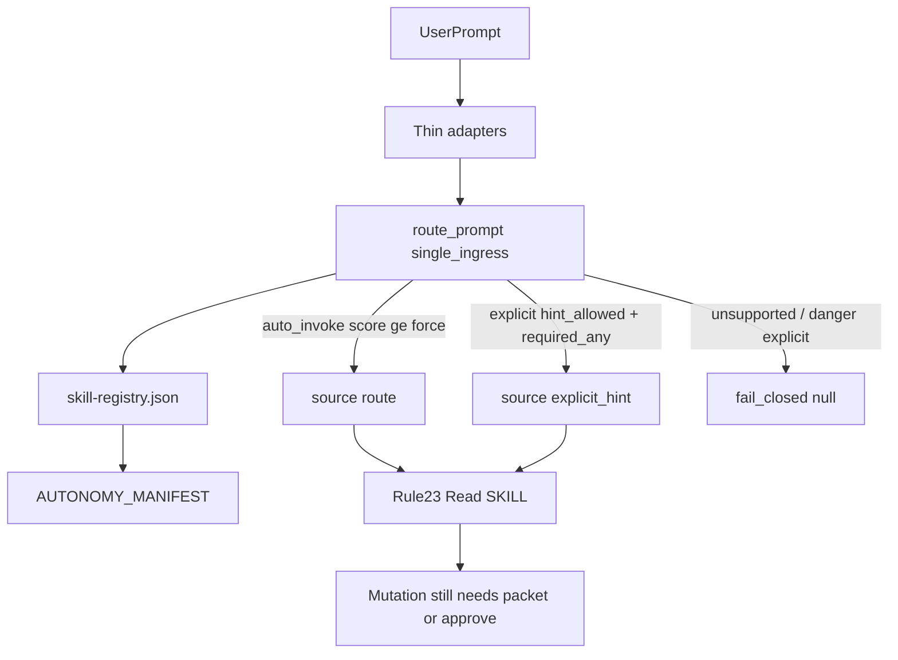

## PLAN: Proactive skill doctrine (unified master)

**Single execution authority.** Prior split drafts (`proactive_skill_doctrine_*`, `proactive_skill_rl_*`) were removed; this file owns the full plan.

### Kernel binding
- **Primary:** [`kernels/Recursive Leverage.md`](/Users/ib-mac/.cursor-governance/kernels/Recursive%20Leverage.md)
- **Subordinate:** [`kernels/Improve.md`](/Users/ib-mac/.cursor-governance/kernels/Improve.md)
- **Mode:** full_improvement on an explicitly bounded artifact group (not a new product)
- **Artifact type route:** `runbook_or_process` + `code_or_config` (hooks/scorer) + `prompt_or_kernel` (Rule 23 / doctrine text)

### Objective
Transform the proactive skill routing module into a **clearer, enforceable, reusable, deterministic** control surface: route evidence aggressively when context is clear; grant mutation authority only when autonomy law allows. Preserve product identity (recommendation ≠ authority). Converge only when another recursive pass finds no material improvement.

**Success (falsifiable):**
1. e2e prompts force `l9-e2e-blocker-resolution`
2. campaign/UI prompts emit `explicit_hint` without ambient Skill-tool selection
3. `l9-cli-optimization` stays explicit, marked for `Quantum-L9/l9-tools`, **not moved**, not routed
4. short/natural plan prompts route to `l9-plan`; planning deliverables must follow `plan-workflow.md`
5. no dead routes; manifest ↔ frontmatter ↔ overrides ↔ registry consistent
6. kernel `convergence_block` can be filled with `execution_readiness: pass`

### Target contract (RL binding_rules)
| Field | Value |
|-------|--------|
| Write root | `~/.cursor-governance` |
| Consumer | Cursor `beforeSubmitPrompt` + Claude `UserPromptSubmit` + always-apply Rule 23 |
| Inspect scope | `ops/skill_routing/`, hooks, `AUTONOMY_MANIFEST.yaml`, `skill-registry.json`, Rule 23, Claude overrides, Protocol D, `/autonomy` |
| Modify scope | Only artifacts required for verified material improvements below |
| Out | Move cli-optimization; create `l9-start-session`; Gate_SDK product code; ambient forge/k8s/pr-remediation; autonomous merge |

### What `l9-bounded-autonomy` is
Campaign SOP: packet → ≤4 Task lanes (≤2 mutating) → background PR-poll → join/merge-gate → human merge only. Contextual auto-surfaced mid-program prevents improvising parallel work; **packet still required** for remediation push.

**Chosen posture:** keep `explicit_only` + `disable-model-invocation: true`; revive route via `hint_allowed` (Read/attach only).

---

### RL Leverage overlays (drive ordering)

| Overlay | Choice |
|---------|--------|
| **Highest-leverage fix** | Scorer hard-skip of `explicit_only` makes declared campaign route dead — fix ingress once |
| **Highest-leverage contract** | Three-layer doctrine: `auto_invoke` \| `explicit_only+hint_allowed` \| `explicit_only` — one reusable flag |
| **Highest-leverage deletion** | Delete contradictory “Do not auto-route” language conflicting with live route notes |
| **Highest-leverage deduplication** | Single authority-split wording in Rule 23; Protocol D / autonomy.md / README point to it |
| **Future-action acceleration** | Fixture matrix + `validate_skill_activation` so tier flips are manifest rows + cases |
| **Max determinism** | validate registry → score → reject unsupported → emit source → Rule 23 Read |
| **Max validation** | Expand routing cases; keep forge/k8s forbidden; activation validator enforces tier↔overrides |
| **Single ingress** | Keep `route_prompt.py` as sole scoring ingress; adapters stay thin |

---

### Recursive passes (execution structure)

| Pass | Objective | Output |
|------|-----------|--------|
| **P1 Context & contract** | Purpose, consumers, invariants, I/O, failure modes | contract_map |
| **P2 Structure map** | Classify rule / workflow / config / test / generated / stale | structure_map |
| **P3 Coverage & gaps** | Missing middle tier; dead bounded_autonomy; no e2e/ui routes; narrow plan signals; unused advisory | gap_findings |
| **P4 Entropy audit** | Route note vs hard-skip; “never auto-invoke explicit” vs surface desire; dual doctrine copies | entropy_findings |
| **P5 L9 alignment** | ADR-0001 / Rule 88: merge OFF; packet; recommendation ≠ authority | alignment_findings |
| **P6 Strengthen** | `hint_allowed`; normalize terms; broaden plan signals; e2e promote | strengthened |
| **P7 Deduplicate** | One authority-split SSOT; Protocol D + autonomy.md reference it | compressed |
| **P8 Risk harden** | `required_any` / 2× weight for hints; negatives; forge/k8s null | hardened |
| **P9 Validation** | pytest + validate_skill_activation + registry rebuild; no stubs | validation |
| **P10 Convergence** | Extra pass; stop when only noise remains | convergence_block |

**Correction order:** authority/routing ingress → tier consistency → skill posture → doctrine dedupe → docs → validators.

---

### Pre-Validation
| Check | Action | Pass |
|-------|--------|------|
| P0 Target bind | Governance SSOT | Single write root |
| P1 Baseline | Confirm hard-skip, dead route, overrides | Matches P3/P4 |
| P2 Clean gate | `make -C ~/.cursor-governance pr-check` | PASS or quarantine |
| P3 Routing baseline | pytest + validate_skill_activation | Baseline recorded |

### Gap / entropy findings (seed; verify before edit)
1. Scorer skips every `explicit_only` primary → declared `bounded_autonomy` route is dead.
2. Binary tier cannot express “surface without ambient Skill authority.”
3. Advisory band unreachable when `signal_weight == force_threshold == 8`.
4. `l9-plan` is auto_invoke + routed, but narrow positives + Plan-mode paths skip template → reliability bug, not user error.
5. Doctrine entropy: Rule 23 “never auto-invoke explicit” vs route note “routing evidence” vs `/autonomy` “Do not auto-route.”

### Doctrine contract (portable)
| Layer | Meaning | Mutation authority |
|-------|---------|-------------------|
| `auto_invoke` | Model may select; router may force Read | Per skill contract |
| `explicit_only` + `hint_allowed: true` | Router may recommend Read (`explicit_hint`) | Still needs user/packet/approve |
| `explicit_only` (no hint) | Never proactive | Manual `/` only |

### Skill posture (material only)
| Skill | Action |
|-------|--------|
| `l9-e2e-blocker-resolution` | → `auto_invoke`; remove disable-model-invocation; drop Claude override; add `e2e_blocker` route |
| `l9-ui-operator` | stay explicit; `hint_allowed` route |
| `l9-bounded-autonomy` | stay explicit; revive `hint_allowed` + campaign `required_any` |
| `l9-cli-optimization` | mark future home `https://github.com/Quantum-L9/l9-tools`; no move; no route |
| `l9-plan` | keep auto; broaden signals; Rule 23 template obligation |

Keep unrouted: forge, k8s, terraform, pr-remediation.

### TODO Plan
| # | Task | Effort |
|---|------|--------|
| 1 | RL P1–P5 evidence pass before code | S |
| 2 | `hint_allowed` in `route_prompt.py` + fail-closed fixtures | M |
| 3 | Promote e2e + overrides + route | M |
| 4 | ui + bounded_autonomy hints; Protocol D / autonomy.md | M |
| 5 | Mark cli-optimization future home only | S |
| 6 | Broaden plan signals + Rule 23 template obligation | S |
| 7 | P7 dedupe doctrine to one SSOT | S |
| 8 | P9–P10 registry rebuild, validators, convergence_block | M |

### Doc / Root Surface Impact
Update: `AUTONOMY_MANIFEST.yaml`, Rule 23, settings.template.json (e2e out of overrides), autonomy.md + Protocol D, cli-optimization SKILL.md, regen LLM rule + skill-registry. Compress proactive docs to pointers at Rule 23 (no third essay). Sync Gate_SDK projected rule via adapter.

### Checkpoints
- CP0: findings match live code
- CP1: campaign → `explicit_hint`; k8s → null
- CP2: e2e → auto primary; ui → hint; cli → null
- CP3: short plan → `l9-plan`; activation validator PASS; convergence_block filled

### Unknowns
- Whether Cursor Plan mode always fires `beforeSubmitPrompt` — mitigate via Rule 23 template obligation when route stale/absent
- Consumer projection cadence for Gate_SDK `.claude/rules` — verify in P9

### Confirm: `l9-plan` auto?
**Yes in registry; not reliable in practice** (narrow signals + Plan-mode skip). RL treats this as determinism/enforceability defect, not user error.

### Final Validation + kernel gates
pytest routing; `validate_skill_activation`; registry rebuild; live `skill-route.json`; plus RL gates: `contract_preserved`, `no_unsupported_scope`, `no_regression`, `repetition_removed`, `single_ingress_evaluated`, `constraints_strengthened`, `convergence_reached`, `no_stubs_no_fake_validation`.

### Convergence block
Required at end of execution (do not pre-claim): status, passes_run, material_improvement_remaining, source_intent_preserved, scope_drift, enforceability/reuse improved, execution_readiness, unknowns, gates passed/failed.

### Recommend next
On approval: Agent mode, P1→P10 under governance root; then `l9-ynp` for follow-ups (`l9-start-session`, actual l9-tools extraction).
