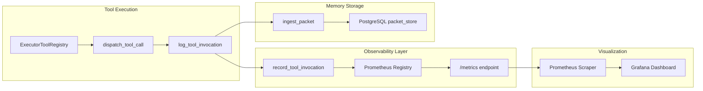

# Prometheus Metrics Integration and Grafana Dashboard

## Executive Summary

This plan wires Prometheus metrics recording into the existing tool audit system, exposes a `/metrics` endpoint for scraping, validates the integration with live API calls, and provides a Grafana dashboard for visualization.

## Architecture

## Implementation Plan

### Phase 1: Add prometheus_client Dependency

**File:** [requirements.txt](requirements.txt)Add `prometheus_client>=0.19.0` to requirements.txt. This package is already conditionally imported in `telemetry/memory_metrics.py` but not installed.

### Phase 2: Wire Metrics into tool_audit.py

**File:** [memory/tool_audit.py](memory/tool_audit.py)Currently, `log_tool_invocation()` only creates memory packets. Add a call to `record_tool_invocation()` from `telemetry/memory_metrics.py` to record Prometheus metrics alongside packet logging.Changes:

1. Import `record_tool_invocation` from `telemetry.memory_metrics`
2. Call `record_tool_invocation(tool_id, status, duration_ms)` after scheduling the packet

This ensures both persistent audit (PostgreSQL) and real-time metrics (Prometheus) are captured.

### Phase 3: Add /metrics Endpoint

**File:** [api/server.py](api/server.py)Add a `/metrics` endpoint using prometheus_client's ASGI app mounting. This allows Prometheus to scrape L9 metrics.Changes:

1. Add conditional import: `from prometheus_client import make_asgi_app, REGISTRY`
2. Add `init_metrics()` call in lifespan startup
3. Mount prometheus ASGI app at `/metrics` path

### Phase 4: Validate with Live API Call

Execute a tool call via the existing `/tools/execute` endpoint and verify:

1. Tool audit packet appears in `packet_store` with `packet_type='tool_audit'`
2. Prometheus counter `l9_tool_invocation_total` increments
3. Histogram `l9_tool_invocation_duration_ms` records latency

### Phase 5: Create Grafana Dashboard

**Directory:** `grafana/dashboards/` (NEW)Create a JSON dashboard file that visualizes:

- Tool invocation rate (by tool_id and status)
- Tool latency percentiles (p50, p95, p99)
- Memory write operations (by segment)
- Error rates

---

## TODO Plan (GMP-Ready Format)

### TODO PLAN (LOCKED)

- [T1] File: `/Users/ib-mac/Projects/L9/requirements.txt`

Lines: 67-68 (end of file)Action: InsertTarget: dependenciesChange: Add `prometheus_client>=0.19.0` after existing dependenciesGate: NoneImports: NONE

- [T2] File: `/Users/ib-mac/Projects/L9/memory/tool_audit.py`

Lines: 27-35 (imports section)Action: InsertTarget: importsChange: Add import for `record_tool_invocation` from `telemetry.memory_metrics`Gate: py_compileImports: `from telemetry.memory_metrics import record_tool_invocation`

- [T3] File: `/Users/ib-mac/Projects/L9/memory/tool_audit.py`

Lines: 122-131 (after scheduling packet)Action: InsertTarget: `log_tool_invocation()`Change: Add call to `record_tool_invocation(tool_id, status, duration_ms)` after scheduling the audit packetGate: py_compileImports: NONE

- [T4] File: `/Users/ib-mac/Projects/L9/api/server.py`

Lines: 35-40 (imports section)Action: InsertTarget: importsChange: Add conditional import for prometheus_client make_asgi_app and init_metricsGate: py_compileImports: `from telemetry.memory_metrics import init_metrics, PROMETHEUS_AVAILABLE`

- [T5] File: `/Users/ib-mac/Projects/L9/api/server.py`

Lines: 793-795 (after L-CTO tools registration, before yield)Action: InsertTarget: lifespan startupChange: Add `init_metrics()` call to initialize Prometheus metrics at startupGate: py_compileImports: NONE

- [T6] File: `/Users/ib-mac/Projects/L9/api/server.py`

Lines: 1295-1310 (after router registrations)Action: InsertTarget: router sectionChange: Mount prometheus ASGI app at `/metrics` using `app.mount("/metrics", make_asgi_app())`Gate: py_compileImports: NONE

- [T7] File: `/Users/ib-mac/Projects/L9/grafana/dashboards/l9-tool-observability.json` (NEW)

Lines: 1-200Action: CreateTarget: Grafana dashboardChange: Create JSON dashboard with 4 panels: invocation rate, latency histogram, error rate, memory writesGate: NoneImports: NONE---

## Files Modified

| File | Action | Lines Changed ||------|--------|---------------|| `requirements.txt` | Insert | +1 || `memory/tool_audit.py` | Insert | +5 || `api/server.py` | Insert | +20 || `grafana/dashboards/l9-tool-observability.json` | Create | +200 |

## Risk Assessment

| Risk | Probability | Impact | Mitigation ||------|------------|--------|------------|| prometheus_client import fails | LOW | LOW | Already handled with PROMETHEUS_AVAILABLE flag || /metrics endpoint conflicts with existing route | LOW | LOW | No existing /metrics route in codebase || Grafana dashboard JSON invalid | LOW | LOW | Use standard Grafana schema |

## L9 Invariant Check

| Invariant File | Touched? | Justification ||----------------|----------|---------------|| docker-compose.yml | NO | - || kernel_loader.py | NO | - || executor.py | NO | - || memory_substrate_service.py | NO | - || websocket_orchestrator.py | NO | - |

## Success Criteria

1. `prometheus_client` installed and importable
2. `record_tool_invocation()` called for every tool execution
3. `/metrics` endpoint returns Prometheus text format
4. Grafana dashboard loads and displays panels
5. Existing tool audit functionality unchanged (packets still written to database)

## Estimated Effort

- Phase 1 (dependency): 2 minutes
- Phase 2 (metrics wiring): 5 minutes
- Phase 3 (/metrics endpoint): 10 minutes
