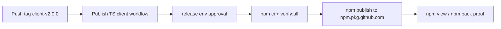

# Publish `@quantum-l9/graphiti-memory-client@2.0.0`

## Verdict

**Code is ready to publish as-is (yes).** This is a release-execution gap: package exists on `main` at `2.0.0`, CI verify is green, registry returns 404, and no `client-v*` tags exist. Preferred (and effectively only viable) path: annotated tag `client-v2.0.0` → workflow `Publish TypeScript memory client` → `release` env approval by `cryptoxdog`.

## Current-state inventory

| Item | Status | Evidence |
|------|--------|----------|
| Package source | Present | [`clients/typescript/`](clients/typescript/) |
| Name / version | Ready | `@quantum-l9/graphiti-memory-client` / `2.0.0` in [`package.json`](clients/typescript/package.json) |
| Registry config | Ready | `publishConfig.registry = https://npm.pkg.github.com` |
| Exports / files | Ready | `exports["."]`, `files: ["dist","README.md"]`, engines `node >= 20.19.0` |
| Consumer contract | Compatible | See below |
| Lockfile | Present | [`package-lock.json`](clients/typescript/package-lock.json) |
| Verify CI | Green | [run 30637061227](https://github.com/Quantum-L9/l9-graphiti-memory/actions/runs/30637061227) on `main` (`verify:all` succeeded); client tree unchanged after that commit |
| Publish workflow | Present, never run | [`.github/workflows/typescript-client-publish.yml`](.github/workflows/typescript-client-publish.yml) |
| `client-v*` tags | Missing (local + remote) | Empty `git tag -l` / `git ls-remote` |
| Registry package | Missing | `npm view ...@2.0.0` → **404** under owner `quantum-l9` |
| `release` environment | Exists | Required reviewer: `cryptoxdog`; `prevent_self_review: false`; no wait timer; deployment refs: **`client-v*` tags only** |

### Consumer contract check (Website-Bot #67)

Verified against [`clients/typescript/src/index.ts`](clients/typescript/src/index.ts):

- Named exports: `GraphitiMemoryClient`, `renderHydration`, types `MemoryClass`, `WriteReceipt`
- Constructor: `new GraphitiMemoryClient({ baseUrl, bearerToken })`
- `hydrate({ clientId, taskType, task, topics, memoryClasses?, tokenBudget, maxRecords })` — signatures accept Website-Bot shapes; defaults `tokenBudget=1200`, `maxRecords=40`
- `writeSemanticFact(...)` — accepts `clientId`, `sourceId`, `idempotencyKey`, `content`, `subject`, `predicate`, `object`, `tags`
- `renderHydration` returns `''` for `failed` or empty sections

Tests in [`clients/typescript/tests/client.test.ts`](clients/typescript/tests/client.test.ts) cover hydrate MCP call shape, bounds rejection, and `renderHydration` escape/empty behavior. README documents tools `memory.hydrate|ingest|promote|health`, matching implementation.

**Build-before-publish:** `npm run verify:all` → `test` → `npm run build`, so `dist/` exists before `npm publish`. No code fix needed.

## Publish path decision

**Chosen path: tag-based publish (`client-v2.0.0`).**

Rationale:

1. Matches existing automation (`on.push.tags: ['client-v*']`).
2. `release` deployment branch policy allows **only** tag name `client-v*` — not `main`.
3. Distinct from Python `v*` tags; no collision.
4. No new workflow invention.

**`workflow_dispatch` fallback: not viable without env policy change.** YAML allows dispatch, but the `release` environment’s custom branch policy only lists `client-v*`. Dispatch from a branch ref would fail the environment gate. Do not use dispatch unless operators explicitly expand deployment policies.

## Pre-publish verification checklist

Run from repo root (execution phase; plan mode did not write `node_modules`):

```bash
cd clients/typescript
npm ci --ignore-scripts
npm run verify:all
# expect: typecheck pass + build + all node:test cases pass
node -v   # expect >= 20.19 (local observed: v22.15.0)
npm view @quantum-l9/graphiti-memory-client versions --json --registry=https://npm.pkg.github.com
# expect: still 404 / package absent — if 2.0.0 appears, STOP
git fetch origin --tags
git rev-parse origin/main   # tag this SHA
git ls-remote --tags origin 'client-v2.0.0'   # expect empty
```

Proxy evidence already green: TypeScript client CI on `main` run `30637061227`.

Tag target: **`origin/main` = `c0dd23b19f33d268988fc4158f6d73b33a79158b`** (includes green client; no post-CI changes under `clients/typescript/`).

## Exact publish steps

1. Confirm working tree will not be used as tag source — tag the remote SHA only (ignore local dirty files like `uv.lock` / validation logs).
2. Local verify (commands above) — must pass.
3. Create and push annotated tag:

```bash
git fetch origin
git tag -a client-v2.0.0 c0dd23b19f33d268988fc4158f6d73b33a79158b -m "Release @quantum-l9/graphiti-memory-client@2.0.0"
git push origin client-v2.0.0
```

4. Watch workflow: `Publish TypeScript memory client` (`.github/workflows/typescript-client-publish.yml`).
5. **Approve** pending deployment for GitHub Environment `release` (reviewer: `cryptoxdog`; self-review allowed). Do not bypass the gate.
6. Confirm job steps succeed: `npm ci --ignore-scripts` → `npm run verify:all` → `npm publish` with `NODE_AUTH_TOKEN: GITHUB_TOKEN`, `packages: write`, `working-directory: clients/typescript`.



## Post-publish proof

```bash
npm view @quantum-l9/graphiti-memory-client@2.0.0 version --registry=https://npm.pkg.github.com
# expect: 2.0.0

npm view @quantum-l9/graphiti-memory-client@2.0.0 name version dist.tarball --registry=https://npm.pkg.github.com

# authenticated temp install/pack
npm pack @quantum-l9/graphiti-memory-client@2.0.0 --registry=https://npm.pkg.github.com
# optional: tar tzf ... | grep -E 'dist/src/index\.(js|d\.ts)'
```

Also confirm GitHub Packages UI/API shows org package `graphiti-memory-client` version `2.0.0`.

## Risks / blockers / unknowns

- **`release` approval required** — job waits until `cryptoxdog` approves; actor is that reviewer (`prevent_self_review: false`).
- **First publish** creates the org package; org package visibility / member read access must allow Website-Bot CI tokens with `read:packages` (same pattern as existing `@quantum-l9/llm-router`).
- **Local npm auth** for post-publish proof needs a PAT/token with `read:packages` (CI publish uses `GITHUB_TOKEN` automatically).
- **Separate Website-Bot blocker (out of this repo):** dependency gate may still require `@quantum-l9/llm-router@1.1.0` while only `1.0.0`/`1.0.1` exist in LLM-Router. Do not publish llm-router from here.

## Out of scope

- Python package / `publish.yml` / `v*` tags
- Website-Bot repo edits (PR #67 remediation)
- Publishing or bumping `@quantum-l9/llm-router`
- Renaming package, changing major away from `2.0.0`, broad MemoryService refactors
- Inventing a new client or new publish workflow
- Force-push / history rewrite / bypassing `release` approval

## Success criteria (binary)

- [ ] Tag `client-v2.0.0` exists on `origin` at intended SHA
- [ ] Publish workflow run succeeded after `release` approval
- [ ] `npm view @quantum-l9/graphiti-memory-client@2.0.0 version` → `2.0.0`
- [ ] `npm pack` (or clean install) resolves from `https://npm.pkg.github.com`
- [ ] GitHub Packages shows `graphiti-memory-client@2.0.0`

**Residual (does not fail this mission):** Website-Bot may still fail `memory-stack-dependency-gate` on `llm-router@1.1.0` until LLM-Router publishes 1.1.0 or the gate is updated.
