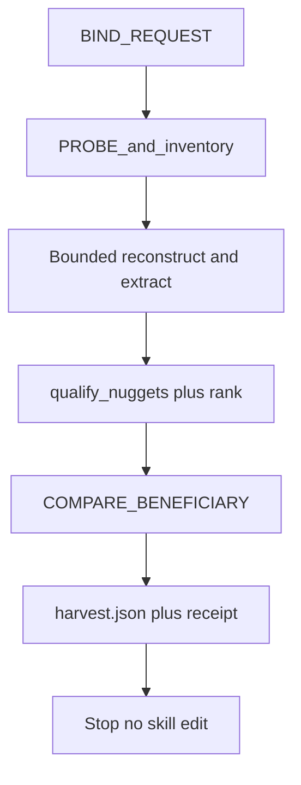

# Harvest the donor readme updater into l9-update-agent-docs

## Ready state

This checkout is on `main` at `59f03a5d`, matching `origin/main`. `skills/l9-intelligence-harvest` is live (v1.1.0). Proceed.

## What the skill allows

[`skills/l9-intelligence-harvest/SKILL.md`](skills/l9-intelligence-harvest/SKILL.md) is a **semantic** harvest. Canonical product is `harvest.json`. Donor and beneficiary mutation are forbidden. Literal code copy, deploy, wire, commit, and push are out of scope.

This pass **does not** edit [`skills/l9-update-agent-docs/SKILL.md`](skills/l9-update-agent-docs/SKILL.md). A later authorized build can apply accepted nuggets.

## Donors

| Repo | Result |
|---|---|
| Primary: `cryptoxdog/L9_Original_Repo` → **`Quantum-L9/L9_Original_Repo`** (private, `main`) | **Has the component** |
| Backup: `cryptoxdog/IB-Odoo_19` (`Staging`) | **No readme updater.** Only [`.claude/adapters/plasticos-update-agent-docs.md`](https://github.com/cryptoxdog/IB-Odoo_19/blob/Staging/.claude/adapters/plasticos-update-agent-docs.md) (module inventory / CI tables). Do not fall through. |

## Donor component (scoped, not the whole L9 OS)

The updater is a **cluster**, not the `readme/` doc dump:

- Canonical generator: `agents/codegenagent/readme_generator.py` (duplicate at `core/agents/codegenagent/readme_generator.py`; tests at `tests/core/agents/codegenagent/test_readme_generator.py`)
- Section validator + SSOT: `.github/scripts/validate-readme-sections.py` + `config/subsystems/readme_config.yaml`
- Pipeline: `workflows/dags/readme_pipeline_dag.py` + `scripts/generate_subsystem_readmes.py`
- Contract: READMEs as binding contracts; required sections; 3-layer (root / subsystem / metadata); AI allow/restrict/forbid scopes

This repo already has a **projection** of the DAG ([`workflows/dags/readme_pipeline_dag.py`](workflows/dags/readme_pipeline_dag.py), [`workflows/defs/readme-pipeline.yaml`](workflows/defs/readme-pipeline.yaml)) but **not** `scripts/generate_subsystem_readmes.py` or `config/subsystems/readme_config.yaml`.

Beneficiary README ownership today is pointer-only:

```143:143:skills/l9-update-agent-docs/SKILL.md
| `README.md` | Fix an index pointer that names a missing or invented file. |
```

Adapter: “Human index — surgical pointers only” in [`.claude/adapters/cursor-governance-update-agent-docs.md`](.claude/adapters/cursor-governance-update-agent-docs.md). Stronger beneficiary pointer/authority semantics **win** (`MERGE_WITH_EXISTING` / `REJECT` as evidence requires). Do not port CodeGenAgent / DORA runtime.

## Execution (read-only harvest)



1. **Sparse read-only clone** of `Quantum-L9/L9_Original_Repo` (depth 1) limited to the paths above. Do not execute donor code. `inventory_source.py` walks the bound path — do not inventory the whole OS tree.
2. **Bind** via `skills/l9-intelligence-harvest/scripts/bind_request.py` against [`contracts/harvest-request.schema.json`](skills/l9-intelligence-harvest/contracts/harvest-request.schema.json):
   - `request_id`: `ih-readme-updater-2026-08-28`
   - `donor`: sparse-clone root
   - `beneficiary`: `skills/l9-update-agent-docs`
   - `harvest_target`: `readme updater`
   - `access_mode`: `read-only`, `depth`: `exhaustive`, `secrets_policy`: `redact`, `brief`: `true`
3. **Deterministic nodes** (no model substitution): `inventory_source.py` → later `qualify_nuggets.py` → `rank_nuggets.py` → `validate_harvest.py` → `render_brief.py`.
4. **Bounded-LLM nodes** only from their contracts: [`references/system-reconstruction-contract.md`](skills/l9-intelligence-harvest/references/system-reconstruction-contract.md), [`references/concept-extraction-contract.md`](skills/l9-intelligence-harvest/references/concept-extraction-contract.md), [`references/beneficiary-fit-contract.md`](skills/l9-intelligence-harvest/references/beneficiary-fit-contract.md). UNKNOWN or BLOCKED if evidence is missing. Never fabricate.
5. **Compare** against live beneficiary write table + adapter + `scripts/self_test.py` (no kernel wrap; README is not a generated contract).
6. **Emit** only allowed outputs under `WIP/8-28-26/intelligence-harvest/readme-updater/` (not inside the skill pack):
   - `harvest.json`
   - `harvest-receipt.json`
   - `DONOR-HARVEST-BRIEF.md`
7. **Stop.** Validate with `scripts/validate_harvest.py`. Do not run `l9-harvest-pipeline`, do not `cp` donor Python into the skill, do not change `SKILL.md`.

Expected concept families (to confirm, not pre-judge): required-section validation against a declarative SSOT; README as index-or-contract; 3-layer ownership; AI scope rules. CodeGenAgent templates, DORA footers, and donor `readme/` prose stay `KEEP_LOCAL` / `REJECT` unless evidence says otherwise.

## Out of scope

- Creating or editing files under `skills/l9-update-agent-docs/`
- Porting `readme-pipeline-v1` ownership into this skill (DAG already lives under `workflows/`)
- IB-Odoo PlasticOS adapter harvest
- `make pr` / merge
