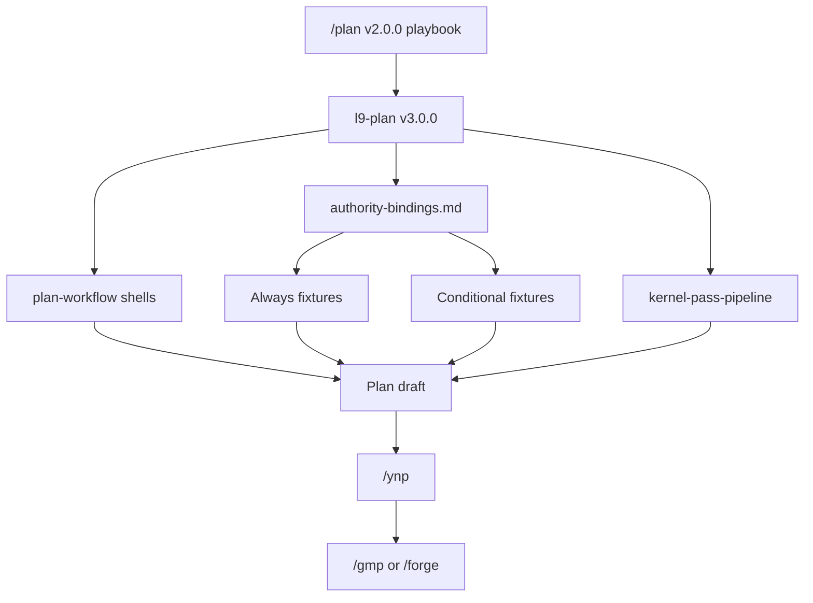

## PLAN: Recreate `/plan` as planning playbook (farewell → rewrite)

### Doctrine
Proper planning prevents piss poor performance. A minute spent planning is an hour saved debugging.

### Planning Mode
**Mode:** Deep
**Justification:** Full rewrite of slash command + skill pack; shared contracts across GMP/CCP/kernels.

### plan_status
ConditionallyReady — Ready when user authorizes GMP execution.

### Objective
**Farewell** the current template-centric [`commands/plan.md`](commands/plan.md) (v1.2.0) and [`skills/l9-plan`](skills/l9-plan) (v2.2.0). **Recreate** them as a **planning playbook**: thin orchestration that **Load / Read / apply** permanent fixtures, then emit a complete plan draft (scopes, constraints, lock, dual DoD, GMP-ready TODOs, kernel pass log, MSNA).

**Success (falsifiable):**
1. `/plan` describes itself as a **planning playbook** (not only “deep template”).
2. New [`authority-bindings.md`](skills/l9-plan/references/authority-bindings.md) is the Load map (always vs conditional).
3. [`plan-workflow.md`](skills/l9-plan/references/plan-workflow.md) is recreated with section **shells** that call fixtures (no pasted GMP/CCP catalogs).
4. Required gaps closed by call: **Files in/out of scope**, **Constraints MUST/MUST NOT**, **Modification Lock**, **Plan DoD** + **Post-impl DoD**, **Phase-0 TODO schema** when CHANGE handoff.
5. Skill **3.0.0**; command **2.0.0**; `make pr-check` PASS; fixtures under `skills/l9-gmp-protocol` and `kernels/` **untouched**.

### Farewell baseline (replace, do not patch-in-place mentally)
| Artifact | Current | After |
|----------|---------|-------|
| `commands/plan.md` | v1.2.0 thin mirror of template steps | v2.0.0 playbook entry: stages, Load map cite, required shells, auto_chain ynp |
| `skills/l9-plan/SKILL.md` | v2.2.0 compact workflow | v3.0.0 playbook workflow + fail-closed Loads |
| `plan-workflow.md` | v2.2.0 expanded template | Recreated SSOT shells + Load directives |
| `ccp-plan-patterns.md` | Distillate-heavy risk | Slim adaptive-depth + pointers only |
| NEW `authority-bindings.md` | — | Playbook Load SSOT |

### Files in scope
| Role | Paths |
|------|-------|
| Inspection | Current plan/skill pack; `skills/l9-gmp-protocol/references/{modification-lock,phase-contracts,evidence-report,pipeline-composition}.md`; `kernels/L9 Coding Control Plane/ai-control-plane/{PLAN,DEFINITION_OF_DONE}.md`; `kernels/{Improve,Leverage,Recursive Alignment,Recursive Leverage,Validate & Repair}.md`; `skills/l9-ynp`; leverage map from prior research |
| Modification | `commands/plan.md`; `commands/commands-index.md`; `skills/l9-plan/SKILL.md`; `skills/l9-plan/references/plan-workflow.md`; `skills/l9-plan/references/spec-workflow.md`; `skills/l9-plan/references/ccp-plan-patterns.md`; **create** `skills/l9-plan/references/authority-bindings.md`; keep `kernel-pass-pipeline.md` (cite, minor cross-link only if needed) |

### Files out of scope
| Path | Why |
|------|-----|
| `skills/l9-gmp-protocol/**` | Call only |
| `kernels/**` | Call only |
| `WIP/10X Kernels/**` | Non-SSOT; use CCP ai-control-plane |
| `protocols/**` | Optional Deep cite only; do not vendor |
| `rules/**` | No edit (doctrine already in skill) |
| Unrelated WIP / harvested / learning dirt | Quarantine |

### Constraints
**MUST:**
- Recreate slash command + skill as playbook (full rewrite of command + workflow + skill narrative).
- Wrap/call permanent fixtures; fail-closed if required Reads skipped.
- Keep `/plan` **planning-only** (no product code edits; no GMP Phase 2–6 execution).
- Preserve auto_chain → `/ynp`; five-kernel pipeline via existing `kernel-pass-pipeline.md`.
- Branch: continue `docs/l9-plan-kernel-pipeline` (or successor from it).

**MUST NOT:**
- Distill/fork GMP lock/phase/DoD/PLAN catalogs into patterns.
- Bind to `WIP/10X Kernels`.
- Turn `/plan` into `/gmp`.
- Stage unrelated dirty tree.

### Modification Lock (for this rebuild)
**May-modify:** paths listed under Files in scope / Modification.
**Must-not-modify:** `skills/l9-gmp-protocol/**`, `kernels/**`, `WIP/**`, `rules/**`, `CANONICAL_LAW.md`, `protocols/**` (except read).

### Playbook architecture (recreate)

**Always Load:** CCP `PLAN.md`, `DEFINITION_OF_DONE.md`; five kernels (pipeline); lesson corpus; Graphiti when healthy; `l9-ynp`.
**CHANGE handoff Load:** GMP `modification-lock.md`, `phase-contracts.md`, `evidence-report.md` (name only), `pipeline-composition.md`.
**Conditional:** `/reasoning`, `/gap-analysis`, `/analyze`, `/inspect`, security/perf audits, Context7, code-graph, ADRs, forge handoff, `/pr`, profiles on Deep — as in prior leverage map (encode in `authority-bindings.md`).

### Recreated `/plan` command shape (target)
1. Doctrine + **Planning playbook** purpose one-liner
2. Stages: Bind → Load fixtures → Gather → Draft shells → VALIDATE_PLAN → Kernel pipeline → plan_status/MSNA → `/ynp`
3. Required section list (shells) pointing at `plan-workflow.md` + `authority-bindings.md`
4. Explicit: planning-only; call fixtures; do not paste
5. Gate: `make pr-check`
6. `auto_chain: ynp`

### Recreated `plan-workflow` shells (mandatory headings)
Doctrine; Planning Mode; plan_status; Objective; **Files in scope** / **Files out of scope**; **Constraints**; **Modification Lock**; Pre-Validation; Acceptance; Assumption register; TODO (GMP Phase-0 columns when CHANGE); Depth + conditionals; Dependencies/waves; Unknown/Decision; Validation matrix; **Plan Definition of Done**; **Post-implementation Definition of Done**; Milestones/Checkpoints/Checklist; Risks; Estimate; Kernel Pass Log; Final Validation; MSNA; Handoff; **ADRs consulted**; Load log (which fixtures Read).

### TODO Plan (GMP-ready)
| ID | Phase | File | Op | Anchor | Description | Deps |
|----|-------|------|-----|--------|-------------|------|
| T1 | 2 | `skills/l9-plan/references/authority-bindings.md` | Create | new file | Playbook Load map A–F (always/conditional/forbid) | — |
| T2 | 2 | `skills/l9-plan/references/plan-workflow.md` | Replace | full file | Recreate SSOT shells + Load directives; meta 3.0.0 | T1 |
| T3 | 2 | `skills/l9-plan/SKILL.md` | Replace | full narrative | v3.0.0 playbook Compact Workflow + fail-closed | T1 |
| T4 | 2 | `skills/l9-plan/references/spec-workflow.md` | Replace | sections | Spec mode same bindings | T1 |
| T5 | 2 | `skills/l9-plan/references/ccp-plan-patterns.md` | Replace | slim | Adaptive-depth + pointers only | T1 |
| T6 | 2 | `commands/plan.md` | Replace | full file | v2.0.0 playbook slash command | T2,T3 |
| T7 | 2 | `commands/commands-index.md` | Replace | `/plan` row | Playbook blurb | T6 |
| T8 | 2 | `kernel-pass-pipeline.md` | Replace | cross-link only if needed | Cite authority-bindings; no path list fork | T1 |
| T9 | 4 | gate | — | — | `make pr-check`; fixtures untouched | T1–T8 |

### Pre-Validation
| Check | Pass |
|-------|------|
| Branch | `docs/l9-plan-kernel-pipeline` (contains v2.2.0 farewell baseline) |
| Fixtures readable | GMP refs + CCP PLAN/DoD + five kernels |
| Dirty quarantine | Do not stage WIP/harvested/learning noise |
| `make pr-check` before edits | PASS or document baseline |

### Plan Definition of Done
- [ ] Slash command fully rewritten as playbook entry
- [ ] Skill 3.0.0 playbook workflow
- [ ] authority-bindings complete
- [ ] Workflow shells call CCP/GMP; no distillate catalogs
- [ ] Path scopes, Constraints, Lock, dual DoD, Phase-0 TODO shape present
- [ ] Kernel pipeline preserved
- [ ] Index updated

### Post-implementation Definition of Done (for GMP run of this plan)
Named for implementer: only may-modify files changed; `make pr-check` PASS; no fixture drift; Phase 5 verify-against-lock; optional GMP evidence report if user asks.

### Milestones
| M | Outcome |
|---|---------|
| M1 | authority-bindings.md live |
| M2 | Skill + workflow + patterns recreated |
| M3 | `/plan` v2.0.0 + index; `make pr` PASS |

### Checkpoints
| CP | Evidence | No-go |
|----|----------|-------|
| CP1 | Bindings list always/conditional/forbid | Don't rewrite command yet |
| CP2 | Workflow has Load directives; greps show no pasted Phase-0/DoD chapters in patterns | Strip |
| CP3 | `git diff -- skills/l9-gmp-protocol kernels` empty; `make pr` PASS | Repair |

### Checklist
- [ ] T1–T9
- [ ] Farewell versions documented in CHANGE sense (command 2.0.0 / skill 3.0.0)
- [ ] Playbook framing in slash + skill
- [ ] Fixtures untouched
- [ ] No commit/push unless requested

### Risks
| Risk | Mitigation |
|------|------------|
| Token cost of many Loads | Always vs conditional; Quick skips Deep-only profiles |
| Agents skip Reads | Fail-closed Validation + Load log section |
| Accidental distillate | Slim patterns; review CP2 |

### Estimate
**Total:** ~90–120 min
**GMPs:** 1

### Final Validation
| Check | Pass |
|-------|------|
| Completeness | T1–T8 done |
| Scanners | `make pr-check` PASS |
| Untouched | GMP skill + kernels clean |
| Honesty | Status labels only |

### Minimum Safe Next Action
Approve → execute T1–T9 with `l9-gmp-protocol` on `docs/l9-plan-kernel-pipeline`.

### Handoff profile
CHANGE → `l9-gmp-protocol`
