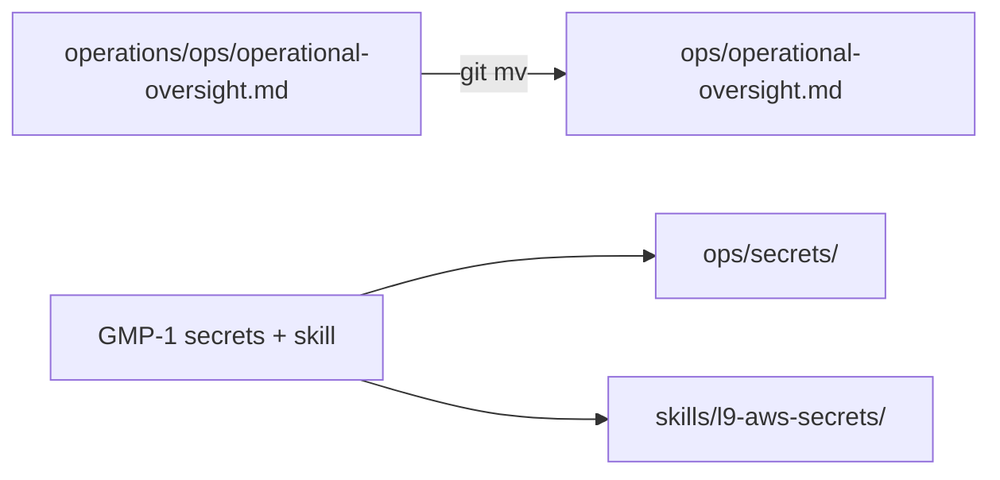

# Relocate `operations/ops` → top-level `ops/`

## Decision (locked)

**Merge** [`operations/ops/`](operations/ops/) into existing top-level [`ops/`](ops/), then remove the empty `operations/` tree.

- Destination for the only live file: `ops/operational-oversight.md`
- New Portable UI Operator paths stay flat under the same root: `ops/secrets/`, `ops/ui-operator/` (per the Portable UI Operator plan)
- Do **not** grow `operations/ops/` or introduce `operations/secrets`

## Why this path

- Top-level `ops/` is already the governance runtime (hooks, scripts, graphiti, config).
- `operations/ops/` currently contains **one** tracked file and no dependents outside `_archived` docs.
- Relocating now avoids a later mass-move once registry/resolver/console land.

## Scope (pre-GMP-1 micro-step)

1. `git mv operations/ops/operational-oversight.md ops/operational-oversight.md`
2. Remove empty dirs `operations/ops/` and `operations/`
3. Reference sweep (live only): update any non-archived path strings that still say `operations/ops/`. Known hits today are only under `foundation/_archived/` — leave archived files untouched unless a live doc/index still points at them.
4. Confirm write root for resumed GMP-1: `ops/secrets/`, `ops/ui-operator/` (later), `skills/`

## Out of scope

- Rewriting content of `operational-oversight.md` (path move only)
- Filling `ops/ui-operator/` (GMP-2)
- Root-doc appends for UI operator (GMP-3)
- Changing igorbot inventory SSOT

## Resume after relocate

Continue **Portable UI Operator GMP-1 (M0+M1)** via `l9-gmp-protocol` with Phase 0 lock against:

- `ops/secrets/sync_igorbot_manifest.py` + registry YAML/schema
- `ops/secrets/resolve_secret.py`
- `skills/l9-aws-secrets` (compile + wire)
- append-only `pyproject.toml` `ui-operator` extra + `requirements.txt` pointer
- mocked-AWS unit tests

Pre-Validation already partially done: AWS caller identity OK; top-level `ops/` restored from git after accidental working-tree deletion; igorbot CSV + resolver protocol fetched.
